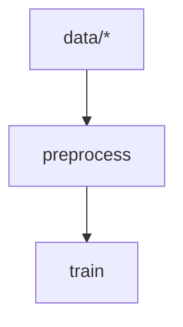

# xvc

[](https://codecov.io/gh/iesahin/xvc)
[](https://github.com/iesahin/xvc/actions/workflows/rust.yml)
[](https://crates.io/crates/xvc)
[](https://docs.rs/xvc/)
[](https://github.com/rust-secure-code/safety-dance/)

Manage your data next to code in Git repositories and run commands when they change. 

## ⌛ Why Xvc?

- You have image, audio, media, document or asset files to
[track/version/backup][xvc-file-track] along with the code, but [don't want to
copy][xvc-file-recheck] that huge data to all Git clones.

- You want to [manage][xvc-file-list] files in multiple locations with
[different subsets][xvc-file-copy], some (e.g. training data) being read-only
and some (e.g. models, executables) change frequently, all versioned along with
the code. 

- You want to [store][xvc-s-n] this data in [local][xvc-s-n-local],
[Rsync][xvc-s-n-rsync], or [S3-compatible cloud storages][xvc-s-n-s3] to share
along the repository. 

- You want to [specify commands][xvc-p-s-n] that [run][xvc-p-r] when
only input data changes, define [pipelines][xvc-p-n] with steps that
run when only their [dependencies][xvc-p-s-d] change.

- You want to define these dependencies with
[files][xvc-p-s-d-file],
[globs][xvc-p-s-d-glob] spanning multiple files, text file
lines defined by [ranges][xvc-p-s-d-line] or
[regexes][xvc-p-s-d-line],
[URLs][xvc-p-s-d-url],
[parameters][xvc-p-s-d-params] in the YAML or JSON files,
[SQLite queries][xvc-p-s-d-sqlite] or [any
command][xvc-p-s-d-generic] that produces output. 

<details>
  <summary> <strong> 🔽 Installation</strong></summary>

You can get the binary files for Linux, macOS, and Windows from [releases]
page. Extract and copy the file to your `$PATH`.


Alternatively, if you have Rust [installed], you can build xvc:

```shell
$ cargo install xvc
```


If you want to use Xvc with Python console and Jupyter notebooks, you can also
install it with `pip`:

```shell
$ pip install xvc
```

Note that pip installation doesn't make `xvc` available as a shell command.
Please see [xvc.py] for details.


### Completions

Xvc supports dynamic completions for bash, zsh, elvish, fish and powershell. For example, run the following to add completions for bash:

```bash
echo "source <(COMPLETE=bash xvc)" >> ~/.bashrc
```

See [completions] section in the docs for others.

</details>

<details>
  <summary>🚀
    <strong> Initialize a directory for Xvc</strong>
  </summary>

```bash
$ xvc init
```

[This command][xvc-init] initializes the `.xvc/` directory and adds a
`.xvcignore` file for specifying paths you wish to hide from Xvc.

  > 💡
  > Git is **not required** to run Xvc. However running Xvc with Git is usually
  > a good idea. Xvc can stage/commit metadata files (under `.xvc/`) used to
  > track binary files and you can use branches for versioning as well. By
  > default, you won't have to deal with Git commands to commit these metadata
  > files. Xvc can manage the files it updates and hides your binary files from
  > Git by default. 
  > 
  > If you don't want to use Xvc with Git, use `--no-git` option when
  > initializing.

</details>

<details>
  <summary>
    👣
    <strong>Track binary files</strong>
  </summary>

Add your data files and directories for tracking:

```shell
$ xvc file track my-data/
```

[This command][xvc-file-track] calculates content
hashes for data (using BLAKE-3, by default) and records them. Files are moved
to content-addressed directories under `.xvc/b3`. Then they are copied to the
workspace. 

  > 💡**Tip**:
  > You can specify different [recheck (checkout)
  > methods][xvc-file-recheck] for files and
  > directories depending on your use case. Symlinks and hardlinks to the
  > files under Xvc cache don't consume additional space but they are readonly.
  > You can also use (copy-on-write) reflinks if your file system supports it
  > and Xvc is built with `reflink` feature. 

</details>

<details>
<summary>🫧 
    <strong>Checkout a subset of files as symlinks</strong>
</summary>

You can [copy][xvc-file-copy] and [recheck][xvc-file-recheck] (checkout)
subsets of files from Xvc cache as symlinks to create multiple _views_. This is
useful when you need a read-only access that won't consume additional space.

```bash
$ xvc file copy my-data/ another-view-to-my-data/
$ xvc file recheck another-view-to-my-data/ --as symlink
```

  > 💡
  > [`xvc file copy`][xvc-file-copy] and [`xvc file move`][xvc-file-move]
  > doesn't require file contents to be available. Xvc works only with their
  > metadata and you can organize files without their content copied to
  > workspace or cache. 
  
  > 💡 If you installed [completions] to your shell, Xvc completes file names
  > even if they are not available in your local paths.

</details>


<details>
  <summary> 🌁 
    <strong>Send files to the cloud services</strong>
  </summary>

Configure a cloud storage to share the files you track with Xvc.

```shell
$ xvc storage new s3 --name my-storage --region us-east-1 --bucket-name xvc
```

You can send the files to this storage.

```shell
$ xvc file send --to my-storage
```

You can also send a subset of the files.

```shell
$ xvc file send 'my-data/training/*' --to my-storage
```

Xvc [supports][xvc-s-n] [external directories][xvc-s-n-local],
[Rsync][xvc-s-n-rsync], [AWS S3][xvc-s-n-s3], [Google Cloud
Storage][xvc-s-n-gcs], [MinIO][xvc-s-n-minio], [Cloudflare R2][xvc-s-n-r2],
[Wasabi][xvc-s-n-wasabi], [Digital Ocean Spaces][xvc-s-n-do]. Please [create an
issue]
if you want Xvc to support another cloud storage service.

> 💡 Xvc also supports any command to upload/download files. If your favorite
> service is not listed or you want to use another tool (s5cmd, rclone, etc.),
> you can specify a [generic][xvc-s-n-generic] storage by supplying shell
> commands to upload and download. 

> 📌 **Important**:
> Xvc never stores credentials to your connections and expects them to be
> available in the environment. It _never_ makes network requests (for
> tracking, statistics, etc.) without your knowledge. You can [compile] without
> cloud connection support in case you want to make sure that it makes no
> connections to outside services.

</details>

<details>
  <summary> 🪣 
    <strong>Get files from cloud services</strong>
  </summary>

When you (or someone else) want to access these files later, you can clone the
Git repository and [get the files][xvc-file-bring] from the storage.

```shell
$ git clone https://example.com/my-machine-learning-project
Cloning into 'my-machine-learning-project'...

$ cd my-machine-learning-project
$ xvc file bring my-data/ --from my-storage

```

This approach ensures convenient access to files from the shared storage when
needed.

  > 💡**Tip**:
  > You don't have to reconfigure the storage after cloning, but you need to
  > have valid credentials as environment variables to access the storage. Xvc
  > never stores any credentials.

</details>

<details>
  <summary> 🫖
    <strong>Share files from cloud storages for a limited time</strong> 
  </summary>
  
  You can share Xvc tracked files from S3 compatible storages for a specified period.

```shell
$ xvc file share --storage my-storage dir-0001/file-0001.bin --duration 1h
https://my-storage.s3.eu-central-1.amazonaws.com/xvc....
```

You can share the link with others and they will be able to access to the file
hour. The default period is 24 hours.

</details>

<details>
<summary> 🥤<strong>Create a data pipeline</strong></summary>

Suppose you have a script to preprocess files in a directory and you want to
run this when the files in `my-data/train` directory changes. We first define a
step in the pipeline that will run the script.

```bash
$ xvc pipeline step new --step-name preprocess --command 'python3 src/preprocess.py'
```

Each command is associated with a step and each step has a command.

</details>

<details>
<summary> 🔗 <strong>Add a dependency to a pipeline step</strong></summary>

When we want to create a dependency for a command, we use [`xvc pipeline step
dependency`][xvc-pipeline-step-dependency] command with various parameters. 

We want to define to dependencies for the `preprocess` step we created previously. 
We'll make `preprocess` step to depend on:

- The `src/preprocess.py` source file itself, so when we change the script, we'll run the step again

```bash
$ xvc pipeline step dependency --step-name preprocess --file src/preprocess.py
```

- `data/raw/*.jpg` files that the script works on.

```bash
$ xvc pipeline step dependency -s preprocess --glob 'data/raw/*jpg'
```

> ⚠️ Most of the shells expand globs before running the command, so you need to
> quote glob to pass these as strings without expansion. Xvc expands these
> globs itself. 

</details>

<details>
<summary> 🛝 <strong>Run pipeline</strong></summary>

After you define the pipeline, you can run it by:

```bash
$ xvc pipeline run
[DONE] preprocess (python3 src/preprocess.py)
[OUT] [preprocess] 
...

[DONE] preprocess (python3 src/preprocess.py)

```

> 💡 Xvc runs pipeline steps in parallel if they are not interdependent. You
> can specify the maximum number of parallel processes.

</details>

<details>
  <summary> 🪡 
    <strong>Add fine grained dependencies to steps</strong>
  </summary>

Xvc allows many kinds of dependencies: 

- Steps can explicitly depend on [other steps][xvc-p-s-d-step] when they are required to run serially. 

- Steps can depend on [single files][xvc-p-s-d-file] or groups of files defined
by [globs][xvc-p-s-d-glob]. For globs, you can also get which files are added,
deleted or updated with [glob-items][xvc-p-s-d-glob-items].

  > 💡 Similar to Git, Xvc doesn't track directories per se. You can define
  > glob dependencies that describe files in directory like `dir/*` when you
  > want to track all files in in. 


- You can specify steps to depend only to a subset of lines in a file with
[line ranges][xvc-p-s-d-line] or [regular expressions][xvc-p-s-d-regex]. You
can also get which lines are added, deleted or updated with more granular
[line-items][xvc-p-s-d-line-items] or [regex-items][xvc-p-s-d-regex-items]
dependencies. 

- If you track (hyper)parameters for building/model training process in JSON or
YAML files, you can specify steps to [depend on these parameters][xvc-p-s-d-params]. 

- If you want your steps to run when an HTTP(S) URL's content change, you can
specify this with [URL dependencies][xvc-p-s-d-url]


- If you want your step to run when the output from an SQLite query change, you can specify it with [SQLite dependencies.][xvc-p-s-d-sqlite]

- If none of the dependency types are fit for your needs, you can also specify a [command][xvc-p-s-d-generic] that will be run to check if a step is invalidated. 

  </details>

<details>
<summary> 🖇️ <strong>Example to add a dependency when only certain lines in a file change</strong></summary>

Suppose you have a list of IQ scores in a file. 

```csv
Ada Harris,128
Alan Thompson,125
Brian Shaffer,122
Brian Wilson,94
Dr. Brittany Chang,103
Brittany Smith,104
David Brown,113
Emily Davis,97
Grace White,130
James Taylor,101
Dr. Jane Doe,105
Jessica Lee,102
John Smith,110
Laura Martinez,110
Dr. Linus Martin,118
Mallory Johnson,105
Mallory Payne MD,99
Margaret Clark,122
Michael Johnson,92
Robert Anderson,105
Sarah Wilson,104
Sherry Brown,115
Sherry Leonard,117
Susan Davis,107
Dr. Susan Swanson,132
```


We're only interested in the IQ scores of those with _Dr._ in front of
their names. Let's create a regex search dependency to run a command when only
a line with a _Dr._ title is added to the file. 


Our command will be collecting all lines with an initial _Dr._ to another file. 

```bash
$ xvc pipeline step new --step-name dr-iq --command 'echo "${XVC_ADDED_REGEX_ITEMS}" >> dr-iq-scores.csv '
$ xvc pipeline step dependency --step-name dr-iq --regex-items 'iq-scores.csv:/^Dr\..*'
```

The first line specifies a command, when run writes `${XVC_ADDED_REGEX_ITEMS}`
environment variable to `dr-iq-scores.csv` file.

The second line specifies the dependency which will also populate the
`${XVC_ADDED_REGEX_ITEMS}` environment variable in the command.

Some dependency types like [regex items][xvc-p-s-d-regex-items], [line
items][xvc-p-s-d-line-items] and [glob items][xvc-p-s-d-glob-items] inject
environment variables to the shells running the step commands. If you have
thousands of files specified by a glob, but want to run a script only on the
added files after the last run, you can use these environment variables.

When you run the pipeline, a file named `dr-iq-scores.csv` will be created. 

```bash
$ xvc pipeline run
[DONE] dr-iq (echo "${XVC_ADDED_REGEX_ITEMS}" >> dr-iq-scores.csv )

$ cat dr-iq-scores.csv
Dr. Brittany Chang,103
Dr. Jane Doe,105
Dr. Linus Martin,118
Dr. Susan Swanson,132

```

When the file changes, e.g. another line matching the dependency regex added
to the `iq-scores.csv` file, the command will add to
`dr-iq-scores.csv` file.

```bash
$ zsh -cl 'echo "Dr. John Doe,123" >> iq-scores.csv'

$ xvc pipeline run
[DONE] dr-iq (echo "${XVC_ADDED_REGEX_ITEMS}" >> dr-iq-scores.csv )

$ cat dr-iq-scores.csv
Dr. Brian Shaffer,122
Dr. Brittany Chang,82
Dr. Mallory Payne MD,70
Dr. Sherry Leonard,93
Dr. Susan Swanson,81
Dr. John Doe,123

```

Note that, `${XVC_ADDED_REGEX_ITEMS}` has only the added lines, not all of the
lines the regex match. So, we can just work on the added elements, without
rerunning the commands for all matching elements. 

</details>

<details>
  <summary> 🛃 
      <strong>Export, edit and import a pipeline with YAML or JSON files</strong>
    </summary>

Unlike some other tools, Xvc doesn't require (or allow) to specify pipelines in
YAML files. Nevertheless, you can [export][xvc-p-e] and [import][xvc-p-i] the pipeline to JSON or
YAML to edit in your editor. You can fix typos in commands, remove steps
completely, or duplicate the pipeline with a new name this way. 


```bash
$ xvc pipeline export --file my-pipeline.json

$ cat my-pipeline.json
{
  "name": "default",
  "steps": [
    {
      "command": "python3 -m pip install --quiet --user -r requirements.txt",
      "dependencies": [
        {
          "File": {
            "content_digest": {
              "algorithm": "Blake3",
              "digest": [
                43,
                86,
                244,
                111,
                13,
                243,
                28,
                110,
                140,
                213,
                105,
                20,
                239,
                62,
                73,
                75,
                13,
                146,
                82,
                17,
                148,
                152,
                66,
                86,
                154,
                230,
                154,
                246,
                213,
                214,
                40,
                119
              ]
            },
            "path": "requirements.txt",
            "xvc_metadata": {
              "file_type": "File",
              "modified": {
                "nanos_since_epoch": [..],
                "secs_since_epoch": [..]
              },
              "size": 14
            }
          }
        }
      ],
      "invalidate": "ByDependencies",
      "name": "install-deps",
      "outputs": []
    },
    {
      "command": "python3 generate_data.py",
      "dependencies": [
        {
          "Step": {
            "name": "install-deps"
          }
        }
      ],
      "invalidate": "ByDependencies",
      "name": "generate-data",
      "outputs": []
    },
    {
      "command": "echo /"${XVC_ADDED_REGEX_ITEMS}/" >> dr-iq-scores.csv ",
      "dependencies": [
        {
          "RegexItems": {
            "lines": [
              "Dr. Brian Shaffer,122",
              "Dr. Susan Swanson,81",
              "Dr. Brittany Chang,82",
              "Dr. Mallory Payne MD,70",
              "Dr. Sherry Leonard,93",
              "Dr. Albert Einstein,144"
            ],
            "path": "iq-scores.csv",
            "regex": "^Dr//..*",
            "xvc_metadata": {
              "file_type": "File",
              "modified": {
                "nanos_since_epoch": [..],
                "secs_since_epoch": [..]
              },
              "size": 19021
            }
          }
        }
      ],
      "invalidate": "ByDependencies",
      "name": "dr-iq",
      "outputs": [
        {
          "File": {
            "path": "dr-iq-scores.csv"
          }
        }
      ]
    },
    {
      "command": "python3 visualize.py",
      "dependencies": [
        {
          "File": {
            "content_digest": null,
            "path": "dr-iq-scores.csv",
            "xvc_metadata": null
          }
        }
      ],
      "invalidate": "ByDependencies",
      "name": "visualize",
      "outputs": []
    }
  ],
  "version": 1,
  "workdir": ""
}
```

After you edit the file with changes, you can import the file to check its
consistency and update the pipeline definition. 

```bash
$ xvc pipeline import --file my-pipeline.json --overwrite
```

</details>

<details>
  <summary> 🎋 
      <strong>Visualize a pipeline in Graphviz or Mermaid</strong>
  </summary>

You can get the pipeline in Graphviz DOT format to convert to an image.

```bash
$ zsh -cl 'xvc pipeline dag --format graphviz | dot -opipeline.png'

```

You can also ask for a [mermaid] diagram;


```bash
xvc pipeline dag --format mermaid
flowchart TD
    n0["preprocess"]
    n1["data/*"] --> n0
    n2["train"]
    n0["preprocess"] --> n2

```

You can embed this output in Markdown files, Github PRs or Jupyter notebooks.



</details>

Please check [`docs.xvc.dev`][docs] for documentation.

## 🤟 Big Thanks

xvc stands on the following crates:

- Xvc has a deep CLI that has subcommands of subcommands (e.g. `xvc storage new
s3`), and all these work with minimum bugs thanks to [clap]. With its dynamic
completion support through [clap_complete], Xvc can complete almost anything in
your shell. 

- [serde] allows all data structures to be stored in text files. Special thanks
from [`xvc-ecs`] for serializing components in an ECS with a single line of
code.

- Xvc processes files in parallel with pipelines and parallel iterators thanks
to [crossbeam] and [rayon].

- Thanks to [strum], Xvc uses enums extensively and converts almost everything
to typed values from strings.

- Xvc uses [rust-s3] to connect to S3 and compatible storage services. It
employs excellent [tokio] for fast async Rust. These cloud storage features can
be turned off thanks to Rust conditional compilation.

- Without implementations of [BLAKE3], BLAKE2, SHA-2 and SHA-3 from Rust
[crypto] crate, Xvc couldn't detect file changes so fast.

- [trycmd] is used to run all example commands in this file, [reference, and
how-to documentation][docs] at every PR. It makes sure that the documentation
is always up-to-date and shown commands work as described. We start development
by writing documentation and implementing them thanks to [trycmd].

- Many thanks to small and well built crates, [reflink], [relative-path],
[path-absolutize], [fast-glob] for file system and glob handling.

- Thanks to [sad_machine] for providing a State Machine implementation that I
used in `xvc pipeline run`. A DAG composed of State Machines made running
pipeline steps in parallel with a clean separation of process states.

- Thanks to [thiserror] and [anyhow] for making error handling a breeze. These
two crates make me feel I'm doing something good for the humanity when handling
errors.

- Xvc is split into many crates and owes this organization to [cargo workspaces].

ls */Cargo.toml
╭───┬────────────────────────┬──────┬─────────┬─────────────╮
│ # │          name          │ type │  size   │  modified   │
├───┼────────────────────────┼──────┼─────────┼─────────────┤
│ 0 │ config/Cargo.toml      │ file │ 1.1 KiB │ 2 weeks ago │
│ 1 │ core/Cargo.toml        │ file │ 2.2 KiB │ 2 weeks ago │
│ 2 │ ecs/Cargo.toml         │ file │ 1.0 KiB │ 2 weeks ago │
│ 3 │ file/Cargo.toml        │ file │ 2.6 KiB │ 2 weeks ago │
│ 4 │ lib/Cargo.toml         │ file │ 3.4 KiB │ a week ago  │
│ 5 │ logging/Cargo.toml     │ file │   738 B │ 2 weeks ago │
│ 6 │ pipeline/Cargo.toml    │ file │ 2.5 KiB │ 2 weeks ago │
│ 7 │ storage/Cargo.toml     │ file │ 2.8 KiB │ 2 weeks ago │
│ 8 │ test_helper/Cargo.toml │ file │   806 B │ 2 weeks ago │
│ 9 │ walker/Cargo.toml      │ file │ 1.1 KiB │ 2 weeks ago │
╰───┴────────────────────────┴──────┴─────────┴─────────────╯

[crossbeam]: https://docs.rs/crossbeam/
[cargo workspaces]: https://crates.io/crates/cargo-workspaces
[rayon]: https://docs.rs/rayon/
[strum]: https://docs.rs/strum/
[clap]: https://docs.rs/clap/
[clap_complete]: https://docs.rs/clap_complete/
[serde]: https://serde.rs
[blake3]: https://docs.rs/blake3/
[crypto]: https://docs.rs/rust-crypto/
[reflink]: https://docs.rs/reflink/
[relative-path]: https://docs.rs/relative-path/
[path-absolutize]: https://docs.rs/path-absolutize/
[fast-glob]: https://docs.rs/fast-glob/
[trycmd]: https://docs.rs/trycmd/
[sad_machine]: https://docs.rs/sad_machine/
[thiserror]: https://docs.rs/thiserror/
[anyhow]: https://docs.rs/anyhow/
[rust-s3]: https://docs.rs/rust-s3/
[`xvc-ecs`]: https://docs.rs/xvc-ecs/
[tokio]: https://tokio.rs
[Rust]: https://rust-lang.org

And, biggest thanks to Rust designers, developers and contributors. It's a
fabulous language and environment to work with.

## 🚁 Support

- If you found a bug, please [create an issue]. 

- You can use [discussions] to ask questions. I'll answer as much as possible.
Thank you.

- I don't follow any other sites regularly. You can also reach me at
[emre@xvc.dev](mailto:emre@xvc.dev)

## 👐 Contributing

- Star this repo. I feel very happy for every star and send my best wishes to
you. That's a certain win to spend your two seconds for me. Thanks. 

- Use xvc. Tell me how it works for you, read the [documentation][docs],
[report bugs][create an issue], [discuss features][discussions].

- Please note that I don't accept large code PRs. Please open an issue to
discuss your idea and write/modify documentation before sending a PR. I'm
happy to discuss and help you to implement your idea. 

## 📜 License

Xvc is licensed under the [GNU GPL 3.0
License](https://github.com/iesahin/xvc/blob/main/LICENSE). 

In the future, some crates can be licensed with other licenses for easier
integration. If you want to use the some crates in your project with other
licenses, please contact me from `emre@xvc.dev`

Any contribution to Xvc is assumed to be aware that licenses can be changed.

## 🌦️ Future and Maintenance

I'm using Xvc daily for repositories up to 2TB and I'm happy with it. Tracking
all my files with Git via arbitrary servers and cloud providers is something I
always need. I'm happy to improve and maintain it as long as I use it.

Given that I'm working on this for the last three years for pure technical bliss,
you can expect me to work on it more.

## ⚠️ Disclaimer

This software is fresh and ambitious. Although I use it and test it close to
real-world conditions, it didn't go under the test of time. Please backup.

[discussions]: https://github.com/iesahin/xvc/discussions
[compile]: https://docs.xvc.dev/intro/compile-without-default-features
[completions]: https://docs.xvc.dev/intro/completions
[create an issue]: https://github.com/iesahin/xvc/issues?q=sort%3Aupdated-desc+is%3Aissue+is%3Aopen
[docs]: https://docs.xvc.dev
[installed]: https://www.rust-lang.org/tools/install
[mermaid]: https://mermaid.js.org
[releases]: https://github.com/iesahin/xvc/releases/latest

[xvc-file-bring]: https://docs.xvc.dev/ref/xvc-file-bring
[xvc-file-copy]: https://docs.xvc.dev/ref/xvc-file-copy
[xvc-file-list]: https://docs.xvc.dev/ref/xvc-file-list
[xvc-file-move]: https://docs.xvc.dev/ref/xvc-file-move
[xvc-file-recheck]: https://docs.xvc.dev/ref/xvc-file-recheck
[xvc-file-send]: https://docs.xvc.dev/ref/xvc-file-send
[xvc-file-track]: https://docs.xvc.dev/ref/xvc-file-track
[xvc-init]: https://docs.xvc.dev/ref/xvc-init

[xvc-p-e]:  https://docs.xvc.dev/ref/xvc-pipeline-export
[xvc-p-i]:  https://docs.xvc.dev/ref/xvc-pipeline-import
[xvc-p-n]: https://docs.xvc.dev/ref/xvc-pipeline-new
[xvc-p-r]: https://docs.xvc.dev/ref/xvc-pipeline-run
[xvc-p-s-d-file]: https://docs.xvc.dev/ref/xvc-pipeline-step-dependency#file
[xvc-p-s-d-generic]: https://docs.xvc.dev/ref/xvc-pipeline-step-dependency#generic
[xvc-p-s-d-glob-items]: https://docs.xvc.dev/ref/xvc-pipeline-step-dependency#glob-items
[xvc-p-s-d-glob]: https://docs.xvc.dev/ref/xvc-pipeline-step-dependency#glob
[xvc-p-s-d-line-items]: https://docs.xvc.dev/ref/xvc-pipeline-step-dependency#line-items
[xvc-p-s-d-line]: https://docs.xvc.dev/ref/xvc-pipeline-step-dependency#line
[xvc-p-s-d-params]: https://docs.xvc.dev/ref/xvc-pipeline-step-dependency#hyper-parameter
[xvc-p-s-d-regex-items]: https://docs.xvc.dev/ref/xvc-pipeline-step-dependency#regex-items
[xvc-p-s-d-regex]: https://docs.xvc.dev/ref/xvc-pipeline-step-dependency#regex
[xvc-p-s-d-sqlite]: https://docs.xvc.dev/ref/xvc-pipeline-step-dependency#sqlite-query-dependency
[xvc-p-s-d-step]: https://docs.xvc.dev/ref/xvc-pipeline-step-dependency#step
[xvc-p-s-d-url]: https://docs.xvc.dev/ref/xvc-pipeline-step-dependency#url-dependencies
[xvc-p-s-d]: https://docs.xvc.dev/ref/xvc-pipeline-step-dependency
[xvc-p-s-n]: https://docs.xvc.dev/ref/xvc-pipeline-step-new

[xvc-s-n-do]: https://docs.xvc.dev/ref/xvc-storage-new-digital-ocean
[xvc-s-n-gcs]: https://docs.xvc.dev/ref/xvc-storage-new-gcs
[xvc-s-n-generic]: https://docs.xvc.dev/ref/xvc-storage-new-generic
[xvc-s-n-local]: https://docs.xvc.dev/ref/xvc-storage-new-local
[xvc-s-n-minio]: https://docs.xvc.dev/ref/xvc-storage-new-minio
[xvc-s-n-r2]: https://docs.xvc.dev/ref/xvc-storage-new-r2
[xvc-s-n-rsync]: https://docs.xvc.dev/ref/xvc-storage-new-rsync
[xvc-s-n-s3]: https://docs.xvc.dev/ref/xvc-storage-new-s3
[xvc-s-n-wasabi]: https://docs.xvc.dev/ref/xvc-storage-new-wasabi 
[xvc-s-n]: https://docs.xvc.dev/ref/xvc-storage-new 
[xvc.py]: https://github.com/iesahin/xvc.py
