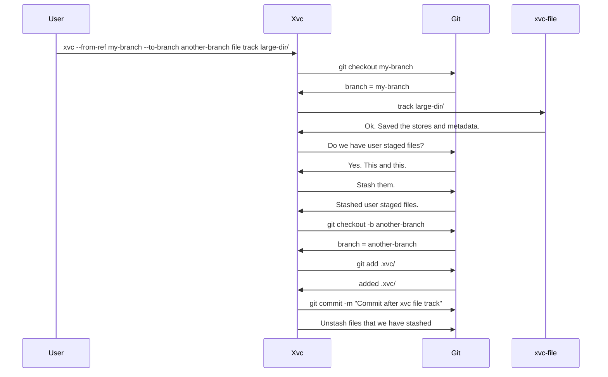

# Git and Xvc

Xvc aims to fill the gap Git leaves for certain workflows. 
These workflows involve large binary data that shouldn't be replicated in each repository.

Xvc tracks all its metadata on top of Git. 
In most cases, Xvc assumes the presence of a Git repository where the user tracks the history, text files, and metadata. 
However, the relationship between these should be clear and separate. 

Xvc doesn't (and shouldn't) use Git more than a user could use manually. 
Our aim is not to replace Git operations with Xvc operations or tamper with the internal structure of the Git repository. 
When Xvc uses Git to track [ECS](./ecs.md) or other metadata, the operations must be separate and *sandwich* Xvc operations. 

- Any Git operation that involves to checkout commits, branches, tags, or other references must come before any Xvc operation. 
As Xvc relies on the files tracked by Git, resuming any state for Xvc operations should be complete before these operations start. 

- Xvc helps to stage and commit certain files in `.xvc/` to Git. 
By default, any state-changing operation in Xvc adds a commit to Git. 

- Xvc also helps to store this changed metadata in a new or existing branch. 
In this case, a checkout must be done before Xvc records the files. 

Note that if the user has some already staged files, these are stashed and unstashed to the requested branch. 
This is a side effect of doing xvc commit operations on behalf of the user. 
The other option is to report an error and quit if the user has the `--to-branch` option set. 
The behavior may change in the future.
For the time being, we will keep this stash-unstash operation for the user files. 

One other issue is the library that we're going to use. 
I checked several options [when I was writing auto-commit functionality](https://github.com/iesahin/xvc/issues/74#issuecomment-1302531362). 

At that time, I decided that the number of Git operations for each Xvc operation is less than five.
These can be done by creating a Git process. 
The libraries are not 100% identical in features. 
Even the most widely used libgit2 doesn't provide shallow clones, or it's not possible to use `git stash --staged`.

The second reason for this is explainability.
Instead of trying to explain to the user what we are doing with Git, we can report the commands we are running. 
The library interfaces are different from Git CLI.
They need to be learned before reading the code. 
Using Git CLI is more dependable, observable, and understandable than trying to come up with a set of library calls. 

