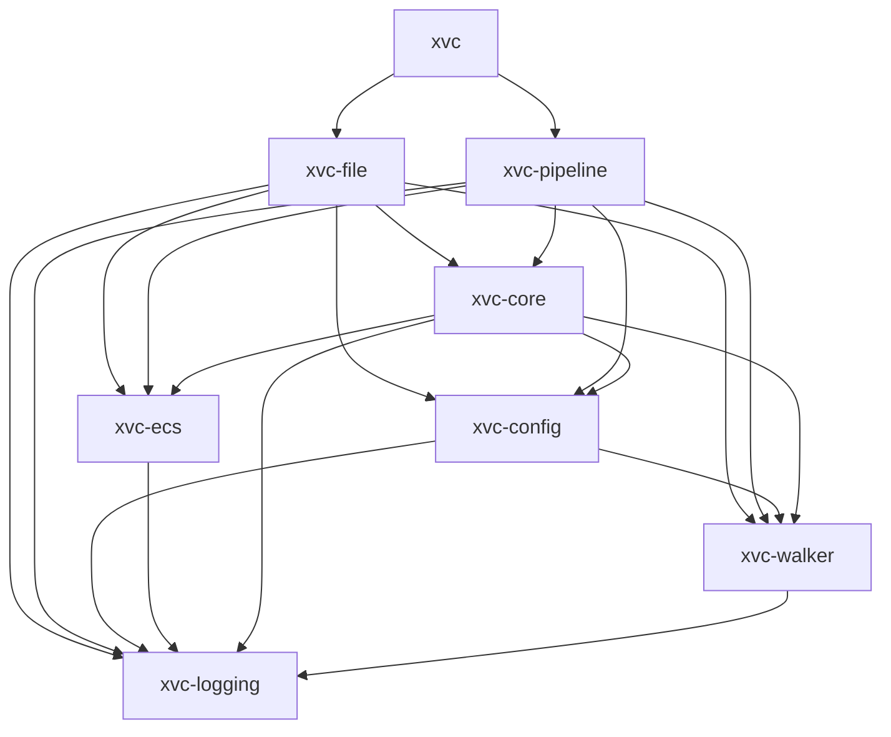
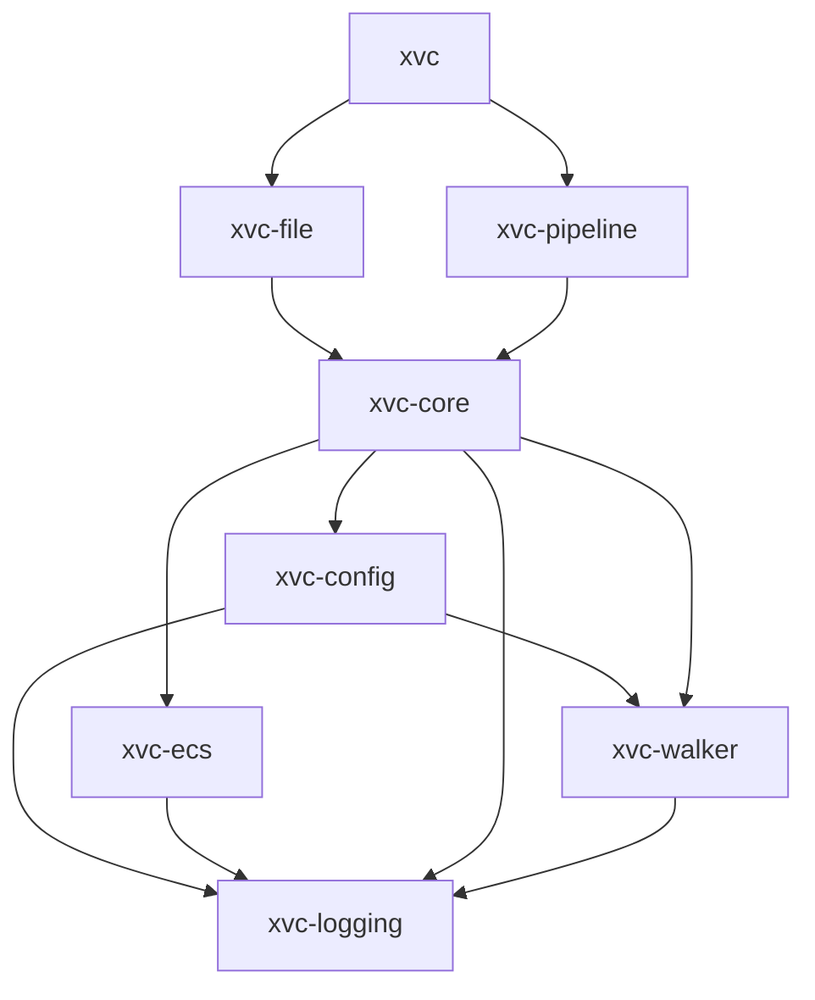

# Xvc Architecture

Difficulty of architecting software is caused by the malleability of the material we're working with. 
Unlike _real_ architecture, bits and bytes don't bring natural restrictions.
It's not possible to build skyscrapers with mud bricks, though our material is much more malleable. 

Software Development created a set of architecture principles to overcome this _unlimit._ 
Most of these principles are bogus. 
They are not actually tested on field, we seldom have a software that's still _perfect_ after 10 years. 
Most of the time, we consider rewriting as a solution. 
As reading and understanding the code is more difficult than coming up with a new _solution_ and rewrite it. 

In this chapter, we describe the problems, assumptions, and solutions in Xvc's intended domain. 
It's a work in progress as the software itself, but should give you idea about the intentions behind decisions. 

In years, we learned a few basic principles regarding software development.

- Object Oriented Programming doesn't work.
Mixing data and functions (methods) isn't a good way to write programs. 
It leads to artificial layers, artificial structures that becomes a burden in the long run.
It burdens the developer's mind to think both data and functions at the same time. 

- Data structures are more important than algorithms. 
Using a few, distinct, well thought data structures is more important than creating _the best_ algorithm.
Algorithms are replaceable locally, without much impact. 
Modifying data structures usually requires updates to all related elements. 

- DRY is overrated.
It's a good principle _after_ you write the software and start maintanence. 
However, during the actual development phase, it's not a good idea to try _not to repeat_ yourself. 
What parts of the program repeats, what parts of the it rhymes, what should be abstracted can be seen _after_ we write the whole.
Trying to apply abstract principles to _exploratory development_ hinders the domain-fit.

- More errors done in the name of abstraction than the reverse.
Most of the times, a good _edit-talent_, that means finding the places a functionality runs is more important than abstraction to find the changes. 
Abstractions doesn't always help. 
They usually distribute a single functionality across arbitrary layers.
In the age of LSP, it's easier to find repeating code and merge them, rather than fixing incorrect assumptions about abstractions splitting functionality.

- Vertical architecture is more important than horizontal architecture
Vertical architecture means the lower the number of redirections between user and their intention, the better.
If the user wants to copy a file, creating a layer of abstract classes to make this *more modular* doesn't result in more resilient software. 
If you want to detect whether we're in a Git repository, checking the presence of `.git` directory is simpler than creating a few abstract classes that work for more than one SCM, and implementing abstract methods for them.
The architecture shouldn't try to satisfy abstract patterns, it should make the path between user's action as direct as possible.

## Xvc Modules (Crates)

Xvc is composed of modules that can be tested (and to some extent used) independently. 
In general lower level modules convert OS level information to data structures that can used in higher levels. 

- `logging`: Logger definitions and debugging macros.

- `walker`: A file system directory walker that checks ignore files. It can also notify the changes in the directory via channels after the initial traversal.

- `config`: Configuration framework that loads configuration from various levels (Default, System, User, Project, Environment) and merges these with command line options for each module. 

- [`ecs`](./ecs.md): The entity-component system responsible for saving and loading state of all data structures, along with their associations and queries.

- `core`: Xvc specific data structures and utilities. 
All user level modules use this module for shared functionality. 

- `file`: API and CLI for `xvc file` commands. 

- `pipeline`: API and CLI command line for `xvc pipeline` commands. 

The current dependency graph where lower level modules are used directly is this:

After the inferfaces are stabilized, all lower level interface will be used through from `xvc-core`.
In this case the graph will be simplified like.

So, any improvement in user level API will be done higher than `xvc-core` levels. 
Any improvement in lower level modules will be done in dependencies of `xvc-core`.
