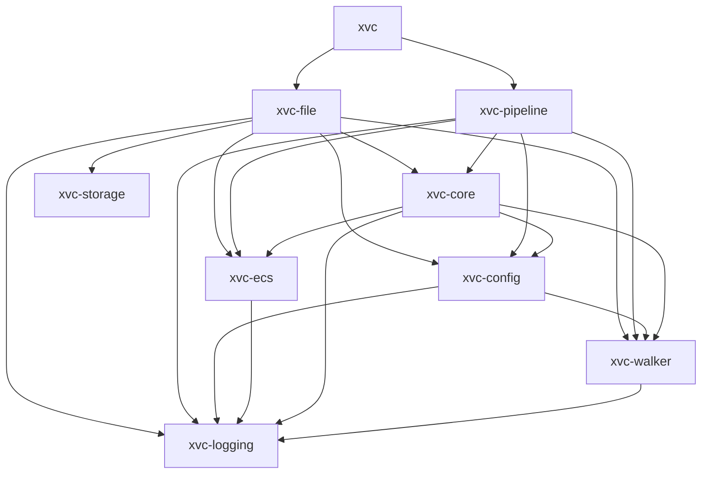
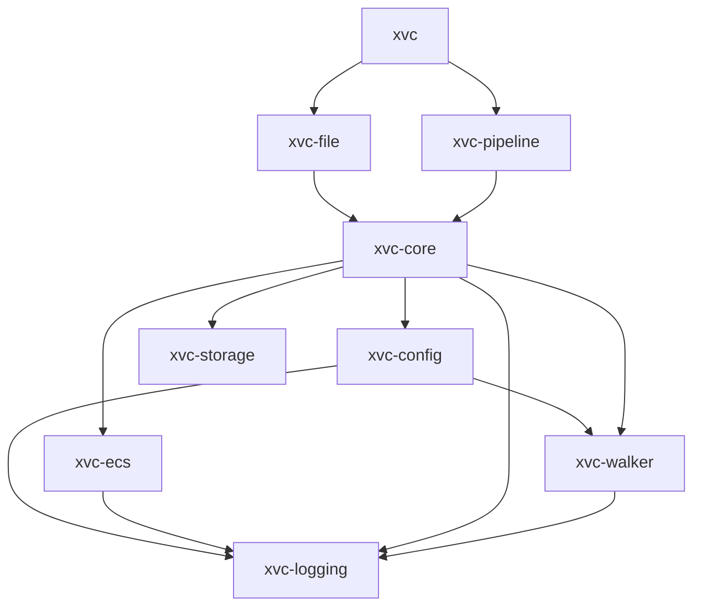

# Xvc Architecture

The malleability of the material (bits and bytes) we're working with leads to difficulties in architecting software.
Unlike _real_ architecture, bits and bytes don't bring natural restrictions.
It's not possible to build skyscrapers with mud bricks, and our material is much more malleable. 
There are too many options, too many ways to solve problems that it's easy to merge in technical mud with the decisions we make. 

Software developers created a set of architectural principles to overcome this _unlimitation._ 
Most of these principles are bogus. 
They are not tested on the field. 
We seldom have software that's still _perfectly maintainable_ after ten years.
Usually, reading and understanding the code is more difficult than coming up with a new _solution_ and rewriting it. 

In this chapter, we describe the problems, assumptions, and solutions in Xvc's intended domain. 
It's a work in progress but should give you ideas about the intentions behind decisions. 

After two decades, I (un)learned a few basic principles regarding software development.

- **Object Oriented Programming doesn't work.**
Mixing data and functions (methods) isn't a good way to write programs. 
It leads to artificial layers and structures that become burdensome the long run.
It forces the developer to think about both the data and functionality at the same time. 
This makes reasoning and solving the problem harder than it should be. 

- **Data structures are more important than algorithms.**
Using a few distinct, well thought data structures is more important than creating _the best_ algorithm.
Algorithms are replaceable locally without much peripheral impact. 
Modifying data structures usually requires updates to all related elements. 

- **DRY is overrated.**
It may be a good principle _after_ you write the first version. 
However, during the actual development phase, it's not a good idea to try _not to repeat_ yourself. 
What parts of the program repeat, what parts rhyme, and what should be abstracted can be seen _after_ we write the whole.
Trying to apply abstract principles to _exploratory development_ hinders the ability to solve problems as plainly as possible. 

- **More errors are done in the name of abstraction than the reverse.**
Abstractions don't always help. 
They usually distribute a single functionality across arbitrary layers.
In the age of LSP, it's easier to find repeating functionality and merge/rewrite, rather than fixing incorrect assumptions about abstractions. 
Problems with repeating code are obvious and easier to fix than problems with abstractions.

- **Vertical architecture is more important than horizontal architecture.**
Vertical architecture means the lower the number of layers between the user and their intention, the better.
If the user wants to copy a file, creating a layer of abstract classes to make this *more modular* doesn't result in more resilient software. 
If you want to detect whether we're in a Git repository, checking the presence of `.git` directory is simpler than creating a few abstract classes that work for more than one SCM, and implementing abstract methods for them.
The architecture shouldn't try to satisfy abstract patterns, it should make the path between the user's action and effect as direct as possible.

## Xvc Modules (Crates)

Xvc is composed of modules that can be tested and used independently. 
`core` module is in the middle of the architecture.
Lower-level crates interface with the OS and convert these to data structures. 
Higher levels use these data structures to implement functionality. 

For example `xvc-walker` crate interfaces with the directories and paths, ignore rules and serves a set of paths with their metadata. 
`xvc-file` crate uses these to check whether a file is changed or not.

- `logging`: Logger definitions and debugging macros.
- `walker`: A file system directory walker that checks ignore files. It can also notify the changes in the directory via channels after the initial traversal.
- `config`: Configuration framework that loads configuration from various levels (Default, System, User, Project, Environment) and merges these with command line options for each module. 
- [`ecs`](./ecs.md): The entity-component system responsible for saving and loading state of all data structures, along with their associations and queries.
* `storage`: Commands and functionality to configure external (local or cloud) locations to store file content.
- `core`: Xvc specific data structures and utilities. 

All user level modules use this module for shared functionality. 

- `file`: Commands to track files and utilities around file management.
- `pipeline`: Commands to define data pipelines as DAGs and run them.

The current dependency graph where lower-level modules are used directly is this:

After the crate interfaces are stabilized, all lower-level functions will be reused from `xvc-core`.
It will provide the basic Xvc API.
In this case, the graph will be simplified.

Any improvement in user-level API will be done higher than `xvc-core` levels. 
Any improvement in lower-level modules will be done in dependencies of `xvc-core`.
