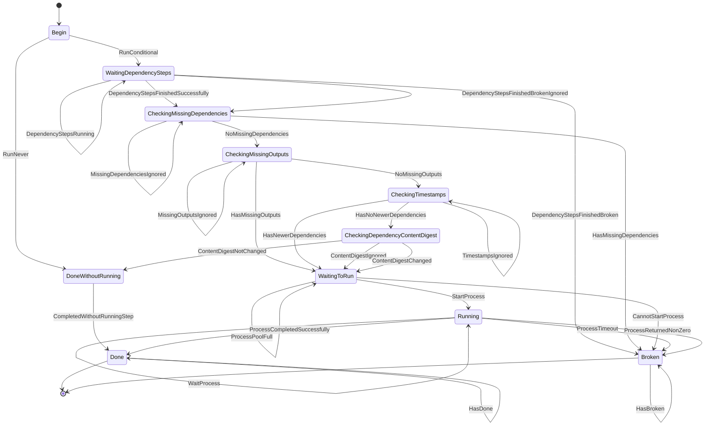

# Xvc Pipelines State Machine

Xvc pipelines use a state machine to track the progress of each step.
Each step has a state that is updated as the pipeline is executed.

A step starts in the `Begin` state.
It must wait for all its dependency steps if `--when` is set to `by_dependencies` (the default) in `xvc pipeline step
new` or `xvc pipeline step update`.
If this option is set to `never`, the step will never run and will move to the `DoneWithoutRunning` state just after begin.
If this option is set to `always`, the step will run regardless of the changes in the dependencies and will move to the
`WaitingDependencySteps` even if dependencies are missing, broken, or have not changed.

If `--when` option is set to `by_dependencies`, the steps check the following conditions before running:

- All dependency steps must be in the `Done` state.
- There should be no missing dependency files.
- There should be no broken dependency processes.
- Dependency files should be newer, or the content digest should be different from the step outputs.

If any of these conditions are met, the step will move to the `WaitingDependencySteps` state.
