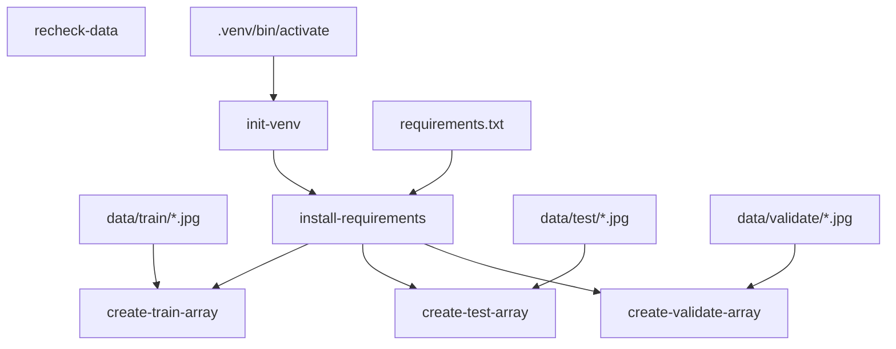

# How to create a data pipeline with Xvc

A data pipeline starts from data and ends with models. Between there is various data transformations and model training. We try to make all pieces reproducible and Xvc helps with this goal. 

In this document, we'll create the following pipeline for a digit recognition system. Our purpose is to show how Xvc helps in versioning data, so this document doesn't try to achieve a high classification performance. 


```admonish info
This document can be more verbose than usual, because all commands in this document are run on a clean directory during tests to check outputs. Some of the idiosyncrasies, e.g., running certain commands with `zsh -c` are due to this reason. Some of the output that changes in 
```
```
```

Although you can do without, most of the times Xvc runs in a Git repository. This allows to version control both the data and the code together. 
```console
$ git init
Initialized empty Git repository in [CWD]/.git/

$ xvc init
```

In this HOWTO, we use Chinese MNIST dataset to create an image classification pipeline. We already downloaded it [from kaggle](https://www.kaggle.com/datasets/gpreda/chinese-mnist/data). 

```console
$ ls -l
total 21096
-rw-r--r--  1 iex  staff  10792680 Nov 17 19:46 chinese_mnist.zip
-rw-r--r--  1 iex  staff      1124 Nov 28 14:27 image_to_numpy_array.py
-rw-r--r--  1 iex  staff        14 Nov 28 14:36 requirements.txt

```
Let's start by tracking the data file with Xvc.

```console
$ xvc file track chinese_mnist.zip --as symlink

```

The default [recheck (checkout) method](/ref/xvc-file-recheck.md) is _copy_ that means the file is
duplicated in the workspace as a writable file. We don't need to write over this
data file, we'll only read from it, so we set the recheck type as symlink.

```console
$ ls -l
total 16
lrwxr-xr-x  1 iex  staff   195 Nov 29 12:27 chinese_mnist.zip -> [CWD]/.xvc/b3/b24/2c9/422f91b804ea3008bc0bc025e97bf50c1d902ae7a0f13588b84f59023d/0.zip
-rw-r--r--  1 iex  staff  1124 Nov 28 14:27 image_to_numpy_array.py
-rw-r--r--  1 iex  staff    14 Nov 28 14:36 requirements.txt

```

The long directory name is the BLAKE-3 hash of the data file.

As we'll work with the file contents, let's unzip the data file.

```console
$ unzip -q chinese_mnist.zip

$ ls -l
total 16
lrwxr-xr-x  1 iex  staff   195 Nov 29 12:27 chinese_mnist.zip -> [CWD]/.xvc/b3/b24/2c9/422f91b804ea3008bc0bc025e97bf50c1d902ae7a0f13588b84f59023d/0.zip
drwxr-xr-x  4 iex  staff   128 Nov 17 19:45 data
-rw-r--r--  1 iex  staff  1124 Nov 28 14:27 image_to_numpy_array.py
-rw-r--r--  1 iex  staff    14 Nov 28 14:36 requirements.txt

```

Now we have the data directory with the following structure:

```console
$ tree -d data
data
└── data

2 directories

```

Let's track the data directory as well with Xvc.

```console
$ xvc file track data --as symlink
```

The reason we're tracking the data directory separately is that we'll use different subsets as training, validation, and test data. 

Let's list the track status of files first. 

```console
$ xvc file list data/data/input_9_9_*
SS         [..] 3a714d65          data/data/input_9_9_9.jpg
SS         [..] 9ffccc4d          data/data/input_9_9_8.jpg
SS         [..] 5d6312a4          data/data/input_9_9_7.jpg
SS         [..] 7a0ddb0e          data/data/input_9_9_6.jpg
SS         [..] 2047d7f3          data/data/input_9_9_5.jpg
SS         [..] 10fcf309          data/data/input_9_9_4.jpg
SS         [..] 0bdcd918          data/data/input_9_9_3.jpg
SS         [..] aebcbc03          data/data/input_9_9_2.jpg
SS         [..] 38abd173          data/data/input_9_9_15.jpg
SS         [..] 7c6a9003          data/data/input_9_9_14.jpg
SS         [..] a9f04ad9          data/data/input_9_9_13.jpg
SS         [..] 2d372f95          data/data/input_9_9_12.jpg
SS         [..] 8fe799b4          data/data/input_9_9_11.jpg
SS         [..] ee35e5d5          data/data/input_9_9_10.jpg
SS         [..] 7576894f          data/data/input_9_9_1.jpg
Total #: 15 Workspace Size:        2925 Cached Size:        8710


```

`xvc file list` command shows the tracking status. Initial two characters shows
the tracking status, `SS` means the file is tracked as symlink and is available
in the workspace as a symlink. The next column shows the file size, then the
last modified date, then the BLAKE-3 hash of the file, and finally the file
name. The empty column contains the actual hash of the file if the file is
available in the workspace. Here it's empty because the workspace file is a
link to the file in cache.

The summary line shows the total size of the files and the size they occupy in
the workspace.

## Splitting Train, Validation, and Test Sets

The first step of the pipeline is to create subsets of the data. 

The data set contains 15 classes. It has 10 samples for each of these classes
from 100 different people. As we'll train a Chinese digit recognizer, we'll
first divide volunteers 1-60 for training, 61-80 for validation, and 81-100 for
testing. This will ensure that the model is not trained with the same person's
handwriting.


```console
$ xvc file copy --name-only data/data/input_?_* data/train/
$ xvc file copy --name-only data/data/input_[12345]?_* data/train/
$ xvc file copy --name-only data/data/input_100_* data/train/
$ xvc file copy --name-only data/data/input_[67]?_* data/validate/
$ xvc file copy --name-only data/data/input_[89]?_* data/test/

$ tree -d data/
data/
├── data
├── test
├── train
└── validate

5 directories

```

If you look at the contents of these directories, you'll see that they are
symbolic links to the same files we started to track. 

Let's check the number of images in each set. 

```console
$ zsh -c 'ls -1 data/train/*.jpg | wc -l'
    9000

$ zsh -c 'ls -1 data/validate/*.jpg | wc -l'
    3000

$ zsh -c 'ls -1 data/test/*.jpg | wc -l'
    3000

```

The first step in the pipeline will be rechecking (checking out) these subsets.

```console
$ xvc pipeline step new -s recheck-data --command 'xvc file recheck data/train/ data/validate/ data/test/'
```

[`xvc file recheck`](/ref/xvc-file-recheck.md) is used in to instate files from Xvc cache.
Let's test the pipeline by first deleting the files we manually created.
```console
$ rm -rf data/train data/validate data/test
```

We run the steps we created.

```console
$ xvc pipeline run 
[DONE] recheck-data (xvc file recheck data/train/ data/validate/ data/test/)

```
If we check the contents of the directories, we'll see that they are back.

```console
$ zsh -c 'ls -1 data/train/*.jpg | wc -l'
    9000

```

## Preprocessing Images into Numpy Arrays


The Python script to train a model runs with Numpy arrays. So we'll convert each of these directories with images into two numpy arrays. 
One of the arrays will keep $n$ 64x64 images and the other will keep $n$ labels for these images.

```console
$ xvc pipeline step new --step-name create-train-array --command '.venv/bin/python3 image_to_numpy_array.py --dir data/train/'
$ xvc pipeline step new --step-name create-test-array --command '.venv/bin/python3 image_to_numpy_array.py --dir data/test/'
$ xvc pipeline step new --step-name create-validate-array --command '.venv/bin/python3 image_to_numpy_array.py --dir data/validate/'
```

These commands will run when the image files in those directories will change. Xvc can keep track of file groups and invalidate a step when the _content_ of any of these files change. Moreover, it's possible to track which files have changed if there are too many files. We don't need this feature of tracking individual items in _globs_, so we'll use a _glob_ dependency. 

```console
$ xvc pipeline step dependency --step-name create-train-array --glob 'data/train/*.jpg'
$ xvc pipeline step dependency --step-name create-test-array --glob 'data/test/*.jpg'
$ xvc pipeline step dependency --step-name create-validate-array --glob 'data/validate/*.jpg'
```

Now we have three more steps that depend on changed files. The script depends on OpenCV to read images. Python best practices recommend to create a separate virtual environment for each project. We'll also make sure that the venv is created and the requirements are installed before running the script.

Create a command to initialize the virtual environment. It will run if there is no `.venv/bin/activate` file. 

```console
$ xvc pipeline step new --step-name init-venv --command 'python3 -m venv .venv'
$ xvc pipeline step dependency --step-name init-venv --generic 'echo "$(hostname)/$(pwd)"'
```

We used `--generic` dependency that runs a command and checks its output to see whether the step requires to be run again. We only want to run `init-env` once per deployment, so checking output of `hostname` and `pwd` is better than existence of a file. File dependencies must be available before running the pipeline to record their metadata. There is no such restriction for generic dependencies.

Then, another step that depends on `init-venv` and `requirements.txt` will install the dependencies. 

```console
$ xvc pipeline step new --step-name install-requirements --command '.venv/bin/python3 -m pip install -r requirements.txt'
$ xvc pipeline step dependency --step-name install-requirements --step init-venv
$ xvc pipeline step dependency --step-name install-requirements --file requirements.txt
```
Note that, unlike other tools, you can specify direct dependencies between steps in Xvc. When a pipeline step must wait another step to finish successfully, a dependency between these two can be defined. 

The above `create-*-array` steps will depend on to `install-requirements` to ensure that requirements are installed when the scripts are run. 

```console
$ xvc pipeline step dependency --step-name create-train-array --step install-requirements

$ xvc pipeline step dependency --step-name create-validate-array --step install-requirements

$ xvc pipeline step dependency --step-name create-test-array --step install-requirements

```

Now, as the pipeline grows, it may be nice to see the graph what we have done so far. 

```console
$ xvc pipeline dag --format mermaid
flowchart TD
    n0["recheck-data"]
    n1["create-train-array"]
    n2["data/train/*.jpg"] --> n1
    n3["install-requirements"] --> n1
    n4["create-test-array"]
    n5["data/test/*.jpg"] --> n4
    n3["install-requirements"] --> n4
    n6["create-validate-array"]
    n7["data/validate/*.jpg"] --> n6
    n3["install-requirements"] --> n6
    n8["init-venv"]
    n9["echo "$(hostname)/$(pwd)""] --> n8
    n3["install-requirements"]
    n8["init-venv"] --> n3
    n10["requirements.txt"] --> n3


```


`dag` command can also produce GraphViz DOT output. For larger graphs, it may be more suitable. We'll use DOT to create images in later sections. 

Let's run the pipeline at this point to test.

```console
$ xvc -vv pipeline run
[DEBUG][logging/src/lib.rs::236] Terminal logger enabled with level: Debug
[DEBUG][core/src/types/xvcroot.rs::253] XVC DIR: "[CWD]"
[DEBUG][config/src/error.rs::72] Config source for level "system" not found at "/Users/iex/Library/Application Support/com.emresult.xvc"
[DEBUG][config/src/error.rs::72] Config source for level "global" not found at "/Users/iex/Library/Application Support/xvc"
[DEBUG][/Users/iex/.cargo/registry/src/index.crates.io-6f17d22bba15001f/globset-0.4.13/src/lib.rs::431] built glob set; 0 literals, 2 basenames, 0 extensions, 0 prefixes, 0 suffixes, 0 required extensions, 0 regexes
[INFO] Found explicit dependency: XvcStep { name: "create-train-array" } -> Step(StepDep { name: "install-requirements" })
[INFO] Found explicit dependency: XvcStep { name: "create-test-array" } -> Step(StepDep { name: "install-requirements" })
[INFO] Found explicit dependency: XvcStep { name: "install-requirements" } -> Step(StepDep { name: "init-venv" })
[INFO] Found explicit dependency: XvcStep { name: "create-validate-array" } -> Step(StepDep { name: "install-requirements" })
[INFO][pipeline/src/pipeline/mod.rs::343] Pipeline Graph:
digraph {
    0 [ label = "(30010, 11012387426036470048)" ]
    1 [ label = "(30011, 11084628250716558753)" ]
    2 [ label = "(30016, 9383897065799906771)" ]
    3 [ label = "(30009, 9299612718943080636)" ]
    4 [ label = "(30018, 185512062461290331)" ]
    5 [ label = "(30012, 15901754714280944657)" ]
    0 -> 4 [ label = "Step" ]
    1 -> 4 [ label = "Step" ]
    4 -> 2 [ label = "Step" ]
    5 -> 4 [ label = "Step" ]
}


[INFO] Waiting for dependency steps for step create-test-array
[DEBUG] Dependency steps are running for step create-test-array
[INFO] Waiting for dependency steps for step install-requirements
[INFO] No dependency steps for step recheck-data
[INFO] [recheck-data] Dependencies has changed
[INFO] Waiting for dependency steps for step create-train-array
[INFO] Waiting for dependency steps for step create-validate-array
[DEBUG] Dependency steps are running for step create-validate-array
[DEBUG] Dependency steps are running for step install-requirements
[DEBUG] Dependency steps are running for step create-train-array
[INFO] No dependency steps for step init-venv
[DEBUG] Step recheck-data with command xvc file recheck data/train/ data/validate/ data/test/ is still running
[DEBUG] Dependency steps are running for step create-test-array
[DEBUG] Dependency steps are running for step install-requirements
[DEBUG] Dependency steps are running for step create-validate-array
[DEBUG] Dependency steps are running for step create-train-array
[DEBUG] Dependency steps are running for step create-test-array
[INFO] [init-venv] Dependencies has changed
[DEBUG] Dependency steps are running for step install-requirements
[DEBUG] Dependency steps are running for step create-validate-array
[DEBUG] Dependency steps are running for step create-train-array
[DEBUG] Step init-venv with command python3 -m venv .venv is still running
[DEBUG] Dependency steps are running for step create-test-array
[DEBUG] Dependency steps are running for step create-validate-array
[DEBUG] Dependency steps are running for step install-requirements
[DEBUG] Dependency steps are running for step create-train-array
[DEBUG] Dependency steps are running for step create-test-array
[DEBUG] Dependency steps are running for step create-validate-array
[DEBUG] Dependency steps are running for step install-requirements
[DEBUG] Dependency steps are running for step create-train-array
[DEBUG] Dependency steps are running for step create-validate-array
[DEBUG] Dependency steps are running for step create-test-array
[DEBUG] Dependency steps are running for step install-requirements
[DEBUG] Dependency steps are running for step create-train-array
[DEBUG] Dependency steps are running for step create-test-array
[DEBUG] Dependency steps are running for step create-validate-array
[DEBUG] Dependency steps are running for step install-requirements
[DEBUG] Dependency steps are running for step create-train-array
[DEBUG] Dependency steps are running for step create-validate-array
[DEBUG] Dependency steps are running for step install-requirements
[DEBUG] Dependency steps are running for step create-test-array
[DEBUG] Dependency steps are running for step create-train-array
[DEBUG] Dependency steps are running for step create-validate-array
[DEBUG] Dependency steps are running for step create-train-array
[DEBUG] Dependency steps are running for step create-test-array
[DEBUG] Dependency steps are running for step install-requirements
[DEBUG] Dependency steps are running for step create-validate-array
[DEBUG] Dependency steps are running for step create-train-array
[DEBUG] Dependency steps are running for step install-requirements
[DEBUG] Dependency steps are running for step create-test-array
[DEBUG] Dependency steps are running for step create-validate-array
[DEBUG] Dependency steps are running for step create-test-array
[DEBUG] Dependency steps are running for step create-train-array
[DEBUG] Dependency steps are running for step install-requirements
[DEBUG] Dependency steps are running for step create-train-array
[DEBUG] Dependency steps are running for step create-validate-array
[DEBUG] Dependency steps are running for step create-test-array
[DEBUG] Dependency steps are running for step install-requirements
[DEBUG] Dependency steps are running for step create-validate-array
[DEBUG] Dependency steps are running for step create-train-array
[DEBUG] Dependency steps are running for step create-test-array
[DEBUG] Dependency steps are running for step install-requirements
[DEBUG] Dependency steps are running for step create-train-array
[DEBUG] Dependency steps are running for step install-requirements
[DEBUG] Dependency steps are running for step create-validate-array
[DEBUG] Dependency steps are running for step create-test-array
[DEBUG] Dependency steps are running for step install-requirements
[DEBUG] Dependency steps are running for step create-train-array
[DEBUG] Dependency steps are running for step create-validate-array
[DEBUG] Dependency steps are running for step create-test-array
[DEBUG] Dependency steps are running for step install-requirements
[DEBUG] Dependency steps are running for step create-train-array
[DEBUG] Dependency steps are running for step create-validate-array
[DEBUG] Dependency steps are running for step create-test-array
[DEBUG] Dependency steps are running for step install-requirements
[DEBUG] Dependency steps are running for step create-validate-array
[DEBUG] Dependency steps are running for step create-train-array
[DEBUG] Dependency steps are running for step create-test-array
[DEBUG] Dependency steps are running for step install-requirements
[DEBUG] Dependency steps are running for step create-validate-array
[DEBUG] Dependency steps are running for step create-train-array
[DEBUG] Dependency steps are running for step create-test-array
[DEBUG] Dependency steps are running for step install-requirements
[DEBUG] Dependency steps are running for step create-validate-array
[DEBUG] Dependency steps are running for step create-train-array
[DEBUG] Dependency steps are running for step create-test-array
[DEBUG] Dependency steps are running for step install-requirements
[DEBUG] Dependency steps are running for step create-validate-array
[DEBUG] Dependency steps are running for step create-train-array
[DEBUG] Dependency steps are running for step create-test-array
[DEBUG] Dependency steps are running for step install-requirements
[DEBUG] Dependency steps are running for step create-validate-array
[DEBUG] Dependency steps are running for step create-train-array
[DEBUG] Dependency steps are running for step create-test-array
[DEBUG] Dependency steps are running for step install-requirements
[DEBUG] Dependency steps are running for step create-validate-array
[DEBUG] Dependency steps are running for step create-test-array
[DEBUG] Dependency steps are running for step create-train-array
[DEBUG] Dependency steps are running for step install-requirements
[DEBUG] Dependency steps are running for step create-validate-array
[DEBUG] Dependency steps are running for step create-test-array
[DEBUG] Dependency steps are running for step create-train-array
[DEBUG] Dependency steps are running for step install-requirements
[DEBUG] Dependency steps are running for step create-validate-array
[DEBUG] Dependency steps are running for step create-test-array
[DEBUG] Dependency steps are running for step create-train-array
[DEBUG] Dependency steps are running for step install-requirements
[DEBUG] Dependency steps are running for step create-validate-array
[DEBUG] Dependency steps are running for step create-test-array
[DEBUG] Dependency steps are running for step create-train-array
[DEBUG] Dependency steps are running for step install-requirements
[DEBUG] Dependency steps are running for step create-validate-array
[DEBUG] Dependency steps are running for step create-test-array
[DEBUG] Dependency steps are running for step create-train-array
[DEBUG] Dependency steps are running for step install-requirements
[DEBUG] Dependency steps are running for step create-validate-array
[DEBUG] Dependency steps are running for step create-test-array
[DEBUG] Dependency steps are running for step create-train-array
[DEBUG] Dependency steps are running for step install-requirements
[DEBUG] Dependency steps are running for step create-validate-array
[DEBUG] Dependency steps are running for step create-test-array
[DEBUG] Dependency steps are running for step create-train-array
[DEBUG] Dependency steps are running for step install-requirements
[DEBUG] Dependency steps are running for step create-validate-array
[DEBUG] Dependency steps are running for step create-test-array
[DEBUG] Dependency steps are running for step install-requirements
[DEBUG] Dependency steps are running for step create-train-array
[DEBUG] Dependency steps are running for step create-validate-array
[DEBUG] Dependency steps are running for step create-test-array
[DEBUG] Dependency steps are running for step install-requirements
[DEBUG] Dependency steps are running for step create-train-array
[DEBUG] Dependency steps are running for step create-validate-array
[DEBUG] Dependency steps are running for step create-test-array
[DEBUG] Dependency steps are running for step install-requirements
[DEBUG] Dependency steps are running for step create-train-array
[DEBUG] Dependency steps are running for step create-test-array
[DEBUG] Dependency steps are running for step create-validate-array
[DEBUG] Dependency steps are running for step install-requirements
[DEBUG] Dependency steps are running for step create-train-array
[DEBUG] Dependency steps are running for step create-test-array
[DEBUG] Dependency steps are running for step create-validate-array
[DEBUG] Dependency steps are running for step install-requirements
[DEBUG] Dependency steps are running for step create-train-array
[DEBUG] Dependency steps are running for step create-test-array
[DEBUG] Dependency steps are running for step create-validate-array
[DEBUG] Dependency steps are running for step install-requirements
[DEBUG] Dependency steps are running for step create-train-array
[DEBUG] Dependency steps are running for step create-test-array
[DEBUG] Dependency steps are running for step create-validate-array
[DEBUG] Dependency steps are running for step install-requirements
[DEBUG] Dependency steps are running for step create-train-array
[DEBUG][walker/src/notify.rs::126] Error in metadata for [CWD]/.git/index.lock
[DONE] recheck-data (xvc file recheck data/train/ data/validate/ data/test/)
[DEBUG] Dependency steps are running for step create-test-array
[DEBUG] Dependency steps are running for step create-validate-array
[DEBUG] Dependency steps are running for step install-requirements
[DEBUG] Dependency steps are running for step create-train-array
[DEBUG] Dependency steps are running for step create-test-array
[DEBUG] Dependency steps are running for step create-validate-array
[DEBUG] Dependency steps are running for step create-train-array
[DEBUG] Dependency steps are running for step install-requirements
[DEBUG] Dependency steps are running for step create-test-array
[DEBUG] Dependency steps are running for step create-validate-array
[DEBUG] Dependency steps are running for step install-requirements
[DEBUG] Dependency steps are running for step create-train-array
[DEBUG] Dependency steps are running for step create-validate-array
[DEBUG] Dependency steps are running for step create-test-array
[DEBUG] Dependency steps are running for step install-requirements
[DEBUG] Dependency steps are running for step create-train-array
[DEBUG] Dependency steps are running for step create-validate-array
[DEBUG] Dependency steps are running for step create-test-array
[DEBUG] Dependency steps are running for step install-requirements
[DEBUG] Dependency steps are running for step create-train-array
[DEBUG] Dependency steps are running for step create-validate-array
[DEBUG] Dependency steps are running for step create-test-array
[DEBUG] Dependency steps are running for step install-requirements
[DEBUG] Dependency steps are running for step create-train-array
[DEBUG] Dependency steps are running for step create-test-array
[DEBUG] Dependency steps are running for step create-validate-array
[DEBUG] Dependency steps are running for step create-train-array
[DEBUG] Dependency steps are running for step install-requirements
[DEBUG] Dependency steps are running for step create-test-array
[DEBUG] Dependency steps are running for step create-validate-array
[DEBUG] Dependency steps are running for step install-requirements
[DEBUG] Dependency steps are running for step create-train-array
[DEBUG] Dependency steps are running for step create-test-array
[DEBUG] Dependency steps are running for step create-validate-array
[DEBUG] Dependency steps are running for step install-requirements
[DEBUG] Dependency steps are running for step create-train-array
[DEBUG] Dependency steps are running for step create-test-array
[DEBUG] Dependency steps are running for step create-validate-array
[DEBUG] Dependency steps are running for step install-requirements
[DEBUG] Dependency steps are running for step create-train-array
[DEBUG] Dependency steps are running for step create-test-array
[DEBUG] Dependency steps are running for step create-validate-array
[DEBUG] Dependency steps are running for step install-requirements
[DEBUG] Dependency steps are running for step create-train-array
[DEBUG] Dependency steps are running for step create-test-array
[DEBUG] Dependency steps are running for step create-validate-array
[DEBUG] Dependency steps are running for step create-train-array
[DEBUG] Dependency steps are running for step install-requirements
[DEBUG] Dependency steps are running for step create-test-array
[DEBUG] Dependency steps are running for step create-validate-array
[DEBUG] Dependency steps are running for step create-train-array
[DEBUG] Dependency steps are running for step install-requirements
[DEBUG] Dependency steps are running for step create-test-array
[DEBUG] Dependency steps are running for step create-validate-array
[DEBUG] Dependency steps are running for step install-requirements
[DEBUG] Dependency steps are running for step create-train-array
[DEBUG] Dependency steps are running for step create-test-array
[DEBUG] Dependency steps are running for step create-validate-array
[DEBUG] Dependency steps are running for step install-requirements
[DEBUG] Dependency steps are running for step create-train-array
[DEBUG] Dependency steps are running for step create-validate-array
[DEBUG] Dependency steps are running for step create-test-array
[DEBUG] Dependency steps are running for step install-requirements
[DEBUG] Dependency steps are running for step create-train-array
[DEBUG] Dependency steps are running for step create-validate-array
[DEBUG] Dependency steps are running for step create-test-array
[DEBUG] Dependency steps are running for step install-requirements
[DEBUG] Dependency steps are running for step create-train-array
[DEBUG] Dependency steps are running for step create-validate-array
[DEBUG] Dependency steps are running for step create-test-array
[DEBUG] Dependency steps are running for step install-requirements
[DEBUG] Dependency steps are running for step create-train-array
[DEBUG] Dependency steps are running for step create-validate-array
[DEBUG] Dependency steps are running for step create-test-array
[DEBUG] Dependency steps are running for step create-train-array
[DEBUG] Dependency steps are running for step install-requirements
[DEBUG] Dependency steps are running for step create-validate-array
[DEBUG] Dependency steps are running for step create-test-array
[DEBUG] Dependency steps are running for step install-requirements
[DEBUG] Dependency steps are running for step create-train-array
[DEBUG] Dependency steps are running for step create-validate-array
[DEBUG] Dependency steps are running for step create-test-array
[DEBUG] Dependency steps are running for step install-requirements
[DEBUG] Dependency steps are running for step create-train-array
[DEBUG] Dependency steps are running for step create-test-array
[DEBUG] Dependency steps are running for step create-validate-array
[DEBUG] Dependency steps are running for step install-requirements
[DEBUG] Dependency steps are running for step create-train-array
[DEBUG] Dependency steps are running for step create-test-array
[DEBUG] Dependency steps are running for step create-validate-array
[DEBUG] Dependency steps are running for step install-requirements
[DEBUG] Dependency steps are running for step create-train-array
[DEBUG] Dependency steps are running for step create-validate-array
[DEBUG] Dependency steps are running for step create-test-array
[DEBUG] Dependency steps are running for step install-requirements
[DEBUG] Dependency steps are running for step create-train-array
[DEBUG] Dependency steps are running for step create-test-array
[DEBUG] Dependency steps are running for step create-validate-array
[DEBUG] Dependency steps are running for step install-requirements
[DEBUG] Dependency steps are running for step create-train-array
[DEBUG] Dependency steps are running for step create-validate-array
[DEBUG] Dependency steps are running for step create-test-array
[DEBUG] Dependency steps are running for step install-requirements
[DEBUG] Dependency steps are running for step create-train-array
[DEBUG] Dependency steps are running for step create-validate-array
[DEBUG] Dependency steps are running for step create-test-array
[DEBUG] Dependency steps are running for step create-train-array
[DEBUG] Dependency steps are running for step install-requirements
[DEBUG] Dependency steps are running for step create-test-array
[DEBUG] Dependency steps are running for step create-validate-array
[DEBUG] Dependency steps are running for step create-train-array
[DEBUG] Dependency steps are running for step install-requirements
[DEBUG] Dependency steps are running for step create-validate-array
[DEBUG] Dependency steps are running for step create-test-array
[DEBUG] Dependency steps are running for step create-train-array
[DEBUG] Dependency steps are running for step install-requirements
[DEBUG] Dependency steps are running for step create-validate-array
[DEBUG] Dependency steps are running for step create-test-array
[DEBUG] Dependency steps are running for step create-train-array
[DEBUG] Dependency steps are running for step install-requirements
[DEBUG] Dependency steps are running for step create-validate-array
[DEBUG] Dependency steps are running for step create-test-array
[DEBUG] Dependency steps are running for step create-train-array
[DEBUG] Dependency steps are running for step install-requirements
[DEBUG] Dependency steps are running for step create-validate-array
[DEBUG] Dependency steps are running for step create-test-array
[DEBUG] Dependency steps are running for step create-train-array
[DEBUG] Dependency steps are running for step install-requirements
[DEBUG] Dependency steps are running for step create-validate-array
[DEBUG] Dependency steps are running for step create-test-array
[DEBUG] Dependency steps are running for step create-train-array
[DEBUG] Dependency steps are running for step create-validate-array
[DEBUG] Dependency steps are running for step install-requirements
[DEBUG] Dependency steps are running for step create-test-array
[DEBUG] Dependency steps are running for step create-train-array
[DEBUG] Dependency steps are running for step create-validate-array
[DEBUG] Dependency steps are running for step install-requirements
[DEBUG] Dependency steps are running for step create-test-array
[DEBUG] Dependency steps are running for step create-train-array
[DEBUG] Dependency steps are running for step create-validate-array
[DEBUG] Dependency steps are running for step install-requirements
[DEBUG] Dependency steps are running for step create-test-array
[DEBUG] Dependency steps are running for step create-train-array
[DEBUG] Dependency steps are running for step create-validate-array
[DEBUG] Dependency steps are running for step install-requirements
[DEBUG] Dependency steps are running for step create-test-array
[DEBUG] Dependency steps are running for step create-train-array
[DEBUG] Dependency steps are running for step create-validate-array
[DEBUG] Dependency steps are running for step install-requirements
[DEBUG] Dependency steps are running for step create-test-array
[DEBUG] Dependency steps are running for step create-train-array
[DEBUG] Dependency steps are running for step create-validate-array
[DEBUG] Dependency steps are running for step install-requirements
[DEBUG] Dependency steps are running for step create-test-array
[DEBUG] Dependency steps are running for step create-train-array
[DEBUG] Dependency steps are running for step create-validate-array
[DEBUG] Dependency steps are running for step create-test-array
[DEBUG] Dependency steps are running for step install-requirements
[DEBUG] Dependency steps are running for step create-train-array
[DEBUG] Dependency steps are running for step create-validate-array
[DEBUG] Dependency steps are running for step create-test-array
[DEBUG] Dependency steps are running for step install-requirements
[DEBUG] Dependency steps are running for step create-train-array
[DEBUG] Dependency steps are running for step create-validate-array
[DEBUG] Dependency steps are running for step create-test-array
[DEBUG] Dependency steps are running for step install-requirements
[DEBUG] Dependency steps are running for step create-validate-array
[DEBUG] Dependency steps are running for step create-train-array
[DEBUG] Dependency steps are running for step install-requirements
[DEBUG] Dependency steps are running for step create-test-array
[DEBUG] Dependency steps are running for step create-validate-array
[DEBUG] Dependency steps are running for step create-train-array
[DEBUG] Dependency steps are running for step install-requirements
[DEBUG] Dependency steps are running for step create-test-array
[DEBUG] Dependency steps are running for step create-validate-array
[DEBUG] Dependency steps are running for step create-train-array
[DEBUG] Dependency steps are running for step install-requirements
[DEBUG] Dependency steps are running for step create-test-array
[DEBUG] Dependency steps are running for step create-validate-array
[DEBUG] Dependency steps are running for step create-train-array
[DEBUG] Dependency steps are running for step install-requirements
[DEBUG] Dependency steps are running for step create-test-array
[DEBUG] Dependency steps are running for step create-validate-array
[DEBUG] Dependency steps are running for step install-requirements
[DEBUG] Dependency steps are running for step create-train-array
[DEBUG] Dependency steps are running for step create-test-array
[DEBUG] Dependency steps are running for step create-validate-array
[DEBUG] Dependency steps are running for step install-requirements
[DEBUG] Dependency steps are running for step create-train-array
[DEBUG] Dependency steps are running for step create-test-array
[DEBUG] Dependency steps are running for step create-validate-array
[DEBUG] Dependency steps are running for step install-requirements
[DEBUG] Dependency steps are running for step create-train-array
[DEBUG] Dependency steps are running for step create-test-array
[DEBUG] Dependency steps are running for step create-train-array
[DEBUG] Dependency steps are running for step create-validate-array
[DEBUG] Dependency steps are running for step install-requirements
[DEBUG] Dependency steps are running for step create-test-array
[DEBUG] Dependency steps are running for step create-train-array
[DEBUG] Dependency steps are running for step install-requirements
[DEBUG] Dependency steps are running for step create-validate-array
[DEBUG] Dependency steps are running for step create-test-array
[DEBUG] Dependency steps are running for step create-validate-array
[DEBUG] Dependency steps are running for step create-train-array
[DEBUG] Dependency steps are running for step install-requirements
[DEBUG] Dependency steps are running for step create-test-array
[DEBUG] Dependency steps are running for step create-validate-array
[DEBUG] Dependency steps are running for step create-train-array
[DEBUG] Dependency steps are running for step install-requirements
[DEBUG] Dependency steps are running for step create-test-array
[DEBUG] Dependency steps are running for step create-train-array
[DEBUG] Dependency steps are running for step create-validate-array
[DEBUG] Dependency steps are running for step install-requirements
[DEBUG] Dependency steps are running for step create-test-array
[DEBUG] Dependency steps are running for step create-train-array
[DEBUG] Dependency steps are running for step create-validate-array
[DEBUG] Dependency steps are running for step install-requirements
[DEBUG] Dependency steps are running for step create-test-array
[DEBUG] Dependency steps are running for step install-requirements
[DEBUG] Dependency steps are running for step create-validate-array
[DEBUG] Dependency steps are running for step create-train-array
[DEBUG] Dependency steps are running for step create-test-array
[DEBUG] Dependency steps are running for step create-validate-array
[DEBUG] Dependency steps are running for step install-requirements
[DEBUG] Dependency steps are running for step create-train-array
[DEBUG] Dependency steps are running for step create-test-array
[DEBUG] Dependency steps are running for step install-requirements
[DEBUG] Dependency steps are running for step create-train-array
[DEBUG] Dependency steps are running for step create-validate-array
[DEBUG] Dependency steps are running for step create-test-array
[DEBUG] Dependency steps are running for step create-train-array
[DEBUG] Dependency steps are running for step install-requirements
[DEBUG] Dependency steps are running for step create-validate-array
[DEBUG] Dependency steps are running for step create-test-array
[DEBUG] Dependency steps are running for step install-requirements
[DEBUG] Dependency steps are running for step create-train-array
[DEBUG] Dependency steps are running for step create-validate-array
[DEBUG] Dependency steps are running for step create-test-array
[DEBUG] Dependency steps are running for step install-requirements
[DEBUG] Dependency steps are running for step create-train-array
[DEBUG] Dependency steps are running for step create-validate-array
[DEBUG] Dependency steps are running for step create-test-array
[DEBUG] Dependency steps are running for step install-requirements
[DEBUG] Dependency steps are running for step create-validate-array
[DEBUG] Dependency steps are running for step create-train-array
[DEBUG] Dependency steps are running for step create-test-array
[DEBUG] Dependency steps are running for step create-train-array
[DEBUG] Dependency steps are running for step install-requirements
[DEBUG] Dependency steps are running for step create-validate-array
[DEBUG] Dependency steps are running for step create-test-array
[DEBUG][walker/src/notify.rs::126] Error in metadata for [CWD]/.venv/lib/python3.11/site-packages/_distutils_hack/__pycache__/__init__.cpython-311.pyc.4377731632
[DEBUG][walker/src/notify.rs::104] Error in metadata for [CWD]/.venv/lib/python3.11/site-packages/_distutils_hack/__pycache__/__init__.cpython-311.pyc.4377731632
[DEBUG][walker/src/notify.rs::126] Error in metadata for [CWD]/.venv/lib/python3.11/site-packages/_distutils_hack/__pycache__/override.cpython-311.pyc.4377731888
[DEBUG][walker/src/notify.rs::104] Error in metadata for [CWD]/.venv/lib/python3.11/site-packages/_distutils_hack/__pycache__/override.cpython-311.pyc.4377731888
[DEBUG] Dependency steps are running for step install-requirements
[DEBUG] Dependency steps are running for step create-train-array
[DEBUG] Dependency steps are running for step create-validate-array
[DEBUG] Dependency steps are running for step create-test-array
[DEBUG][walker/src/notify.rs::126] Error in metadata for [CWD]/.venv/lib/python3.11/site-packages/pkg_resources/__pycache__/__init__.cpython-311.pyc.4377730864
[DEBUG][walker/src/notify.rs::104] Error in metadata for [CWD]/.venv/lib/python3.11/site-packages/pkg_resources/__pycache__/__init__.cpython-311.pyc.4377730864
[DEBUG][walker/src/notify.rs::126] Error in metadata for [CWD]/.venv/lib/python3.11/site-packages/pkg_resources/_vendor/__pycache__/__init__.cpython-311.pyc.4379232432
[DEBUG][walker/src/notify.rs::104] Error in metadata for [CWD]/.venv/lib/python3.11/site-packages/pkg_resources/_vendor/__pycache__/__init__.cpython-311.pyc.4379232432
[DEBUG][walker/src/notify.rs::126] Error in metadata for [CWD]/.venv/lib/python3.11/site-packages/pkg_resources/_vendor/importlib_resources/__pycache__/__init__.cpython-311.pyc.4377597616
[DEBUG][walker/src/notify.rs::104] Error in metadata for [CWD]/.venv/lib/python3.11/site-packages/pkg_resources/_vendor/importlib_resources/__pycache__/__init__.cpython-311.pyc.4377597616
[DEBUG][walker/src/notify.rs::126] Error in metadata for [CWD]/.venv/lib/python3.11/site-packages/pkg_resources/_vendor/importlib_resources/__pycache__/_adapters.cpython-311.pyc.4377602512
[DEBUG][walker/src/notify.rs::104] Error in metadata for [CWD]/.venv/lib/python3.11/site-packages/pkg_resources/_vendor/importlib_resources/__pycache__/_adapters.cpython-311.pyc.4377602512
[DEBUG][walker/src/notify.rs::126] Error in metadata for [CWD]/.venv/lib/python3.11/site-packages/pkg_resources/_vendor/importlib_resources/__pycache__/_common.cpython-311.pyc.4377597040
[DEBUG][walker/src/notify.rs::104] Error in metadata for [CWD]/.venv/lib/python3.11/site-packages/pkg_resources/_vendor/importlib_resources/__pycache__/_common.cpython-311.pyc.4377597040
[DEBUG][walker/src/notify.rs::126] Error in metadata for [CWD]/.venv/lib/python3.11/site-packages/pkg_resources/_vendor/importlib_resources/__pycache__/_common.cpython-311.pyc.4377597040
[DEBUG][walker/src/notify.rs::104] Error in metadata for [CWD]/.venv/lib/python3.11/site-packages/pkg_resources/_vendor/importlib_resources/__pycache__/_common.cpython-311.pyc.4377597040
[DEBUG][walker/src/notify.rs::126] Error in metadata for [CWD]/.venv/lib/python3.11/site-packages/pkg_resources/_vendor/importlib_resources/__pycache__/_compat.cpython-311.pyc.4377597904
[DEBUG][walker/src/notify.rs::104] Error in metadata for [CWD]/.venv/lib/python3.11/site-packages/pkg_resources/_vendor/importlib_resources/__pycache__/_compat.cpython-311.pyc.4377597904
[DEBUG][walker/src/notify.rs::126] Error in metadata for [CWD]/.venv/lib/python3.11/site-packages/pkg_resources/_vendor/importlib_resources/__pycache__/_itertools.cpython-311.pyc.4377598480
[DEBUG][walker/src/notify.rs::104] Error in metadata for [CWD]/.venv/lib/python3.11/site-packages/pkg_resources/_vendor/importlib_resources/__pycache__/_itertools.cpython-311.pyc.4377598480
[DEBUG][walker/src/notify.rs::126] Error in metadata for [CWD]/.venv/lib/python3.11/site-packages/pkg_resources/_vendor/importlib_resources/__pycache__/_legacy.cpython-311.pyc.4377598192
[DEBUG][walker/src/notify.rs::104] Error in metadata for [CWD]/.venv/lib/python3.11/site-packages/pkg_resources/_vendor/importlib_resources/__pycache__/_legacy.cpython-311.pyc.4377598192
[DEBUG][walker/src/notify.rs::126] Error in metadata for [CWD]/.venv/lib/python3.11/site-packages/pkg_resources/_vendor/importlib_resources/__pycache__/abc.cpython-311.pyc.4379243856
[DEBUG][walker/src/notify.rs::104] Error in metadata for [CWD]/.venv/lib/python3.11/site-packages/pkg_resources/_vendor/importlib_resources/__pycache__/abc.cpython-311.pyc.4379243856
[DEBUG][walker/src/notify.rs::126] Error in metadata for [CWD]/.venv/lib/python3.11/site-packages/pkg_resources/_vendor/importlib_resources/__pycache__/readers.cpython-311.pyc.4377598192
[DEBUG][walker/src/notify.rs::104] Error in metadata for [CWD]/.venv/lib/python3.11/site-packages/pkg_resources/_vendor/importlib_resources/__pycache__/readers.cpython-311.pyc.4377598192
[DEBUG][walker/src/notify.rs::126] Error in metadata for [CWD]/.venv/lib/python3.11/site-packages/pkg_resources/_vendor/importlib_resources/__pycache__/simple.cpython-311.pyc.4377598768
[DEBUG] Dependency steps are running for step install-requirements
[DEBUG] Dependency steps are running for step create-train-array
[DEBUG][walker/src/notify.rs::126] Error in metadata for [CWD]/.venv/lib/python3.11/site-packages/pkg_resources/_vendor/importlib_resources/__pycache__/simple.cpython-311.pyc.4377598768
[DEBUG][walker/src/notify.rs::104] Error in metadata for [CWD]/.venv/lib/python3.11/site-packages/pkg_resources/_vendor/importlib_resources/__pycache__/simple.cpython-311.pyc.4377598768
[DEBUG][walker/src/notify.rs::126] Error in metadata for [CWD]/.venv/lib/python3.11/site-packages/pkg_resources/_vendor/jaraco/__pycache__/__init__.cpython-311.pyc.4379243856
[DEBUG][walker/src/notify.rs::104] Error in metadata for [CWD]/.venv/lib/python3.11/site-packages/pkg_resources/_vendor/jaraco/__pycache__/__init__.cpython-311.pyc.4379243856
[DEBUG][walker/src/notify.rs::126] Error in metadata for [CWD]/.venv/lib/python3.11/site-packages/pkg_resources/_vendor/jaraco/__pycache__/context.cpython-311.pyc.4379243312
[DEBUG][walker/src/notify.rs::104] Error in metadata for [CWD]/.venv/lib/python3.11/site-packages/pkg_resources/_vendor/jaraco/__pycache__/context.cpython-311.pyc.4379243312
[DEBUG][walker/src/notify.rs::126] Error in metadata for [CWD]/.venv/lib/python3.11/site-packages/pkg_resources/_vendor/jaraco/__pycache__/functools.cpython-311.pyc.4379237328
[DEBUG][walker/src/notify.rs::104] Error in metadata for [CWD]/.venv/lib/python3.11/site-packages/pkg_resources/_vendor/jaraco/__pycache__/functools.cpython-311.pyc.4379237328
[DEBUG][walker/src/notify.rs::126] Error in metadata for [CWD]/.venv/lib/python3.11/site-packages/pkg_resources/_vendor/jaraco/text/__pycache__/__init__.cpython-311.pyc.4379238688
[DEBUG][walker/src/notify.rs::104] Error in metadata for [CWD]/.venv/lib/python3.11/site-packages/pkg_resources/_vendor/jaraco/text/__pycache__/__init__.cpython-311.pyc.4379238688
[DEBUG] Dependency steps are running for step create-validate-array
[DEBUG] Dependency steps are running for step create-test-array
[DEBUG] Dependency steps are running for step install-requirements
[DEBUG] Dependency steps are running for step create-train-array
[DEBUG] Dependency steps are running for step create-validate-array
[DEBUG][walker/src/notify.rs::126] Error in metadata for [CWD]/.venv/lib/python3.11/site-packages/pkg_resources/_vendor/more_itertools/__pycache__/__init__.cpython-311.pyc.4379234608
[DEBUG][walker/src/notify.rs::104] Error in metadata for [CWD]/.venv/lib/python3.11/site-packages/pkg_resources/_vendor/more_itertools/__pycache__/__init__.cpython-311.pyc.4379234608
[DEBUG][walker/src/notify.rs::126] Error in metadata for [CWD]/.venv/lib/python3.11/site-packages/pkg_resources/_vendor/more_itertools/__pycache__/more.cpython-311.pyc.4379244128
[DEBUG][walker/src/notify.rs::104] Error in metadata for [CWD]/.venv/lib/python3.11/site-packages/pkg_resources/_vendor/more_itertools/__pycache__/more.cpython-311.pyc.4379244128
[DEBUG][walker/src/notify.rs::126] Error in metadata for [CWD]/.venv/lib/python3.11/site-packages/pkg_resources/_vendor/more_itertools/__pycache__/recipes.cpython-311.pyc.4379238416
[DEBUG][walker/src/notify.rs::104] Error in metadata for [CWD]/.venv/lib/python3.11/site-packages/pkg_resources/_vendor/more_itertools/__pycache__/recipes.cpython-311.pyc.4379238416
[DEBUG][walker/src/notify.rs::126] Error in metadata for [CWD]/.venv/lib/python3.11/site-packages/pkg_resources/_vendor/packaging/__pycache__/__init__.cpython-311.pyc.4379239232
[DEBUG][walker/src/notify.rs::104] Error in metadata for [CWD]/.venv/lib/python3.11/site-packages/pkg_resources/_vendor/packaging/__pycache__/__init__.cpython-311.pyc.4379239232
[DEBUG] Dependency steps are running for step create-test-array
[DEBUG][walker/src/notify.rs::126] Error in metadata for [CWD]/.venv/lib/python3.11/site-packages/pkg_resources/_vendor/packaging/__pycache__/_elffile.cpython-311.pyc.4379236240
[DEBUG][walker/src/notify.rs::104] Error in metadata for [CWD]/.venv/lib/python3.11/site-packages/pkg_resources/_vendor/packaging/__pycache__/_elffile.cpython-311.pyc.4379236240
[DEBUG][walker/src/notify.rs::126] Error in metadata for [CWD]/.venv/lib/python3.11/site-packages/pkg_resources/_vendor/packaging/__pycache__/_manylinux.cpython-311.pyc.4379245216
[DEBUG][walker/src/notify.rs::104] Error in metadata for [CWD]/.venv/lib/python3.11/site-packages/pkg_resources/_vendor/packaging/__pycache__/_manylinux.cpython-311.pyc.4379245216
[DEBUG][walker/src/notify.rs::126] Error in metadata for [CWD]/.venv/lib/python3.11/site-packages/pkg_resources/_vendor/packaging/__pycache__/_musllinux.cpython-311.pyc.4379235152
[DEBUG][walker/src/notify.rs::126] Error in metadata for [CWD]/.venv/lib/python3.11/site-packages/pkg_resources/_vendor/packaging/__pycache__/_musllinux.cpython-311.pyc.4379235152
[DEBUG][walker/src/notify.rs::104] Error in metadata for [CWD]/.venv/lib/python3.11/site-packages/pkg_resources/_vendor/packaging/__pycache__/_musllinux.cpython-311.pyc.4379235152
[DEBUG][walker/src/notify.rs::126] Error in metadata for [CWD]/.venv/lib/python3.11/site-packages/pkg_resources/_vendor/packaging/__pycache__/_parser.cpython-311.pyc.4379237600
[DEBUG][walker/src/notify.rs::104] Error in metadata for [CWD]/.venv/lib/python3.11/site-packages/pkg_resources/_vendor/packaging/__pycache__/_parser.cpython-311.pyc.4379237600
[DEBUG][walker/src/notify.rs::126] Error in metadata for [CWD]/.venv/lib/python3.11/site-packages/pkg_resources/_vendor/packaging/__pycache__/_structures.cpython-311.pyc.4379244944
[DEBUG][walker/src/notify.rs::104] Error in metadata for [CWD]/.venv/lib/python3.11/site-packages/pkg_resources/_vendor/packaging/__pycache__/_structures.cpython-311.pyc.4379244944
[DEBUG][walker/src/notify.rs::126] Error in metadata for [CWD]/.venv/lib/python3.11/site-packages/pkg_resources/_vendor/packaging/__pycache__/_tokenizer.cpython-311.pyc.4379234336
[DEBUG][walker/src/notify.rs::104] Error in metadata for [CWD]/.venv/lib/python3.11/site-packages/pkg_resources/_vendor/packaging/__pycache__/_tokenizer.cpython-311.pyc.4379234336
[DEBUG][walker/src/notify.rs::126] Error in metadata for [CWD]/.venv/lib/python3.11/site-packages/pkg_resources/_vendor/packaging/__pycache__/markers.cpython-311.pyc.4379231072
[DEBUG][walker/src/notify.rs::104] Error in metadata for [CWD]/.venv/lib/python3.11/site-packages/pkg_resources/_vendor/packaging/__pycache__/markers.cpython-311.pyc.4379231072
[DEBUG][walker/src/notify.rs::126] Error in metadata for [CWD]/.venv/lib/python3.11/site-packages/pkg_resources/_vendor/packaging/__pycache__/metadata.cpython-311.pyc.4379237056
[DEBUG][walker/src/notify.rs::104] Error in metadata for [CWD]/.venv/lib/python3.11/site-packages/pkg_resources/_vendor/packaging/__pycache__/metadata.cpython-311.pyc.4379237056
[DEBUG] Dependency steps are running for step install-requirements
[DEBUG] Dependency steps are running for step create-test-array
[DEBUG] Dependency steps are running for step create-validate-array
[DEBUG] Dependency steps are running for step create-train-array
[DEBUG][walker/src/notify.rs::126] Error in metadata for [CWD]/.venv/lib/python3.11/site-packages/pkg_resources/_vendor/packaging/__pycache__/requirements.cpython-311.pyc.4379241136
[DEBUG][walker/src/notify.rs::104] Error in metadata for [CWD]/.venv/lib/python3.11/site-packages/pkg_resources/_vendor/packaging/__pycache__/requirements.cpython-311.pyc.4379241136
[DEBUG][walker/src/notify.rs::126] Error in metadata for [CWD]/.venv/lib/python3.11/site-packages/pkg_resources/_vendor/packaging/__pycache__/specifiers.cpython-311.pyc.4379240864
[DEBUG][walker/src/notify.rs::104] Error in metadata for [CWD]/.venv/lib/python3.11/site-packages/pkg_resources/_vendor/packaging/__pycache__/specifiers.cpython-311.pyc.4379240864
[DEBUG][walker/src/notify.rs::126] Error in metadata for [CWD]/.venv/lib/python3.11/site-packages/pkg_resources/_vendor/packaging/__pycache__/tags.cpython-311.pyc.4379232160
[DEBUG][walker/src/notify.rs::104] Error in metadata for [CWD]/.venv/lib/python3.11/site-packages/pkg_resources/_vendor/packaging/__pycache__/tags.cpython-311.pyc.4379232160
[DEBUG][walker/src/notify.rs::126] Error in metadata for [CWD]/.venv/lib/python3.11/site-packages/pkg_resources/_vendor/packaging/__pycache__/utils.cpython-311.pyc.4379233792
[DEBUG][walker/src/notify.rs::104] Error in metadata for [CWD]/.venv/lib/python3.11/site-packages/pkg_resources/_vendor/packaging/__pycache__/utils.cpython-311.pyc.4379233792
[DEBUG][walker/src/notify.rs::126] Error in metadata for [CWD]/.venv/lib/python3.11/site-packages/pkg_resources/_vendor/packaging/__pycache__/version.cpython-311.pyc.4379242224
[DEBUG][walker/src/notify.rs::104] Error in metadata for [CWD]/.venv/lib/python3.11/site-packages/pkg_resources/_vendor/packaging/__pycache__/version.cpython-311.pyc.4379242224
[DEBUG][walker/src/notify.rs::126] Error in metadata for [CWD]/.venv/lib/python3.11/site-packages/pkg_resources/_vendor/platformdirs/__pycache__/__init__.cpython-311.pyc.4379244400
[DEBUG][walker/src/notify.rs::104] Error in metadata for [CWD]/.venv/lib/python3.11/site-packages/pkg_resources/_vendor/platformdirs/__pycache__/__init__.cpython-311.pyc.4379244400
[DEBUG][walker/src/notify.rs::126] Error in metadata for [CWD]/.venv/lib/python3.11/site-packages/pkg_resources/_vendor/platformdirs/__pycache__/__main__.cpython-311.pyc.4379232976
[DEBUG][walker/src/notify.rs::104] Error in metadata for [CWD]/.venv/lib/python3.11/site-packages/pkg_resources/_vendor/platformdirs/__pycache__/__main__.cpython-311.pyc.4379232976
[DEBUG][walker/src/notify.rs::126] Error in metadata for [CWD]/.venv/lib/python3.11/site-packages/pkg_resources/_vendor/platformdirs/__pycache__/android.cpython-311.pyc.4379239776
[DEBUG][walker/src/notify.rs::104] Error in metadata for [CWD]/.venv/lib/python3.11/site-packages/pkg_resources/_vendor/platformdirs/__pycache__/android.cpython-311.pyc.4379239776
[DEBUG][walker/src/notify.rs::126] Error in metadata for [CWD]/.venv/lib/python3.11/site-packages/pkg_resources/_vendor/platformdirs/__pycache__/api.cpython-311.pyc.4379238144
[DEBUG][walker/src/notify.rs::104] Error in metadata for [CWD]/.venv/lib/python3.11/site-packages/pkg_resources/_vendor/platformdirs/__pycache__/api.cpython-311.pyc.4379238144
[DEBUG][walker/src/notify.rs::126] Error in metadata for [CWD]/.venv/lib/python3.11/site-packages/pkg_resources/_vendor/platformdirs/__pycache__/macos.cpython-311.pyc.4379236784
[DEBUG][walker/src/notify.rs::104] Error in metadata for [CWD]/.venv/lib/python3.11/site-packages/pkg_resources/_vendor/platformdirs/__pycache__/macos.cpython-311.pyc.4379236784
[DEBUG][walker/src/notify.rs::126] Error in metadata for [CWD]/.venv/lib/python3.11/site-packages/pkg_resources/_vendor/platformdirs/__pycache__/unix.cpython-311.pyc.4379242768
[DEBUG][walker/src/notify.rs::104] Error in metadata for [CWD]/.venv/lib/python3.11/site-packages/pkg_resources/_vendor/platformdirs/__pycache__/unix.cpython-311.pyc.4379242768
[DEBUG][walker/src/notify.rs::126] Error in metadata for [CWD]/.venv/lib/python3.11/site-packages/pkg_resources/_vendor/platformdirs/__pycache__/version.cpython-311.pyc.4379245760
[DEBUG][walker/src/notify.rs::104] Error in metadata for [CWD]/.venv/lib/python3.11/site-packages/pkg_resources/_vendor/platformdirs/__pycache__/version.cpython-311.pyc.4379245760
[DEBUG][walker/src/notify.rs::126] Error in metadata for [CWD]/.venv/lib/python3.11/site-packages/pkg_resources/_vendor/platformdirs/__pycache__/windows.cpython-311.pyc.4379242496
[DEBUG][walker/src/notify.rs::104] Error in metadata for [CWD]/.venv/lib/python3.11/site-packages/pkg_resources/_vendor/platformdirs/__pycache__/windows.cpython-311.pyc.4379242496
[DEBUG] Dependency steps are running for step create-test-array
[DEBUG] Dependency steps are running for step create-train-array
[DEBUG] Dependency steps are running for step install-requirements
[DEBUG] Dependency steps are running for step create-validate-array
[DEBUG][walker/src/notify.rs::126] Error in metadata for [CWD]/.venv/lib/python3.11/site-packages/pkg_resources/_vendor/__pycache__/typing_extensions.cpython-311.pyc.4379233248
[DEBUG][walker/src/notify.rs::104] Error in metadata for [CWD]/.venv/lib/python3.11/site-packages/pkg_resources/_vendor/__pycache__/typing_extensions.cpython-311.pyc.4379233248
[DEBUG][walker/src/notify.rs::126] Error in metadata for [CWD]/.venv/lib/python3.11/site-packages/pkg_resources/_vendor/__pycache__/zipp.cpython-311.pyc.4377733936
[DEBUG][walker/src/notify.rs::104] Error in metadata for [CWD]/.venv/lib/python3.11/site-packages/pkg_resources/_vendor/__pycache__/zipp.cpython-311.pyc.4377733936
[DEBUG][walker/src/notify.rs::126] Error in metadata for [CWD]/.venv/lib/python3.11/site-packages/pkg_resources/extern/__pycache__/__init__.cpython-311.pyc.4377732656
[DEBUG][walker/src/notify.rs::104] Error in metadata for [CWD]/.venv/lib/python3.11/site-packages/pkg_resources/extern/__pycache__/__init__.cpython-311.pyc.4377732656
[DEBUG][walker/src/notify.rs::126] Error in metadata for [CWD]/.venv/lib/python3.11/site-packages/setuptools/__pycache__/__init__.cpython-311.pyc.4377734192
[DEBUG][walker/src/notify.rs::104] Error in metadata for [CWD]/.venv/lib/python3.11/site-packages/setuptools/__pycache__/__init__.cpython-311.pyc.4377734192
[DEBUG][walker/src/notify.rs::126] Error in metadata for [CWD]/.venv/lib/python3.11/site-packages/setuptools/__pycache__/_core_metadata.cpython-311.pyc.4377731120
[DEBUG][walker/src/notify.rs::104] Error in metadata for [CWD]/.venv/lib/python3.11/site-packages/setuptools/__pycache__/_core_metadata.cpython-311.pyc.4377731120
[DEBUG][walker/src/notify.rs::126] Error in metadata for [CWD]/.venv/lib/python3.11/site-packages/setuptools/_distutils/__pycache__/__init__.cpython-311.pyc.4379233248
[DEBUG][walker/src/notify.rs::104] Error in metadata for [CWD]/.venv/lib/python3.11/site-packages/setuptools/_distutils/__pycache__/__init__.cpython-311.pyc.4379233248
[DEBUG][walker/src/notify.rs::126] Error in metadata for [CWD]/.venv/lib/python3.11/site-packages/setuptools/_distutils/__pycache__/_collections.cpython-311.pyc.4379241952
[DEBUG][walker/src/notify.rs::104] Error in metadata for [CWD]/.venv/lib/python3.11/site-packages/setuptools/_distutils/__pycache__/_collections.cpython-311.pyc.4379241952
[DEBUG][walker/src/notify.rs::126] Error in metadata for [CWD]/.venv/lib/python3.11/site-packages/setuptools/_distutils/__pycache__/_functools.cpython-311.pyc.4379241680
[DEBUG][walker/src/notify.rs::104] Error in metadata for [CWD]/.venv/lib/python3.11/site-packages/setuptools/_distutils/__pycache__/_functools.cpython-311.pyc.4379241680
[DEBUG][walker/src/notify.rs::126] Error in metadata for [CWD]/.venv/lib/python3.11/site-packages/setuptools/_distutils/__pycache__/_log.cpython-311.pyc.4377733424
[DEBUG][walker/src/notify.rs::104] Error in metadata for [CWD]/.venv/lib/python3.11/site-packages/setuptools/_distutils/__pycache__/_log.cpython-311.pyc.4377733424
[DEBUG][walker/src/notify.rs::126] Error in metadata for [CWD]/.venv/lib/python3.11/site-packages/setuptools/_distutils/__pycache__/_macos_compat.cpython-311.pyc.4379241680
[DEBUG][walker/src/notify.rs::104] Error in metadata for [CWD]/.venv/lib/python3.11/site-packages/setuptools/_distutils/__pycache__/_macos_compat.cpython-311.pyc.4379241680
[DEBUG][walker/src/notify.rs::126] Error in metadata for [CWD]/.venv/lib/python3.11/site-packages/setuptools/_distutils/__pycache__/_msvccompiler.cpython-311.pyc.4379748224
[DEBUG][walker/src/notify.rs::104] Error in metadata for [CWD]/.venv/lib/python3.11/site-packages/setuptools/_distutils/__pycache__/_msvccompiler.cpython-311.pyc.4379748224
[DEBUG][walker/src/notify.rs::126] Error in metadata for [CWD]/.venv/lib/python3.11/site-packages/setuptools/_distutils/__pycache__/archive_util.cpython-311.pyc.4379740608
[DEBUG][walker/src/notify.rs::104] Error in metadata for [CWD]/.venv/lib/python3.11/site-packages/setuptools/_distutils/__pycache__/archive_util.cpython-311.pyc.4379740608
[DEBUG][walker/src/notify.rs::126] Error in metadata for [CWD]/.venv/lib/python3.11/site-packages/setuptools/_distutils/__pycache__/bcppcompiler.cpython-311.pyc.4379753664
[DEBUG][walker/src/notify.rs::104] Error in metadata for [CWD]/.venv/lib/python3.11/site-packages/setuptools/_distutils/__pycache__/bcppcompiler.cpython-311.pyc.4379753664
[DEBUG] Dependency steps are running for step install-requirements
[DEBUG] Dependency steps are running for step create-test-array
[DEBUG] Dependency steps are running for step create-train-array
[DEBUG] Dependency steps are running for step create-validate-array
[DEBUG][walker/src/notify.rs::126] Error in metadata for [CWD]/.venv/lib/python3.11/site-packages/setuptools/_distutils/__pycache__/ccompiler.cpython-311.pyc.4379752304
[DEBUG][walker/src/notify.rs::104] Error in metadata for [CWD]/.venv/lib/python3.11/site-packages/setuptools/_distutils/__pycache__/ccompiler.cpython-311.pyc.4379752304
[DEBUG][walker/src/notify.rs::126] Error in metadata for [CWD]/.venv/lib/python3.11/site-packages/setuptools/_distutils/__pycache__/cmd.cpython-311.pyc.4377734704
[DEBUG][walker/src/notify.rs::104] Error in metadata for [CWD]/.venv/lib/python3.11/site-packages/setuptools/_distutils/__pycache__/cmd.cpython-311.pyc.4377734704
[DEBUG][walker/src/notify.rs::126] Error in metadata for [CWD]/.venv/lib/python3.11/site-packages/setuptools/_distutils/command/__pycache__/__init__.cpython-311.pyc.4379752304
[DEBUG][walker/src/notify.rs::104] Error in metadata for [CWD]/.venv/lib/python3.11/site-packages/setuptools/_distutils/command/__pycache__/__init__.cpython-311.pyc.4379752304
[DEBUG][walker/src/notify.rs::126] Error in metadata for [CWD]/.venv/lib/python3.11/site-packages/setuptools/_distutils/command/__pycache__/_framework_compat.cpython-311.pyc.4377598768
[DEBUG][walker/src/notify.rs::104] Error in metadata for [CWD]/.venv/lib/python3.11/site-packages/setuptools/_distutils/command/__pycache__/_framework_compat.cpython-311.pyc.4377598768
[DEBUG][walker/src/notify.rs::126] Error in metadata for [CWD]/.venv/lib/python3.11/site-packages/setuptools/_distutils/command/__pycache__/bdist.cpython-311.pyc.4379752304
[DEBUG][walker/src/notify.rs::104] Error in metadata for [CWD]/.venv/lib/python3.11/site-packages/setuptools/_distutils/command/__pycache__/bdist.cpython-311.pyc.4379752304
[DEBUG][walker/src/notify.rs::126] Error in metadata for [CWD]/.venv/lib/python3.11/site-packages/setuptools/_distutils/command/__pycache__/bdist_dumb.cpython-311.pyc.4379742240
[DEBUG][walker/src/notify.rs::104] Error in metadata for [CWD]/.venv/lib/python3.11/site-packages/setuptools/_distutils/command/__pycache__/bdist_dumb.cpython-311.pyc.4379742240
[DEBUG][walker/src/notify.rs::126] Error in metadata for [CWD]/.venv/lib/python3.11/site-packages/setuptools/_distutils/command/__pycache__/bdist_dumb.cpython-311.pyc.4379742240
[DEBUG][walker/src/notify.rs::104] Error in metadata for [CWD]/.venv/lib/python3.11/site-packages/setuptools/_distutils/command/__pycache__/bdist_dumb.cpython-311.pyc.4379742240
[DEBUG][walker/src/notify.rs::126] Error in metadata for [CWD]/.venv/lib/python3.11/site-packages/setuptools/_distutils/command/__pycache__/bdist_rpm.cpython-311.pyc.4379747408
[DEBUG][walker/src/notify.rs::104] Error in metadata for [CWD]/.venv/lib/python3.11/site-packages/setuptools/_distutils/command/__pycache__/bdist_rpm.cpython-311.pyc.4379747408
[DEBUG][walker/src/notify.rs::126] Error in metadata for [CWD]/.venv/lib/python3.11/site-packages/setuptools/_distutils/command/__pycache__/build.cpython-311.pyc.4379743872
[DEBUG][walker/src/notify.rs::104] Error in metadata for [CWD]/.venv/lib/python3.11/site-packages/setuptools/_distutils/command/__pycache__/build.cpython-311.pyc.4379743872
[DEBUG][walker/src/notify.rs::126] Error in metadata for [CWD]/.venv/lib/python3.11/site-packages/setuptools/_distutils/command/__pycache__/build_clib.cpython-311.pyc.4379750128
[DEBUG][walker/src/notify.rs::104] Error in metadata for [CWD]/.venv/lib/python3.11/site-packages/setuptools/_distutils/command/__pycache__/build_clib.cpython-311.pyc.4379750128
[DEBUG][walker/src/notify.rs::126] Error in metadata for [CWD]/.venv/lib/python3.11/site-packages/setuptools/_distutils/command/__pycache__/build_ext.cpython-311.pyc.4379741968
[DEBUG][walker/src/notify.rs::104] Error in metadata for [CWD]/.venv/lib/python3.11/site-packages/setuptools/_distutils/command/__pycache__/build_ext.cpython-311.pyc.4379741968
[DEBUG][walker/src/notify.rs::126] Error in metadata for [CWD]/.venv/lib/python3.11/site-packages/setuptools/_distutils/command/__pycache__/build_py.cpython-311.pyc.4379750672
[DEBUG][walker/src/notify.rs::104] Error in metadata for [CWD]/.venv/lib/python3.11/site-packages/setuptools/_distutils/command/__pycache__/build_py.cpython-311.pyc.4379750672
[DEBUG] Dependency steps are running for step install-requirements
[DEBUG] Dependency steps are running for step create-test-array
[DEBUG] Dependency steps are running for step create-train-array
[DEBUG] Dependency steps are running for step create-validate-array
[DEBUG][walker/src/notify.rs::126] Error in metadata for [CWD]/.venv/lib/python3.11/site-packages/setuptools/_distutils/command/__pycache__/build_scripts.cpython-311.pyc.4379744688
[DEBUG][walker/src/notify.rs::104] Error in metadata for [CWD]/.venv/lib/python3.11/site-packages/setuptools/_distutils/command/__pycache__/build_scripts.cpython-311.pyc.4379744688
[DEBUG][walker/src/notify.rs::126] Error in metadata for [CWD]/.venv/lib/python3.11/site-packages/setuptools/_distutils/command/__pycache__/check.cpython-311.pyc.4379746592
[DEBUG][walker/src/notify.rs::104] Error in metadata for [CWD]/.venv/lib/python3.11/site-packages/setuptools/_distutils/command/__pycache__/check.cpython-311.pyc.4379746592
[DEBUG][walker/src/notify.rs::126] Error in metadata for [CWD]/.venv/lib/python3.11/site-packages/setuptools/_distutils/command/__pycache__/clean.cpython-311.pyc.4379749040
[DEBUG][walker/src/notify.rs::104] Error in metadata for [CWD]/.venv/lib/python3.11/site-packages/setuptools/_distutils/command/__pycache__/clean.cpython-311.pyc.4379749040
[DEBUG][walker/src/notify.rs::126] Error in metadata for [CWD]/.venv/lib/python3.11/site-packages/setuptools/_distutils/command/__pycache__/config.cpython-311.pyc.4379743056
[DEBUG][walker/src/notify.rs::104] Error in metadata for [CWD]/.venv/lib/python3.11/site-packages/setuptools/_distutils/command/__pycache__/config.cpython-311.pyc.4379743056
[DEBUG][walker/src/notify.rs::126] Error in metadata for [CWD]/.venv/lib/python3.11/site-packages/setuptools/_distutils/command/__pycache__/install.cpython-311.pyc.4379746864
[DEBUG][walker/src/notify.rs::104] Error in metadata for [CWD]/.venv/lib/python3.11/site-packages/setuptools/_distutils/command/__pycache__/install.cpython-311.pyc.4379746864
[DEBUG][walker/src/notify.rs::126] Error in metadata for [CWD]/.venv/lib/python3.11/site-packages/setuptools/_distutils/command/__pycache__/install_data.cpython-311.pyc.4379742784
[DEBUG][walker/src/notify.rs::104] Error in metadata for [CWD]/.venv/lib/python3.11/site-packages/setuptools/_distutils/command/__pycache__/install_data.cpython-311.pyc.4379742784
[DEBUG][walker/src/notify.rs::126] Error in metadata for [CWD]/.venv/lib/python3.11/site-packages/setuptools/_distutils/command/__pycache__/install_egg_info.cpython-311.pyc.4377596752
[DEBUG][walker/src/notify.rs::104] Error in metadata for [CWD]/.venv/lib/python3.11/site-packages/setuptools/_distutils/command/__pycache__/install_egg_info.cpython-311.pyc.4377596752
[DEBUG][walker/src/notify.rs::126] Error in metadata for [CWD]/.venv/lib/python3.11/site-packages/setuptools/_distutils/command/__pycache__/install_headers.cpython-311.pyc.4379742784
[DEBUG][walker/src/notify.rs::104] Error in metadata for [CWD]/.venv/lib/python3.11/site-packages/setuptools/_distutils/command/__pycache__/install_headers.cpython-311.pyc.4379742784
[DEBUG][walker/src/notify.rs::126] Error in metadata for [CWD]/.venv/lib/python3.11/site-packages/setuptools/_distutils/command/__pycache__/install_lib.cpython-311.pyc.4379751488
[DEBUG][walker/src/notify.rs::104] Error in metadata for [CWD]/.venv/lib/python3.11/site-packages/setuptools/_distutils/command/__pycache__/install_lib.cpython-311.pyc.4379751488
[DEBUG][walker/src/notify.rs::126] Error in metadata for [CWD]/.venv/lib/python3.11/site-packages/setuptools/_distutils/command/__pycache__/install_scripts.cpython-311.pyc.4379744144
[DEBUG][walker/src/notify.rs::104] Error in metadata for [CWD]/.venv/lib/python3.11/site-packages/setuptools/_distutils/command/__pycache__/install_scripts.cpython-311.pyc.4379744144
[DEBUG][walker/src/notify.rs::126] Error in metadata for [CWD]/.venv/lib/python3.11/site-packages/setuptools/_distutils/command/__pycache__/py37compat.cpython-311.pyc.4379753392
[DEBUG][walker/src/notify.rs::104] Error in metadata for [CWD]/.venv/lib/python3.11/site-packages/setuptools/_distutils/command/__pycache__/py37compat.cpython-311.pyc.4379753392
[DEBUG][walker/src/notify.rs::126] Error in metadata for [CWD]/.venv/lib/python3.11/site-packages/setuptools/_distutils/command/__pycache__/register.cpython-311.pyc.4379745776
[DEBUG][walker/src/notify.rs::104] Error in metadata for [CWD]/.venv/lib/python3.11/site-packages/setuptools/_distutils/command/__pycache__/register.cpython-311.pyc.4379745776
[DEBUG][walker/src/notify.rs::126] Error in metadata for [CWD]/.venv/lib/python3.11/site-packages/setuptools/_distutils/command/__pycache__/sdist.cpython-311.pyc.4379741696
[DEBUG][walker/src/notify.rs::104] Error in metadata for [CWD]/.venv/lib/python3.11/site-packages/setuptools/_distutils/command/__pycache__/sdist.cpython-311.pyc.4379741696
[DEBUG][walker/src/notify.rs::126] Error in metadata for [CWD]/.venv/lib/python3.11/site-packages/setuptools/_distutils/command/__pycache__/upload.cpython-311.pyc.4379754208
[DEBUG][walker/src/notify.rs::104] Error in metadata for [CWD]/.venv/lib/python3.11/site-packages/setuptools/_distutils/command/__pycache__/upload.cpython-311.pyc.4379754208
[DEBUG][walker/src/notify.rs::126] Error in metadata for [CWD]/.venv/lib/python3.11/site-packages/setuptools/_distutils/__pycache__/config.cpython-311.pyc.4377736496
[DEBUG][walker/src/notify.rs::104] Error in metadata for [CWD]/.venv/lib/python3.11/site-packages/setuptools/_distutils/__pycache__/config.cpython-311.pyc.4377736496
[DEBUG][walker/src/notify.rs::126] Error in metadata for [CWD]/.venv/lib/python3.11/site-packages/setuptools/_distutils/__pycache__/core.cpython-311.pyc.4377731120
[DEBUG][walker/src/notify.rs::104] Error in metadata for [CWD]/.venv/lib/python3.11/site-packages/setuptools/_distutils/__pycache__/core.cpython-311.pyc.4377731120
[DEBUG][walker/src/notify.rs::126] Error in metadata for [CWD]/.venv/lib/python3.11/site-packages/setuptools/_distutils/__pycache__/cygwinccompiler.cpython-311.pyc.4379742512
[DEBUG][walker/src/notify.rs::104] Error in metadata for [CWD]/.venv/lib/python3.11/site-packages/setuptools/_distutils/__pycache__/cygwinccompiler.cpython-311.pyc.4379742512
[DEBUG][walker/src/notify.rs::126] Error in metadata for [CWD]/.venv/lib/python3.11/site-packages/setuptools/_distutils/__pycache__/debug.cpython-311.pyc.4377731120
[DEBUG][walker/src/notify.rs::104] Error in metadata for [CWD]/.venv/lib/python3.11/site-packages/setuptools/_distutils/__pycache__/debug.cpython-311.pyc.4377731120
[DEBUG][walker/src/notify.rs::126] Error in metadata for [CWD]/.venv/lib/python3.11/site-packages/setuptools/_distutils/__pycache__/dep_util.cpython-311.pyc.4379742512
[DEBUG][walker/src/notify.rs::104] Error in metadata for [CWD]/.venv/lib/python3.11/site-packages/setuptools/_distutils/__pycache__/dep_util.cpython-311.pyc.4379742512
[DEBUG][walker/src/notify.rs::126] Error in metadata for [CWD]/.venv/lib/python3.11/site-packages/setuptools/_distutils/__pycache__/dir_util.cpython-311.pyc.4379750400
[DEBUG][walker/src/notify.rs::104] Error in metadata for [CWD]/.venv/lib/python3.11/site-packages/setuptools/_distutils/__pycache__/dir_util.cpython-311.pyc.4379750400
[DEBUG] Dependency steps are running for step install-requirements
[DEBUG] Dependency steps are running for step create-validate-array
[DEBUG] Dependency steps are running for step create-test-array
[DEBUG] Dependency steps are running for step create-train-array
[DEBUG][walker/src/notify.rs::126] Error in metadata for [CWD]/.venv/lib/python3.11/site-packages/setuptools/_distutils/__pycache__/dist.cpython-311.pyc.4377731120
[DEBUG][walker/src/notify.rs::104] Error in metadata for [CWD]/.venv/lib/python3.11/site-packages/setuptools/_distutils/__pycache__/dist.cpython-311.pyc.4377731120
[DEBUG][walker/src/notify.rs::126] Error in metadata for [CWD]/.venv/lib/python3.11/site-packages/setuptools/_distutils/__pycache__/errors.cpython-311.pyc.4377733424
[DEBUG][walker/src/notify.rs::104] Error in metadata for [CWD]/.venv/lib/python3.11/site-packages/setuptools/_distutils/__pycache__/errors.cpython-311.pyc.4377733424
[DEBUG][walker/src/notify.rs::126] Error in metadata for [CWD]/.venv/lib/python3.11/site-packages/setuptools/_distutils/__pycache__/extension.cpython-311.pyc.4379738432
[DEBUG][walker/src/notify.rs::104] Error in metadata for [CWD]/.venv/lib/python3.11/site-packages/setuptools/_distutils/__pycache__/extension.cpython-311.pyc.4379738432
[DEBUG][walker/src/notify.rs::126] Error in metadata for [CWD]/.venv/lib/python3.11/site-packages/setuptools/_distutils/__pycache__/fancy_getopt.cpython-311.pyc.4379743328
[DEBUG][walker/src/notify.rs::104] Error in metadata for [CWD]/.venv/lib/python3.11/site-packages/setuptools/_distutils/__pycache__/fancy_getopt.cpython-311.pyc.4379743328
[DEBUG][walker/src/notify.rs::126] Error in metadata for [CWD]/.venv/lib/python3.11/site-packages/setuptools/_distutils/__pycache__/file_util.cpython-311.pyc.4379738704
[DEBUG][walker/src/notify.rs::104] Error in metadata for [CWD]/.venv/lib/python3.11/site-packages/setuptools/_distutils/__pycache__/file_util.cpython-311.pyc.4379738704
[DEBUG][walker/src/notify.rs::126] Error in metadata for [CWD]/.venv/lib/python3.11/site-packages/setuptools/_distutils/__pycache__/filelist.cpython-311.pyc.4379738976
[DEBUG][walker/src/notify.rs::104] Error in metadata for [CWD]/.venv/lib/python3.11/site-packages/setuptools/_distutils/__pycache__/filelist.cpython-311.pyc.4379738976
[DEBUG] Dependency steps are running for step create-train-array
[DEBUG] Dependency steps are running for step create-test-array
[DEBUG] Dependency steps are running for step create-validate-array
[DEBUG] Dependency steps are running for step install-requirements
[DEBUG][walker/src/notify.rs::126] Error in metadata for [CWD]/.venv/lib/python3.11/site-packages/setuptools/_distutils/__pycache__/filelist.cpython-311.pyc.4379738976
[DEBUG][walker/src/notify.rs::104] Error in metadata for [CWD]/.venv/lib/python3.11/site-packages/setuptools/_distutils/__pycache__/filelist.cpython-311.pyc.4379738976
[DEBUG][walker/src/notify.rs::126] Error in metadata for [CWD]/.venv/lib/python3.11/site-packages/setuptools/_distutils/__pycache__/log.cpython-311.pyc.4377733424
[DEBUG][walker/src/notify.rs::104] Error in metadata for [CWD]/.venv/lib/python3.11/site-packages/setuptools/_distutils/__pycache__/log.cpython-311.pyc.4377733424
[DEBUG][walker/src/notify.rs::126] Error in metadata for [CWD]/.venv/lib/python3.11/site-packages/setuptools/_distutils/__pycache__/msvc9compiler.cpython-311.pyc.4379738976
[DEBUG][walker/src/notify.rs::104] Error in metadata for [CWD]/.venv/lib/python3.11/site-packages/setuptools/_distutils/__pycache__/msvc9compiler.cpython-311.pyc.4379738976
[DEBUG][walker/src/notify.rs::126] Error in metadata for [CWD]/.venv/lib/python3.11/site-packages/setuptools/_distutils/__pycache__/msvccompiler.cpython-311.pyc.4379740336
[DEBUG][walker/src/notify.rs::104] Error in metadata for [CWD]/.venv/lib/python3.11/site-packages/setuptools/_distutils/__pycache__/msvccompiler.cpython-311.pyc.4379740336
[DEBUG][walker/src/notify.rs::126] Error in metadata for [CWD]/.venv/lib/python3.11/site-packages/setuptools/_distutils/__pycache__/py38compat.cpython-311.pyc.4379739792
[DEBUG][walker/src/notify.rs::104] Error in metadata for [CWD]/.venv/lib/python3.11/site-packages/setuptools/_distutils/__pycache__/py38compat.cpython-311.pyc.4379739792
[DEBUG][walker/src/notify.rs::126] Error in metadata for [CWD]/.venv/lib/python3.11/site-packages/setuptools/_distutils/__pycache__/py39compat.cpython-311.pyc.4379504096
[DEBUG][walker/src/notify.rs::104] Error in metadata for [CWD]/.venv/lib/python3.11/site-packages/setuptools/_distutils/__pycache__/py39compat.cpython-311.pyc.4379504096
[DEBUG][walker/src/notify.rs::126] Error in metadata for [CWD]/.venv/lib/python3.11/site-packages/setuptools/_distutils/__pycache__/spawn.cpython-311.pyc.4377735216
[DEBUG][walker/src/notify.rs::104] Error in metadata for [CWD]/.venv/lib/python3.11/site-packages/setuptools/_distutils/__pycache__/spawn.cpython-311.pyc.4377735216
[DEBUG][walker/src/notify.rs::126] Error in metadata for [CWD]/.venv/lib/python3.11/site-packages/setuptools/_distutils/__pycache__/spawn.cpython-311.pyc.4377735216
[DEBUG][walker/src/notify.rs::104] Error in metadata for [CWD]/.venv/lib/python3.11/site-packages/setuptools/_distutils/__pycache__/spawn.cpython-311.pyc.4377735216
[DEBUG][walker/src/notify.rs::126] Error in metadata for [CWD]/.venv/lib/python3.11/site-packages/setuptools/_distutils/__pycache__/sysconfig.cpython-311.pyc.4379504096
[DEBUG][walker/src/notify.rs::104] Error in metadata for [CWD]/.venv/lib/python3.11/site-packages/setuptools/_distutils/__pycache__/sysconfig.cpython-311.pyc.4379504096
[DEBUG][walker/src/notify.rs::126] Error in metadata for [CWD]/.venv/lib/python3.11/site-packages/setuptools/_distutils/__pycache__/text_file.cpython-311.pyc.4379492400
[DEBUG][walker/src/notify.rs::104] Error in metadata for [CWD]/.venv/lib/python3.11/site-packages/setuptools/_distutils/__pycache__/text_file.cpython-311.pyc.4379492400
[DEBUG][walker/src/notify.rs::126] Error in metadata for [CWD]/.venv/lib/python3.11/site-packages/setuptools/_distutils/__pycache__/unixccompiler.cpython-311.pyc.4379503280
[DEBUG][walker/src/notify.rs::104] Error in metadata for [CWD]/.venv/lib/python3.11/site-packages/setuptools/_distutils/__pycache__/unixccompiler.cpython-311.pyc.4379503280
[DEBUG][walker/src/notify.rs::126] Error in metadata for [CWD]/.venv/lib/python3.11/site-packages/setuptools/_distutils/__pycache__/util.cpython-311.pyc.4377735216
[DEBUG][walker/src/notify.rs::104] Error in metadata for [CWD]/.venv/lib/python3.11/site-packages/setuptools/_distutils/__pycache__/util.cpython-311.pyc.4377735216
[DEBUG][walker/src/notify.rs::126] Error in metadata for [CWD]/.venv/lib/python3.11/site-packages/setuptools/_distutils/__pycache__/version.cpython-311.pyc.4377733168
[DEBUG][walker/src/notify.rs::104] Error in metadata for [CWD]/.venv/lib/python3.11/site-packages/setuptools/_distutils/__pycache__/version.cpython-311.pyc.4377733168
[DEBUG][walker/src/notify.rs::126] Error in metadata for [CWD]/.venv/lib/python3.11/site-packages/setuptools/_distutils/__pycache__/versionpredicate.cpython-311.pyc.4379503280
[DEBUG][walker/src/notify.rs::104] Error in metadata for [CWD]/.venv/lib/python3.11/site-packages/setuptools/_distutils/__pycache__/versionpredicate.cpython-311.pyc.4379503280
[DEBUG][walker/src/notify.rs::126] Error in metadata for [CWD]/.venv/lib/python3.11/site-packages/setuptools/__pycache__/_entry_points.cpython-311.pyc.4377733168
[DEBUG][walker/src/notify.rs::104] Error in metadata for [CWD]/.venv/lib/python3.11/site-packages/setuptools/__pycache__/_entry_points.cpython-311.pyc.4377733168
[DEBUG][walker/src/notify.rs::126] Error in metadata for [CWD]/.venv/lib/python3.11/site-packages/setuptools/__pycache__/_imp.cpython-311.pyc.4377738544
[DEBUG][walker/src/notify.rs::104] Error in metadata for [CWD]/.venv/lib/python3.11/site-packages/setuptools/__pycache__/_imp.cpython-311.pyc.4377738544
[DEBUG][walker/src/notify.rs::126] Error in metadata for [CWD]/.venv/lib/python3.11/site-packages/setuptools/__pycache__/_importlib.cpython-311.pyc.4377735728
[DEBUG][walker/src/notify.rs::104] Error in metadata for [CWD]/.venv/lib/python3.11/site-packages/setuptools/__pycache__/_importlib.cpython-311.pyc.4377735728
[DEBUG][walker/src/notify.rs::126] Error in metadata for [CWD]/.venv/lib/python3.11/site-packages/setuptools/__pycache__/_itertools.cpython-311.pyc.4377735472
[DEBUG][walker/src/notify.rs::104] Error in metadata for [CWD]/.venv/lib/python3.11/site-packages/setuptools/__pycache__/_itertools.cpython-311.pyc.4377735472
[DEBUG][walker/src/notify.rs::126] Error in metadata for [CWD]/.venv/lib/python3.11/site-packages/setuptools/__pycache__/_normalization.cpython-311.pyc.4377736752
[DEBUG][walker/src/notify.rs::104] Error in metadata for [CWD]/.venv/lib/python3.11/site-packages/setuptools/__pycache__/_normalization.cpython-311.pyc.4377736752
[DEBUG][walker/src/notify.rs::126] Error in metadata for [CWD]/.venv/lib/python3.11/site-packages/setuptools/__pycache__/_path.cpython-311.pyc.4377732912
[DEBUG][walker/src/notify.rs::104] Error in metadata for [CWD]/.venv/lib/python3.11/site-packages/setuptools/__pycache__/_path.cpython-311.pyc.4377732912
[DEBUG][walker/src/notify.rs::126] Error in metadata for [CWD]/.venv/lib/python3.11/site-packages/setuptools/__pycache__/_reqs.cpython-311.pyc.4377737264
[DEBUG][walker/src/notify.rs::104] Error in metadata for [CWD]/.venv/lib/python3.11/site-packages/setuptools/__pycache__/_reqs.cpython-311.pyc.4377737264
[DEBUG][walker/src/notify.rs::126] Error in metadata for [CWD]/.venv/lib/python3.11/site-packages/setuptools/_vendor/__pycache__/__init__.cpython-311.pyc.4377737008
[DEBUG][walker/src/notify.rs::104] Error in metadata for [CWD]/.venv/lib/python3.11/site-packages/setuptools/_vendor/__pycache__/__init__.cpython-311.pyc.4377737008
[DEBUG][walker/src/notify.rs::126] Error in metadata for [CWD]/.venv/lib/python3.11/site-packages/setuptools/_vendor/importlib_metadata/__pycache__/__init__.cpython-311.pyc.4377599920
[DEBUG][walker/src/notify.rs::104] Error in metadata for [CWD]/.venv/lib/python3.11/site-packages/setuptools/_vendor/importlib_metadata/__pycache__/__init__.cpython-311.pyc.4377599920
[DEBUG] Dependency steps are running for step create-train-array
[DEBUG] Dependency steps are running for step install-requirements
[DEBUG] Dependency steps are running for step create-test-array
[DEBUG] Dependency steps are running for step create-validate-array
[DEBUG][walker/src/notify.rs::126] Error in metadata for [CWD]/.venv/lib/python3.11/site-packages/setuptools/_vendor/importlib_metadata/__pycache__/_adapters.cpython-311.pyc.4377603088
[DEBUG][walker/src/notify.rs::104] Error in metadata for [CWD]/.venv/lib/python3.11/site-packages/setuptools/_vendor/importlib_metadata/__pycache__/_adapters.cpython-311.pyc.4377603088
[DEBUG][walker/src/notify.rs::126] Error in metadata for [CWD]/.venv/lib/python3.11/site-packages/setuptools/_vendor/importlib_metadata/__pycache__/_collections.cpython-311.pyc.4377598768
[DEBUG][walker/src/notify.rs::104] Error in metadata for [CWD]/.venv/lib/python3.11/site-packages/setuptools/_vendor/importlib_metadata/__pycache__/_collections.cpython-311.pyc.4377598768
[DEBUG][walker/src/notify.rs::126] Error in metadata for [CWD]/.venv/lib/python3.11/site-packages/setuptools/_vendor/importlib_metadata/__pycache__/_compat.cpython-311.pyc.4379506272
[DEBUG][walker/src/notify.rs::104] Error in metadata for [CWD]/.venv/lib/python3.11/site-packages/setuptools/_vendor/importlib_metadata/__pycache__/_compat.cpython-311.pyc.4379506272
[DEBUG][walker/src/notify.rs::126] Error in metadata for [CWD]/.venv/lib/python3.11/site-packages/setuptools/_vendor/importlib_metadata/__pycache__/_functools.cpython-311.pyc.4377598768
[DEBUG][walker/src/notify.rs::104] Error in metadata for [CWD]/.venv/lib/python3.11/site-packages/setuptools/_vendor/importlib_metadata/__pycache__/_functools.cpython-311.pyc.4377598768
[DEBUG][walker/src/notify.rs::126] Error in metadata for [CWD]/.venv/lib/python3.11/site-packages/setuptools/_vendor/importlib_metadata/__pycache__/_itertools.cpython-311.pyc.4377602224
[DEBUG][walker/src/notify.rs::104] Error in metadata for [CWD]/.venv/lib/python3.11/site-packages/setuptools/_vendor/importlib_metadata/__pycache__/_itertools.cpython-311.pyc.4377602224
[DEBUG][walker/src/notify.rs::126] Error in metadata for [CWD]/.venv/lib/python3.11/site-packages/setuptools/_vendor/importlib_metadata/__pycache__/_meta.cpython-311.pyc.4379494848
[DEBUG][walker/src/notify.rs::104] Error in metadata for [CWD]/.venv/lib/python3.11/site-packages/setuptools/_vendor/importlib_metadata/__pycache__/_meta.cpython-311.pyc.4379494848
[DEBUG][walker/src/notify.rs::126] Error in metadata for [CWD]/.venv/lib/python3.11/site-packages/setuptools/_vendor/importlib_metadata/__pycache__/_py39compat.cpython-311.pyc.4377602224
[DEBUG][walker/src/notify.rs::104] Error in metadata for [CWD]/.venv/lib/python3.11/site-packages/setuptools/_vendor/importlib_metadata/__pycache__/_py39compat.cpython-311.pyc.4377602224
[DEBUG][walker/src/notify.rs::126] Error in metadata for [CWD]/.venv/lib/python3.11/site-packages/setuptools/_vendor/importlib_metadata/__pycache__/_text.cpython-311.pyc.4379494848
[DEBUG][walker/src/notify.rs::104] Error in metadata for [CWD]/.venv/lib/python3.11/site-packages/setuptools/_vendor/importlib_metadata/__pycache__/_text.cpython-311.pyc.4379494848
[DEBUG][walker/src/notify.rs::126] Error in metadata for [CWD]/.venv/lib/python3.11/site-packages/setuptools/_vendor/importlib_resources/__pycache__/__init__.cpython-311.pyc.4377602224
[DEBUG][walker/src/notify.rs::104] Error in metadata for [CWD]/.venv/lib/python3.11/site-packages/setuptools/_vendor/importlib_resources/__pycache__/__init__.cpython-311.pyc.4377602224
[DEBUG][walker/src/notify.rs::126] Error in metadata for [CWD]/.venv/lib/python3.11/site-packages/setuptools/_vendor/importlib_resources/__pycache__/_adapters.cpython-311.pyc.4377603376
[DEBUG][walker/src/notify.rs::104] Error in metadata for [CWD]/.venv/lib/python3.11/site-packages/setuptools/_vendor/importlib_resources/__pycache__/_adapters.cpython-311.pyc.4377603376
[DEBUG][walker/src/notify.rs::126] Error in metadata for [CWD]/.venv/lib/python3.11/site-packages/setuptools/_vendor/importlib_resources/__pycache__/_common.cpython-311.pyc.4377600784
[DEBUG][walker/src/notify.rs::104] Error in metadata for [CWD]/.venv/lib/python3.11/site-packages/setuptools/_vendor/importlib_resources/__pycache__/_common.cpython-311.pyc.4377600784
[DEBUG][walker/src/notify.rs::126] Error in metadata for [CWD]/.venv/lib/python3.11/site-packages/setuptools/_vendor/importlib_resources/__pycache__/_compat.cpython-311.pyc.4377604240
[DEBUG][walker/src/notify.rs::104] Error in metadata for [CWD]/.venv/lib/python3.11/site-packages/setuptools/_vendor/importlib_resources/__pycache__/_compat.cpython-311.pyc.4377604240
[DEBUG][walker/src/notify.rs::126] Error in metadata for [CWD]/.venv/lib/python3.11/site-packages/setuptools/_vendor/importlib_resources/__pycache__/_itertools.cpython-311.pyc.4377604528
[DEBUG][walker/src/notify.rs::104] Error in metadata for [CWD]/.venv/lib/python3.11/site-packages/setuptools/_vendor/importlib_resources/__pycache__/_itertools.cpython-311.pyc.4377604528
[DEBUG][walker/src/notify.rs::126] Error in metadata for [CWD]/.venv/lib/python3.11/site-packages/setuptools/_vendor/importlib_resources/__pycache__/_legacy.cpython-311.pyc.4377599056
[DEBUG][walker/src/notify.rs::104] Error in metadata for [CWD]/.venv/lib/python3.11/site-packages/setuptools/_vendor/importlib_resources/__pycache__/_legacy.cpython-311.pyc.4377599056
[DEBUG][walker/src/notify.rs::126] Error in metadata for [CWD]/.venv/lib/python3.11/site-packages/setuptools/_vendor/importlib_resources/__pycache__/abc.cpython-311.pyc.4379507360
[DEBUG][walker/src/notify.rs::104] Error in metadata for [CWD]/.venv/lib/python3.11/site-packages/setuptools/_vendor/importlib_resources/__pycache__/abc.cpython-311.pyc.4379507360
[DEBUG][walker/src/notify.rs::126] Error in metadata for [CWD]/.venv/lib/python3.11/site-packages/setuptools/_vendor/importlib_resources/__pycache__/readers.cpython-311.pyc.4377599056
[DEBUG][walker/src/notify.rs::104] Error in metadata for [CWD]/.venv/lib/python3.11/site-packages/setuptools/_vendor/importlib_resources/__pycache__/readers.cpython-311.pyc.4377599056
[DEBUG][walker/src/notify.rs::126] Error in metadata for [CWD]/.venv/lib/python3.11/site-packages/setuptools/_vendor/importlib_resources/__pycache__/readers.cpython-311.pyc.4377599056
[DEBUG] Dependency steps are running for step install-requirements
[DEBUG][walker/src/notify.rs::104] Error in metadata for [CWD]/.venv/lib/python3.11/site-packages/setuptools/_vendor/importlib_resources/__pycache__/readers.cpython-311.pyc.4377599056
[DEBUG][walker/src/notify.rs::126] Error in metadata for [CWD]/.venv/lib/python3.11/site-packages/setuptools/_vendor/importlib_resources/__pycache__/simple.cpython-311.pyc.4379507360
[DEBUG][walker/src/notify.rs::104] Error in metadata for [CWD]/.venv/lib/python3.11/site-packages/setuptools/_vendor/importlib_resources/__pycache__/simple.cpython-311.pyc.4379507360
[DEBUG][walker/src/notify.rs::126] Error in metadata for [CWD]/.venv/lib/python3.11/site-packages/setuptools/_vendor/jaraco/__pycache__/__init__.cpython-311.pyc.4379494848
[DEBUG][walker/src/notify.rs::104] Error in metadata for [CWD]/.venv/lib/python3.11/site-packages/setuptools/_vendor/jaraco/__pycache__/__init__.cpython-311.pyc.4379494848
[DEBUG][walker/src/notify.rs::126] Error in metadata for [CWD]/.venv/lib/python3.11/site-packages/setuptools/_vendor/jaraco/__pycache__/context.cpython-311.pyc.4379502192
[DEBUG][walker/src/notify.rs::104] Error in metadata for [CWD]/.venv/lib/python3.11/site-packages/setuptools/_vendor/jaraco/__pycache__/context.cpython-311.pyc.4379502192
[DEBUG][walker/src/notify.rs::126] Error in metadata for [CWD]/.venv/lib/python3.11/site-packages/setuptools/_vendor/jaraco/__pycache__/functools.cpython-311.pyc.4379504912
[DEBUG][walker/src/notify.rs::104] Error in metadata for [CWD]/.venv/lib/python3.11/site-packages/setuptools/_vendor/jaraco/__pycache__/functools.cpython-311.pyc.4379504912
[DEBUG][walker/src/notify.rs::126] Error in metadata for [CWD]/.venv/lib/python3.11/site-packages/setuptools/_vendor/jaraco/text/__pycache__/__init__.cpython-311.pyc.4379497296
[DEBUG][walker/src/notify.rs::104] Error in metadata for [CWD]/.venv/lib/python3.11/site-packages/setuptools/_vendor/jaraco/text/__pycache__/__init__.cpython-311.pyc.4379497296
[DEBUG] Dependency steps are running for step create-train-array
[DEBUG] Dependency steps are running for step create-test-array
[DEBUG][walker/src/notify.rs::126] Error in metadata for [CWD]/.venv/lib/python3.11/site-packages/setuptools/_vendor/jaraco/text/__pycache__/__init__.cpython-311.pyc.4379497296
[DEBUG][walker/src/notify.rs::104] Error in metadata for [CWD]/.venv/lib/python3.11/site-packages/setuptools/_vendor/jaraco/text/__pycache__/__init__.cpython-311.pyc.4379497296
[DEBUG][walker/src/notify.rs::126] Error in metadata for [CWD]/.venv/lib/python3.11/site-packages/setuptools/_vendor/more_itertools/__pycache__/__init__.cpython-311.pyc.4379502736
[DEBUG][walker/src/notify.rs::104] Error in metadata for [CWD]/.venv/lib/python3.11/site-packages/setuptools/_vendor/more_itertools/__pycache__/__init__.cpython-311.pyc.4379502736
[DEBUG] Dependency steps are running for step create-validate-array
[DEBUG] Dependency steps are running for step create-test-array
[DEBUG][walker/src/notify.rs::126] Error in metadata for [CWD]/.venv/lib/python3.11/site-packages/setuptools/_vendor/more_itertools/__pycache__/more.cpython-311.pyc.4379504640
[DEBUG][walker/src/notify.rs::104] Error in metadata for [CWD]/.venv/lib/python3.11/site-packages/setuptools/_vendor/more_itertools/__pycache__/more.cpython-311.pyc.4379504640
[DEBUG][walker/src/notify.rs::126] Error in metadata for [CWD]/.venv/lib/python3.11/site-packages/setuptools/_vendor/more_itertools/__pycache__/recipes.cpython-311.pyc.4379505456
[DEBUG][walker/src/notify.rs::104] Error in metadata for [CWD]/.venv/lib/python3.11/site-packages/setuptools/_vendor/more_itertools/__pycache__/recipes.cpython-311.pyc.4379505456
[DEBUG][walker/src/notify.rs::126] Error in metadata for [CWD]/.venv/lib/python3.11/site-packages/setuptools/_vendor/__pycache__/ordered_set.cpython-311.pyc.4379506000
[DEBUG][walker/src/notify.rs::104] Error in metadata for [CWD]/.venv/lib/python3.11/site-packages/setuptools/_vendor/__pycache__/ordered_set.cpython-311.pyc.4379506000
[DEBUG][walker/src/notify.rs::126] Error in metadata for [CWD]/.venv/lib/python3.11/site-packages/setuptools/_vendor/packaging/__pycache__/__init__.cpython-311.pyc.4379494576
[DEBUG][walker/src/notify.rs::104] Error in metadata for [CWD]/.venv/lib/python3.11/site-packages/setuptools/_vendor/packaging/__pycache__/__init__.cpython-311.pyc.4379494576
[DEBUG][walker/src/notify.rs::126] Error in metadata for [CWD]/.venv/lib/python3.11/site-packages/setuptools/_vendor/packaging/__pycache__/_elffile.cpython-311.pyc.4379501920
[DEBUG][walker/src/notify.rs::104] Error in metadata for [CWD]/.venv/lib/python3.11/site-packages/setuptools/_vendor/packaging/__pycache__/_elffile.cpython-311.pyc.4379501920
[DEBUG][walker/src/notify.rs::126] Error in metadata for [CWD]/.venv/lib/python3.11/site-packages/setuptools/_vendor/packaging/__pycache__/_manylinux.cpython-311.pyc.4379508176
[DEBUG][walker/src/notify.rs::104] Error in metadata for [CWD]/.venv/lib/python3.11/site-packages/setuptools/_vendor/packaging/__pycache__/_manylinux.cpython-311.pyc.4379508176
[DEBUG] Dependency steps are running for step install-requirements
[DEBUG] Dependency steps are running for step create-train-array
[DEBUG] Dependency steps are running for step create-validate-array
[DEBUG][walker/src/notify.rs::126] Error in metadata for [CWD]/.venv/lib/python3.11/site-packages/setuptools/_vendor/packaging/__pycache__/_manylinux.cpython-311.pyc.4379508176
[DEBUG][walker/src/notify.rs::104] Error in metadata for [CWD]/.venv/lib/python3.11/site-packages/setuptools/_vendor/packaging/__pycache__/_manylinux.cpython-311.pyc.4379508176
[DEBUG][walker/src/notify.rs::126] Error in metadata for [CWD]/.venv/lib/python3.11/site-packages/setuptools/_vendor/packaging/__pycache__/_musllinux.cpython-311.pyc.4379507632
[DEBUG][walker/src/notify.rs::104] Error in metadata for [CWD]/.venv/lib/python3.11/site-packages/setuptools/_vendor/packaging/__pycache__/_musllinux.cpython-311.pyc.4379507632
[DEBUG][walker/src/notify.rs::126] Error in metadata for [CWD]/.venv/lib/python3.11/site-packages/setuptools/_vendor/packaging/__pycache__/_parser.cpython-311.pyc.4379500288
[DEBUG][walker/src/notify.rs::104] Error in metadata for [CWD]/.venv/lib/python3.11/site-packages/setuptools/_vendor/packaging/__pycache__/_parser.cpython-311.pyc.4379500288
[DEBUG][walker/src/notify.rs::126] Error in metadata for [CWD]/.venv/lib/python3.11/site-packages/setuptools/_vendor/packaging/__pycache__/_structures.cpython-311.pyc.4379500560
[DEBUG][walker/src/notify.rs::104] Error in metadata for [CWD]/.venv/lib/python3.11/site-packages/setuptools/_vendor/packaging/__pycache__/_structures.cpython-311.pyc.4379500560
[DEBUG][walker/src/notify.rs::126] Error in metadata for [CWD]/.venv/lib/python3.11/site-packages/setuptools/_vendor/packaging/__pycache__/_tokenizer.cpython-311.pyc.4379507904
[DEBUG][walker/src/notify.rs::104] Error in metadata for [CWD]/.venv/lib/python3.11/site-packages/setuptools/_vendor/packaging/__pycache__/_tokenizer.cpython-311.pyc.4379507904
[DEBUG][walker/src/notify.rs::126] Error in metadata for [CWD]/.venv/lib/python3.11/site-packages/setuptools/_vendor/packaging/__pycache__/markers.cpython-311.pyc.4379504368
[DEBUG][walker/src/notify.rs::104] Error in metadata for [CWD]/.venv/lib/python3.11/site-packages/setuptools/_vendor/packaging/__pycache__/markers.cpython-311.pyc.4379504368
[DEBUG][walker/src/notify.rs::126] Error in metadata for [CWD]/.venv/lib/python3.11/site-packages/setuptools/_vendor/packaging/__pycache__/metadata.cpython-311.pyc.4379498384
[DEBUG][walker/src/notify.rs::104] Error in metadata for [CWD]/.venv/lib/python3.11/site-packages/setuptools/_vendor/packaging/__pycache__/metadata.cpython-311.pyc.4379498384
[DEBUG][walker/src/notify.rs::126] Error in metadata for [CWD]/.venv/lib/python3.11/site-packages/setuptools/_vendor/packaging/__pycache__/requirements.cpython-311.pyc.4379499200
[DEBUG][walker/src/notify.rs::104] Error in metadata for [CWD]/.venv/lib/python3.11/site-packages/setuptools/_vendor/packaging/__pycache__/requirements.cpython-311.pyc.4379499200
[DEBUG] Dependency steps are running for step create-test-array
[DEBUG] Dependency steps are running for step install-requirements
[DEBUG] Dependency steps are running for step create-train-array
[DEBUG][walker/src/notify.rs::126] Error in metadata for [CWD]/.venv/lib/python3.11/site-packages/setuptools/_vendor/packaging/__pycache__/specifiers.cpython-311.pyc.4379503824
[DEBUG][walker/src/notify.rs::104] Error in metadata for [CWD]/.venv/lib/python3.11/site-packages/setuptools/_vendor/packaging/__pycache__/specifiers.cpython-311.pyc.4379503824
[DEBUG][walker/src/notify.rs::126] Error in metadata for [CWD]/.venv/lib/python3.11/site-packages/setuptools/_vendor/packaging/__pycache__/tags.cpython-311.pyc.4379494032
[DEBUG][walker/src/notify.rs::104] Error in metadata for [CWD]/.venv/lib/python3.11/site-packages/setuptools/_vendor/packaging/__pycache__/tags.cpython-311.pyc.4379494032
[DEBUG][walker/src/notify.rs::126] Error in metadata for [CWD]/.venv/lib/python3.11/site-packages/setuptools/_vendor/packaging/__pycache__/utils.cpython-311.pyc.4379493760
[DEBUG][walker/src/notify.rs::104] Error in metadata for [CWD]/.venv/lib/python3.11/site-packages/setuptools/_vendor/packaging/__pycache__/utils.cpython-311.pyc.4379493760
[DEBUG][walker/src/notify.rs::126] Error in metadata for [CWD]/.venv/lib/python3.11/site-packages/setuptools/_vendor/packaging/__pycache__/version.cpython-311.pyc.4379503280
[DEBUG][walker/src/notify.rs::104] Error in metadata for [CWD]/.venv/lib/python3.11/site-packages/setuptools/_vendor/packaging/__pycache__/version.cpython-311.pyc.4379503280
[DEBUG][walker/src/notify.rs::126] Error in metadata for [CWD]/.venv/lib/python3.11/site-packages/setuptools/_vendor/tomli/__pycache__/__init__.cpython-311.pyc.4379499472
[DEBUG][walker/src/notify.rs::104] Error in metadata for [CWD]/.venv/lib/python3.11/site-packages/setuptools/_vendor/tomli/__pycache__/__init__.cpython-311.pyc.4379499472
[DEBUG][walker/src/notify.rs::126] Error in metadata for [CWD]/.venv/lib/python3.11/site-packages/setuptools/_vendor/tomli/__pycache__/_parser.cpython-311.pyc.4379503008
[DEBUG] Dependency steps are running for step create-validate-array
[DEBUG][walker/src/notify.rs::126] Error in metadata for [CWD]/.venv/lib/python3.11/site-packages/setuptools/_vendor/tomli/__pycache__/_parser.cpython-311.pyc.4379503008
[DEBUG][walker/src/notify.rs::104] Error in metadata for [CWD]/.venv/lib/python3.11/site-packages/setuptools/_vendor/tomli/__pycache__/_parser.cpython-311.pyc.4379503008
[DEBUG][walker/src/notify.rs::126] Error in metadata for [CWD]/.venv/lib/python3.11/site-packages/setuptools/_vendor/tomli/__pycache__/_re.cpython-311.pyc.4377738288
[DEBUG][walker/src/notify.rs::104] Error in metadata for [CWD]/.venv/lib/python3.11/site-packages/setuptools/_vendor/tomli/__pycache__/_re.cpython-311.pyc.4377738288
[DEBUG][walker/src/notify.rs::126] Error in metadata for [CWD]/.venv/lib/python3.11/site-packages/setuptools/_vendor/tomli/__pycache__/_types.cpython-311.pyc.4379503008
[DEBUG][walker/src/notify.rs::104] Error in metadata for [CWD]/.venv/lib/python3.11/site-packages/setuptools/_vendor/tomli/__pycache__/_types.cpython-311.pyc.4379503008
[DEBUG] Dependency steps are running for step create-test-array
[DEBUG] Dependency steps are running for step install-requirements
[DEBUG] Dependency steps are running for step create-train-array
[DEBUG] Dependency steps are running for step create-validate-array
[DEBUG][walker/src/notify.rs::126] Error in metadata for [CWD]/.venv/lib/python3.11/site-packages/setuptools/_vendor/__pycache__/typing_extensions.cpython-311.pyc.4379495392
[DEBUG][walker/src/notify.rs::104] Error in metadata for [CWD]/.venv/lib/python3.11/site-packages/setuptools/_vendor/__pycache__/typing_extensions.cpython-311.pyc.4379495392
[DEBUG][walker/src/notify.rs::126] Error in metadata for [CWD]/.venv/lib/python3.11/site-packages/setuptools/_vendor/__pycache__/zipp.cpython-311.pyc.4377738032
[DEBUG][walker/src/notify.rs::104] Error in metadata for [CWD]/.venv/lib/python3.11/site-packages/setuptools/_vendor/__pycache__/zipp.cpython-311.pyc.4377738032
[DEBUG][walker/src/notify.rs::126] Error in metadata for [CWD]/.venv/lib/python3.11/site-packages/setuptools/__pycache__/archive_util.cpython-311.pyc.4377738288
[DEBUG][walker/src/notify.rs::104] Error in metadata for [CWD]/.venv/lib/python3.11/site-packages/setuptools/__pycache__/archive_util.cpython-311.pyc.4377738288
[DEBUG][walker/src/notify.rs::126] Error in metadata for [CWD]/.venv/lib/python3.11/site-packages/setuptools/__pycache__/build_meta.cpython-311.pyc.4377737776
[DEBUG][walker/src/notify.rs::104] Error in metadata for [CWD]/.venv/lib/python3.11/site-packages/setuptools/__pycache__/build_meta.cpython-311.pyc.4377737776
[DEBUG][walker/src/notify.rs::126] Error in metadata for [CWD]/.venv/lib/python3.11/site-packages/setuptools/command/__pycache__/__init__.cpython-311.pyc.4380902192
[DEBUG][walker/src/notify.rs::104] Error in metadata for [CWD]/.venv/lib/python3.11/site-packages/setuptools/command/__pycache__/__init__.cpython-311.pyc.4380902192
[DEBUG][walker/src/notify.rs::126] Error in metadata for [CWD]/.venv/lib/python3.11/site-packages/setuptools/command/__pycache__/_requirestxt.cpython-311.pyc.4379495392
[DEBUG][walker/src/notify.rs::104] Error in metadata for [CWD]/.venv/lib/python3.11/site-packages/setuptools/command/__pycache__/_requirestxt.cpython-311.pyc.4379495392
[DEBUG][walker/src/notify.rs::126] Error in metadata for [CWD]/.venv/lib/python3.11/site-packages/setuptools/command/__pycache__/_requirestxt.cpython-311.pyc.4379495392
[DEBUG][walker/src/notify.rs::104] Error in metadata for [CWD]/.venv/lib/python3.11/site-packages/setuptools/command/__pycache__/_requirestxt.cpython-311.pyc.4379495392
[DEBUG][walker/src/notify.rs::126] Error in metadata for [CWD]/.venv/lib/python3.11/site-packages/setuptools/command/__pycache__/alias.cpython-311.pyc.4380902192
[DEBUG][walker/src/notify.rs::104] Error in metadata for [CWD]/.venv/lib/python3.11/site-packages/setuptools/command/__pycache__/alias.cpython-311.pyc.4380902192
[DEBUG][walker/src/notify.rs::126] Error in metadata for [CWD]/.venv/lib/python3.11/site-packages/setuptools/command/__pycache__/bdist_egg.cpython-311.pyc.4380901936
[DEBUG][walker/src/notify.rs::104] Error in metadata for [CWD]/.venv/lib/python3.11/site-packages/setuptools/command/__pycache__/bdist_egg.cpython-311.pyc.4380901936
[DEBUG][walker/src/notify.rs::126] Error in metadata for [CWD]/.venv/lib/python3.11/site-packages/setuptools/command/__pycache__/bdist_rpm.cpython-311.pyc.4380901680
[DEBUG][walker/src/notify.rs::104] Error in metadata for [CWD]/.venv/lib/python3.11/site-packages/setuptools/command/__pycache__/bdist_rpm.cpython-311.pyc.4380901680
[DEBUG][walker/src/notify.rs::126] Error in metadata for [CWD]/.venv/lib/python3.11/site-packages/setuptools/command/__pycache__/build.cpython-311.pyc.4380902704
[DEBUG][walker/src/notify.rs::104] Error in metadata for [CWD]/.venv/lib/python3.11/site-packages/setuptools/command/__pycache__/build.cpython-311.pyc.4380902704
[DEBUG][walker/src/notify.rs::126] Error in metadata for [CWD]/.venv/lib/python3.11/site-packages/setuptools/command/__pycache__/build_clib.cpython-311.pyc.4380902960
[DEBUG][walker/src/notify.rs::104] Error in metadata for [CWD]/.venv/lib/python3.11/site-packages/setuptools/command/__pycache__/build_clib.cpython-311.pyc.4380902960
[DEBUG][walker/src/notify.rs::126] Error in metadata for [CWD]/.venv/lib/python3.11/site-packages/setuptools/command/__pycache__/build_ext.cpython-311.pyc.4380903216
[DEBUG][walker/src/notify.rs::104] Error in metadata for [CWD]/.venv/lib/python3.11/site-packages/setuptools/command/__pycache__/build_ext.cpython-311.pyc.4380903216
[DEBUG] Dependency steps are running for step create-test-array
[DEBUG] Dependency steps are running for step install-requirements
[DEBUG] Dependency steps are running for step create-train-array
[DEBUG] Dependency steps are running for step create-validate-array
[DEBUG][walker/src/notify.rs::126] Error in metadata for [CWD]/.venv/lib/python3.11/site-packages/setuptools/command/__pycache__/build_py.cpython-311.pyc.4380903472
[DEBUG][walker/src/notify.rs::104] Error in metadata for [CWD]/.venv/lib/python3.11/site-packages/setuptools/command/__pycache__/build_py.cpython-311.pyc.4380903472
[DEBUG][walker/src/notify.rs::126] Error in metadata for [CWD]/.venv/lib/python3.11/site-packages/setuptools/command/__pycache__/develop.cpython-311.pyc.4380901424
[DEBUG][walker/src/notify.rs::104] Error in metadata for [CWD]/.venv/lib/python3.11/site-packages/setuptools/command/__pycache__/develop.cpython-311.pyc.4380901424
[DEBUG][walker/src/notify.rs::126] Error in metadata for [CWD]/.venv/lib/python3.11/site-packages/setuptools/command/__pycache__/dist_info.cpython-311.pyc.4380904240
[DEBUG][walker/src/notify.rs::104] Error in metadata for [CWD]/.venv/lib/python3.11/site-packages/setuptools/command/__pycache__/dist_info.cpython-311.pyc.4380904240
[DEBUG][walker/src/notify.rs::126] Error in metadata for [CWD]/.venv/lib/python3.11/site-packages/setuptools/command/__pycache__/easy_install.cpython-311.pyc.4379495936
[DEBUG][walker/src/notify.rs::104] Error in metadata for [CWD]/.venv/lib/python3.11/site-packages/setuptools/command/__pycache__/easy_install.cpython-311.pyc.4379495936
[DEBUG][walker/src/notify.rs::126] Error in metadata for [CWD]/.venv/lib/python3.11/site-packages/setuptools/command/__pycache__/editable_wheel.cpython-311.pyc.4379495392
[DEBUG][walker/src/notify.rs::104] Error in metadata for [CWD]/.venv/lib/python3.11/site-packages/setuptools/command/__pycache__/editable_wheel.cpython-311.pyc.4379495392
[DEBUG] Dependency steps are running for step create-train-array
[DEBUG] Dependency steps are running for step create-test-array
[DEBUG] Dependency steps are running for step install-requirements
[DEBUG] Dependency steps are running for step create-validate-array
[DEBUG][walker/src/notify.rs::126] Error in metadata for [CWD]/.venv/lib/python3.11/site-packages/setuptools/command/__pycache__/egg_info.cpython-311.pyc.4380903728
[DEBUG][walker/src/notify.rs::104] Error in metadata for [CWD]/.venv/lib/python3.11/site-packages/setuptools/command/__pycache__/egg_info.cpython-311.pyc.4380903728
[DEBUG][walker/src/notify.rs::126] Error in metadata for [CWD]/.venv/lib/python3.11/site-packages/setuptools/command/__pycache__/install.cpython-311.pyc.4380905008
[DEBUG][walker/src/notify.rs::104] Error in metadata for [CWD]/.venv/lib/python3.11/site-packages/setuptools/command/__pycache__/install.cpython-311.pyc.4380905008
[DEBUG][walker/src/notify.rs::126] Error in metadata for [CWD]/.venv/lib/python3.11/site-packages/setuptools/command/__pycache__/install_egg_info.cpython-311.pyc.4379495392
[DEBUG][walker/src/notify.rs::104] Error in metadata for [CWD]/.venv/lib/python3.11/site-packages/setuptools/command/__pycache__/install_egg_info.cpython-311.pyc.4379495392
[DEBUG][walker/src/notify.rs::126] Error in metadata for [CWD]/.venv/lib/python3.11/site-packages/setuptools/command/__pycache__/install_lib.cpython-311.pyc.4379493216
[DEBUG][walker/src/notify.rs::104] Error in metadata for [CWD]/.venv/lib/python3.11/site-packages/setuptools/command/__pycache__/install_lib.cpython-311.pyc.4379493216
[DEBUG][walker/src/notify.rs::126] Error in metadata for [CWD]/.venv/lib/python3.11/site-packages/setuptools/command/__pycache__/install_scripts.cpython-311.pyc.4379498112
[DEBUG][walker/src/notify.rs::104] Error in metadata for [CWD]/.venv/lib/python3.11/site-packages/setuptools/command/__pycache__/install_scripts.cpython-311.pyc.4379498112
[DEBUG][walker/src/notify.rs::126] Error in metadata for [CWD]/.venv/lib/python3.11/site-packages/setuptools/command/__pycache__/register.cpython-311.pyc.4380905776
[DEBUG][walker/src/notify.rs::104] Error in metadata for [CWD]/.venv/lib/python3.11/site-packages/setuptools/command/__pycache__/register.cpython-311.pyc.4380905776
[DEBUG][walker/src/notify.rs::126] Error in metadata for [CWD]/.venv/lib/python3.11/site-packages/setuptools/command/__pycache__/rotate.cpython-311.pyc.4380905008
[DEBUG][walker/src/notify.rs::104] Error in metadata for [CWD]/.venv/lib/python3.11/site-packages/setuptools/command/__pycache__/rotate.cpython-311.pyc.4380905008
[DEBUG][walker/src/notify.rs::126] Error in metadata for [CWD]/.venv/lib/python3.11/site-packages/setuptools/command/__pycache__/saveopts.cpython-311.pyc.4380903984
[DEBUG][walker/src/notify.rs::104] Error in metadata for [CWD]/.venv/lib/python3.11/site-packages/setuptools/command/__pycache__/saveopts.cpython-311.pyc.4380903984
[DEBUG][walker/src/notify.rs::126] Error in metadata for [CWD]/.venv/lib/python3.11/site-packages/setuptools/command/__pycache__/sdist.cpython-311.pyc.4380905520
[DEBUG][walker/src/notify.rs::104] Error in metadata for [CWD]/.venv/lib/python3.11/site-packages/setuptools/command/__pycache__/sdist.cpython-311.pyc.4380905520
[DEBUG][walker/src/notify.rs::126] Error in metadata for [CWD]/.venv/lib/python3.11/site-packages/setuptools/command/__pycache__/setopt.cpython-311.pyc.4380906032
[DEBUG][walker/src/notify.rs::104] Error in metadata for [CWD]/.venv/lib/python3.11/site-packages/setuptools/command/__pycache__/setopt.cpython-311.pyc.4380906032
[DEBUG][walker/src/notify.rs::126] Error in metadata for [CWD]/.venv/lib/python3.11/site-packages/setuptools/command/__pycache__/test.cpython-311.pyc.4380906288
[DEBUG][walker/src/notify.rs::104] Error in metadata for [CWD]/.venv/lib/python3.11/site-packages/setuptools/command/__pycache__/test.cpython-311.pyc.4380906288
[DEBUG][walker/src/notify.rs::126] Error in metadata for [CWD]/.venv/lib/python3.11/site-packages/setuptools/command/__pycache__/upload.cpython-311.pyc.4380905264
[DEBUG][walker/src/notify.rs::104] Error in metadata for [CWD]/.venv/lib/python3.11/site-packages/setuptools/command/__pycache__/upload.cpython-311.pyc.4380905264
[DEBUG][walker/src/notify.rs::126] Error in metadata for [CWD]/.venv/lib/python3.11/site-packages/setuptools/command/__pycache__/upload_docs.cpython-311.pyc.4379505184
[DEBUG][walker/src/notify.rs::104] Error in metadata for [CWD]/.venv/lib/python3.11/site-packages/setuptools/command/__pycache__/upload_docs.cpython-311.pyc.4379505184
[DEBUG][walker/src/notify.rs::126] Error in metadata for [CWD]/.venv/lib/python3.11/site-packages/setuptools/config/__pycache__/__init__.cpython-311.pyc.4380905264
[DEBUG][walker/src/notify.rs::104] Error in metadata for [CWD]/.venv/lib/python3.11/site-packages/setuptools/config/__pycache__/__init__.cpython-311.pyc.4380905264
[DEBUG][walker/src/notify.rs::126] Error in metadata for [CWD]/.venv/lib/python3.11/site-packages/setuptools/config/__pycache__/_apply_pyprojecttoml.cpython-311.pyc.4379505184
[DEBUG][walker/src/notify.rs::104] Error in metadata for [CWD]/.venv/lib/python3.11/site-packages/setuptools/config/__pycache__/_apply_pyprojecttoml.cpython-311.pyc.4379505184
[DEBUG][walker/src/notify.rs::126] Error in metadata for [CWD]/.venv/lib/python3.11/site-packages/setuptools/config/_validate_pyproject/__pycache__/__init__.cpython-311.pyc.4377606544
[DEBUG][walker/src/notify.rs::104] Error in metadata for [CWD]/.venv/lib/python3.11/site-packages/setuptools/config/_validate_pyproject/__pycache__/__init__.cpython-311.pyc.4377606544
[DEBUG] Dependency steps are running for step create-train-array
[DEBUG] Dependency steps are running for step create-test-array
[DEBUG] Dependency steps are running for step install-requirements
[DEBUG] Dependency steps are running for step create-validate-array
[DEBUG][walker/src/notify.rs::126] Error in metadata for [CWD]/.venv/lib/python3.11/site-packages/setuptools/config/_validate_pyproject/__pycache__/error_reporting.cpython-311.pyc.4377605104
[DEBUG][walker/src/notify.rs::104] Error in metadata for [CWD]/.venv/lib/python3.11/site-packages/setuptools/config/_validate_pyproject/__pycache__/error_reporting.cpython-311.pyc.4377605104
[DEBUG][walker/src/notify.rs::126] Error in metadata for [CWD]/.venv/lib/python3.11/site-packages/setuptools/config/_validate_pyproject/__pycache__/extra_validations.cpython-311.pyc.4377605968
[DEBUG][walker/src/notify.rs::104] Error in metadata for [CWD]/.venv/lib/python3.11/site-packages/setuptools/config/_validate_pyproject/__pycache__/extra_validations.cpython-311.pyc.4377605968
[DEBUG][walker/src/notify.rs::126] Error in metadata for [CWD]/.venv/lib/python3.11/site-packages/setuptools/config/_validate_pyproject/__pycache__/fastjsonschema_exceptions.cpython-311.pyc.4377317280
[DEBUG][walker/src/notify.rs::104] Error in metadata for [CWD]/.venv/lib/python3.11/site-packages/setuptools/config/_validate_pyproject/__pycache__/fastjsonschema_exceptions.cpython-311.pyc.4377317280
[DEBUG] Dependency steps are running for step create-train-array
[DEBUG] Dependency steps are running for step create-test-array
[DEBUG] Dependency steps are running for step install-requirements
[DEBUG] Dependency steps are running for step create-validate-array
[DEBUG] Dependency steps are running for step create-train-array
[DEBUG] Dependency steps are running for step create-test-array
[DEBUG] Dependency steps are running for step install-requirements
[DEBUG] Dependency steps are running for step create-validate-array
[DEBUG][walker/src/notify.rs::126] Error in metadata for [CWD]/.venv/lib/python3.11/site-packages/setuptools/config/_validate_pyproject/__pycache__/fastjsonschema_validations.cpython-311.pyc.4377328528
[DEBUG][walker/src/notify.rs::104] Error in metadata for [CWD]/.venv/lib/python3.11/site-packages/setuptools/config/_validate_pyproject/__pycache__/fastjsonschema_validations.cpython-311.pyc.4377328528
[DEBUG][walker/src/notify.rs::126] Error in metadata for [CWD]/.venv/lib/python3.11/site-packages/setuptools/config/_validate_pyproject/__pycache__/formats.cpython-311.pyc.4379506544
[DEBUG][walker/src/notify.rs::104] Error in metadata for [CWD]/.venv/lib/python3.11/site-packages/setuptools/config/_validate_pyproject/__pycache__/formats.cpython-311.pyc.4379506544
[DEBUG][walker/src/notify.rs::126] Error in metadata for [CWD]/.venv/lib/python3.11/site-packages/setuptools/config/__pycache__/expand.cpython-311.pyc.4380906544
[DEBUG][walker/src/notify.rs::104] Error in metadata for [CWD]/.venv/lib/python3.11/site-packages/setuptools/config/__pycache__/expand.cpython-311.pyc.4380906544
[DEBUG][walker/src/notify.rs::126] Error in metadata for [CWD]/.venv/lib/python3.11/site-packages/setuptools/config/__pycache__/pyprojecttoml.cpython-311.pyc.4379506544
[DEBUG][walker/src/notify.rs::104] Error in metadata for [CWD]/.venv/lib/python3.11/site-packages/setuptools/config/__pycache__/pyprojecttoml.cpython-311.pyc.4379506544
[DEBUG][walker/src/notify.rs::126] Error in metadata for [CWD]/.venv/lib/python3.11/site-packages/setuptools/config/__pycache__/setupcfg.cpython-311.pyc.4380906544
[DEBUG][walker/src/notify.rs::104] Error in metadata for [CWD]/.venv/lib/python3.11/site-packages/setuptools/config/__pycache__/setupcfg.cpython-311.pyc.4380906544
[DEBUG][walker/src/notify.rs::126] Error in metadata for [CWD]/.venv/lib/python3.11/site-packages/setuptools/__pycache__/dep_util.cpython-311.pyc.4380905264
[DEBUG][walker/src/notify.rs::104] Error in metadata for [CWD]/.venv/lib/python3.11/site-packages/setuptools/__pycache__/dep_util.cpython-311.pyc.4380905264
[DEBUG][walker/src/notify.rs::126] Error in metadata for [CWD]/.venv/lib/python3.11/site-packages/setuptools/__pycache__/depends.cpython-311.pyc.4380907568
[DEBUG][walker/src/notify.rs::104] Error in metadata for [CWD]/.venv/lib/python3.11/site-packages/setuptools/__pycache__/depends.cpython-311.pyc.4380907568
[DEBUG][walker/src/notify.rs::126] Error in metadata for [CWD]/.venv/lib/python3.11/site-packages/setuptools/__pycache__/discovery.cpython-311.pyc.4380908848
[DEBUG][walker/src/notify.rs::104] Error in metadata for [CWD]/.venv/lib/python3.11/site-packages/setuptools/__pycache__/discovery.cpython-311.pyc.4380908848
[DEBUG][walker/src/notify.rs::126] Error in metadata for [CWD]/.venv/lib/python3.11/site-packages/setuptools/__pycache__/dist.cpython-311.pyc.4380906800
[DEBUG][walker/src/notify.rs::104] Error in metadata for [CWD]/.venv/lib/python3.11/site-packages/setuptools/__pycache__/dist.cpython-311.pyc.4380906800
[DEBUG][walker/src/notify.rs::126] Error in metadata for [CWD]/.venv/lib/python3.11/site-packages/setuptools/__pycache__/errors.cpython-311.pyc.4380909872
[DEBUG][walker/src/notify.rs::104] Error in metadata for [CWD]/.venv/lib/python3.11/site-packages/setuptools/__pycache__/errors.cpython-311.pyc.4380909872
[DEBUG][walker/src/notify.rs::126] Error in metadata for [CWD]/.venv/lib/python3.11/site-packages/setuptools/__pycache__/extension.cpython-311.pyc.4380907056
[DEBUG][walker/src/notify.rs::104] Error in metadata for [CWD]/.venv/lib/python3.11/site-packages/setuptools/__pycache__/extension.cpython-311.pyc.4380907056
[DEBUG][walker/src/notify.rs::126] Error in metadata for [CWD]/.venv/lib/python3.11/site-packages/setuptools/extern/__pycache__/__init__.cpython-311.pyc.4380908592
[DEBUG][walker/src/notify.rs::104] Error in metadata for [CWD]/.venv/lib/python3.11/site-packages/setuptools/extern/__pycache__/__init__.cpython-311.pyc.4380908592
[DEBUG][walker/src/notify.rs::126] Error in metadata for [CWD]/.venv/lib/python3.11/site-packages/setuptools/__pycache__/glob.cpython-311.pyc.4380907312
[DEBUG] Dependency steps are running for step create-train-array
[DEBUG] Dependency steps are running for step create-test-array
[DEBUG] Dependency steps are running for step create-validate-array
[DEBUG] Dependency steps are running for step install-requirements
[DEBUG][walker/src/notify.rs::126] Error in metadata for [CWD]/.venv/lib/python3.11/site-packages/setuptools/__pycache__/glob.cpython-311.pyc.4380907312
[DEBUG][walker/src/notify.rs::104] Error in metadata for [CWD]/.venv/lib/python3.11/site-packages/setuptools/__pycache__/glob.cpython-311.pyc.4380907312
[DEBUG][walker/src/notify.rs::126] Error in metadata for [CWD]/.venv/lib/python3.11/site-packages/setuptools/__pycache__/installer.cpython-311.pyc.4380909104
[DEBUG][walker/src/notify.rs::104] Error in metadata for [CWD]/.venv/lib/python3.11/site-packages/setuptools/__pycache__/installer.cpython-311.pyc.4380909104
[DEBUG][walker/src/notify.rs::126] Error in metadata for [CWD]/.venv/lib/python3.11/site-packages/setuptools/__pycache__/launch.cpython-311.pyc.4380907824
[DEBUG][walker/src/notify.rs::104] Error in metadata for [CWD]/.venv/lib/python3.11/site-packages/setuptools/__pycache__/launch.cpython-311.pyc.4380907824
[DEBUG][walker/src/notify.rs::126] Error in metadata for [CWD]/.venv/lib/python3.11/site-packages/setuptools/__pycache__/logging.cpython-311.pyc.4380910128
[DEBUG][walker/src/notify.rs::104] Error in metadata for [CWD]/.venv/lib/python3.11/site-packages/setuptools/__pycache__/logging.cpython-311.pyc.4380910128
[DEBUG][walker/src/notify.rs::126] Error in metadata for [CWD]/.venv/lib/python3.11/site-packages/setuptools/__pycache__/monkey.cpython-311.pyc.4380909360
[DEBUG][walker/src/notify.rs::104] Error in metadata for [CWD]/.venv/lib/python3.11/site-packages/setuptools/__pycache__/monkey.cpython-311.pyc.4380909360
[DEBUG][walker/src/notify.rs::126] Error in metadata for [CWD]/.venv/lib/python3.11/site-packages/setuptools/__pycache__/msvc.cpython-311.pyc.4380910384
[DEBUG][walker/src/notify.rs::104] Error in metadata for [CWD]/.venv/lib/python3.11/site-packages/setuptools/__pycache__/msvc.cpython-311.pyc.4380910384
[DEBUG] Dependency steps are running for step create-train-array
[DEBUG] Dependency steps are running for step install-requirements
[DEBUG][walker/src/notify.rs::126] Error in metadata for [CWD]/.venv/lib/python3.11/site-packages/setuptools/__pycache__/msvc.cpython-311.pyc.4380910384
[DEBUG][walker/src/notify.rs::104] Error in metadata for [CWD]/.venv/lib/python3.11/site-packages/setuptools/__pycache__/msvc.cpython-311.pyc.4380910384
[DEBUG][walker/src/notify.rs::126] Error in metadata for [CWD]/.venv/lib/python3.11/site-packages/setuptools/__pycache__/namespaces.cpython-311.pyc.4380909616
[DEBUG][walker/src/notify.rs::104] Error in metadata for [CWD]/.venv/lib/python3.11/site-packages/setuptools/__pycache__/namespaces.cpython-311.pyc.4380909616
[DEBUG][walker/src/notify.rs::126] Error in metadata for [CWD]/.venv/lib/python3.11/site-packages/setuptools/__pycache__/package_index.cpython-311.pyc.4380910896
[DEBUG][walker/src/notify.rs::104] Error in metadata for [CWD]/.venv/lib/python3.11/site-packages/setuptools/__pycache__/package_index.cpython-311.pyc.4380910896
[DEBUG][walker/src/notify.rs::126] Error in metadata for [CWD]/.venv/lib/python3.11/site-packages/setuptools/__pycache__/py312compat.cpython-311.pyc.4380911408
[DEBUG][walker/src/notify.rs::104] Error in metadata for [CWD]/.venv/lib/python3.11/site-packages/setuptools/__pycache__/py312compat.cpython-311.pyc.4380911408
[DEBUG][walker/src/notify.rs::126] Error in metadata for [CWD]/.venv/lib/python3.11/site-packages/setuptools/__pycache__/sandbox.cpython-311.pyc.4380911920
[DEBUG][walker/src/notify.rs::104] Error in metadata for [CWD]/.venv/lib/python3.11/site-packages/setuptools/__pycache__/sandbox.cpython-311.pyc.4380911920
[DEBUG][walker/src/notify.rs::126] Error in metadata for [CWD]/.venv/lib/python3.11/site-packages/setuptools/__pycache__/unicode_utils.cpython-311.pyc.4380913456
[DEBUG][walker/src/notify.rs::104] Error in metadata for [CWD]/.venv/lib/python3.11/site-packages/setuptools/__pycache__/unicode_utils.cpython-311.pyc.4380913456
[DEBUG][walker/src/notify.rs::126] Error in metadata for [CWD]/.venv/lib/python3.11/site-packages/setuptools/__pycache__/version.cpython-311.pyc.4380911664
[DEBUG][walker/src/notify.rs::104] Error in metadata for [CWD]/.venv/lib/python3.11/site-packages/setuptools/__pycache__/version.cpython-311.pyc.4380911664
[DEBUG][walker/src/notify.rs::126] Error in metadata for [CWD]/.venv/lib/python3.11/site-packages/setuptools/__pycache__/warnings.cpython-311.pyc.4380912176
[DEBUG][walker/src/notify.rs::104] Error in metadata for [CWD]/.venv/lib/python3.11/site-packages/setuptools/__pycache__/warnings.cpython-311.pyc.4380912176
[DEBUG][walker/src/notify.rs::126] Error in metadata for [CWD]/.venv/lib/python3.11/site-packages/setuptools/__pycache__/wheel.cpython-311.pyc.4380912432
[DEBUG][walker/src/notify.rs::104] Error in metadata for [CWD]/.venv/lib/python3.11/site-packages/setuptools/__pycache__/wheel.cpython-311.pyc.4380912432
[DEBUG][walker/src/notify.rs::126] Error in metadata for [CWD]/.venv/lib/python3.11/site-packages/setuptools/__pycache__/windows_support.cpython-311.pyc.4380910640
[DEBUG][walker/src/notify.rs::104] Error in metadata for [CWD]/.venv/lib/python3.11/site-packages/setuptools/__pycache__/windows_support.cpython-311.pyc.4380910640
[DEBUG][walker/src/notify.rs::126] Error in metadata for [CWD]/.venv/lib/python3.11/site-packages/setuptools-68.2.2.dist-info/INSTALLERhg7ep86e.tmp
[DEBUG][walker/src/notify.rs::104] Error in metadata for [CWD]/.venv/lib/python3.11/site-packages/setuptools-68.2.2.dist-info/INSTALLERhg7ep86e.tmp
[DEBUG][walker/src/notify.rs::104] Error in metadata for [CWD]/.venv/lib/python3.11/site-packages/setuptools-68.2.2.dist-info/INSTALLERhg7ep86e.tmp
[DEBUG] Dependency steps are running for step create-test-array
[DEBUG] Dependency steps are running for step create-validate-array
[DEBUG][walker/src/notify.rs::126] Error in metadata for [CWD]/.venv/lib/python3.11/site-packages/setuptools-68.2.2.dist-info/RECORD14mnbls5.tmp
[DEBUG][walker/src/notify.rs::104] Error in metadata for [CWD]/.venv/lib/python3.11/site-packages/setuptools-68.2.2.dist-info/RECORD14mnbls5.tmp
[DEBUG][walker/src/notify.rs::104] Error in metadata for [CWD]/.venv/lib/python3.11/site-packages/setuptools-68.2.2.dist-info/RECORD14mnbls5.tmp
[DEBUG] Dependency steps are running for step create-train-array
[DEBUG] Dependency steps are running for step install-requirements
[DEBUG] Dependency steps are running for step create-validate-array
[DEBUG] Dependency steps are running for step create-test-array
[DEBUG] Dependency steps are running for step create-train-array
[DEBUG] Dependency steps are running for step create-test-array
[DEBUG] Dependency steps are running for step create-validate-array
[DEBUG] Dependency steps are running for step install-requirements
[DEBUG] Dependency steps are running for step create-train-array
[DEBUG] Dependency steps are running for step install-requirements
[DEBUG] Dependency steps are running for step create-validate-array
[DEBUG] Dependency steps are running for step create-test-array
[DEBUG] Dependency steps are running for step create-train-array
[DEBUG] Dependency steps are running for step install-requirements
[DEBUG] Dependency steps are running for step create-validate-array
[DEBUG] Dependency steps are running for step create-test-array
[DEBUG] Dependency steps are running for step create-train-array
[DEBUG] Dependency steps are running for step create-validate-array
[DEBUG] Dependency steps are running for step install-requirements
[DEBUG] Dependency steps are running for step create-test-array
[DEBUG] Dependency steps are running for step create-train-array
[DEBUG] Dependency steps are running for step create-test-array
[DEBUG] Dependency steps are running for step create-validate-array
[DEBUG] Dependency steps are running for step install-requirements
[DEBUG] Dependency steps are running for step create-train-array
[DEBUG] Dependency steps are running for step create-test-array
[DEBUG] Dependency steps are running for step create-validate-array
[DEBUG] Dependency steps are running for step install-requirements
[DEBUG] Dependency steps are running for step create-train-array
[DEBUG] Dependency steps are running for step create-validate-array
[DEBUG] Dependency steps are running for step create-test-array
[DEBUG] Dependency steps are running for step install-requirements
[DEBUG][walker/src/notify.rs::126] Error in metadata for [CWD]/.venv/lib/python3.11/site-packages/pip/__pycache__/__init__.cpython-311.pyc.4379772848
[DEBUG][walker/src/notify.rs::104] Error in metadata for [CWD]/.venv/lib/python3.11/site-packages/pip/__pycache__/__init__.cpython-311.pyc.4379772848
[DEBUG][walker/src/notify.rs::126] Error in metadata for [CWD]/.venv/lib/python3.11/site-packages/pip/__pycache__/__main__.cpython-311.pyc.4379776208
[DEBUG][walker/src/notify.rs::104] Error in metadata for [CWD]/.venv/lib/python3.11/site-packages/pip/__pycache__/__main__.cpython-311.pyc.4379776208
[DEBUG] Dependency steps are running for step create-train-array
[DEBUG][walker/src/notify.rs::126] Error in metadata for [CWD]/.venv/lib/python3.11/site-packages/pip/__pycache__/__pip-runner__.cpython-311.pyc.4377738032
[DEBUG][walker/src/notify.rs::104] Error in metadata for [CWD]/.venv/lib/python3.11/site-packages/pip/__pycache__/__pip-runner__.cpython-311.pyc.4377738032
[DEBUG][walker/src/notify.rs::126] Error in metadata for [CWD]/.venv/lib/python3.11/site-packages/pip/_internal/__pycache__/__init__.cpython-311.pyc.4377737520
[DEBUG][walker/src/notify.rs::104] Error in metadata for [CWD]/.venv/lib/python3.11/site-packages/pip/_internal/__pycache__/__init__.cpython-311.pyc.4377737520
[DEBUG][walker/src/notify.rs::126] Error in metadata for [CWD]/.venv/lib/python3.11/site-packages/pip/_internal/__pycache__/build_env.cpython-311.pyc.4377732912
[DEBUG][walker/src/notify.rs::104] Error in metadata for [CWD]/.venv/lib/python3.11/site-packages/pip/_internal/__pycache__/build_env.cpython-311.pyc.4377732912
[DEBUG][walker/src/notify.rs::126] Error in metadata for [CWD]/.venv/lib/python3.11/site-packages/pip/_internal/__pycache__/cache.cpython-311.pyc.4377735728
[DEBUG][walker/src/notify.rs::104] Error in metadata for [CWD]/.venv/lib/python3.11/site-packages/pip/_internal/__pycache__/cache.cpython-311.pyc.4377735728
[DEBUG][walker/src/notify.rs::126] Error in metadata for [CWD]/.venv/lib/python3.11/site-packages/pip/_internal/cli/__pycache__/__init__.cpython-311.pyc.4377737264
[DEBUG][walker/src/notify.rs::104] Error in metadata for [CWD]/.venv/lib/python3.11/site-packages/pip/_internal/cli/__pycache__/__init__.cpython-311.pyc.4377737264
[DEBUG] Dependency steps are running for step create-validate-array
[DEBUG] Dependency steps are running for step install-requirements
[DEBUG][walker/src/notify.rs::126] Error in metadata for [CWD]/.venv/lib/python3.11/site-packages/pip/_internal/cli/__pycache__/autocompletion.cpython-311.pyc.4379738976
[DEBUG][walker/src/notify.rs::104] Error in metadata for [CWD]/.venv/lib/python3.11/site-packages/pip/_internal/cli/__pycache__/autocompletion.cpython-311.pyc.4379738976
[DEBUG][walker/src/notify.rs::126] Error in metadata for [CWD]/.venv/lib/python3.11/site-packages/pip/_internal/cli/__pycache__/base_command.cpython-311.pyc.4379739248
[DEBUG][walker/src/notify.rs::104] Error in metadata for [CWD]/.venv/lib/python3.11/site-packages/pip/_internal/cli/__pycache__/base_command.cpython-311.pyc.4379739248
[DEBUG][walker/src/notify.rs::126] Error in metadata for [CWD]/.venv/lib/python3.11/site-packages/pip/_internal/cli/__pycache__/cmdoptions.cpython-311.pyc.4377730864
[DEBUG][walker/src/notify.rs::104] Error in metadata for [CWD]/.venv/lib/python3.11/site-packages/pip/_internal/cli/__pycache__/cmdoptions.cpython-311.pyc.4377730864
[DEBUG][walker/src/notify.rs::126] Error in metadata for [CWD]/.venv/lib/python3.11/site-packages/pip/_internal/cli/__pycache__/command_context.cpython-311.pyc.4379739248
[DEBUG][walker/src/notify.rs::104] Error in metadata for [CWD]/.venv/lib/python3.11/site-packages/pip/_internal/cli/__pycache__/command_context.cpython-311.pyc.4379739248
[DEBUG] Dependency steps are running for step create-test-array
[DEBUG][walker/src/notify.rs::126] Error in metadata for [CWD]/.venv/lib/python3.11/site-packages/pip/_internal/cli/__pycache__/main.cpython-311.pyc.4377730864
[DEBUG][walker/src/notify.rs::104] Error in metadata for [CWD]/.venv/lib/python3.11/site-packages/pip/_internal/cli/__pycache__/main.cpython-311.pyc.4377730864
[DEBUG][walker/src/notify.rs::126] Error in metadata for [CWD]/.venv/lib/python3.11/site-packages/pip/_internal/cli/__pycache__/main_parser.cpython-311.pyc.4377737264
[DEBUG][walker/src/notify.rs::104] Error in metadata for [CWD]/.venv/lib/python3.11/site-packages/pip/_internal/cli/__pycache__/main_parser.cpython-311.pyc.4377737264
[DEBUG][walker/src/notify.rs::126] Error in metadata for [CWD]/.venv/lib/python3.11/site-packages/pip/_internal/cli/__pycache__/parser.cpython-311.pyc.4377735472
[DEBUG][walker/src/notify.rs::104] Error in metadata for [CWD]/.venv/lib/python3.11/site-packages/pip/_internal/cli/__pycache__/parser.cpython-311.pyc.4377735472
[DEBUG][walker/src/notify.rs::126] Error in metadata for [CWD]/.venv/lib/python3.11/site-packages/pip/_internal/cli/__pycache__/progress_bars.cpython-311.pyc.4379743328
[DEBUG][walker/src/notify.rs::104] Error in metadata for [CWD]/.venv/lib/python3.11/site-packages/pip/_internal/cli/__pycache__/progress_bars.cpython-311.pyc.4379743328
[DEBUG][walker/src/notify.rs::126] Error in metadata for [CWD]/.venv/lib/python3.11/site-packages/pip/_internal/cli/__pycache__/req_command.cpython-311.pyc.4377735472
[DEBUG][walker/src/notify.rs::104] Error in metadata for [CWD]/.venv/lib/python3.11/site-packages/pip/_internal/cli/__pycache__/req_command.cpython-311.pyc.4377735472
[DEBUG][walker/src/notify.rs::126] Error in metadata for [CWD]/.venv/lib/python3.11/site-packages/pip/_internal/cli/__pycache__/spinners.cpython-311.pyc.4377736240
[DEBUG][walker/src/notify.rs::104] Error in metadata for [CWD]/.venv/lib/python3.11/site-packages/pip/_internal/cli/__pycache__/spinners.cpython-311.pyc.4377736240
[DEBUG][walker/src/notify.rs::126] Error in metadata for [CWD]/.venv/lib/python3.11/site-packages/pip/_internal/cli/__pycache__/status_codes.cpython-311.pyc.4379754208
[DEBUG][walker/src/notify.rs::104] Error in metadata for [CWD]/.venv/lib/python3.11/site-packages/pip/_internal/cli/__pycache__/status_codes.cpython-311.pyc.4379754208
[DEBUG][walker/src/notify.rs::126] Error in metadata for [CWD]/.venv/lib/python3.11/site-packages/pip/_internal/commands/__pycache__/__init__.cpython-311.pyc.4379738432
[DEBUG][walker/src/notify.rs::104] Error in metadata for [CWD]/.venv/lib/python3.11/site-packages/pip/_internal/commands/__pycache__/__init__.cpython-311.pyc.4379738432
[DEBUG][walker/src/notify.rs::126] Error in metadata for [CWD]/.venv/lib/python3.11/site-packages/pip/_internal/commands/__pycache__/cache.cpython-311.pyc.4377736240
[DEBUG][walker/src/notify.rs::104] Error in metadata for [CWD]/.venv/lib/python3.11/site-packages/pip/_internal/commands/__pycache__/cache.cpython-311.pyc.4377736240
[DEBUG][walker/src/notify.rs::126] Error in metadata for [CWD]/.venv/lib/python3.11/site-packages/pip/_internal/commands/__pycache__/check.cpython-311.pyc.4377735216
[DEBUG][walker/src/notify.rs::104] Error in metadata for [CWD]/.venv/lib/python3.11/site-packages/pip/_internal/commands/__pycache__/check.cpython-311.pyc.4377735216
[DEBUG][walker/src/notify.rs::126] Error in metadata for [CWD]/.venv/lib/python3.11/site-packages/pip/_internal/commands/__pycache__/completion.cpython-311.pyc.4379738432
[DEBUG] Dependency steps are running for step create-train-array
[DEBUG][walker/src/notify.rs::126] Error in metadata for [CWD]/.venv/lib/python3.11/site-packages/pip/_internal/commands/__pycache__/completion.cpython-311.pyc.4379738432
[DEBUG][walker/src/notify.rs::104] Error in metadata for [CWD]/.venv/lib/python3.11/site-packages/pip/_internal/commands/__pycache__/completion.cpython-311.pyc.4379738432
[DEBUG][walker/src/notify.rs::126] Error in metadata for [CWD]/.venv/lib/python3.11/site-packages/pip/_internal/commands/__pycache__/configuration.cpython-311.pyc.4379750400
[DEBUG][walker/src/notify.rs::104] Error in metadata for [CWD]/.venv/lib/python3.11/site-packages/pip/_internal/commands/__pycache__/configuration.cpython-311.pyc.4379750400
[DEBUG][walker/src/notify.rs::126] Error in metadata for [CWD]/.venv/lib/python3.11/site-packages/pip/_internal/commands/__pycache__/debug.cpython-311.pyc.4377735216
[DEBUG][walker/src/notify.rs::104] Error in metadata for [CWD]/.venv/lib/python3.11/site-packages/pip/_internal/commands/__pycache__/debug.cpython-311.pyc.4377735216
[DEBUG][walker/src/notify.rs::126] Error in metadata for [CWD]/.venv/lib/python3.11/site-packages/pip/_internal/commands/__pycache__/download.cpython-311.pyc.4379750400
[DEBUG][walker/src/notify.rs::104] Error in metadata for [CWD]/.venv/lib/python3.11/site-packages/pip/_internal/commands/__pycache__/download.cpython-311.pyc.4379750400
[DEBUG][walker/src/notify.rs::126] Error in metadata for [CWD]/.venv/lib/python3.11/site-packages/pip/_internal/commands/__pycache__/freeze.cpython-311.pyc.4377735216
[DEBUG][walker/src/notify.rs::104] Error in metadata for [CWD]/.venv/lib/python3.11/site-packages/pip/_internal/commands/__pycache__/freeze.cpython-311.pyc.4377735216
[DEBUG][walker/src/notify.rs::126] Error in metadata for [CWD]/.venv/lib/python3.11/site-packages/pip/_internal/commands/__pycache__/hash.cpython-311.pyc.4377734704
[DEBUG][walker/src/notify.rs::104] Error in metadata for [CWD]/.venv/lib/python3.11/site-packages/pip/_internal/commands/__pycache__/hash.cpython-311.pyc.4377734704
[DEBUG] Dependency steps are running for step create-validate-array
[DEBUG] Dependency steps are running for step install-requirements
[DEBUG] Dependency steps are running for step create-test-array
[DEBUG][walker/src/notify.rs::126] Error in metadata for [CWD]/.venv/lib/python3.11/site-packages/pip/_internal/commands/__pycache__/help.cpython-311.pyc.4377736496
[DEBUG][walker/src/notify.rs::104] Error in metadata for [CWD]/.venv/lib/python3.11/site-packages/pip/_internal/commands/__pycache__/help.cpython-311.pyc.4377736496
[DEBUG][walker/src/notify.rs::126] Error in metadata for [CWD]/.venv/lib/python3.11/site-packages/pip/_internal/commands/__pycache__/index.cpython-311.pyc.4377734960
[DEBUG][walker/src/notify.rs::104] Error in metadata for [CWD]/.venv/lib/python3.11/site-packages/pip/_internal/commands/__pycache__/index.cpython-311.pyc.4377734960
[DEBUG][walker/src/notify.rs::126] Error in metadata for [CWD]/.venv/lib/python3.11/site-packages/pip/_internal/commands/__pycache__/inspect.cpython-311.pyc.4379750400
[DEBUG][walker/src/notify.rs::104] Error in metadata for [CWD]/.venv/lib/python3.11/site-packages/pip/_internal/commands/__pycache__/inspect.cpython-311.pyc.4379750400
[DEBUG][walker/src/notify.rs::126] Error in metadata for [CWD]/.venv/lib/python3.11/site-packages/pip/_internal/commands/__pycache__/install.cpython-311.pyc.4379745776
[DEBUG][walker/src/notify.rs::104] Error in metadata for [CWD]/.venv/lib/python3.11/site-packages/pip/_internal/commands/__pycache__/install.cpython-311.pyc.4379745776
[DEBUG][walker/src/notify.rs::126] Error in metadata for [CWD]/.venv/lib/python3.11/site-packages/pip/_internal/commands/__pycache__/list.cpython-311.pyc.4377734960
[DEBUG][walker/src/notify.rs::104] Error in metadata for [CWD]/.venv/lib/python3.11/site-packages/pip/_internal/commands/__pycache__/list.cpython-311.pyc.4377734960
[DEBUG] Dependency steps are running for step create-train-array
[DEBUG][walker/src/notify.rs::126] Error in metadata for [CWD]/.venv/lib/python3.11/site-packages/pip/_internal/commands/__pycache__/search.cpython-311.pyc.4377735984
[DEBUG][walker/src/notify.rs::104] Error in metadata for [CWD]/.venv/lib/python3.11/site-packages/pip/_internal/commands/__pycache__/search.cpython-311.pyc.4377735984
[DEBUG][walker/src/notify.rs::126] Error in metadata for [CWD]/.venv/lib/python3.11/site-packages/pip/_internal/commands/__pycache__/show.cpython-311.pyc.4377732656
[DEBUG][walker/src/notify.rs::104] Error in metadata for [CWD]/.venv/lib/python3.11/site-packages/pip/_internal/commands/__pycache__/show.cpython-311.pyc.4377732656
[DEBUG][walker/src/notify.rs::126] Error in metadata for [CWD]/.venv/lib/python3.11/site-packages/pip/_internal/commands/__pycache__/uninstall.cpython-311.pyc.4379745776
[DEBUG][walker/src/notify.rs::104] Error in metadata for [CWD]/.venv/lib/python3.11/site-packages/pip/_internal/commands/__pycache__/uninstall.cpython-311.pyc.4379745776
[DEBUG][walker/src/notify.rs::126] Error in metadata for [CWD]/.venv/lib/python3.11/site-packages/pip/_internal/commands/__pycache__/wheel.cpython-311.pyc.4377732656
[DEBUG][walker/src/notify.rs::104] Error in metadata for [CWD]/.venv/lib/python3.11/site-packages/pip/_internal/commands/__pycache__/wheel.cpython-311.pyc.4377732656
[DEBUG][walker/src/notify.rs::126] Error in metadata for [CWD]/.venv/lib/python3.11/site-packages/pip/_internal/__pycache__/configuration.cpython-311.pyc.4377738800
[DEBUG][walker/src/notify.rs::104] Error in metadata for [CWD]/.venv/lib/python3.11/site-packages/pip/_internal/__pycache__/configuration.cpython-311.pyc.4377738800
[DEBUG][walker/src/notify.rs::126] Error in metadata for [CWD]/.venv/lib/python3.11/site-packages/pip/_internal/distributions/__pycache__/__init__.cpython-311.pyc.4379753392
[DEBUG][walker/src/notify.rs::104] Error in metadata for [CWD]/.venv/lib/python3.11/site-packages/pip/_internal/distributions/__pycache__/__init__.cpython-311.pyc.4379753392
[DEBUG] Dependency steps are running for step create-validate-array
[DEBUG] Dependency steps are running for step create-test-array
[DEBUG][walker/src/notify.rs::126] Error in metadata for [CWD]/.venv/lib/python3.11/site-packages/pip/_internal/distributions/__pycache__/base.cpython-311.pyc.4379745776
[DEBUG][walker/src/notify.rs::104] Error in metadata for [CWD]/.venv/lib/python3.11/site-packages/pip/_internal/distributions/__pycache__/base.cpython-311.pyc.4379745776
[DEBUG][walker/src/notify.rs::126] Error in metadata for [CWD]/.venv/lib/python3.11/site-packages/pip/_internal/distributions/__pycache__/installed.cpython-311.pyc.4379749312
[DEBUG][walker/src/notify.rs::104] Error in metadata for [CWD]/.venv/lib/python3.11/site-packages/pip/_internal/distributions/__pycache__/installed.cpython-311.pyc.4379749312
[DEBUG][walker/src/notify.rs::126] Error in metadata for [CWD]/.venv/lib/python3.11/site-packages/pip/_internal/distributions/__pycache__/sdist.cpython-311.pyc.4379742784
[DEBUG][walker/src/notify.rs::104] Error in metadata for [CWD]/.venv/lib/python3.11/site-packages/pip/_internal/distributions/__pycache__/sdist.cpython-311.pyc.4379742784
[DEBUG][walker/src/notify.rs::126] Error in metadata for [CWD]/.venv/lib/python3.11/site-packages/pip/_internal/distributions/__pycache__/wheel.cpython-311.pyc.4379746864
[DEBUG][walker/src/notify.rs::104] Error in metadata for [CWD]/.venv/lib/python3.11/site-packages/pip/_internal/distributions/__pycache__/wheel.cpython-311.pyc.4379746864
[DEBUG][walker/src/notify.rs::126] Error in metadata for [CWD]/.venv/lib/python3.11/site-packages/pip/_internal/__pycache__/exceptions.cpython-311.pyc.4377733680
[DEBUG][walker/src/notify.rs::104] Error in metadata for [CWD]/.venv/lib/python3.11/site-packages/pip/_internal/__pycache__/exceptions.cpython-311.pyc.4377733680
[DEBUG][walker/src/notify.rs::126] Error in metadata for [CWD]/.venv/lib/python3.11/site-packages/pip/_internal/index/__pycache__/__init__.cpython-311.pyc.4377734448
[DEBUG][walker/src/notify.rs::104] Error in metadata for [CWD]/.venv/lib/python3.11/site-packages/pip/_internal/index/__pycache__/__init__.cpython-311.pyc.4377734448
[DEBUG] Dependency steps are running for step install-requirements
[DEBUG][walker/src/notify.rs::126] Error in metadata for [CWD]/.venv/lib/python3.11/site-packages/pip/_internal/index/__pycache__/__init__.cpython-311.pyc.4377734448
[DEBUG][walker/src/notify.rs::104] Error in metadata for [CWD]/.venv/lib/python3.11/site-packages/pip/_internal/index/__pycache__/__init__.cpython-311.pyc.4377734448
[DEBUG][walker/src/notify.rs::126] Error in metadata for [CWD]/.venv/lib/python3.11/site-packages/pip/_internal/index/__pycache__/collector.cpython-311.pyc.4377731888
[DEBUG][walker/src/notify.rs::104] Error in metadata for [CWD]/.venv/lib/python3.11/site-packages/pip/_internal/index/__pycache__/collector.cpython-311.pyc.4377731888
[DEBUG] Dependency steps are running for step create-train-array
[DEBUG][walker/src/notify.rs::126] Error in metadata for [CWD]/.venv/lib/python3.11/site-packages/pip/_internal/index/__pycache__/package_finder.cpython-311.pyc.4379746864
[DEBUG][walker/src/notify.rs::104] Error in metadata for [CWD]/.venv/lib/python3.11/site-packages/pip/_internal/index/__pycache__/package_finder.cpython-311.pyc.4379746864
[DEBUG][walker/src/notify.rs::126] Error in metadata for [CWD]/.venv/lib/python3.11/site-packages/pip/_internal/index/__pycache__/sources.cpython-311.pyc.4377731888
[DEBUG][walker/src/notify.rs::104] Error in metadata for [CWD]/.venv/lib/python3.11/site-packages/pip/_internal/index/__pycache__/sources.cpython-311.pyc.4377731888
[DEBUG][walker/src/notify.rs::126] Error in metadata for [CWD]/.venv/lib/python3.11/site-packages/pip/_internal/locations/__pycache__/__init__.cpython-311.pyc.4379746864
[DEBUG][walker/src/notify.rs::104] Error in metadata for [CWD]/.venv/lib/python3.11/site-packages/pip/_internal/locations/__pycache__/__init__.cpython-311.pyc.4379746864
[DEBUG][walker/src/notify.rs::126] Error in metadata for [CWD]/.venv/lib/python3.11/site-packages/pip/_internal/locations/__pycache__/_distutils.cpython-311.pyc.4379750672
[DEBUG][walker/src/notify.rs::104] Error in metadata for [CWD]/.venv/lib/python3.11/site-packages/pip/_internal/locations/__pycache__/_distutils.cpython-311.pyc.4379750672
[DEBUG][walker/src/notify.rs::126] Error in metadata for [CWD]/.venv/lib/python3.11/site-packages/pip/_internal/locations/__pycache__/_sysconfig.cpython-311.pyc.4379744688
[DEBUG][walker/src/notify.rs::104] Error in metadata for [CWD]/.venv/lib/python3.11/site-packages/pip/_internal/locations/__pycache__/_sysconfig.cpython-311.pyc.4379744688
[DEBUG][walker/src/notify.rs::126] Error in metadata for [CWD]/.venv/lib/python3.11/site-packages/pip/_internal/locations/__pycache__/base.cpython-311.pyc.4377731632
[DEBUG][walker/src/notify.rs::104] Error in metadata for [CWD]/.venv/lib/python3.11/site-packages/pip/_internal/locations/__pycache__/base.cpython-311.pyc.4377731632
[DEBUG] Dependency steps are running for step create-validate-array
[DEBUG][walker/src/notify.rs::126] Error in metadata for [CWD]/.venv/lib/python3.11/site-packages/pip/_internal/__pycache__/main.cpython-311.pyc.4377731888
[DEBUG][walker/src/notify.rs::104] Error in metadata for [CWD]/.venv/lib/python3.11/site-packages/pip/_internal/__pycache__/main.cpython-311.pyc.4377731888
[DEBUG][walker/src/notify.rs::126] Error in metadata for [CWD]/.venv/lib/python3.11/site-packages/pip/_internal/metadata/__pycache__/__init__.cpython-311.pyc.4379744688
[DEBUG][walker/src/notify.rs::104] Error in metadata for [CWD]/.venv/lib/python3.11/site-packages/pip/_internal/metadata/__pycache__/__init__.cpython-311.pyc.4379744688
[DEBUG][walker/src/notify.rs::126] Error in metadata for [CWD]/.venv/lib/python3.11/site-packages/pip/_internal/metadata/__pycache__/_json.cpython-311.pyc.4377731888
[DEBUG][walker/src/notify.rs::104] Error in metadata for [CWD]/.venv/lib/python3.11/site-packages/pip/_internal/metadata/__pycache__/_json.cpython-311.pyc.4377731888
[DEBUG][walker/src/notify.rs::126] Error in metadata for [CWD]/.venv/lib/python3.11/site-packages/pip/_internal/metadata/__pycache__/base.cpython-311.pyc.4380655664
[DEBUG][walker/src/notify.rs::104] Error in metadata for [CWD]/.venv/lib/python3.11/site-packages/pip/_internal/metadata/__pycache__/base.cpython-311.pyc.4380655664
[DEBUG][walker/src/notify.rs::126] Error in metadata for [CWD]/.venv/lib/python3.11/site-packages/pip/_internal/metadata/importlib/__pycache__/__init__.cpython-311.pyc.4379744688
[DEBUG][walker/src/notify.rs::104] Error in metadata for [CWD]/.venv/lib/python3.11/site-packages/pip/_internal/metadata/importlib/__pycache__/__init__.cpython-311.pyc.4379744688
[DEBUG] Dependency steps are running for step create-test-array
[DEBUG] Dependency steps are running for step install-requirements
[DEBUG][walker/src/notify.rs::126] Error in metadata for [CWD]/.venv/lib/python3.11/site-packages/pip/_internal/metadata/importlib/__pycache__/_compat.cpython-311.pyc.4379750128
[DEBUG][walker/src/notify.rs::104] Error in metadata for [CWD]/.venv/lib/python3.11/site-packages/pip/_internal/metadata/importlib/__pycache__/_compat.cpython-311.pyc.4379750128
[DEBUG][walker/src/notify.rs::126] Error in metadata for [CWD]/.venv/lib/python3.11/site-packages/pip/_internal/metadata/importlib/__pycache__/_dists.cpython-311.pyc.4379747408
[DEBUG][walker/src/notify.rs::104] Error in metadata for [CWD]/.venv/lib/python3.11/site-packages/pip/_internal/metadata/importlib/__pycache__/_dists.cpython-311.pyc.4379747408
[DEBUG][walker/src/notify.rs::126] Error in metadata for [CWD]/.venv/lib/python3.11/site-packages/pip/_internal/metadata/importlib/__pycache__/_envs.cpython-311.pyc.4379741968
[DEBUG][walker/src/notify.rs::104] Error in metadata for [CWD]/.venv/lib/python3.11/site-packages/pip/_internal/metadata/importlib/__pycache__/_envs.cpython-311.pyc.4379741968
[DEBUG][walker/src/notify.rs::126] Error in metadata for [CWD]/.venv/lib/python3.11/site-packages/pip/_internal/metadata/__pycache__/pkg_resources.cpython-311.pyc.4379752304
[DEBUG][walker/src/notify.rs::104] Error in metadata for [CWD]/.venv/lib/python3.11/site-packages/pip/_internal/metadata/__pycache__/pkg_resources.cpython-311.pyc.4379752304
[DEBUG][walker/src/notify.rs::126] Error in metadata for [CWD]/.venv/lib/python3.11/site-packages/pip/_internal/models/__pycache__/__init__.cpython-311.pyc.4380656688
[DEBUG][walker/src/notify.rs::104] Error in metadata for [CWD]/.venv/lib/python3.11/site-packages/pip/_internal/models/__pycache__/__init__.cpython-311.pyc.4380656688
[DEBUG] Dependency steps are running for step create-train-array
[DEBUG][walker/src/notify.rs::126] Error in metadata for [CWD]/.venv/lib/python3.11/site-packages/pip/_internal/models/__pycache__/candidate.cpython-311.pyc.4379752304
[DEBUG][walker/src/notify.rs::104] Error in metadata for [CWD]/.venv/lib/python3.11/site-packages/pip/_internal/models/__pycache__/candidate.cpython-311.pyc.4379752304
[DEBUG][walker/src/notify.rs::126] Error in metadata for [CWD]/.venv/lib/python3.11/site-packages/pip/_internal/models/__pycache__/direct_url.cpython-311.pyc.4379748496
[DEBUG][walker/src/notify.rs::104] Error in metadata for [CWD]/.venv/lib/python3.11/site-packages/pip/_internal/models/__pycache__/direct_url.cpython-311.pyc.4379748496
[DEBUG][walker/src/notify.rs::126] Error in metadata for [CWD]/.venv/lib/python3.11/site-packages/pip/_internal/models/__pycache__/format_control.cpython-311.pyc.4379753664
[DEBUG][walker/src/notify.rs::104] Error in metadata for [CWD]/.venv/lib/python3.11/site-packages/pip/_internal/models/__pycache__/format_control.cpython-311.pyc.4379753664
[DEBUG][walker/src/notify.rs::126] Error in metadata for [CWD]/.venv/lib/python3.11/site-packages/pip/_internal/models/__pycache__/index.cpython-311.pyc.4380656688
[DEBUG][walker/src/notify.rs::104] Error in metadata for [CWD]/.venv/lib/python3.11/site-packages/pip/_internal/models/__pycache__/index.cpython-311.pyc.4380656688
[DEBUG][walker/src/notify.rs::126] Error in metadata for [CWD]/.venv/lib/python3.11/site-packages/pip/_internal/models/__pycache__/installation_report.cpython-311.pyc.4379753664
[DEBUG][walker/src/notify.rs::104] Error in metadata for [CWD]/.venv/lib/python3.11/site-packages/pip/_internal/models/__pycache__/installation_report.cpython-311.pyc.4379753664
[DEBUG][walker/src/notify.rs::126] Error in metadata for [CWD]/.venv/lib/python3.11/site-packages/pip/_internal/models/__pycache__/link.cpython-311.pyc.4380655920
[DEBUG][walker/src/notify.rs::104] Error in metadata for [CWD]/.venv/lib/python3.11/site-packages/pip/_internal/models/__pycache__/link.cpython-311.pyc.4380655920
[DEBUG][walker/src/notify.rs::126] Error in metadata for [CWD]/.venv/lib/python3.11/site-packages/pip/_internal/models/__pycache__/scheme.cpython-311.pyc.4380656432
[DEBUG][walker/src/notify.rs::104] Error in metadata for [CWD]/.venv/lib/python3.11/site-packages/pip/_internal/models/__pycache__/scheme.cpython-311.pyc.4380656432
[DEBUG][walker/src/notify.rs::126] Error in metadata for [CWD]/.venv/lib/python3.11/site-packages/pip/_internal/models/__pycache__/search_scope.cpython-311.pyc.4379753664
[DEBUG][walker/src/notify.rs::104] Error in metadata for [CWD]/.venv/lib/python3.11/site-packages/pip/_internal/models/__pycache__/search_scope.cpython-311.pyc.4379753664
[DEBUG][walker/src/notify.rs::126] Error in metadata for [CWD]/.venv/lib/python3.11/site-packages/pip/_internal/models/__pycache__/selection_prefs.cpython-311.pyc.4379746320
[DEBUG][walker/src/notify.rs::104] Error in metadata for [CWD]/.venv/lib/python3.11/site-packages/pip/_internal/models/__pycache__/selection_prefs.cpython-311.pyc.4379746320
[DEBUG][walker/src/notify.rs::126] Error in metadata for [CWD]/.venv/lib/python3.11/site-packages/pip/_internal/models/__pycache__/target_python.cpython-311.pyc.4379241952
[DEBUG][walker/src/notify.rs::104] Error in metadata for [CWD]/.venv/lib/python3.11/site-packages/pip/_internal/models/__pycache__/target_python.cpython-311.pyc.4379241952
[DEBUG][walker/src/notify.rs::126] Error in metadata for [CWD]/.venv/lib/python3.11/site-packages/pip/_internal/models/__pycache__/wheel.cpython-311.pyc.4380657200
[DEBUG][walker/src/notify.rs::104] Error in metadata for [CWD]/.venv/lib/python3.11/site-packages/pip/_internal/models/__pycache__/wheel.cpython-311.pyc.4380657200
[DEBUG][walker/src/notify.rs::126] Error in metadata for [CWD]/.venv/lib/python3.11/site-packages/pip/_internal/network/__pycache__/__init__.cpython-311.pyc.4379241952
[DEBUG][walker/src/notify.rs::104] Error in metadata for [CWD]/.venv/lib/python3.11/site-packages/pip/_internal/network/__pycache__/__init__.cpython-311.pyc.4379241952
[DEBUG] Dependency steps are running for step create-test-array
[DEBUG] Dependency steps are running for step create-validate-array
[DEBUG] Dependency steps are running for step install-requirements
[DEBUG][walker/src/notify.rs::126] Error in metadata for [CWD]/.venv/lib/python3.11/site-packages/pip/_internal/network/__pycache__/__init__.cpython-311.pyc.4379241952
[DEBUG][walker/src/notify.rs::104] Error in metadata for [CWD]/.venv/lib/python3.11/site-packages/pip/_internal/network/__pycache__/__init__.cpython-311.pyc.4379241952
[DEBUG][walker/src/notify.rs::126] Error in metadata for [CWD]/.venv/lib/python3.11/site-packages/pip/_internal/network/__pycache__/auth.cpython-311.pyc.4380657200
[DEBUG][walker/src/notify.rs::104] Error in metadata for [CWD]/.venv/lib/python3.11/site-packages/pip/_internal/network/__pycache__/auth.cpython-311.pyc.4380657200
[DEBUG][walker/src/notify.rs::126] Error in metadata for [CWD]/.venv/lib/python3.11/site-packages/pip/_internal/network/__pycache__/cache.cpython-311.pyc.4380656176
[DEBUG][walker/src/notify.rs::104] Error in metadata for [CWD]/.venv/lib/python3.11/site-packages/pip/_internal/network/__pycache__/cache.cpython-311.pyc.4380656176
[DEBUG][walker/src/notify.rs::126] Error in metadata for [CWD]/.venv/lib/python3.11/site-packages/pip/_internal/network/__pycache__/download.cpython-311.pyc.4379241952
[DEBUG][walker/src/notify.rs::104] Error in metadata for [CWD]/.venv/lib/python3.11/site-packages/pip/_internal/network/__pycache__/download.cpython-311.pyc.4379241952
[DEBUG][walker/src/notify.rs::126] Error in metadata for [CWD]/.venv/lib/python3.11/site-packages/pip/_internal/network/__pycache__/lazy_wheel.cpython-311.pyc.4379233248
[DEBUG][walker/src/notify.rs::104] Error in metadata for [CWD]/.venv/lib/python3.11/site-packages/pip/_internal/network/__pycache__/lazy_wheel.cpython-311.pyc.4379233248
[DEBUG][walker/src/notify.rs::126] Error in metadata for [CWD]/.venv/lib/python3.11/site-packages/pip/_internal/network/__pycache__/session.cpython-311.pyc.4380656176
[DEBUG][walker/src/notify.rs::104] Error in metadata for [CWD]/.venv/lib/python3.11/site-packages/pip/_internal/network/__pycache__/session.cpython-311.pyc.4380656176
[DEBUG][walker/src/notify.rs::126] Error in metadata for [CWD]/.venv/lib/python3.11/site-packages/pip/_internal/network/__pycache__/utils.cpython-311.pyc.4380658480
[DEBUG][walker/src/notify.rs::104] Error in metadata for [CWD]/.venv/lib/python3.11/site-packages/pip/_internal/network/__pycache__/utils.cpython-311.pyc.4380658480
[DEBUG][walker/src/notify.rs::126] Error in metadata for [CWD]/.venv/lib/python3.11/site-packages/pip/_internal/network/__pycache__/xmlrpc.cpython-311.pyc.4380658224
[DEBUG][walker/src/notify.rs::104] Error in metadata for [CWD]/.venv/lib/python3.11/site-packages/pip/_internal/network/__pycache__/xmlrpc.cpython-311.pyc.4380658224
[DEBUG][walker/src/notify.rs::126] Error in metadata for [CWD]/.venv/lib/python3.11/site-packages/pip/_internal/operations/__pycache__/__init__.cpython-311.pyc.4379233248
[DEBUG][walker/src/notify.rs::104] Error in metadata for [CWD]/.venv/lib/python3.11/site-packages/pip/_internal/operations/__pycache__/__init__.cpython-311.pyc.4379233248
[DEBUG][walker/src/notify.rs::126] Error in metadata for [CWD]/.venv/lib/python3.11/site-packages/pip/_internal/operations/build/__pycache__/__init__.cpython-311.pyc.4379241680
[DEBUG][walker/src/notify.rs::126] Error in metadata for [CWD]/.venv/lib/python3.11/site-packages/pip/_internal/operations/build/__pycache__/__init__.cpython-311.pyc.4379241680
[DEBUG][walker/src/notify.rs::104] Error in metadata for [CWD]/.venv/lib/python3.11/site-packages/pip/_internal/operations/build/__pycache__/__init__.cpython-311.pyc.4379241680
[DEBUG][walker/src/notify.rs::126] Error in metadata for [CWD]/.venv/lib/python3.11/site-packages/pip/_internal/operations/build/__pycache__/build_tracker.cpython-311.pyc.4379242496
[DEBUG][walker/src/notify.rs::104] Error in metadata for [CWD]/.venv/lib/python3.11/site-packages/pip/_internal/operations/build/__pycache__/build_tracker.cpython-311.pyc.4379242496
[DEBUG][walker/src/notify.rs::126] Error in metadata for [CWD]/.venv/lib/python3.11/site-packages/pip/_internal/operations/build/__pycache__/metadata.cpython-311.pyc.4379236784
[DEBUG][walker/src/notify.rs::104] Error in metadata for [CWD]/.venv/lib/python3.11/site-packages/pip/_internal/operations/build/__pycache__/metadata.cpython-311.pyc.4379236784
[DEBUG][walker/src/notify.rs::126] Error in metadata for [CWD]/.venv/lib/python3.11/site-packages/pip/_internal/operations/build/__pycache__/metadata_editable.cpython-311.pyc.4377606544
[DEBUG][walker/src/notify.rs::104] Error in metadata for [CWD]/.venv/lib/python3.11/site-packages/pip/_internal/operations/build/__pycache__/metadata_editable.cpython-311.pyc.4377606544
[DEBUG][walker/src/notify.rs::126] Error in metadata for [CWD]/.venv/lib/python3.11/site-packages/pip/_internal/operations/build/__pycache__/metadata_legacy.cpython-311.pyc.4377604528
[DEBUG][walker/src/notify.rs::104] Error in metadata for [CWD]/.venv/lib/python3.11/site-packages/pip/_internal/operations/build/__pycache__/metadata_legacy.cpython-311.pyc.4377604528
[DEBUG][walker/src/notify.rs::126] Error in metadata for [CWD]/.venv/lib/python3.11/site-packages/pip/_internal/operations/build/__pycache__/wheel.cpython-311.pyc.4379242768
[DEBUG][walker/src/notify.rs::104] Error in metadata for [CWD]/.venv/lib/python3.11/site-packages/pip/_internal/operations/build/__pycache__/wheel.cpython-311.pyc.4379242768
[DEBUG] Dependency steps are running for step create-train-array
[DEBUG][walker/src/notify.rs::126] Error in metadata for [CWD]/.venv/lib/python3.11/site-packages/pip/_internal/operations/build/__pycache__/wheel_editable.cpython-311.pyc.4379238144
[DEBUG][walker/src/notify.rs::104] Error in metadata for [CWD]/.venv/lib/python3.11/site-packages/pip/_internal/operations/build/__pycache__/wheel_editable.cpython-311.pyc.4379238144
[DEBUG][walker/src/notify.rs::126] Error in metadata for [CWD]/.venv/lib/python3.11/site-packages/pip/_internal/operations/build/__pycache__/wheel_legacy.cpython-311.pyc.4379239776
[DEBUG][walker/src/notify.rs::104] Error in metadata for [CWD]/.venv/lib/python3.11/site-packages/pip/_internal/operations/build/__pycache__/wheel_legacy.cpython-311.pyc.4379239776
[DEBUG][walker/src/notify.rs::126] Error in metadata for [CWD]/.venv/lib/python3.11/site-packages/pip/_internal/operations/__pycache__/check.cpython-311.pyc.4379232976
[DEBUG][walker/src/notify.rs::104] Error in metadata for [CWD]/.venv/lib/python3.11/site-packages/pip/_internal/operations/__pycache__/check.cpython-311.pyc.4379232976
[DEBUG][walker/src/notify.rs::126] Error in metadata for [CWD]/.venv/lib/python3.11/site-packages/pip/_internal/operations/__pycache__/freeze.cpython-311.pyc.4379244400
[DEBUG][walker/src/notify.rs::104] Error in metadata for [CWD]/.venv/lib/python3.11/site-packages/pip/_internal/operations/__pycache__/freeze.cpython-311.pyc.4379244400
[DEBUG][walker/src/notify.rs::126] Error in metadata for [CWD]/.venv/lib/python3.11/site-packages/pip/_internal/operations/install/__pycache__/__init__.cpython-311.pyc.4379242224
[DEBUG][walker/src/notify.rs::104] Error in metadata for [CWD]/.venv/lib/python3.11/site-packages/pip/_internal/operations/install/__pycache__/__init__.cpython-311.pyc.4379242224
[DEBUG][walker/src/notify.rs::126] Error in metadata for [CWD]/.venv/lib/python3.11/site-packages/pip/_internal/operations/install/__pycache__/editable_legacy.cpython-311.pyc.4377604528
[DEBUG][walker/src/notify.rs::104] Error in metadata for [CWD]/.venv/lib/python3.11/site-packages/pip/_internal/operations/install/__pycache__/editable_legacy.cpython-311.pyc.4377604528
[DEBUG] Dependency steps are running for step create-test-array
[DEBUG] Dependency steps are running for step create-validate-array
[DEBUG][walker/src/notify.rs::126] Error in metadata for [CWD]/.venv/lib/python3.11/site-packages/pip/_internal/operations/install/__pycache__/editable_legacy.cpython-311.pyc.4377604528
[DEBUG][walker/src/notify.rs::104] Error in metadata for [CWD]/.venv/lib/python3.11/site-packages/pip/_internal/operations/install/__pycache__/editable_legacy.cpython-311.pyc.4377604528
[DEBUG][walker/src/notify.rs::126] Error in metadata for [CWD]/.venv/lib/python3.11/site-packages/pip/_internal/operations/install/__pycache__/wheel.cpython-311.pyc.4379242224
[DEBUG][walker/src/notify.rs::104] Error in metadata for [CWD]/.venv/lib/python3.11/site-packages/pip/_internal/operations/install/__pycache__/wheel.cpython-311.pyc.4379242224
[DEBUG] Dependency steps are running for step install-requirements
[DEBUG] Dependency steps are running for step create-train-array
[DEBUG] Dependency steps are running for step create-test-array
[DEBUG][walker/src/notify.rs::126] Error in metadata for [CWD]/.venv/lib/python3.11/site-packages/pip/_internal/operations/__pycache__/prepare.cpython-311.pyc.4379233792
[DEBUG][walker/src/notify.rs::104] Error in metadata for [CWD]/.venv/lib/python3.11/site-packages/pip/_internal/operations/__pycache__/prepare.cpython-311.pyc.4379233792
[DEBUG][walker/src/notify.rs::126] Error in metadata for [CWD]/.venv/lib/python3.11/site-packages/pip/_internal/__pycache__/pyproject.cpython-311.pyc.4380660272
[DEBUG][walker/src/notify.rs::104] Error in metadata for [CWD]/.venv/lib/python3.11/site-packages/pip/_internal/__pycache__/pyproject.cpython-311.pyc.4380660272
[DEBUG][walker/src/notify.rs::126] Error in metadata for [CWD]/.venv/lib/python3.11/site-packages/pip/_internal/req/__pycache__/__init__.cpython-311.pyc.4380660528
[DEBUG][walker/src/notify.rs::104] Error in metadata for [CWD]/.venv/lib/python3.11/site-packages/pip/_internal/req/__pycache__/__init__.cpython-311.pyc.4380660528
[DEBUG][walker/src/notify.rs::126] Error in metadata for [CWD]/.venv/lib/python3.11/site-packages/pip/_internal/req/__pycache__/constructors.cpython-311.pyc.4379233792
[DEBUG][walker/src/notify.rs::104] Error in metadata for [CWD]/.venv/lib/python3.11/site-packages/pip/_internal/req/__pycache__/constructors.cpython-311.pyc.4379233792
[DEBUG][walker/src/notify.rs::126] Error in metadata for [CWD]/.venv/lib/python3.11/site-packages/pip/_internal/req/__pycache__/req_file.cpython-311.pyc.4380660528
[DEBUG][walker/src/notify.rs::104] Error in metadata for [CWD]/.venv/lib/python3.11/site-packages/pip/_internal/req/__pycache__/req_file.cpython-311.pyc.4380660528
[DEBUG][walker/src/notify.rs::126] Error in metadata for [CWD]/.venv/lib/python3.11/site-packages/pip/_internal/req/__pycache__/req_install.cpython-311.pyc.4380658736
[DEBUG] Dependency steps are running for step create-validate-array
[DEBUG] Dependency steps are running for step install-requirements
[DEBUG][walker/src/notify.rs::126] Error in metadata for [CWD]/.venv/lib/python3.11/site-packages/pip/_internal/req/__pycache__/req_install.cpython-311.pyc.4380658736
[DEBUG][walker/src/notify.rs::104] Error in metadata for [CWD]/.venv/lib/python3.11/site-packages/pip/_internal/req/__pycache__/req_install.cpython-311.pyc.4380658736
[DEBUG][walker/src/notify.rs::126] Error in metadata for [CWD]/.venv/lib/python3.11/site-packages/pip/_internal/req/__pycache__/req_set.cpython-311.pyc.4380659504
[DEBUG][walker/src/notify.rs::104] Error in metadata for [CWD]/.venv/lib/python3.11/site-packages/pip/_internal/req/__pycache__/req_set.cpython-311.pyc.4380659504
[DEBUG][walker/src/notify.rs::126] Error in metadata for [CWD]/.venv/lib/python3.11/site-packages/pip/_internal/req/__pycache__/req_uninstall.cpython-311.pyc.4379237056
[DEBUG][walker/src/notify.rs::104] Error in metadata for [CWD]/.venv/lib/python3.11/site-packages/pip/_internal/req/__pycache__/req_uninstall.cpython-311.pyc.4379237056
[DEBUG][walker/src/notify.rs::126] Error in metadata for [CWD]/.venv/lib/python3.11/site-packages/pip/_internal/resolution/__pycache__/__init__.cpython-311.pyc.4379244944
[DEBUG][walker/src/notify.rs::104] Error in metadata for [CWD]/.venv/lib/python3.11/site-packages/pip/_internal/resolution/__pycache__/__init__.cpython-311.pyc.4379244944
[DEBUG][walker/src/notify.rs::126] Error in metadata for [CWD]/.venv/lib/python3.11/site-packages/pip/_internal/resolution/__pycache__/base.cpython-311.pyc.4380660784
[DEBUG][walker/src/notify.rs::104] Error in metadata for [CWD]/.venv/lib/python3.11/site-packages/pip/_internal/resolution/__pycache__/base.cpython-311.pyc.4380660784
[DEBUG][walker/src/notify.rs::126] Error in metadata for [CWD]/.venv/lib/python3.11/site-packages/pip/_internal/resolution/legacy/__pycache__/__init__.cpython-311.pyc.4379244944
[DEBUG][walker/src/notify.rs::104] Error in metadata for [CWD]/.venv/lib/python3.11/site-packages/pip/_internal/resolution/legacy/__pycache__/__init__.cpython-311.pyc.4379244944
[DEBUG][walker/src/notify.rs::126] Error in metadata for [CWD]/.venv/lib/python3.11/site-packages/pip/_internal/resolution/legacy/__pycache__/resolver.cpython-311.pyc.4379233792
[DEBUG][walker/src/notify.rs::104] Error in metadata for [CWD]/.venv/lib/python3.11/site-packages/pip/_internal/resolution/legacy/__pycache__/resolver.cpython-311.pyc.4379233792
[DEBUG][walker/src/notify.rs::126] Error in metadata for [CWD]/.venv/lib/python3.11/site-packages/pip/_internal/resolution/resolvelib/__pycache__/__init__.cpython-311.pyc.4379237600
[DEBUG][walker/src/notify.rs::104] Error in metadata for [CWD]/.venv/lib/python3.11/site-packages/pip/_internal/resolution/resolvelib/__pycache__/__init__.cpython-311.pyc.4379237600
[DEBUG][walker/src/notify.rs::126] Error in metadata for [CWD]/.venv/lib/python3.11/site-packages/pip/_internal/resolution/resolvelib/__pycache__/base.cpython-311.pyc.4379241136
[DEBUG][walker/src/notify.rs::104] Error in metadata for [CWD]/.venv/lib/python3.11/site-packages/pip/_internal/resolution/resolvelib/__pycache__/base.cpython-311.pyc.4379241136
[DEBUG][walker/src/notify.rs::126] Error in metadata for [CWD]/.venv/lib/python3.11/site-packages/pip/_internal/resolution/resolvelib/__pycache__/candidates.cpython-311.pyc.4377600784
[DEBUG][walker/src/notify.rs::104] Error in metadata for [CWD]/.venv/lib/python3.11/site-packages/pip/_internal/resolution/resolvelib/__pycache__/candidates.cpython-311.pyc.4377600784
[DEBUG] Dependency steps are running for step create-train-array
[DEBUG] Dependency steps are running for step create-test-array
[DEBUG] Dependency steps are running for step create-validate-array
[DEBUG] Dependency steps are running for step install-requirements
[DEBUG][walker/src/notify.rs::126] Error in metadata for [CWD]/.venv/lib/python3.11/site-packages/pip/_internal/resolution/resolvelib/__pycache__/factory.cpython-311.pyc.4379241136
[DEBUG][walker/src/notify.rs::104] Error in metadata for [CWD]/.venv/lib/python3.11/site-packages/pip/_internal/resolution/resolvelib/__pycache__/factory.cpython-311.pyc.4379241136
[DEBUG][walker/src/notify.rs::126] Error in metadata for [CWD]/.venv/lib/python3.11/site-packages/pip/_internal/resolution/resolvelib/__pycache__/found_candidates.cpython-311.pyc.4377600784
[DEBUG][walker/src/notify.rs::104] Error in metadata for [CWD]/.venv/lib/python3.11/site-packages/pip/_internal/resolution/resolvelib/__pycache__/found_candidates.cpython-311.pyc.4377600784
[DEBUG][walker/src/notify.rs::126] Error in metadata for [CWD]/.venv/lib/python3.11/site-packages/pip/_internal/resolution/resolvelib/__pycache__/provider.cpython-311.pyc.4379241136
[DEBUG][walker/src/notify.rs::104] Error in metadata for [CWD]/.venv/lib/python3.11/site-packages/pip/_internal/resolution/resolvelib/__pycache__/provider.cpython-311.pyc.4379241136
[DEBUG][walker/src/notify.rs::126] Error in metadata for [CWD]/.venv/lib/python3.11/site-packages/pip/_internal/resolution/resolvelib/__pycache__/reporter.cpython-311.pyc.4379239232
[DEBUG][walker/src/notify.rs::104] Error in metadata for [CWD]/.venv/lib/python3.11/site-packages/pip/_internal/resolution/resolvelib/__pycache__/reporter.cpython-311.pyc.4379239232
[DEBUG][walker/src/notify.rs::126] Error in metadata for [CWD]/.venv/lib/python3.11/site-packages/pip/_internal/resolution/resolvelib/__pycache__/requirements.cpython-311.pyc.4377600784
[DEBUG][walker/src/notify.rs::104] Error in metadata for [CWD]/.venv/lib/python3.11/site-packages/pip/_internal/resolution/resolvelib/__pycache__/requirements.cpython-311.pyc.4377600784
[DEBUG][walker/src/notify.rs::126] Error in metadata for [CWD]/.venv/lib/python3.11/site-packages/pip/_internal/resolution/resolvelib/__pycache__/resolver.cpython-311.pyc.4379239232
[DEBUG][walker/src/notify.rs::104] Error in metadata for [CWD]/.venv/lib/python3.11/site-packages/pip/_internal/resolution/resolvelib/__pycache__/resolver.cpython-311.pyc.4379239232
[DEBUG][walker/src/notify.rs::126] Error in metadata for [CWD]/.venv/lib/python3.11/site-packages/pip/_internal/__pycache__/self_outdated_check.cpython-311.pyc.4379234608
[DEBUG][walker/src/notify.rs::104] Error in metadata for [CWD]/.venv/lib/python3.11/site-packages/pip/_internal/__pycache__/self_outdated_check.cpython-311.pyc.4379234608
[DEBUG][walker/src/notify.rs::126] Error in metadata for [CWD]/.venv/lib/python3.11/site-packages/pip/_internal/utils/__pycache__/__init__.cpython-311.pyc.4380661296
[DEBUG][walker/src/notify.rs::104] Error in metadata for [CWD]/.venv/lib/python3.11/site-packages/pip/_internal/utils/__pycache__/__init__.cpython-311.pyc.4380661296
[DEBUG][walker/src/notify.rs::126] Error in metadata for [CWD]/.venv/lib/python3.11/site-packages/pip/_internal/utils/__pycache__/_jaraco_text.cpython-311.pyc.4379234608
[DEBUG][walker/src/notify.rs::104] Error in metadata for [CWD]/.venv/lib/python3.11/site-packages/pip/_internal/utils/__pycache__/_jaraco_text.cpython-311.pyc.4379234608
[DEBUG][walker/src/notify.rs::126] Error in metadata for [CWD]/.venv/lib/python3.11/site-packages/pip/_internal/utils/__pycache__/_log.cpython-311.pyc.4380661296
[DEBUG][walker/src/notify.rs::104] Error in metadata for [CWD]/.venv/lib/python3.11/site-packages/pip/_internal/utils/__pycache__/_log.cpython-311.pyc.4380661296
[DEBUG][walker/src/notify.rs::126] Error in metadata for [CWD]/.venv/lib/python3.11/site-packages/pip/_internal/utils/__pycache__/appdirs.cpython-311.pyc.4380662064
[DEBUG][walker/src/notify.rs::104] Error in metadata for [CWD]/.venv/lib/python3.11/site-packages/pip/_internal/utils/__pycache__/appdirs.cpython-311.pyc.4380662064
[DEBUG][walker/src/notify.rs::126] Error in metadata for [CWD]/.venv/lib/python3.11/site-packages/pip/_internal/utils/__pycache__/compat.cpython-311.pyc.4380661552
[DEBUG][walker/src/notify.rs::104] Error in metadata for [CWD]/.venv/lib/python3.11/site-packages/pip/_internal/utils/__pycache__/compat.cpython-311.pyc.4380661552
[DEBUG][walker/src/notify.rs::126] Error in metadata for [CWD]/.venv/lib/python3.11/site-packages/pip/_internal/utils/__pycache__/compatibility_tags.cpython-311.pyc.4379234608
[DEBUG][walker/src/notify.rs::104] Error in metadata for [CWD]/.venv/lib/python3.11/site-packages/pip/_internal/utils/__pycache__/compatibility_tags.cpython-311.pyc.4379234608
[DEBUG][walker/src/notify.rs::126] Error in metadata for [CWD]/.venv/lib/python3.11/site-packages/pip/_internal/utils/__pycache__/datetime.cpython-311.pyc.4380661552
[DEBUG][walker/src/notify.rs::104] Error in metadata for [CWD]/.venv/lib/python3.11/site-packages/pip/_internal/utils/__pycache__/datetime.cpython-311.pyc.4380661552
[DEBUG][walker/src/notify.rs::126] Error in metadata for [CWD]/.venv/lib/python3.11/site-packages/pip/_internal/utils/__pycache__/deprecation.cpython-311.pyc.4379234608
[DEBUG][walker/src/notify.rs::104] Error in metadata for [CWD]/.venv/lib/python3.11/site-packages/pip/_internal/utils/__pycache__/deprecation.cpython-311.pyc.4379234608
[DEBUG][walker/src/notify.rs::126] Error in metadata for [CWD]/.venv/lib/python3.11/site-packages/pip/_internal/utils/__pycache__/direct_url_helpers.cpython-311.pyc.4379238688
[DEBUG][walker/src/notify.rs::104] Error in metadata for [CWD]/.venv/lib/python3.11/site-packages/pip/_internal/utils/__pycache__/direct_url_helpers.cpython-311.pyc.4379238688
[DEBUG][walker/src/notify.rs::126] Error in metadata for [CWD]/.venv/lib/python3.11/site-packages/pip/_internal/utils/__pycache__/egg_link.cpython-311.pyc.4380659504
[DEBUG][walker/src/notify.rs::104] Error in metadata for [CWD]/.venv/lib/python3.11/site-packages/pip/_internal/utils/__pycache__/egg_link.cpython-311.pyc.4380659504
[DEBUG][walker/src/notify.rs::126] Error in metadata for [CWD]/.venv/lib/python3.11/site-packages/pip/_internal/utils/__pycache__/encoding.cpython-311.pyc.4380661552
[DEBUG][walker/src/notify.rs::104] Error in metadata for [CWD]/.venv/lib/python3.11/site-packages/pip/_internal/utils/__pycache__/encoding.cpython-311.pyc.4380661552
[DEBUG] Dependency steps are running for step create-validate-array
[DEBUG] Dependency steps are running for step create-test-array
[DEBUG] Dependency steps are running for step create-train-array
[DEBUG][walker/src/notify.rs::126] Error in metadata for [CWD]/.venv/lib/python3.11/site-packages/pip/_internal/utils/__pycache__/encoding.cpython-311.pyc.4380661552
[DEBUG][walker/src/notify.rs::104] Error in metadata for [CWD]/.venv/lib/python3.11/site-packages/pip/_internal/utils/__pycache__/encoding.cpython-311.pyc.4380661552
[DEBUG][walker/src/notify.rs::126] Error in metadata for [CWD]/.venv/lib/python3.11/site-packages/pip/_internal/utils/__pycache__/entrypoints.cpython-311.pyc.4379238688
[DEBUG][walker/src/notify.rs::104] Error in metadata for [CWD]/.venv/lib/python3.11/site-packages/pip/_internal/utils/__pycache__/entrypoints.cpython-311.pyc.4379238688
[DEBUG][walker/src/notify.rs::126] Error in metadata for [CWD]/.venv/lib/python3.11/site-packages/pip/_internal/utils/__pycache__/filesystem.cpython-311.pyc.4379243856
[DEBUG][walker/src/notify.rs::104] Error in metadata for [CWD]/.venv/lib/python3.11/site-packages/pip/_internal/utils/__pycache__/filesystem.cpython-311.pyc.4379243856
[DEBUG][walker/src/notify.rs::126] Error in metadata for [CWD]/.venv/lib/python3.11/site-packages/pip/_internal/utils/__pycache__/filetypes.cpython-311.pyc.4380661808
[DEBUG][walker/src/notify.rs::104] Error in metadata for [CWD]/.venv/lib/python3.11/site-packages/pip/_internal/utils/__pycache__/filetypes.cpython-311.pyc.4380661808
[DEBUG][walker/src/notify.rs::126] Error in metadata for [CWD]/.venv/lib/python3.11/site-packages/pip/_internal/utils/__pycache__/glibc.cpython-311.pyc.4380661552
[DEBUG][walker/src/notify.rs::104] Error in metadata for [CWD]/.venv/lib/python3.11/site-packages/pip/_internal/utils/__pycache__/glibc.cpython-311.pyc.4380661552
[DEBUG][walker/src/notify.rs::126] Error in metadata for [CWD]/.venv/lib/python3.11/site-packages/pip/_internal/utils/__pycache__/hashes.cpython-311.pyc.4380662320
[DEBUG][walker/src/notify.rs::104] Error in metadata for [CWD]/.venv/lib/python3.11/site-packages/pip/_internal/utils/__pycache__/hashes.cpython-311.pyc.4380662320
[DEBUG][walker/src/notify.rs::126] Error in metadata for [CWD]/.venv/lib/python3.11/site-packages/pip/_internal/utils/__pycache__/logging.cpython-311.pyc.4380663344
[DEBUG] Dependency steps are running for step install-requirements
[DEBUG][walker/src/notify.rs::126] Error in metadata for [CWD]/.venv/lib/python3.11/site-packages/pip/_internal/utils/__pycache__/logging.cpython-311.pyc.4380663344
[DEBUG][walker/src/notify.rs::104] Error in metadata for [CWD]/.venv/lib/python3.11/site-packages/pip/_internal/utils/__pycache__/logging.cpython-311.pyc.4380663344
[DEBUG][walker/src/notify.rs::126] Error in metadata for [CWD]/.venv/lib/python3.11/site-packages/pip/_internal/utils/__pycache__/misc.cpython-311.pyc.4380663088
[DEBUG][walker/src/notify.rs::104] Error in metadata for [CWD]/.venv/lib/python3.11/site-packages/pip/_internal/utils/__pycache__/misc.cpython-311.pyc.4380663088
[DEBUG][walker/src/notify.rs::126] Error in metadata for [CWD]/.venv/lib/python3.11/site-packages/pip/_internal/utils/__pycache__/models.cpython-311.pyc.4380662832
[DEBUG][walker/src/notify.rs::104] Error in metadata for [CWD]/.venv/lib/python3.11/site-packages/pip/_internal/utils/__pycache__/models.cpython-311.pyc.4380662832
[DEBUG][walker/src/notify.rs::126] Error in metadata for [CWD]/.venv/lib/python3.11/site-packages/pip/_internal/utils/__pycache__/packaging.cpython-311.pyc.4380664624
[DEBUG][walker/src/notify.rs::104] Error in metadata for [CWD]/.venv/lib/python3.11/site-packages/pip/_internal/utils/__pycache__/packaging.cpython-311.pyc.4380664624
[DEBUG][walker/src/notify.rs::126] Error in metadata for [CWD]/.venv/lib/python3.11/site-packages/pip/_internal/utils/__pycache__/setuptools_build.cpython-311.pyc.4379243584
[DEBUG][walker/src/notify.rs::104] Error in metadata for [CWD]/.venv/lib/python3.11/site-packages/pip/_internal/utils/__pycache__/setuptools_build.cpython-311.pyc.4379243584
[DEBUG][walker/src/notify.rs::126] Error in metadata for [CWD]/.venv/lib/python3.11/site-packages/pip/_internal/utils/__pycache__/subprocess.cpython-311.pyc.4379232432
[DEBUG][walker/src/notify.rs::104] Error in metadata for [CWD]/.venv/lib/python3.11/site-packages/pip/_internal/utils/__pycache__/subprocess.cpython-311.pyc.4379232432
[DEBUG][walker/src/notify.rs::126] Error in metadata for [CWD]/.venv/lib/python3.11/site-packages/pip/_internal/utils/__pycache__/temp_dir.cpython-311.pyc.4380664112
[DEBUG][walker/src/notify.rs::104] Error in metadata for [CWD]/.venv/lib/python3.11/site-packages/pip/_internal/utils/__pycache__/temp_dir.cpython-311.pyc.4380664112
[DEBUG][walker/src/notify.rs::126] Error in metadata for [CWD]/.venv/lib/python3.11/site-packages/pip/_internal/utils/__pycache__/unpacking.cpython-311.pyc.4380664624
[DEBUG][walker/src/notify.rs::104] Error in metadata for [CWD]/.venv/lib/python3.11/site-packages/pip/_internal/utils/__pycache__/unpacking.cpython-311.pyc.4380664624
[DEBUG] Dependency steps are running for step create-validate-array
[DEBUG] Dependency steps are running for step create-train-array
[DEBUG] Dependency steps are running for step install-requirements
[DEBUG] Dependency steps are running for step create-test-array
[DEBUG][walker/src/notify.rs::126] Error in metadata for [CWD]/.venv/lib/python3.11/site-packages/pip/_internal/utils/__pycache__/urls.cpython-311.pyc.4380662576
[DEBUG][walker/src/notify.rs::104] Error in metadata for [CWD]/.venv/lib/python3.11/site-packages/pip/_internal/utils/__pycache__/urls.cpython-311.pyc.4380662576
[DEBUG][walker/src/notify.rs::126] Error in metadata for [CWD]/.venv/lib/python3.11/site-packages/pip/_internal/utils/__pycache__/virtualenv.cpython-311.pyc.4379232432
[DEBUG][walker/src/notify.rs::104] Error in metadata for [CWD]/.venv/lib/python3.11/site-packages/pip/_internal/utils/__pycache__/virtualenv.cpython-311.pyc.4379232432
[DEBUG][walker/src/notify.rs::126] Error in metadata for [CWD]/.venv/lib/python3.11/site-packages/pip/_internal/utils/__pycache__/wheel.cpython-311.pyc.4380662576
[DEBUG][walker/src/notify.rs::104] Error in metadata for [CWD]/.venv/lib/python3.11/site-packages/pip/_internal/utils/__pycache__/wheel.cpython-311.pyc.4380662576
[DEBUG][walker/src/notify.rs::126] Error in metadata for [CWD]/.venv/lib/python3.11/site-packages/pip/_internal/vcs/__pycache__/__init__.cpython-311.pyc.4380664368
[DEBUG][walker/src/notify.rs::104] Error in metadata for [CWD]/.venv/lib/python3.11/site-packages/pip/_internal/vcs/__pycache__/__init__.cpython-311.pyc.4380664368
[DEBUG][walker/src/notify.rs::126] Error in metadata for [CWD]/.venv/lib/python3.11/site-packages/pip/_internal/vcs/__pycache__/bazaar.cpython-311.pyc.4380665392
[DEBUG][walker/src/notify.rs::104] Error in metadata for [CWD]/.venv/lib/python3.11/site-packages/pip/_internal/vcs/__pycache__/bazaar.cpython-311.pyc.4380665392
[DEBUG][walker/src/notify.rs::126] Error in metadata for [CWD]/.venv/lib/python3.11/site-packages/pip/_internal/vcs/__pycache__/git.cpython-311.pyc.4380665136
[DEBUG][walker/src/notify.rs::104] Error in metadata for [CWD]/.venv/lib/python3.11/site-packages/pip/_internal/vcs/__pycache__/git.cpython-311.pyc.4380665136
[DEBUG][walker/src/notify.rs::126] Error in metadata for [CWD]/.venv/lib/python3.11/site-packages/pip/_internal/vcs/__pycache__/mercurial.cpython-311.pyc.4380665648
[DEBUG][walker/src/notify.rs::104] Error in metadata for [CWD]/.venv/lib/python3.11/site-packages/pip/_internal/vcs/__pycache__/mercurial.cpython-311.pyc.4380665648
[DEBUG][walker/src/notify.rs::126] Error in metadata for [CWD]/.venv/lib/python3.11/site-packages/pip/_internal/vcs/__pycache__/subversion.cpython-311.pyc.4380666416
[DEBUG][walker/src/notify.rs::104] Error in metadata for [CWD]/.venv/lib/python3.11/site-packages/pip/_internal/vcs/__pycache__/subversion.cpython-311.pyc.4380666416
[DEBUG][walker/src/notify.rs::126] Error in metadata for [CWD]/.venv/lib/python3.11/site-packages/pip/_internal/vcs/__pycache__/versioncontrol.cpython-311.pyc.4379232432
[DEBUG][walker/src/notify.rs::104] Error in metadata for [CWD]/.venv/lib/python3.11/site-packages/pip/_internal/vcs/__pycache__/versioncontrol.cpython-311.pyc.4379232432
[DEBUG][walker/src/notify.rs::126] Error in metadata for [CWD]/.venv/lib/python3.11/site-packages/pip/_internal/__pycache__/wheel_builder.cpython-311.pyc.4380666416
[DEBUG][walker/src/notify.rs::104] Error in metadata for [CWD]/.venv/lib/python3.11/site-packages/pip/_internal/__pycache__/wheel_builder.cpython-311.pyc.4380666416
[DEBUG][walker/src/notify.rs::126] Error in metadata for [CWD]/.venv/lib/python3.11/site-packages/pip/_vendor/__pycache__/__init__.cpython-311.pyc.4380665904
[DEBUG][walker/src/notify.rs::104] Error in metadata for [CWD]/.venv/lib/python3.11/site-packages/pip/_vendor/__pycache__/__init__.cpython-311.pyc.4380665904
[DEBUG][walker/src/notify.rs::126] Error in metadata for [CWD]/.venv/lib/python3.11/site-packages/pip/_vendor/cachecontrol/__pycache__/__init__.cpython-311.pyc.4379232432
[DEBUG][walker/src/notify.rs::104] Error in metadata for [CWD]/.venv/lib/python3.11/site-packages/pip/_vendor/cachecontrol/__pycache__/__init__.cpython-311.pyc.4379232432
[DEBUG][walker/src/notify.rs::126] Error in metadata for [CWD]/.venv/lib/python3.11/site-packages/pip/_vendor/cachecontrol/__pycache__/_cmd.cpython-311.pyc.4380665904
[DEBUG][walker/src/notify.rs::104] Error in metadata for [CWD]/.venv/lib/python3.11/site-packages/pip/_vendor/cachecontrol/__pycache__/_cmd.cpython-311.pyc.4380665904
[DEBUG][walker/src/notify.rs::126] Error in metadata for [CWD]/.venv/lib/python3.11/site-packages/pip/_vendor/cachecontrol/__pycache__/adapter.cpython-311.pyc.4379232432
[DEBUG][walker/src/notify.rs::104] Error in metadata for [CWD]/.venv/lib/python3.11/site-packages/pip/_vendor/cachecontrol/__pycache__/adapter.cpython-311.pyc.4379232432
[DEBUG][walker/src/notify.rs::126] Error in metadata for [CWD]/.venv/lib/python3.11/site-packages/pip/_vendor/cachecontrol/__pycache__/cache.cpython-311.pyc.4379495392
[DEBUG][walker/src/notify.rs::104] Error in metadata for [CWD]/.venv/lib/python3.11/site-packages/pip/_vendor/cachecontrol/__pycache__/cache.cpython-311.pyc.4379495392
[DEBUG][walker/src/notify.rs::126] Error in metadata for [CWD]/.venv/lib/python3.11/site-packages/pip/_vendor/cachecontrol/caches/__pycache__/__init__.cpython-311.pyc.4379506816
[DEBUG][walker/src/notify.rs::104] Error in metadata for [CWD]/.venv/lib/python3.11/site-packages/pip/_vendor/cachecontrol/caches/__pycache__/__init__.cpython-311.pyc.4379506816
[DEBUG][walker/src/notify.rs::126] Error in metadata for [CWD]/.venv/lib/python3.11/site-packages/pip/_vendor/cachecontrol/caches/__pycache__/file_cache.cpython-311.pyc.4379505184
[DEBUG][walker/src/notify.rs::104] Error in metadata for [CWD]/.venv/lib/python3.11/site-packages/pip/_vendor/cachecontrol/caches/__pycache__/file_cache.cpython-311.pyc.4379505184
[DEBUG][walker/src/notify.rs::126] Error in metadata for [CWD]/.venv/lib/python3.11/site-packages/pip/_vendor/cachecontrol/caches/__pycache__/redis_cache.cpython-311.pyc.4379498112
[DEBUG][walker/src/notify.rs::104] Error in metadata for [CWD]/.venv/lib/python3.11/site-packages/pip/_vendor/cachecontrol/caches/__pycache__/redis_cache.cpython-311.pyc.4379498112
[DEBUG][walker/src/notify.rs::126] Error in metadata for [CWD]/.venv/lib/python3.11/site-packages/pip/_vendor/cachecontrol/__pycache__/controller.cpython-311.pyc.4379495936
[DEBUG][walker/src/notify.rs::104] Error in metadata for [CWD]/.venv/lib/python3.11/site-packages/pip/_vendor/cachecontrol/__pycache__/controller.cpython-311.pyc.4379495936
[DEBUG] Dependency steps are running for step create-validate-array
[DEBUG] Dependency steps are running for step install-requirements
[DEBUG] Dependency steps are running for step create-test-array
[DEBUG] Dependency steps are running for step create-train-array
[DEBUG] Dependency steps are running for step create-test-array
[DEBUG][walker/src/notify.rs::126] Error in metadata for [CWD]/.venv/lib/python3.11/site-packages/pip/_vendor/cachecontrol/__pycache__/controller.cpython-311.pyc.4379495936
[DEBUG][walker/src/notify.rs::104] Error in metadata for [CWD]/.venv/lib/python3.11/site-packages/pip/_vendor/cachecontrol/__pycache__/controller.cpython-311.pyc.4379495936
[DEBUG][walker/src/notify.rs::126] Error in metadata for [CWD]/.venv/lib/python3.11/site-packages/pip/_vendor/cachecontrol/__pycache__/filewrapper.cpython-311.pyc.4379501104
[DEBUG][walker/src/notify.rs::104] Error in metadata for [CWD]/.venv/lib/python3.11/site-packages/pip/_vendor/cachecontrol/__pycache__/filewrapper.cpython-311.pyc.4379501104
[DEBUG][walker/src/notify.rs::126] Error in metadata for [CWD]/.venv/lib/python3.11/site-packages/pip/_vendor/cachecontrol/__pycache__/heuristics.cpython-311.pyc.4379508448
[DEBUG][walker/src/notify.rs::104] Error in metadata for [CWD]/.venv/lib/python3.11/site-packages/pip/_vendor/cachecontrol/__pycache__/heuristics.cpython-311.pyc.4379508448
[DEBUG][walker/src/notify.rs::126] Error in metadata for [CWD]/.venv/lib/python3.11/site-packages/pip/_vendor/cachecontrol/__pycache__/serialize.cpython-311.pyc.4379499472
[DEBUG][walker/src/notify.rs::104] Error in metadata for [CWD]/.venv/lib/python3.11/site-packages/pip/_vendor/cachecontrol/__pycache__/serialize.cpython-311.pyc.4379499472
[DEBUG][walker/src/notify.rs::126] Error in metadata for [CWD]/.venv/lib/python3.11/site-packages/pip/_vendor/cachecontrol/__pycache__/wrapper.cpython-311.pyc.4379503008
[DEBUG][walker/src/notify.rs::104] Error in metadata for [CWD]/.venv/lib/python3.11/site-packages/pip/_vendor/cachecontrol/__pycache__/wrapper.cpython-311.pyc.4379503008
[DEBUG][walker/src/notify.rs::126] Error in metadata for [CWD]/.venv/lib/python3.11/site-packages/pip/_vendor/certifi/__pycache__/__init__.cpython-311.pyc.4380665904
[DEBUG][walker/src/notify.rs::104] Error in metadata for [CWD]/.venv/lib/python3.11/site-packages/pip/_vendor/certifi/__pycache__/__init__.cpython-311.pyc.4380665904
[DEBUG] Dependency steps are running for step create-validate-array
[DEBUG] Dependency steps are running for step create-train-array
[DEBUG] Dependency steps are running for step install-requirements
[DEBUG][walker/src/notify.rs::126] Error in metadata for [CWD]/.venv/lib/python3.11/site-packages/pip/_vendor/certifi/__pycache__/__main__.cpython-311.pyc.4380667440
[DEBUG][walker/src/notify.rs::104] Error in metadata for [CWD]/.venv/lib/python3.11/site-packages/pip/_vendor/certifi/__pycache__/__main__.cpython-311.pyc.4380667440
[DEBUG][walker/src/notify.rs::126] Error in metadata for [CWD]/.venv/lib/python3.11/site-packages/pip/_vendor/certifi/__pycache__/core.cpython-311.pyc.4380666672
[DEBUG][walker/src/notify.rs::104] Error in metadata for [CWD]/.venv/lib/python3.11/site-packages/pip/_vendor/certifi/__pycache__/core.cpython-311.pyc.4380666672
[DEBUG][walker/src/notify.rs::126] Error in metadata for [CWD]/.venv/lib/python3.11/site-packages/pip/_vendor/chardet/__pycache__/__init__.cpython-311.pyc.4380667696
[DEBUG][walker/src/notify.rs::104] Error in metadata for [CWD]/.venv/lib/python3.11/site-packages/pip/_vendor/chardet/__pycache__/__init__.cpython-311.pyc.4380667696
[DEBUG][walker/src/notify.rs::126] Error in metadata for [CWD]/.venv/lib/python3.11/site-packages/pip/_vendor/chardet/__pycache__/big5freq.cpython-311.pyc.4380666928
[DEBUG][walker/src/notify.rs::104] Error in metadata for [CWD]/.venv/lib/python3.11/site-packages/pip/_vendor/chardet/__pycache__/big5freq.cpython-311.pyc.4380666928
[DEBUG][walker/src/notify.rs::126] Error in metadata for [CWD]/.venv/lib/python3.11/site-packages/pip/_vendor/chardet/__pycache__/big5prober.cpython-311.pyc.4379503008
[DEBUG][walker/src/notify.rs::104] Error in metadata for [CWD]/.venv/lib/python3.11/site-packages/pip/_vendor/chardet/__pycache__/big5prober.cpython-311.pyc.4379503008
[DEBUG][walker/src/notify.rs::126] Error in metadata for [CWD]/.venv/lib/python3.11/site-packages/pip/_vendor/chardet/__pycache__/chardistribution.cpython-311.pyc.4379501648
[DEBUG][walker/src/notify.rs::104] Error in metadata for [CWD]/.venv/lib/python3.11/site-packages/pip/_vendor/chardet/__pycache__/chardistribution.cpython-311.pyc.4379501648
[DEBUG][walker/src/notify.rs::126] Error in metadata for [CWD]/.venv/lib/python3.11/site-packages/pip/_vendor/chardet/__pycache__/charsetgroupprober.cpython-311.pyc.4379493760
[DEBUG][walker/src/notify.rs::104] Error in metadata for [CWD]/.venv/lib/python3.11/site-packages/pip/_vendor/chardet/__pycache__/charsetgroupprober.cpython-311.pyc.4379493760
[DEBUG][walker/src/notify.rs::126] Error in metadata for [CWD]/.venv/lib/python3.11/site-packages/pip/_vendor/chardet/__pycache__/charsetprober.cpython-311.pyc.4379494032
[DEBUG][walker/src/notify.rs::104] Error in metadata for [CWD]/.venv/lib/python3.11/site-packages/pip/_vendor/chardet/__pycache__/charsetprober.cpython-311.pyc.4379494032
[DEBUG][walker/src/notify.rs::126] Error in metadata for [CWD]/.venv/lib/python3.11/site-packages/pip/_vendor/chardet/cli/__pycache__/__init__.cpython-311.pyc.4379503824
[DEBUG][walker/src/notify.rs::104] Error in metadata for [CWD]/.venv/lib/python3.11/site-packages/pip/_vendor/chardet/cli/__pycache__/__init__.cpython-311.pyc.4379503824
[DEBUG][walker/src/notify.rs::126] Error in metadata for [CWD]/.venv/lib/python3.11/site-packages/pip/_vendor/chardet/cli/__pycache__/chardetect.cpython-311.pyc.4379499200
[DEBUG][walker/src/notify.rs::104] Error in metadata for [CWD]/.venv/lib/python3.11/site-packages/pip/_vendor/chardet/cli/__pycache__/chardetect.cpython-311.pyc.4379499200
[DEBUG][walker/src/notify.rs::126] Error in metadata for [CWD]/.venv/lib/python3.11/site-packages/pip/_vendor/chardet/__pycache__/codingstatemachine.cpython-311.pyc.4379498384
[DEBUG][walker/src/notify.rs::104] Error in metadata for [CWD]/.venv/lib/python3.11/site-packages/pip/_vendor/chardet/__pycache__/codingstatemachine.cpython-311.pyc.4379498384
[DEBUG][walker/src/notify.rs::126] Error in metadata for [CWD]/.venv/lib/python3.11/site-packages/pip/_vendor/chardet/__pycache__/codingstatemachinedict.cpython-311.pyc.4379504368
[DEBUG][walker/src/notify.rs::104] Error in metadata for [CWD]/.venv/lib/python3.11/site-packages/pip/_vendor/chardet/__pycache__/codingstatemachinedict.cpython-311.pyc.4379504368
[DEBUG][walker/src/notify.rs::126] Error in metadata for [CWD]/.venv/lib/python3.11/site-packages/pip/_vendor/chardet/__pycache__/cp949prober.cpython-311.pyc.4379507904
[DEBUG][walker/src/notify.rs::104] Error in metadata for [CWD]/.venv/lib/python3.11/site-packages/pip/_vendor/chardet/__pycache__/cp949prober.cpython-311.pyc.4379507904
[DEBUG][walker/src/notify.rs::126] Error in metadata for [CWD]/.venv/lib/python3.11/site-packages/pip/_vendor/chardet/__pycache__/enums.cpython-311.pyc.4380669744
[DEBUG][walker/src/notify.rs::104] Error in metadata for [CWD]/.venv/lib/python3.11/site-packages/pip/_vendor/chardet/__pycache__/enums.cpython-311.pyc.4380669744
[DEBUG][walker/src/notify.rs::126] Error in metadata for [CWD]/.venv/lib/python3.11/site-packages/pip/_vendor/chardet/__pycache__/escprober.cpython-311.pyc.4380666928
[DEBUG][walker/src/notify.rs::104] Error in metadata for [CWD]/.venv/lib/python3.11/site-packages/pip/_vendor/chardet/__pycache__/escprober.cpython-311.pyc.4380666928
[DEBUG][walker/src/notify.rs::126] Error in metadata for [CWD]/.venv/lib/python3.11/site-packages/pip/_vendor/chardet/__pycache__/escsm.cpython-311.pyc.4380668208
[DEBUG][walker/src/notify.rs::104] Error in metadata for [CWD]/.venv/lib/python3.11/site-packages/pip/_vendor/chardet/__pycache__/escsm.cpython-311.pyc.4380668208
[DEBUG][walker/src/notify.rs::126] Error in metadata for [CWD]/.venv/lib/python3.11/site-packages/pip/_vendor/chardet/__pycache__/eucjpprober.cpython-311.pyc.4379507904
[DEBUG][walker/src/notify.rs::104] Error in metadata for [CWD]/.venv/lib/python3.11/site-packages/pip/_vendor/chardet/__pycache__/eucjpprober.cpython-311.pyc.4379507904
[DEBUG][walker/src/notify.rs::126] Error in metadata for [CWD]/.venv/lib/python3.11/site-packages/pip/_vendor/chardet/__pycache__/euckrfreq.cpython-311.pyc.4380668208
[DEBUG][walker/src/notify.rs::104] Error in metadata for [CWD]/.venv/lib/python3.11/site-packages/pip/_vendor/chardet/__pycache__/euckrfreq.cpython-311.pyc.4380668208
[DEBUG][walker/src/notify.rs::126] Error in metadata for [CWD]/.venv/lib/python3.11/site-packages/pip/_vendor/chardet/__pycache__/euckrprober.cpython-311.pyc.4379507904
[DEBUG][walker/src/notify.rs::104] Error in metadata for [CWD]/.venv/lib/python3.11/site-packages/pip/_vendor/chardet/__pycache__/euckrprober.cpython-311.pyc.4379507904
[DEBUG] Dependency steps are running for step create-test-array
[DEBUG] Dependency steps are running for step create-validate-array
[DEBUG] Dependency steps are running for step install-requirements
[DEBUG][walker/src/notify.rs::126] Error in metadata for [CWD]/.venv/lib/python3.11/site-packages/pip/_vendor/chardet/__pycache__/euctwfreq.cpython-311.pyc.4380668208
[DEBUG][walker/src/notify.rs::104] Error in metadata for [CWD]/.venv/lib/python3.11/site-packages/pip/_vendor/chardet/__pycache__/euctwfreq.cpython-311.pyc.4380668208
[DEBUG][walker/src/notify.rs::126] Error in metadata for [CWD]/.venv/lib/python3.11/site-packages/pip/_vendor/chardet/__pycache__/euctwprober.cpython-311.pyc.4379507904
[DEBUG][walker/src/notify.rs::104] Error in metadata for [CWD]/.venv/lib/python3.11/site-packages/pip/_vendor/chardet/__pycache__/euctwprober.cpython-311.pyc.4379507904
[DEBUG][walker/src/notify.rs::126] Error in metadata for [CWD]/.venv/lib/python3.11/site-packages/pip/_vendor/chardet/__pycache__/gb2312freq.cpython-311.pyc.4379500560
[DEBUG][walker/src/notify.rs::104] Error in metadata for [CWD]/.venv/lib/python3.11/site-packages/pip/_vendor/chardet/__pycache__/gb2312freq.cpython-311.pyc.4379500560
[DEBUG][walker/src/notify.rs::126] Error in metadata for [CWD]/.venv/lib/python3.11/site-packages/pip/_vendor/chardet/__pycache__/gb2312prober.cpython-311.pyc.4379501920
[DEBUG][walker/src/notify.rs::104] Error in metadata for [CWD]/.venv/lib/python3.11/site-packages/pip/_vendor/chardet/__pycache__/gb2312prober.cpython-311.pyc.4379501920
[DEBUG][walker/src/notify.rs::126] Error in metadata for [CWD]/.venv/lib/python3.11/site-packages/pip/_vendor/chardet/__pycache__/hebrewprober.cpython-311.pyc.4379506000
[DEBUG] Dependency steps are running for step create-train-array
[DEBUG][walker/src/notify.rs::104] Error in metadata for [CWD]/.venv/lib/python3.11/site-packages/pip/_vendor/chardet/__pycache__/hebrewprober.cpython-311.pyc.4379506000
[DEBUG][walker/src/notify.rs::126] Error in metadata for [CWD]/.venv/lib/python3.11/site-packages/pip/_vendor/chardet/__pycache__/jisfreq.cpython-311.pyc.4380667952
[DEBUG][walker/src/notify.rs::104] Error in metadata for [CWD]/.venv/lib/python3.11/site-packages/pip/_vendor/chardet/__pycache__/jisfreq.cpython-311.pyc.4380667952
[DEBUG][walker/src/notify.rs::126] Error in metadata for [CWD]/.venv/lib/python3.11/site-packages/pip/_vendor/chardet/__pycache__/jisfreq.cpython-311.pyc.4380667952
[DEBUG][walker/src/notify.rs::104] Error in metadata for [CWD]/.venv/lib/python3.11/site-packages/pip/_vendor/chardet/__pycache__/jisfreq.cpython-311.pyc.4380667952
[DEBUG] Dependency steps are running for step install-requirements
[DEBUG] Dependency steps are running for step create-test-array
[DEBUG] Dependency steps are running for step create-validate-array
[DEBUG] Dependency steps are running for step create-train-array
[DEBUG][walker/src/notify.rs::126] Error in metadata for [CWD]/.venv/lib/python3.11/site-packages/pip/_vendor/chardet/__pycache__/johabfreq.cpython-311.pyc.4380668976
[DEBUG][walker/src/notify.rs::104] Error in metadata for [CWD]/.venv/lib/python3.11/site-packages/pip/_vendor/chardet/__pycache__/johabfreq.cpython-311.pyc.4380668976
[DEBUG][walker/src/notify.rs::126] Error in metadata for [CWD]/.venv/lib/python3.11/site-packages/pip/_vendor/chardet/__pycache__/johabprober.cpython-311.pyc.4379506000
[DEBUG][walker/src/notify.rs::104] Error in metadata for [CWD]/.venv/lib/python3.11/site-packages/pip/_vendor/chardet/__pycache__/johabprober.cpython-311.pyc.4379506000
[DEBUG][walker/src/notify.rs::126] Error in metadata for [CWD]/.venv/lib/python3.11/site-packages/pip/_vendor/chardet/__pycache__/jpcntx.cpython-311.pyc.4380668976
[DEBUG][walker/src/notify.rs::104] Error in metadata for [CWD]/.venv/lib/python3.11/site-packages/pip/_vendor/chardet/__pycache__/jpcntx.cpython-311.pyc.4380668976
[DEBUG] Dependency steps are running for step install-requirements
[DEBUG] Dependency steps are running for step create-test-array
[DEBUG] Dependency steps are running for step create-validate-array
[DEBUG] Dependency steps are running for step create-train-array
[DEBUG][walker/src/notify.rs::126] Error in metadata for [CWD]/.venv/lib/python3.11/site-packages/pip/_vendor/chardet/__pycache__/langbulgarianmodel.cpython-311.pyc.4379506000
[DEBUG][walker/src/notify.rs::104] Error in metadata for [CWD]/.venv/lib/python3.11/site-packages/pip/_vendor/chardet/__pycache__/langbulgarianmodel.cpython-311.pyc.4379506000
[DEBUG][walker/src/notify.rs::126] Error in metadata for [CWD]/.venv/lib/python3.11/site-packages/pip/_vendor/chardet/__pycache__/langgreekmodel.cpython-311.pyc.4379504640
[DEBUG][walker/src/notify.rs::104] Error in metadata for [CWD]/.venv/lib/python3.11/site-packages/pip/_vendor/chardet/__pycache__/langgreekmodel.cpython-311.pyc.4379504640
[DEBUG] Dependency steps are running for step install-requirements
[DEBUG] Dependency steps are running for step create-validate-array
[DEBUG] Dependency steps are running for step create-test-array
[DEBUG] Dependency steps are running for step create-train-array
[DEBUG][walker/src/notify.rs::126] Error in metadata for [CWD]/.venv/lib/python3.11/site-packages/pip/_vendor/chardet/__pycache__/langhebrewmodel.cpython-311.pyc.4379502736
[DEBUG][walker/src/notify.rs::104] Error in metadata for [CWD]/.venv/lib/python3.11/site-packages/pip/_vendor/chardet/__pycache__/langhebrewmodel.cpython-311.pyc.4379502736
[DEBUG][walker/src/notify.rs::126] Error in metadata for [CWD]/.venv/lib/python3.11/site-packages/pip/_vendor/chardet/__pycache__/langhungarianmodel.cpython-311.pyc.4379497296
[DEBUG][walker/src/notify.rs::104] Error in metadata for [CWD]/.venv/lib/python3.11/site-packages/pip/_vendor/chardet/__pycache__/langhungarianmodel.cpython-311.pyc.4379497296
[DEBUG] Dependency steps are running for step install-requirements
[DEBUG] Dependency steps are running for step create-test-array
[DEBUG] Dependency steps are running for step create-train-array
[DEBUG] Dependency steps are running for step create-validate-array
[DEBUG] Dependency steps are running for step install-requirements
[DEBUG] Dependency steps are running for step create-test-array
[DEBUG] Dependency steps are running for step create-validate-array
[DEBUG] Dependency steps are running for step create-train-array
[DEBUG][walker/src/notify.rs::126] Error in metadata for [CWD]/.venv/lib/python3.11/site-packages/pip/_vendor/chardet/__pycache__/langrussianmodel.cpython-311.pyc.4379504912
[DEBUG][walker/src/notify.rs::104] Error in metadata for [CWD]/.venv/lib/python3.11/site-packages/pip/_vendor/chardet/__pycache__/langrussianmodel.cpython-311.pyc.4379504912
[DEBUG][walker/src/notify.rs::126] Error in metadata for [CWD]/.venv/lib/python3.11/site-packages/pip/_vendor/chardet/__pycache__/langthaimodel.cpython-311.pyc.4379502192
[DEBUG][walker/src/notify.rs::104] Error in metadata for [CWD]/.venv/lib/python3.11/site-packages/pip/_vendor/chardet/__pycache__/langthaimodel.cpython-311.pyc.4379502192
[DEBUG][walker/src/notify.rs::126] Error in metadata for [CWD]/.venv/lib/python3.11/site-packages/pip/_vendor/chardet/__pycache__/langturkishmodel.cpython-311.pyc.4379494848
[DEBUG][walker/src/notify.rs::104] Error in metadata for [CWD]/.venv/lib/python3.11/site-packages/pip/_vendor/chardet/__pycache__/langturkishmodel.cpython-311.pyc.4379494848
[DEBUG][walker/src/notify.rs::126] Error in metadata for [CWD]/.venv/lib/python3.11/site-packages/pip/_vendor/chardet/__pycache__/latin1prober.cpython-311.pyc.4379507360
[DEBUG][walker/src/notify.rs::104] Error in metadata for [CWD]/.venv/lib/python3.11/site-packages/pip/_vendor/chardet/__pycache__/latin1prober.cpython-311.pyc.4379507360
[DEBUG][walker/src/notify.rs::126] Error in metadata for [CWD]/.venv/lib/python3.11/site-packages/pip/_vendor/chardet/__pycache__/macromanprober.cpython-311.pyc.4379496208
[DEBUG][walker/src/notify.rs::104] Error in metadata for [CWD]/.venv/lib/python3.11/site-packages/pip/_vendor/chardet/__pycache__/macromanprober.cpython-311.pyc.4379496208
[DEBUG][walker/src/notify.rs::126] Error in metadata for [CWD]/.venv/lib/python3.11/site-packages/pip/_vendor/chardet/__pycache__/mbcharsetprober.cpython-311.pyc.4379494304
[DEBUG][walker/src/notify.rs::104] Error in metadata for [CWD]/.venv/lib/python3.11/site-packages/pip/_vendor/chardet/__pycache__/mbcharsetprober.cpython-311.pyc.4379494304
[DEBUG][walker/src/notify.rs::126] Error in metadata for [CWD]/.venv/lib/python3.11/site-packages/pip/_vendor/chardet/__pycache__/mbcsgroupprober.cpython-311.pyc.4379505728
[DEBUG][walker/src/notify.rs::104] Error in metadata for [CWD]/.venv/lib/python3.11/site-packages/pip/_vendor/chardet/__pycache__/mbcsgroupprober.cpython-311.pyc.4379505728
[DEBUG][walker/src/notify.rs::126] Error in metadata for [CWD]/.venv/lib/python3.11/site-packages/pip/_vendor/chardet/__pycache__/mbcssm.cpython-311.pyc.4380668976
[DEBUG][walker/src/notify.rs::104] Error in metadata for [CWD]/.venv/lib/python3.11/site-packages/pip/_vendor/chardet/__pycache__/mbcssm.cpython-311.pyc.4380668976
[DEBUG] Dependency steps are running for step create-test-array
[DEBUG][walker/src/notify.rs::126] Error in metadata for [CWD]/.venv/lib/python3.11/site-packages/pip/_vendor/chardet/metadata/__pycache__/__init__.cpython-311.pyc.4379505728
[DEBUG][walker/src/notify.rs::104] Error in metadata for [CWD]/.venv/lib/python3.11/site-packages/pip/_vendor/chardet/metadata/__pycache__/__init__.cpython-311.pyc.4379505728
[DEBUG][walker/src/notify.rs::126] Error in metadata for [CWD]/.venv/lib/python3.11/site-packages/pip/_vendor/chardet/metadata/__pycache__/languages.cpython-311.pyc.4379496480
[DEBUG][walker/src/notify.rs::104] Error in metadata for [CWD]/.venv/lib/python3.11/site-packages/pip/_vendor/chardet/metadata/__pycache__/languages.cpython-311.pyc.4379496480
[DEBUG][walker/src/notify.rs::126] Error in metadata for [CWD]/.venv/lib/python3.11/site-packages/pip/_vendor/chardet/__pycache__/resultdict.cpython-311.pyc.4379497568
[DEBUG][walker/src/notify.rs::104] Error in metadata for [CWD]/.venv/lib/python3.11/site-packages/pip/_vendor/chardet/__pycache__/resultdict.cpython-311.pyc.4379497568
[DEBUG][walker/src/notify.rs::126] Error in metadata for [CWD]/.venv/lib/python3.11/site-packages/pip/_vendor/chardet/__pycache__/sbcharsetprober.cpython-311.pyc.4379492400
[DEBUG][walker/src/notify.rs::104] Error in metadata for [CWD]/.venv/lib/python3.11/site-packages/pip/_vendor/chardet/__pycache__/sbcharsetprober.cpython-311.pyc.4379492400
[DEBUG][walker/src/notify.rs::126] Error in metadata for [CWD]/.venv/lib/python3.11/site-packages/pip/_vendor/chardet/__pycache__/sbcsgroupprober.cpython-311.pyc.4379504096
[DEBUG][walker/src/notify.rs::104] Error in metadata for [CWD]/.venv/lib/python3.11/site-packages/pip/_vendor/chardet/__pycache__/sbcsgroupprober.cpython-311.pyc.4379504096
[DEBUG][walker/src/notify.rs::126] Error in metadata for [CWD]/.venv/lib/python3.11/site-packages/pip/_vendor/chardet/__pycache__/sjisprober.cpython-311.pyc.4379507088
[DEBUG][walker/src/notify.rs::104] Error in metadata for [CWD]/.venv/lib/python3.11/site-packages/pip/_vendor/chardet/__pycache__/sjisprober.cpython-311.pyc.4379507088
[DEBUG][walker/src/notify.rs::126] Error in metadata for [CWD]/.venv/lib/python3.11/site-packages/pip/_vendor/chardet/__pycache__/sjisprober.cpython-311.pyc.4379507088
[DEBUG][walker/src/notify.rs::104] Error in metadata for [CWD]/.venv/lib/python3.11/site-packages/pip/_vendor/chardet/__pycache__/sjisprober.cpython-311.pyc.4379507088
[DEBUG][walker/src/notify.rs::126] Error in metadata for [CWD]/.venv/lib/python3.11/site-packages/pip/_vendor/chardet/__pycache__/universaldetector.cpython-311.pyc.4379495664
[DEBUG][walker/src/notify.rs::104] Error in metadata for [CWD]/.venv/lib/python3.11/site-packages/pip/_vendor/chardet/__pycache__/universaldetector.cpython-311.pyc.4379495664
[DEBUG] Dependency steps are running for step create-validate-array
[DEBUG] Dependency steps are running for step install-requirements
[DEBUG] Dependency steps are running for step create-train-array
[DEBUG][walker/src/notify.rs::126] Error in metadata for [CWD]/.venv/lib/python3.11/site-packages/pip/_vendor/chardet/__pycache__/utf1632prober.cpython-311.pyc.4379506544
[DEBUG][walker/src/notify.rs::104] Error in metadata for [CWD]/.venv/lib/python3.11/site-packages/pip/_vendor/chardet/__pycache__/utf1632prober.cpython-311.pyc.4379506544
[DEBUG][walker/src/notify.rs::126] Error in metadata for [CWD]/.venv/lib/python3.11/site-packages/pip/_vendor/chardet/__pycache__/utf8prober.cpython-311.pyc.4379839184
[DEBUG][walker/src/notify.rs::104] Error in metadata for [CWD]/.venv/lib/python3.11/site-packages/pip/_vendor/chardet/__pycache__/utf8prober.cpython-311.pyc.4379839184
[DEBUG][walker/src/notify.rs::126] Error in metadata for [CWD]/.venv/lib/python3.11/site-packages/pip/_vendor/chardet/__pycache__/version.cpython-311.pyc.4380668976
[DEBUG][walker/src/notify.rs::104] Error in metadata for [CWD]/.venv/lib/python3.11/site-packages/pip/_vendor/chardet/__pycache__/version.cpython-311.pyc.4380668976
[DEBUG][walker/src/notify.rs::126] Error in metadata for [CWD]/.venv/lib/python3.11/site-packages/pip/_vendor/colorama/__pycache__/__init__.cpython-311.pyc.4380670256
[DEBUG][walker/src/notify.rs::104] Error in metadata for [CWD]/.venv/lib/python3.11/site-packages/pip/_vendor/colorama/__pycache__/__init__.cpython-311.pyc.4380670256
[DEBUG][walker/src/notify.rs::126] Error in metadata for [CWD]/.venv/lib/python3.11/site-packages/pip/_vendor/colorama/__pycache__/ansi.cpython-311.pyc.4380670768
[DEBUG][walker/src/notify.rs::104] Error in metadata for [CWD]/.venv/lib/python3.11/site-packages/pip/_vendor/colorama/__pycache__/ansi.cpython-311.pyc.4380670768
[DEBUG][walker/src/notify.rs::126] Error in metadata for [CWD]/.venv/lib/python3.11/site-packages/pip/_vendor/colorama/__pycache__/ansitowin32.cpython-311.pyc.4379839184
[DEBUG][walker/src/notify.rs::126] Error in metadata for [CWD]/.venv/lib/python3.11/site-packages/pip/_vendor/colorama/__pycache__/ansitowin32.cpython-311.pyc.4379839184
[DEBUG][walker/src/notify.rs::104] Error in metadata for [CWD]/.venv/lib/python3.11/site-packages/pip/_vendor/colorama/__pycache__/ansitowin32.cpython-311.pyc.4379839184
[DEBUG][walker/src/notify.rs::126] Error in metadata for [CWD]/.venv/lib/python3.11/site-packages/pip/_vendor/colorama/__pycache__/initialise.cpython-311.pyc.4379841632
[DEBUG][walker/src/notify.rs::104] Error in metadata for [CWD]/.venv/lib/python3.11/site-packages/pip/_vendor/colorama/__pycache__/initialise.cpython-311.pyc.4379841632
[DEBUG][walker/src/notify.rs::126] Error in metadata for [CWD]/.venv/lib/python3.11/site-packages/pip/_vendor/colorama/tests/__pycache__/__init__.cpython-311.pyc.4379844624
[DEBUG][walker/src/notify.rs::104] Error in metadata for [CWD]/.venv/lib/python3.11/site-packages/pip/_vendor/colorama/tests/__pycache__/__init__.cpython-311.pyc.4379844624
[DEBUG][walker/src/notify.rs::126] Error in metadata for [CWD]/.venv/lib/python3.11/site-packages/pip/_vendor/colorama/tests/__pycache__/ansi_test.cpython-311.pyc.4379842176
[DEBUG][walker/src/notify.rs::104] Error in metadata for [CWD]/.venv/lib/python3.11/site-packages/pip/_vendor/colorama/tests/__pycache__/ansi_test.cpython-311.pyc.4379842176
[DEBUG][walker/src/notify.rs::126] Error in metadata for [CWD]/.venv/lib/python3.11/site-packages/pip/_vendor/colorama/tests/__pycache__/ansitowin32_test.cpython-311.pyc.4379842720
[DEBUG][walker/src/notify.rs::104] Error in metadata for [CWD]/.venv/lib/python3.11/site-packages/pip/_vendor/colorama/tests/__pycache__/ansitowin32_test.cpython-311.pyc.4379842720
[DEBUG][walker/src/notify.rs::126] Error in metadata for [CWD]/.venv/lib/python3.11/site-packages/pip/_vendor/colorama/tests/__pycache__/initialise_test.cpython-311.pyc.4379842992
[DEBUG][walker/src/notify.rs::104] Error in metadata for [CWD]/.venv/lib/python3.11/site-packages/pip/_vendor/colorama/tests/__pycache__/initialise_test.cpython-311.pyc.4379842992
[DEBUG][walker/src/notify.rs::126] Error in metadata for [CWD]/.venv/lib/python3.11/site-packages/pip/_vendor/colorama/tests/__pycache__/isatty_test.cpython-311.pyc.4379845168
[DEBUG][walker/src/notify.rs::104] Error in metadata for [CWD]/.venv/lib/python3.11/site-packages/pip/_vendor/colorama/tests/__pycache__/isatty_test.cpython-311.pyc.4379845168
[DEBUG][walker/src/notify.rs::126] Error in metadata for [CWD]/.venv/lib/python3.11/site-packages/pip/_vendor/colorama/tests/__pycache__/utils.cpython-311.pyc.4379843808
[DEBUG][walker/src/notify.rs::104] Error in metadata for [CWD]/.venv/lib/python3.11/site-packages/pip/_vendor/colorama/tests/__pycache__/utils.cpython-311.pyc.4379843808
[DEBUG][walker/src/notify.rs::126] Error in metadata for [CWD]/.venv/lib/python3.11/site-packages/pip/_vendor/colorama/tests/__pycache__/winterm_test.cpython-311.pyc.4379847072
[DEBUG][walker/src/notify.rs::104] Error in metadata for [CWD]/.venv/lib/python3.11/site-packages/pip/_vendor/colorama/tests/__pycache__/winterm_test.cpython-311.pyc.4379847072
[DEBUG][walker/src/notify.rs::126] Error in metadata for [CWD]/.venv/lib/python3.11/site-packages/pip/_vendor/colorama/__pycache__/win32.cpython-311.pyc.4380671280
[DEBUG][walker/src/notify.rs::104] Error in metadata for [CWD]/.venv/lib/python3.11/site-packages/pip/_vendor/colorama/__pycache__/win32.cpython-311.pyc.4380671280
[DEBUG][walker/src/notify.rs::126] Error in metadata for [CWD]/.venv/lib/python3.11/site-packages/pip/_vendor/colorama/__pycache__/winterm.cpython-311.pyc.4380670768
[DEBUG][walker/src/notify.rs::104] Error in metadata for [CWD]/.venv/lib/python3.11/site-packages/pip/_vendor/colorama/__pycache__/winterm.cpython-311.pyc.4380670768
[DEBUG][walker/src/notify.rs::126] Error in metadata for [CWD]/.venv/lib/python3.11/site-packages/pip/_vendor/distlib/__pycache__/__init__.cpython-311.pyc.4380671536
[DEBUG][walker/src/notify.rs::104] Error in metadata for [CWD]/.venv/lib/python3.11/site-packages/pip/_vendor/distlib/__pycache__/__init__.cpython-311.pyc.4380671536
[DEBUG] Dependency steps are running for step create-test-array
[DEBUG] Dependency steps are running for step create-validate-array
[DEBUG] Dependency steps are running for step install-requirements
[DEBUG] Dependency steps are running for step create-train-array
[DEBUG] Dependency steps are running for step create-validate-array
[DEBUG] Dependency steps are running for step create-test-array
[DEBUG] Dependency steps are running for step install-requirements
[DEBUG][walker/src/notify.rs::126] Error in metadata for [CWD]/.venv/lib/python3.11/site-packages/pip/_vendor/distlib/__pycache__/compat.cpython-311.pyc.4380213552
[DEBUG][walker/src/notify.rs::104] Error in metadata for [CWD]/.venv/lib/python3.11/site-packages/pip/_vendor/distlib/__pycache__/compat.cpython-311.pyc.4380213552
[DEBUG][walker/src/notify.rs::126] Error in metadata for [CWD]/.venv/lib/python3.11/site-packages/pip/_vendor/distlib/__pycache__/database.cpython-311.pyc.4380214064
[DEBUG][walker/src/notify.rs::104] Error in metadata for [CWD]/.venv/lib/python3.11/site-packages/pip/_vendor/distlib/__pycache__/database.cpython-311.pyc.4380214064
[DEBUG][walker/src/notify.rs::126] Error in metadata for [CWD]/.venv/lib/python3.11/site-packages/pip/_vendor/distlib/__pycache__/index.cpython-311.pyc.4380214320
[DEBUG][walker/src/notify.rs::104] Error in metadata for [CWD]/.venv/lib/python3.11/site-packages/pip/_vendor/distlib/__pycache__/index.cpython-311.pyc.4380214320
[DEBUG][walker/src/notify.rs::126] Error in metadata for [CWD]/.venv/lib/python3.11/site-packages/pip/_vendor/distlib/__pycache__/locators.cpython-311.pyc.4380214832
[DEBUG][walker/src/notify.rs::104] Error in metadata for [CWD]/.venv/lib/python3.11/site-packages/pip/_vendor/distlib/__pycache__/locators.cpython-311.pyc.4380214832
[DEBUG][walker/src/notify.rs::126] Error in metadata for [CWD]/.venv/lib/python3.11/site-packages/pip/_vendor/distlib/__pycache__/manifest.cpython-311.pyc.4380216112
[DEBUG][walker/src/notify.rs::104] Error in metadata for [CWD]/.venv/lib/python3.11/site-packages/pip/_vendor/distlib/__pycache__/manifest.cpython-311.pyc.4380216112
[DEBUG] Dependency steps are running for step create-train-array
[DEBUG] Dependency steps are running for step create-validate-array
[DEBUG] Dependency steps are running for step create-test-array
[DEBUG][walker/src/notify.rs::126] Error in metadata for [CWD]/.venv/lib/python3.11/site-packages/pip/_vendor/distlib/__pycache__/markers.cpython-311.pyc.4380214576
[DEBUG][walker/src/notify.rs::104] Error in metadata for [CWD]/.venv/lib/python3.11/site-packages/pip/_vendor/distlib/__pycache__/markers.cpython-311.pyc.4380214576
[DEBUG][walker/src/notify.rs::126] Error in metadata for [CWD]/.venv/lib/python3.11/site-packages/pip/_vendor/distlib/__pycache__/metadata.cpython-311.pyc.4380213296
[DEBUG][walker/src/notify.rs::104] Error in metadata for [CWD]/.venv/lib/python3.11/site-packages/pip/_vendor/distlib/__pycache__/metadata.cpython-311.pyc.4380213296
[DEBUG][walker/src/notify.rs::126] Error in metadata for [CWD]/.venv/lib/python3.11/site-packages/pip/_vendor/distlib/__pycache__/resources.cpython-311.pyc.4380215344
[DEBUG][walker/src/notify.rs::104] Error in metadata for [CWD]/.venv/lib/python3.11/site-packages/pip/_vendor/distlib/__pycache__/resources.cpython-311.pyc.4380215344
[DEBUG][walker/src/notify.rs::126] Error in metadata for [CWD]/.venv/lib/python3.11/site-packages/pip/_vendor/distlib/__pycache__/scripts.cpython-311.pyc.4380215088
[DEBUG][walker/src/notify.rs::104] Error in metadata for [CWD]/.venv/lib/python3.11/site-packages/pip/_vendor/distlib/__pycache__/scripts.cpython-311.pyc.4380215088
[DEBUG] Dependency steps are running for step install-requirements
[DEBUG] Dependency steps are running for step create-train-array
[DEBUG] Dependency steps are running for step create-validate-array
[DEBUG] Dependency steps are running for step create-test-array
[DEBUG][walker/src/notify.rs::126] Error in metadata for [CWD]/.venv/lib/python3.11/site-packages/pip/_vendor/distlib/__pycache__/util.cpython-311.pyc.4380219440
[DEBUG][walker/src/notify.rs::104] Error in metadata for [CWD]/.venv/lib/python3.11/site-packages/pip/_vendor/distlib/__pycache__/util.cpython-311.pyc.4380219440
[DEBUG][walker/src/notify.rs::126] Error in metadata for [CWD]/.venv/lib/python3.11/site-packages/pip/_vendor/distlib/__pycache__/version.cpython-311.pyc.4380216880
[DEBUG][walker/src/notify.rs::104] Error in metadata for [CWD]/.venv/lib/python3.11/site-packages/pip/_vendor/distlib/__pycache__/version.cpython-311.pyc.4380216880
[DEBUG][walker/src/notify.rs::126] Error in metadata for [CWD]/.venv/lib/python3.11/site-packages/pip/_vendor/distlib/__pycache__/wheel.cpython-311.pyc.4380217392
[DEBUG][walker/src/notify.rs::104] Error in metadata for [CWD]/.venv/lib/python3.11/site-packages/pip/_vendor/distlib/__pycache__/wheel.cpython-311.pyc.4380217392
[DEBUG][walker/src/notify.rs::126] Error in metadata for [CWD]/.venv/lib/python3.11/site-packages/pip/_vendor/distro/__pycache__/__init__.cpython-311.pyc.4380216368
[DEBUG][walker/src/notify.rs::104] Error in metadata for [CWD]/.venv/lib/python3.11/site-packages/pip/_vendor/distro/__pycache__/__init__.cpython-311.pyc.4380216368
[DEBUG][walker/src/notify.rs::126] Error in metadata for [CWD]/.venv/lib/python3.11/site-packages/pip/_vendor/distro/__pycache__/__main__.cpython-311.pyc.4380217904
[DEBUG][walker/src/notify.rs::104] Error in metadata for [CWD]/.venv/lib/python3.11/site-packages/pip/_vendor/distro/__pycache__/__main__.cpython-311.pyc.4380217904
[DEBUG][walker/src/notify.rs::126] Error in metadata for [CWD]/.venv/lib/python3.11/site-packages/pip/_vendor/distro/__pycache__/distro.cpython-311.pyc.4380217136
[DEBUG][walker/src/notify.rs::104] Error in metadata for [CWD]/.venv/lib/python3.11/site-packages/pip/_vendor/distro/__pycache__/distro.cpython-311.pyc.4380217136
[DEBUG] Dependency steps are running for step install-requirements
[DEBUG] Dependency steps are running for step create-train-array
[DEBUG][walker/src/notify.rs::126] Error in metadata for [CWD]/.venv/lib/python3.11/site-packages/pip/_vendor/idna/__pycache__/__init__.cpython-311.pyc.4380219184
[DEBUG][walker/src/notify.rs::104] Error in metadata for [CWD]/.venv/lib/python3.11/site-packages/pip/_vendor/idna/__pycache__/__init__.cpython-311.pyc.4380219184
[DEBUG][walker/src/notify.rs::126] Error in metadata for [CWD]/.venv/lib/python3.11/site-packages/pip/_vendor/idna/__pycache__/codec.cpython-311.pyc.4380218672
[DEBUG][walker/src/notify.rs::104] Error in metadata for [CWD]/.venv/lib/python3.11/site-packages/pip/_vendor/idna/__pycache__/codec.cpython-311.pyc.4380218672
[DEBUG][walker/src/notify.rs::126] Error in metadata for [CWD]/.venv/lib/python3.11/site-packages/pip/_vendor/idna/__pycache__/compat.cpython-311.pyc.4380217648
[DEBUG][walker/src/notify.rs::104] Error in metadata for [CWD]/.venv/lib/python3.11/site-packages/pip/_vendor/idna/__pycache__/compat.cpython-311.pyc.4380217648
[DEBUG][walker/src/notify.rs::126] Error in metadata for [CWD]/.venv/lib/python3.11/site-packages/pip/_vendor/idna/__pycache__/core.cpython-311.pyc.4380216624
[DEBUG][walker/src/notify.rs::104] Error in metadata for [CWD]/.venv/lib/python3.11/site-packages/pip/_vendor/idna/__pycache__/core.cpython-311.pyc.4380216624
[DEBUG][walker/src/notify.rs::126] Error in metadata for [CWD]/.venv/lib/python3.11/site-packages/pip/_vendor/idna/__pycache__/idnadata.cpython-311.pyc.4380213808
[DEBUG][walker/src/notify.rs::104] Error in metadata for [CWD]/.venv/lib/python3.11/site-packages/pip/_vendor/idna/__pycache__/idnadata.cpython-311.pyc.4380213808
[DEBUG][walker/src/notify.rs::126] Error in metadata for [CWD]/.venv/lib/python3.11/site-packages/pip/_vendor/idna/__pycache__/intranges.cpython-311.pyc.4380218928
[DEBUG][walker/src/notify.rs::104] Error in metadata for [CWD]/.venv/lib/python3.11/site-packages/pip/_vendor/idna/__pycache__/intranges.cpython-311.pyc.4380218928
[DEBUG][walker/src/notify.rs::126] Error in metadata for [CWD]/.venv/lib/python3.11/site-packages/pip/_vendor/idna/__pycache__/package_data.cpython-311.pyc.4380218416
[DEBUG][walker/src/notify.rs::104] Error in metadata for [CWD]/.venv/lib/python3.11/site-packages/pip/_vendor/idna/__pycache__/package_data.cpython-311.pyc.4380218416
[DEBUG] Dependency steps are running for step create-validate-array
[DEBUG] Dependency steps are running for step create-test-array
[DEBUG] Dependency steps are running for step install-requirements
[DEBUG] Dependency steps are running for step create-train-array
[DEBUG] Dependency steps are running for step create-validate-array
[DEBUG] Dependency steps are running for step create-test-array
[DEBUG] Dependency steps are running for step install-requirements
[DEBUG] Dependency steps are running for step create-train-array
[DEBUG] Dependency steps are running for step create-validate-array
[DEBUG] Dependency steps are running for step create-test-array
[DEBUG] Dependency steps are running for step create-train-array
[DEBUG] Dependency steps are running for step install-requirements
[DEBUG] Dependency steps are running for step create-validate-array
[DEBUG] Dependency steps are running for step create-test-array
[DEBUG] Dependency steps are running for step install-requirements
[DEBUG] Dependency steps are running for step create-train-array
[DEBUG][walker/src/notify.rs::126] Error in metadata for [CWD]/.venv/lib/python3.11/site-packages/pip/_vendor/idna/__pycache__/uts46data.cpython-311.pyc.4380218160
[DEBUG][walker/src/notify.rs::104] Error in metadata for [CWD]/.venv/lib/python3.11/site-packages/pip/_vendor/idna/__pycache__/uts46data.cpython-311.pyc.4380218160
[DEBUG][walker/src/notify.rs::126] Error in metadata for [CWD]/.venv/lib/python3.11/site-packages/pip/_vendor/msgpack/__pycache__/__init__.cpython-311.pyc.4380218416
[DEBUG][walker/src/notify.rs::104] Error in metadata for [CWD]/.venv/lib/python3.11/site-packages/pip/_vendor/msgpack/__pycache__/__init__.cpython-311.pyc.4380218416
[DEBUG][walker/src/notify.rs::126] Error in metadata for [CWD]/.venv/lib/python3.11/site-packages/pip/_vendor/msgpack/__pycache__/exceptions.cpython-311.pyc.4379240320
[DEBUG][walker/src/notify.rs::104] Error in metadata for [CWD]/.venv/lib/python3.11/site-packages/pip/_vendor/msgpack/__pycache__/exceptions.cpython-311.pyc.4379240320
[DEBUG][walker/src/notify.rs::126] Error in metadata for [CWD]/.venv/lib/python3.11/site-packages/pip/_vendor/msgpack/__pycache__/ext.cpython-311.pyc.4380218416
[DEBUG][walker/src/notify.rs::104] Error in metadata for [CWD]/.venv/lib/python3.11/site-packages/pip/_vendor/msgpack/__pycache__/ext.cpython-311.pyc.4380218416
[DEBUG][walker/src/notify.rs::126] Error in metadata for [CWD]/.venv/lib/python3.11/site-packages/pip/_vendor/msgpack/__pycache__/fallback.cpython-311.pyc.4380219696
[DEBUG][walker/src/notify.rs::104] Error in metadata for [CWD]/.venv/lib/python3.11/site-packages/pip/_vendor/msgpack/__pycache__/fallback.cpython-311.pyc.4380219696
[DEBUG][walker/src/notify.rs::126] Error in metadata for [CWD]/.venv/lib/python3.11/site-packages/pip/_vendor/packaging/__pycache__/__about__.cpython-311.pyc.4379240320
[DEBUG][walker/src/notify.rs::104] Error in metadata for [CWD]/.venv/lib/python3.11/site-packages/pip/_vendor/packaging/__pycache__/__about__.cpython-311.pyc.4379240320
[DEBUG][walker/src/notify.rs::126] Error in metadata for [CWD]/.venv/lib/python3.11/site-packages/pip/_vendor/packaging/__pycache__/__about__.cpython-311.pyc.4379240320
[DEBUG][walker/src/notify.rs::104] Error in metadata for [CWD]/.venv/lib/python3.11/site-packages/pip/_vendor/packaging/__pycache__/__about__.cpython-311.pyc.4379240320
[DEBUG][walker/src/notify.rs::126] Error in metadata for [CWD]/.venv/lib/python3.11/site-packages/pip/_vendor/packaging/__pycache__/__init__.cpython-311.pyc.4379246032
[DEBUG][walker/src/notify.rs::104] Error in metadata for [CWD]/.venv/lib/python3.11/site-packages/pip/_vendor/packaging/__pycache__/__init__.cpython-311.pyc.4379246032
[DEBUG][walker/src/notify.rs::126] Error in metadata for [CWD]/.venv/lib/python3.11/site-packages/pip/_vendor/packaging/__pycache__/_manylinux.cpython-311.pyc.4379245488
[DEBUG][walker/src/notify.rs::104] Error in metadata for [CWD]/.venv/lib/python3.11/site-packages/pip/_vendor/packaging/__pycache__/_manylinux.cpython-311.pyc.4379245488
[DEBUG][walker/src/notify.rs::126] Error in metadata for [CWD]/.venv/lib/python3.11/site-packages/pip/_vendor/packaging/__pycache__/_musllinux.cpython-311.pyc.4379235424
[DEBUG][walker/src/notify.rs::104] Error in metadata for [CWD]/.venv/lib/python3.11/site-packages/pip/_vendor/packaging/__pycache__/_musllinux.cpython-311.pyc.4379235424
[DEBUG][walker/src/notify.rs::126] Error in metadata for [CWD]/.venv/lib/python3.11/site-packages/pip/_vendor/packaging/__pycache__/_structures.cpython-311.pyc.4379235696
[DEBUG][walker/src/notify.rs::104] Error in metadata for [CWD]/.venv/lib/python3.11/site-packages/pip/_vendor/packaging/__pycache__/_structures.cpython-311.pyc.4379235696
[DEBUG][walker/src/notify.rs::126] Error in metadata for [CWD]/.venv/lib/python3.11/site-packages/pip/_vendor/packaging/__pycache__/markers.cpython-311.pyc.4380220720
[DEBUG][walker/src/notify.rs::104] Error in metadata for [CWD]/.venv/lib/python3.11/site-packages/pip/_vendor/packaging/__pycache__/markers.cpython-311.pyc.4380220720
[DEBUG][walker/src/notify.rs::126] Error in metadata for [CWD]/.venv/lib/python3.11/site-packages/pip/_vendor/packaging/__pycache__/requirements.cpython-311.pyc.4379235696
[DEBUG][walker/src/notify.rs::104] Error in metadata for [CWD]/.venv/lib/python3.11/site-packages/pip/_vendor/packaging/__pycache__/requirements.cpython-311.pyc.4379235696
[DEBUG] Dependency steps are running for step create-validate-array
[DEBUG] Dependency steps are running for step create-test-array
[DEBUG] Dependency steps are running for step install-requirements
[DEBUG] Dependency steps are running for step create-train-array
[DEBUG][walker/src/notify.rs::126] Error in metadata for [CWD]/.venv/lib/python3.11/site-packages/pip/_vendor/packaging/__pycache__/specifiers.cpython-311.pyc.4379231888
[DEBUG][walker/src/notify.rs::104] Error in metadata for [CWD]/.venv/lib/python3.11/site-packages/pip/_vendor/packaging/__pycache__/specifiers.cpython-311.pyc.4379231888
[DEBUG][walker/src/notify.rs::126] Error in metadata for [CWD]/.venv/lib/python3.11/site-packages/pip/_vendor/packaging/__pycache__/tags.cpython-311.pyc.4380219696
[DEBUG][walker/src/notify.rs::104] Error in metadata for [CWD]/.venv/lib/python3.11/site-packages/pip/_vendor/packaging/__pycache__/tags.cpython-311.pyc.4380219696
[DEBUG][walker/src/notify.rs::126] Error in metadata for [CWD]/.venv/lib/python3.11/site-packages/pip/_vendor/packaging/__pycache__/utils.cpython-311.pyc.4380215600
[DEBUG][walker/src/notify.rs::104] Error in metadata for [CWD]/.venv/lib/python3.11/site-packages/pip/_vendor/packaging/__pycache__/utils.cpython-311.pyc.4380215600
[DEBUG] Dependency steps are running for step create-validate-array
[DEBUG][walker/src/notify.rs::126] Error in metadata for [CWD]/.venv/lib/python3.11/site-packages/pip/_vendor/packaging/__pycache__/version.cpython-311.pyc.4380219952
[DEBUG][walker/src/notify.rs::104] Error in metadata for [CWD]/.venv/lib/python3.11/site-packages/pip/_vendor/packaging/__pycache__/version.cpython-311.pyc.4380219952
[DEBUG] Dependency steps are running for step install-requirements
[DEBUG] Dependency steps are running for step create-test-array
[DEBUG] Dependency steps are running for step create-train-array
[DEBUG][walker/src/notify.rs::126] Error in metadata for [CWD]/.venv/lib/python3.11/site-packages/pip/_vendor/pkg_resources/__pycache__/__init__.cpython-311.pyc.4379231888
[DEBUG][walker/src/notify.rs::104] Error in metadata for [CWD]/.venv/lib/python3.11/site-packages/pip/_vendor/pkg_resources/__pycache__/__init__.cpython-311.pyc.4379231888
[DEBUG][walker/src/notify.rs::126] Error in metadata for [CWD]/.venv/lib/python3.11/site-packages/pip/_vendor/platformdirs/__pycache__/__init__.cpython-311.pyc.4379502464
[DEBUG][walker/src/notify.rs::104] Error in metadata for [CWD]/.venv/lib/python3.11/site-packages/pip/_vendor/platformdirs/__pycache__/__init__.cpython-311.pyc.4379502464
[DEBUG][walker/src/notify.rs::126] Error in metadata for [CWD]/.venv/lib/python3.11/site-packages/pip/_vendor/platformdirs/__pycache__/__main__.cpython-311.pyc.4379493488
[DEBUG][walker/src/notify.rs::104] Error in metadata for [CWD]/.venv/lib/python3.11/site-packages/pip/_vendor/platformdirs/__pycache__/__main__.cpython-311.pyc.4379493488
[DEBUG][walker/src/notify.rs::126] Error in metadata for [CWD]/.venv/lib/python3.11/site-packages/pip/_vendor/platformdirs/__pycache__/android.cpython-311.pyc.4379497840
[DEBUG][walker/src/notify.rs::104] Error in metadata for [CWD]/.venv/lib/python3.11/site-packages/pip/_vendor/platformdirs/__pycache__/android.cpython-311.pyc.4379497840
[DEBUG][walker/src/notify.rs::126] Error in metadata for [CWD]/.venv/lib/python3.11/site-packages/pip/_vendor/platformdirs/__pycache__/api.cpython-311.pyc.4380220976
[DEBUG][walker/src/notify.rs::104] Error in metadata for [CWD]/.venv/lib/python3.11/site-packages/pip/_vendor/platformdirs/__pycache__/api.cpython-311.pyc.4380220976
[DEBUG][walker/src/notify.rs::126] Error in metadata for [CWD]/.venv/lib/python3.11/site-packages/pip/_vendor/platformdirs/__pycache__/macos.cpython-311.pyc.4379497840
[DEBUG][walker/src/notify.rs::104] Error in metadata for [CWD]/.venv/lib/python3.11/site-packages/pip/_vendor/platformdirs/__pycache__/macos.cpython-311.pyc.4379497840
[DEBUG][walker/src/notify.rs::126] Error in metadata for [CWD]/.venv/lib/python3.11/site-packages/pip/_vendor/platformdirs/__pycache__/unix.cpython-311.pyc.4380220976
[DEBUG][walker/src/notify.rs::104] Error in metadata for [CWD]/.venv/lib/python3.11/site-packages/pip/_vendor/platformdirs/__pycache__/unix.cpython-311.pyc.4380220976
[DEBUG][walker/src/notify.rs::126] Error in metadata for [CWD]/.venv/lib/python3.11/site-packages/pip/_vendor/platformdirs/__pycache__/version.cpython-311.pyc.4379497840
[DEBUG][walker/src/notify.rs::104] Error in metadata for [CWD]/.venv/lib/python3.11/site-packages/pip/_vendor/platformdirs/__pycache__/version.cpython-311.pyc.4379497840
[DEBUG][walker/src/notify.rs::126] Error in metadata for [CWD]/.venv/lib/python3.11/site-packages/pip/_vendor/platformdirs/__pycache__/windows.cpython-311.pyc.4379495120
[DEBUG][walker/src/notify.rs::104] Error in metadata for [CWD]/.venv/lib/python3.11/site-packages/pip/_vendor/platformdirs/__pycache__/windows.cpython-311.pyc.4379495120
[DEBUG][walker/src/notify.rs::126] Error in metadata for [CWD]/.venv/lib/python3.11/site-packages/pip/_vendor/pygments/__pycache__/__init__.cpython-311.pyc.4380222256
[DEBUG][walker/src/notify.rs::104] Error in metadata for [CWD]/.venv/lib/python3.11/site-packages/pip/_vendor/pygments/__pycache__/__init__.cpython-311.pyc.4380222256
[DEBUG][walker/src/notify.rs::126] Error in metadata for [CWD]/.venv/lib/python3.11/site-packages/pip/_vendor/pygments/__pycache__/__main__.cpython-311.pyc.4380222000
[DEBUG][walker/src/notify.rs::104] Error in metadata for [CWD]/.venv/lib/python3.11/site-packages/pip/_vendor/pygments/__pycache__/__main__.cpython-311.pyc.4380222000
[DEBUG] Dependency steps are running for step create-validate-array
[DEBUG][walker/src/notify.rs::126] Error in metadata for [CWD]/.venv/lib/python3.11/site-packages/pip/_vendor/pygments/__pycache__/__main__.cpython-311.pyc.4380222000
[DEBUG][walker/src/notify.rs::104] Error in metadata for [CWD]/.venv/lib/python3.11/site-packages/pip/_vendor/pygments/__pycache__/__main__.cpython-311.pyc.4380222000
[DEBUG][walker/src/notify.rs::126] Error in metadata for [CWD]/.venv/lib/python3.11/site-packages/pip/_vendor/pygments/__pycache__/cmdline.cpython-311.pyc.4380220208
[DEBUG][walker/src/notify.rs::104] Error in metadata for [CWD]/.venv/lib/python3.11/site-packages/pip/_vendor/pygments/__pycache__/cmdline.cpython-311.pyc.4380220208
[DEBUG][walker/src/notify.rs::126] Error in metadata for [CWD]/.venv/lib/python3.11/site-packages/pip/_vendor/pygments/__pycache__/console.cpython-311.pyc.4380221488
[DEBUG][walker/src/notify.rs::104] Error in metadata for [CWD]/.venv/lib/python3.11/site-packages/pip/_vendor/pygments/__pycache__/console.cpython-311.pyc.4380221488
[DEBUG][walker/src/notify.rs::126] Error in metadata for [CWD]/.venv/lib/python3.11/site-packages/pip/_vendor/pygments/__pycache__/filter.cpython-311.pyc.4380222768
[DEBUG][walker/src/notify.rs::104] Error in metadata for [CWD]/.venv/lib/python3.11/site-packages/pip/_vendor/pygments/__pycache__/filter.cpython-311.pyc.4380222768
[DEBUG][walker/src/notify.rs::126] Error in metadata for [CWD]/.venv/lib/python3.11/site-packages/pip/_vendor/pygments/filters/__pycache__/__init__.cpython-311.pyc.4379499744
[DEBUG][walker/src/notify.rs::104] Error in metadata for [CWD]/.venv/lib/python3.11/site-packages/pip/_vendor/pygments/filters/__pycache__/__init__.cpython-311.pyc.4379499744
[DEBUG][walker/src/notify.rs::126] Error in metadata for [CWD]/.venv/lib/python3.11/site-packages/pip/_vendor/pygments/__pycache__/formatter.cpython-311.pyc.4379495120
[DEBUG][walker/src/notify.rs::104] Error in metadata for [CWD]/.venv/lib/python3.11/site-packages/pip/_vendor/pygments/__pycache__/formatter.cpython-311.pyc.4379495120
[DEBUG][walker/src/notify.rs::126] Error in metadata for [CWD]/.venv/lib/python3.11/site-packages/pip/_vendor/pygments/formatters/__pycache__/__init__.cpython-311.pyc.4379492672
[DEBUG][walker/src/notify.rs::104] Error in metadata for [CWD]/.venv/lib/python3.11/site-packages/pip/_vendor/pygments/formatters/__pycache__/__init__.cpython-311.pyc.4379492672
[DEBUG][walker/src/notify.rs::126] Error in metadata for [CWD]/.venv/lib/python3.11/site-packages/pip/_vendor/pygments/formatters/__pycache__/_mapping.cpython-311.pyc.4377303744
[DEBUG][walker/src/notify.rs::104] Error in metadata for [CWD]/.venv/lib/python3.11/site-packages/pip/_vendor/pygments/formatters/__pycache__/_mapping.cpython-311.pyc.4377303744
[DEBUG][walker/src/notify.rs::126] Error in metadata for [CWD]/.venv/lib/python3.11/site-packages/pip/_vendor/pygments/formatters/__pycache__/bbcode.cpython-311.pyc.4377305648
[DEBUG][walker/src/notify.rs::104] Error in metadata for [CWD]/.venv/lib/python3.11/site-packages/pip/_vendor/pygments/formatters/__pycache__/bbcode.cpython-311.pyc.4377305648
[DEBUG] Dependency steps are running for step create-test-array
[DEBUG] Dependency steps are running for step install-requirements
[DEBUG] Dependency steps are running for step create-train-array
[DEBUG][walker/src/notify.rs::126] Error in metadata for [CWD]/.venv/lib/python3.11/site-packages/pip/_vendor/pygments/formatters/__pycache__/groff.cpython-311.pyc.4377303200
[DEBUG][walker/src/notify.rs::104] Error in metadata for [CWD]/.venv/lib/python3.11/site-packages/pip/_vendor/pygments/formatters/__pycache__/groff.cpython-311.pyc.4377303200
[DEBUG][walker/src/notify.rs::126] Error in metadata for [CWD]/.venv/lib/python3.11/site-packages/pip/_vendor/pygments/formatters/__pycache__/html.cpython-311.pyc.4377298848
[DEBUG][walker/src/notify.rs::104] Error in metadata for [CWD]/.venv/lib/python3.11/site-packages/pip/_vendor/pygments/formatters/__pycache__/html.cpython-311.pyc.4377298848
[DEBUG][walker/src/notify.rs::126] Error in metadata for [CWD]/.venv/lib/python3.11/site-packages/pip/_vendor/pygments/formatters/__pycache__/img.cpython-311.pyc.4377298304
[DEBUG][walker/src/notify.rs::104] Error in metadata for [CWD]/.venv/lib/python3.11/site-packages/pip/_vendor/pygments/formatters/__pycache__/img.cpython-311.pyc.4377298304
[DEBUG][walker/src/notify.rs::126] Error in metadata for [CWD]/.venv/lib/python3.11/site-packages/pip/_vendor/pygments/formatters/__pycache__/irc.cpython-311.pyc.4377299120
[DEBUG][walker/src/notify.rs::104] Error in metadata for [CWD]/.venv/lib/python3.11/site-packages/pip/_vendor/pygments/formatters/__pycache__/irc.cpython-311.pyc.4377299120
[DEBUG][walker/src/notify.rs::126] Error in metadata for [CWD]/.venv/lib/python3.11/site-packages/pip/_vendor/pygments/formatters/__pycache__/latex.cpython-311.pyc.4377298576
[DEBUG][walker/src/notify.rs::104] Error in metadata for [CWD]/.venv/lib/python3.11/site-packages/pip/_vendor/pygments/formatters/__pycache__/latex.cpython-311.pyc.4377298576
[DEBUG][walker/src/notify.rs::126] Error in metadata for [CWD]/.venv/lib/python3.11/site-packages/pip/_vendor/pygments/formatters/__pycache__/other.cpython-311.pyc.4379231888
[DEBUG][walker/src/notify.rs::104] Error in metadata for [CWD]/.venv/lib/python3.11/site-packages/pip/_vendor/pygments/formatters/__pycache__/other.cpython-311.pyc.4379231888
[DEBUG] Dependency steps are running for step create-validate-array
[DEBUG] Dependency steps are running for step create-train-array
[DEBUG] Dependency steps are running for step install-requirements
[DEBUG] Dependency steps are running for step create-test-array
[DEBUG][walker/src/notify.rs::126] Error in metadata for [CWD]/.venv/lib/python3.11/site-packages/pip/_vendor/pygments/formatters/__pycache__/pangomarkup.cpython-311.pyc.4379240592
[DEBUG][walker/src/notify.rs::104] Error in metadata for [CWD]/.venv/lib/python3.11/site-packages/pip/_vendor/pygments/formatters/__pycache__/pangomarkup.cpython-311.pyc.4379240592
[DEBUG][walker/src/notify.rs::126] Error in metadata for [CWD]/.venv/lib/python3.11/site-packages/pip/_vendor/pygments/formatters/__pycache__/rtf.cpython-311.pyc.4379235968
[DEBUG][walker/src/notify.rs::104] Error in metadata for [CWD]/.venv/lib/python3.11/site-packages/pip/_vendor/pygments/formatters/__pycache__/rtf.cpython-311.pyc.4379235968
[DEBUG][walker/src/notify.rs::126] Error in metadata for [CWD]/.venv/lib/python3.11/site-packages/pip/_vendor/pygments/formatters/__pycache__/svg.cpython-311.pyc.4379241408
[DEBUG][walker/src/notify.rs::104] Error in metadata for [CWD]/.venv/lib/python3.11/site-packages/pip/_vendor/pygments/formatters/__pycache__/svg.cpython-311.pyc.4379241408
[DEBUG][walker/src/notify.rs::126] Error in metadata for [CWD]/.venv/lib/python3.11/site-packages/pip/_vendor/pygments/formatters/__pycache__/terminal.cpython-311.pyc.4379234880
[DEBUG][walker/src/notify.rs::104] Error in metadata for [CWD]/.venv/lib/python3.11/site-packages/pip/_vendor/pygments/formatters/__pycache__/terminal.cpython-311.pyc.4379234880
[DEBUG][walker/src/notify.rs::126] Error in metadata for [CWD]/.venv/lib/python3.11/site-packages/pip/_vendor/pygments/formatters/__pycache__/terminal256.cpython-311.pyc.4379244672
[DEBUG][walker/src/notify.rs::104] Error in metadata for [CWD]/.venv/lib/python3.11/site-packages/pip/_vendor/pygments/formatters/__pycache__/terminal256.cpython-311.pyc.4379244672
[DEBUG][walker/src/notify.rs::126] Error in metadata for [CWD]/.venv/lib/python3.11/site-packages/pip/_vendor/pygments/__pycache__/lexer.cpython-311.pyc.4380224048
[DEBUG][walker/src/notify.rs::104] Error in metadata for [CWD]/.venv/lib/python3.11/site-packages/pip/_vendor/pygments/__pycache__/lexer.cpython-311.pyc.4380224048
[DEBUG][walker/src/notify.rs::126] Error in metadata for [CWD]/.venv/lib/python3.11/site-packages/pip/_vendor/pygments/lexers/__pycache__/__init__.cpython-311.pyc.4379244672
[DEBUG][walker/src/notify.rs::104] Error in metadata for [CWD]/.venv/lib/python3.11/site-packages/pip/_vendor/pygments/lexers/__pycache__/__init__.cpython-311.pyc.4379244672
[DEBUG] Dependency steps are running for step create-validate-array
[DEBUG] Dependency steps are running for step create-train-array
[DEBUG] Dependency steps are running for step install-requirements
[DEBUG] Dependency steps are running for step create-test-array
[DEBUG][walker/src/notify.rs::126] Error in metadata for [CWD]/.venv/lib/python3.11/site-packages/pip/_vendor/pygments/lexers/__pycache__/_mapping.cpython-311.pyc.4379243040
[DEBUG][walker/src/notify.rs::104] Error in metadata for [CWD]/.venv/lib/python3.11/site-packages/pip/_vendor/pygments/lexers/__pycache__/_mapping.cpython-311.pyc.4379243040
[DEBUG][walker/src/notify.rs::126] Error in metadata for [CWD]/.venv/lib/python3.11/site-packages/pip/_vendor/pygments/lexers/__pycache__/python.cpython-311.pyc.4379753936
[DEBUG][walker/src/notify.rs::104] Error in metadata for [CWD]/.venv/lib/python3.11/site-packages/pip/_vendor/pygments/lexers/__pycache__/python.cpython-311.pyc.4379753936
[DEBUG][walker/src/notify.rs::126] Error in metadata for [CWD]/.venv/lib/python3.11/site-packages/pip/_vendor/pygments/__pycache__/modeline.cpython-311.pyc.4380223536
[DEBUG][walker/src/notify.rs::104] Error in metadata for [CWD]/.venv/lib/python3.11/site-packages/pip/_vendor/pygments/__pycache__/modeline.cpython-311.pyc.4380223536
[DEBUG][walker/src/notify.rs::126] Error in metadata for [CWD]/.venv/lib/python3.11/site-packages/pip/_vendor/pygments/__pycache__/plugin.cpython-311.pyc.4380222512
[DEBUG][walker/src/notify.rs::104] Error in metadata for [CWD]/.venv/lib/python3.11/site-packages/pip/_vendor/pygments/__pycache__/plugin.cpython-311.pyc.4380222512
[DEBUG][walker/src/notify.rs::126] Error in metadata for [CWD]/.venv/lib/python3.11/site-packages/pip/_vendor/pygments/__pycache__/regexopt.cpython-311.pyc.4380223024
[DEBUG][walker/src/notify.rs::104] Error in metadata for [CWD]/.venv/lib/python3.11/site-packages/pip/_vendor/pygments/__pycache__/regexopt.cpython-311.pyc.4380223024
[DEBUG][walker/src/notify.rs::126] Error in metadata for [CWD]/.venv/lib/python3.11/site-packages/pip/_vendor/pygments/__pycache__/scanner.cpython-311.pyc.4380222768
[DEBUG][walker/src/notify.rs::104] Error in metadata for [CWD]/.venv/lib/python3.11/site-packages/pip/_vendor/pygments/__pycache__/scanner.cpython-311.pyc.4380222768
[DEBUG][walker/src/notify.rs::126] Error in metadata for [CWD]/.venv/lib/python3.11/site-packages/pip/_vendor/pygments/__pycache__/sphinxext.cpython-311.pyc.4379753936
[DEBUG][walker/src/notify.rs::104] Error in metadata for [CWD]/.venv/lib/python3.11/site-packages/pip/_vendor/pygments/__pycache__/sphinxext.cpython-311.pyc.4379753936
[DEBUG][walker/src/notify.rs::126] Error in metadata for [CWD]/.venv/lib/python3.11/site-packages/pip/_vendor/pygments/__pycache__/style.cpython-311.pyc.4380222768
[DEBUG][walker/src/notify.rs::104] Error in metadata for [CWD]/.venv/lib/python3.11/site-packages/pip/_vendor/pygments/__pycache__/style.cpython-311.pyc.4380222768
[DEBUG][walker/src/notify.rs::126] Error in metadata for [CWD]/.venv/lib/python3.11/site-packages/pip/_vendor/pygments/styles/__pycache__/__init__.cpython-311.pyc.4379753936
[DEBUG][walker/src/notify.rs::104] Error in metadata for [CWD]/.venv/lib/python3.11/site-packages/pip/_vendor/pygments/styles/__pycache__/__init__.cpython-311.pyc.4379753936
[DEBUG][walker/src/notify.rs::126] Error in metadata for [CWD]/.venv/lib/python3.11/site-packages/pip/_vendor/pygments/__pycache__/token.cpython-311.pyc.4380222768
[DEBUG][walker/src/notify.rs::104] Error in metadata for [CWD]/.venv/lib/python3.11/site-packages/pip/_vendor/pygments/__pycache__/token.cpython-311.pyc.4380222768
[DEBUG][walker/src/notify.rs::126] Error in metadata for [CWD]/.venv/lib/python3.11/site-packages/pip/_vendor/pygments/__pycache__/unistring.cpython-311.pyc.4379753936
[DEBUG][walker/src/notify.rs::104] Error in metadata for [CWD]/.venv/lib/python3.11/site-packages/pip/_vendor/pygments/__pycache__/unistring.cpython-311.pyc.4379753936
[DEBUG] Dependency steps are running for step create-validate-array
[DEBUG] Dependency steps are running for step create-train-array
[DEBUG] Dependency steps are running for step install-requirements
[DEBUG] Dependency steps are running for step create-test-array
[DEBUG][walker/src/notify.rs::126] Error in metadata for [CWD]/.venv/lib/python3.11/site-packages/pip/_vendor/pygments/__pycache__/util.cpython-311.pyc.4380222768
[DEBUG][walker/src/notify.rs::104] Error in metadata for [CWD]/.venv/lib/python3.11/site-packages/pip/_vendor/pygments/__pycache__/util.cpython-311.pyc.4380222768
[DEBUG][walker/src/notify.rs::126] Error in metadata for [CWD]/.venv/lib/python3.11/site-packages/pip/_vendor/pyparsing/__pycache__/__init__.cpython-311.pyc.4379753936
[DEBUG][walker/src/notify.rs::104] Error in metadata for [CWD]/.venv/lib/python3.11/site-packages/pip/_vendor/pyparsing/__pycache__/__init__.cpython-311.pyc.4379753936
[DEBUG][walker/src/notify.rs::126] Error in metadata for [CWD]/.venv/lib/python3.11/site-packages/pip/_vendor/pyparsing/__pycache__/actions.cpython-311.pyc.4380222768
[DEBUG][walker/src/notify.rs::104] Error in metadata for [CWD]/.venv/lib/python3.11/site-packages/pip/_vendor/pyparsing/__pycache__/actions.cpython-311.pyc.4380222768
[DEBUG][walker/src/notify.rs::126] Error in metadata for [CWD]/.venv/lib/python3.11/site-packages/pip/_vendor/pyparsing/__pycache__/common.cpython-311.pyc.4380225072
[DEBUG][walker/src/notify.rs::104] Error in metadata for [CWD]/.venv/lib/python3.11/site-packages/pip/_vendor/pyparsing/__pycache__/common.cpython-311.pyc.4380225072
[DEBUG] Dependency steps are running for step create-validate-array
[DEBUG] Dependency steps are running for step install-requirements
[DEBUG] Dependency steps are running for step create-train-array
[DEBUG] Dependency steps are running for step create-test-array
[DEBUG] Dependency steps are running for step create-validate-array
[DEBUG] Dependency steps are running for step install-requirements
[DEBUG] Dependency steps are running for step create-train-array
[DEBUG] Dependency steps are running for step create-test-array
[DEBUG][walker/src/notify.rs::126] Error in metadata for [CWD]/.venv/lib/python3.11/site-packages/pip/_vendor/pyparsing/__pycache__/core.cpython-311.pyc.4380226096
[DEBUG][walker/src/notify.rs::104] Error in metadata for [CWD]/.venv/lib/python3.11/site-packages/pip/_vendor/pyparsing/__pycache__/core.cpython-311.pyc.4380226096
[DEBUG][walker/src/notify.rs::126] Error in metadata for [CWD]/.venv/lib/python3.11/site-packages/pip/_vendor/pyparsing/diagram/__pycache__/__init__.cpython-311.pyc.4379749856
[DEBUG][walker/src/notify.rs::104] Error in metadata for [CWD]/.venv/lib/python3.11/site-packages/pip/_vendor/pyparsing/diagram/__pycache__/__init__.cpython-311.pyc.4379749856
[DEBUG][walker/src/notify.rs::126] Error in metadata for [CWD]/.venv/lib/python3.11/site-packages/pip/_vendor/pyparsing/__pycache__/exceptions.cpython-311.pyc.4379748768
[DEBUG][walker/src/notify.rs::104] Error in metadata for [CWD]/.venv/lib/python3.11/site-packages/pip/_vendor/pyparsing/__pycache__/exceptions.cpython-311.pyc.4379748768
[DEBUG][walker/src/notify.rs::126] Error in metadata for [CWD]/.venv/lib/python3.11/site-packages/pip/_vendor/pyparsing/__pycache__/helpers.cpython-311.pyc.4380223792
[DEBUG][walker/src/notify.rs::104] Error in metadata for [CWD]/.venv/lib/python3.11/site-packages/pip/_vendor/pyparsing/__pycache__/helpers.cpython-311.pyc.4380223792
[DEBUG][walker/src/notify.rs::126] Error in metadata for [CWD]/.venv/lib/python3.11/site-packages/pip/_vendor/pyparsing/__pycache__/results.cpython-311.pyc.4380226608
[DEBUG][walker/src/notify.rs::104] Error in metadata for [CWD]/.venv/lib/python3.11/site-packages/pip/_vendor/pyparsing/__pycache__/results.cpython-311.pyc.4380226608
[DEBUG][walker/src/notify.rs::126] Error in metadata for [CWD]/.venv/lib/python3.11/site-packages/pip/_vendor/pyparsing/__pycache__/testing.cpython-311.pyc.4380226352
[DEBUG][walker/src/notify.rs::104] Error in metadata for [CWD]/.venv/lib/python3.11/site-packages/pip/_vendor/pyparsing/__pycache__/testing.cpython-311.pyc.4380226352
[DEBUG] Dependency steps are running for step create-validate-array
[DEBUG][walker/src/notify.rs::126] Error in metadata for [CWD]/.venv/lib/python3.11/site-packages/pip/_vendor/pyparsing/__pycache__/unicode.cpython-311.pyc.4380226864
[DEBUG][walker/src/notify.rs::104] Error in metadata for [CWD]/.venv/lib/python3.11/site-packages/pip/_vendor/pyparsing/__pycache__/unicode.cpython-311.pyc.4380226864
[DEBUG][walker/src/notify.rs::126] Error in metadata for [CWD]/.venv/lib/python3.11/site-packages/pip/_vendor/pyparsing/__pycache__/util.cpython-311.pyc.4380228656
[DEBUG][walker/src/notify.rs::104] Error in metadata for [CWD]/.venv/lib/python3.11/site-packages/pip/_vendor/pyparsing/__pycache__/util.cpython-311.pyc.4380228656
[DEBUG][walker/src/notify.rs::126] Error in metadata for [CWD]/.venv/lib/python3.11/site-packages/pip/_vendor/pyproject_hooks/__pycache__/__init__.cpython-311.pyc.4379750944
[DEBUG][walker/src/notify.rs::104] Error in metadata for [CWD]/.venv/lib/python3.11/site-packages/pip/_vendor/pyproject_hooks/__pycache__/__init__.cpython-311.pyc.4379750944
[DEBUG][walker/src/notify.rs::126] Error in metadata for [CWD]/.venv/lib/python3.11/site-packages/pip/_vendor/pyproject_hooks/__pycache__/_compat.cpython-311.pyc.4379743600
[DEBUG][walker/src/notify.rs::104] Error in metadata for [CWD]/.venv/lib/python3.11/site-packages/pip/_vendor/pyproject_hooks/__pycache__/_compat.cpython-311.pyc.4379743600
[DEBUG][walker/src/notify.rs::126] Error in metadata for [CWD]/.venv/lib/python3.11/site-packages/pip/_vendor/pyproject_hooks/__pycache__/_impl.cpython-311.pyc.4379748768
[DEBUG][walker/src/notify.rs::104] Error in metadata for [CWD]/.venv/lib/python3.11/site-packages/pip/_vendor/pyproject_hooks/__pycache__/_impl.cpython-311.pyc.4379748768
[DEBUG][walker/src/notify.rs::126] Error in metadata for [CWD]/.venv/lib/python3.11/site-packages/pip/_vendor/pyproject_hooks/_in_process/__pycache__/__init__.cpython-311.pyc.4377596464
[DEBUG][walker/src/notify.rs::104] Error in metadata for [CWD]/.venv/lib/python3.11/site-packages/pip/_vendor/pyproject_hooks/_in_process/__pycache__/__init__.cpython-311.pyc.4377596464
[DEBUG][walker/src/notify.rs::126] Error in metadata for [CWD]/.venv/lib/python3.11/site-packages/pip/_vendor/pyproject_hooks/_in_process/__pycache__/_in_process.cpython-311.pyc.4377600208
[DEBUG][walker/src/notify.rs::104] Error in metadata for [CWD]/.venv/lib/python3.11/site-packages/pip/_vendor/pyproject_hooks/_in_process/__pycache__/_in_process.cpython-311.pyc.4377600208
[DEBUG][walker/src/notify.rs::126] Error in metadata for [CWD]/.venv/lib/python3.11/site-packages/pip/_vendor/requests/__pycache__/__init__.cpython-311.pyc.4380228656
[DEBUG][walker/src/notify.rs::104] Error in metadata for [CWD]/.venv/lib/python3.11/site-packages/pip/_vendor/requests/__pycache__/__init__.cpython-311.pyc.4380228656
[DEBUG][walker/src/notify.rs::126] Error in metadata for [CWD]/.venv/lib/python3.11/site-packages/pip/_vendor/requests/__pycache__/__version__.cpython-311.pyc.4379753120
[DEBUG][walker/src/notify.rs::104] Error in metadata for [CWD]/.venv/lib/python3.11/site-packages/pip/_vendor/requests/__pycache__/__version__.cpython-311.pyc.4379753120
[DEBUG][walker/src/notify.rs::126] Error in metadata for [CWD]/.venv/lib/python3.11/site-packages/pip/_vendor/requests/__pycache__/_internal_utils.cpython-311.pyc.4379752848
[DEBUG][walker/src/notify.rs::104] Error in metadata for [CWD]/.venv/lib/python3.11/site-packages/pip/_vendor/requests/__pycache__/_internal_utils.cpython-311.pyc.4379752848
[DEBUG][walker/src/notify.rs::126] Error in metadata for [CWD]/.venv/lib/python3.11/site-packages/pip/_vendor/requests/__pycache__/adapters.cpython-311.pyc.4380228656
[DEBUG][walker/src/notify.rs::104] Error in metadata for [CWD]/.venv/lib/python3.11/site-packages/pip/_vendor/requests/__pycache__/adapters.cpython-311.pyc.4380228656
[DEBUG][walker/src/notify.rs::126] Error in metadata for [CWD]/.venv/lib/python3.11/site-packages/pip/_vendor/requests/__pycache__/api.cpython-311.pyc.4380225840
[DEBUG][walker/src/notify.rs::104] Error in metadata for [CWD]/.venv/lib/python3.11/site-packages/pip/_vendor/requests/__pycache__/api.cpython-311.pyc.4380225840
[DEBUG] Dependency steps are running for step install-requirements
[DEBUG] Dependency steps are running for step create-train-array
[DEBUG] Dependency steps are running for step create-test-array
[DEBUG][walker/src/notify.rs::126] Error in metadata for [CWD]/.venv/lib/python3.11/site-packages/pip/_vendor/requests/__pycache__/auth.cpython-311.pyc.4380228912
[DEBUG][walker/src/notify.rs::104] Error in metadata for [CWD]/.venv/lib/python3.11/site-packages/pip/_vendor/requests/__pycache__/auth.cpython-311.pyc.4380228912
[DEBUG][walker/src/notify.rs::126] Error in metadata for [CWD]/.venv/lib/python3.11/site-packages/pip/_vendor/requests/__pycache__/certs.cpython-311.pyc.4380221232
[DEBUG][walker/src/notify.rs::104] Error in metadata for [CWD]/.venv/lib/python3.11/site-packages/pip/_vendor/requests/__pycache__/certs.cpython-311.pyc.4380221232
[DEBUG][walker/src/notify.rs::126] Error in metadata for [CWD]/.venv/lib/python3.11/site-packages/pip/_vendor/requests/__pycache__/compat.cpython-311.pyc.4380227376
[DEBUG][walker/src/notify.rs::104] Error in metadata for [CWD]/.venv/lib/python3.11/site-packages/pip/_vendor/requests/__pycache__/compat.cpython-311.pyc.4380227376
[DEBUG][walker/src/notify.rs::126] Error in metadata for [CWD]/.venv/lib/python3.11/site-packages/pip/_vendor/requests/__pycache__/cookies.cpython-311.pyc.4380227632
[DEBUG][walker/src/notify.rs::104] Error in metadata for [CWD]/.venv/lib/python3.11/site-packages/pip/_vendor/requests/__pycache__/cookies.cpython-311.pyc.4380227632
[DEBUG][walker/src/notify.rs::126] Error in metadata for [CWD]/.venv/lib/python3.11/site-packages/pip/_vendor/requests/__pycache__/exceptions.cpython-311.pyc.4379741424
[DEBUG][walker/src/notify.rs::104] Error in metadata for [CWD]/.venv/lib/python3.11/site-packages/pip/_vendor/requests/__pycache__/exceptions.cpython-311.pyc.4379741424
[DEBUG][walker/src/notify.rs::126] Error in metadata for [CWD]/.venv/lib/python3.11/site-packages/pip/_vendor/requests/__pycache__/help.cpython-311.pyc.4380227632
[DEBUG][walker/src/notify.rs::104] Error in metadata for [CWD]/.venv/lib/python3.11/site-packages/pip/_vendor/requests/__pycache__/help.cpython-311.pyc.4380227632
[DEBUG][walker/src/notify.rs::126] Error in metadata for [CWD]/.venv/lib/python3.11/site-packages/pip/_vendor/requests/__pycache__/hooks.cpython-311.pyc.4380224048
[DEBUG][walker/src/notify.rs::104] Error in metadata for [CWD]/.venv/lib/python3.11/site-packages/pip/_vendor/requests/__pycache__/hooks.cpython-311.pyc.4380224048
[DEBUG] Dependency steps are running for step create-validate-array
[DEBUG][walker/src/notify.rs::126] Error in metadata for [CWD]/.venv/lib/python3.11/site-packages/pip/_vendor/requests/__pycache__/models.cpython-311.pyc.4380227888
[DEBUG][walker/src/notify.rs::104] Error in metadata for [CWD]/.venv/lib/python3.11/site-packages/pip/_vendor/requests/__pycache__/models.cpython-311.pyc.4380227888
[DEBUG][walker/src/notify.rs::126] Error in metadata for [CWD]/.venv/lib/python3.11/site-packages/pip/_vendor/requests/__pycache__/packages.cpython-311.pyc.4380228144
[DEBUG][walker/src/notify.rs::104] Error in metadata for [CWD]/.venv/lib/python3.11/site-packages/pip/_vendor/requests/__pycache__/packages.cpython-311.pyc.4380228144
[DEBUG][walker/src/notify.rs::126] Error in metadata for [CWD]/.venv/lib/python3.11/site-packages/pip/_vendor/requests/__pycache__/sessions.cpython-311.pyc.4380228400
[DEBUG][walker/src/notify.rs::104] Error in metadata for [CWD]/.venv/lib/python3.11/site-packages/pip/_vendor/requests/__pycache__/sessions.cpython-311.pyc.4380228400
[DEBUG][walker/src/notify.rs::126] Error in metadata for [CWD]/.venv/lib/python3.11/site-packages/pip/_vendor/requests/__pycache__/status_codes.cpython-311.pyc.4379745504
[DEBUG][walker/src/notify.rs::104] Error in metadata for [CWD]/.venv/lib/python3.11/site-packages/pip/_vendor/requests/__pycache__/status_codes.cpython-311.pyc.4379745504
[DEBUG][walker/src/notify.rs::126] Error in metadata for [CWD]/.venv/lib/python3.11/site-packages/pip/_vendor/requests/__pycache__/structures.cpython-311.pyc.4379741424
[DEBUG][walker/src/notify.rs::104] Error in metadata for [CWD]/.venv/lib/python3.11/site-packages/pip/_vendor/requests/__pycache__/structures.cpython-311.pyc.4379741424
[DEBUG][walker/src/notify.rs::126] Error in metadata for [CWD]/.venv/lib/python3.11/site-packages/pip/_vendor/requests/__pycache__/utils.cpython-311.pyc.4380228400
[DEBUG][walker/src/notify.rs::104] Error in metadata for [CWD]/.venv/lib/python3.11/site-packages/pip/_vendor/requests/__pycache__/utils.cpython-311.pyc.4380228400
[DEBUG] Dependency steps are running for step create-train-array
[DEBUG][walker/src/notify.rs::126] Error in metadata for [CWD]/.venv/lib/python3.11/site-packages/pip/_vendor/resolvelib/__pycache__/__init__.cpython-311.pyc.4379741424
[DEBUG][walker/src/notify.rs::104] Error in metadata for [CWD]/.venv/lib/python3.11/site-packages/pip/_vendor/resolvelib/__pycache__/__init__.cpython-311.pyc.4379741424
[DEBUG] Dependency steps are running for step install-requirements
[DEBUG] Dependency steps are running for step create-test-array
[DEBUG][walker/src/notify.rs::126] Error in metadata for [CWD]/.venv/lib/python3.11/site-packages/pip/_vendor/resolvelib/compat/__pycache__/__init__.cpython-311.pyc.4379753936
[DEBUG][walker/src/notify.rs::104] Error in metadata for [CWD]/.venv/lib/python3.11/site-packages/pip/_vendor/resolvelib/compat/__pycache__/__init__.cpython-311.pyc.4379753936
[DEBUG][walker/src/notify.rs::126] Error in metadata for [CWD]/.venv/lib/python3.11/site-packages/pip/_vendor/resolvelib/compat/__pycache__/collections_abc.cpython-311.pyc.4379747680
[DEBUG][walker/src/notify.rs::104] Error in metadata for [CWD]/.venv/lib/python3.11/site-packages/pip/_vendor/resolvelib/compat/__pycache__/collections_abc.cpython-311.pyc.4379747680
[DEBUG][walker/src/notify.rs::126] Error in metadata for [CWD]/.venv/lib/python3.11/site-packages/pip/_vendor/resolvelib/__pycache__/providers.cpython-311.pyc.4379745232
[DEBUG][walker/src/notify.rs::104] Error in metadata for [CWD]/.venv/lib/python3.11/site-packages/pip/_vendor/resolvelib/__pycache__/providers.cpython-311.pyc.4379745232
[DEBUG][walker/src/notify.rs::126] Error in metadata for [CWD]/.venv/lib/python3.11/site-packages/pip/_vendor/resolvelib/__pycache__/reporters.cpython-311.pyc.4379752032
[DEBUG][walker/src/notify.rs::104] Error in metadata for [CWD]/.venv/lib/python3.11/site-packages/pip/_vendor/resolvelib/__pycache__/reporters.cpython-311.pyc.4379752032
[DEBUG][walker/src/notify.rs::126] Error in metadata for [CWD]/.venv/lib/python3.11/site-packages/pip/_vendor/resolvelib/__pycache__/resolvers.cpython-311.pyc.4379740880
[DEBUG][walker/src/notify.rs::104] Error in metadata for [CWD]/.venv/lib/python3.11/site-packages/pip/_vendor/resolvelib/__pycache__/resolvers.cpython-311.pyc.4379740880
[DEBUG][walker/src/notify.rs::126] Error in metadata for [CWD]/.venv/lib/python3.11/site-packages/pip/_vendor/resolvelib/__pycache__/structs.cpython-311.pyc.4379752576
[DEBUG][walker/src/notify.rs::104] Error in metadata for [CWD]/.venv/lib/python3.11/site-packages/pip/_vendor/resolvelib/__pycache__/structs.cpython-311.pyc.4379752576
[DEBUG][walker/src/notify.rs::126] Error in metadata for [CWD]/.venv/lib/python3.11/site-packages/pip/_vendor/rich/__pycache__/__init__.cpython-311.pyc.4380228400
[DEBUG][walker/src/notify.rs::104] Error in metadata for [CWD]/.venv/lib/python3.11/site-packages/pip/_vendor/rich/__pycache__/__init__.cpython-311.pyc.4380228400
[DEBUG] Dependency steps are running for step create-validate-array
[DEBUG] Dependency steps are running for step create-train-array
[DEBUG] Dependency steps are running for step install-requirements
[DEBUG] Dependency steps are running for step create-test-array
[DEBUG][walker/src/notify.rs::126] Error in metadata for [CWD]/.venv/lib/python3.11/site-packages/pip/_vendor/rich/__pycache__/__main__.cpython-311.pyc.4379559728
[DEBUG][walker/src/notify.rs::104] Error in metadata for [CWD]/.venv/lib/python3.11/site-packages/pip/_vendor/rich/__pycache__/__main__.cpython-311.pyc.4379559728
[DEBUG][walker/src/notify.rs::126] Error in metadata for [CWD]/.venv/lib/python3.11/site-packages/pip/_vendor/rich/__pycache__/_cell_widths.cpython-311.pyc.4379558960
[DEBUG][walker/src/notify.rs::104] Error in metadata for [CWD]/.venv/lib/python3.11/site-packages/pip/_vendor/rich/__pycache__/_cell_widths.cpython-311.pyc.4379558960
[DEBUG][walker/src/notify.rs::126] Error in metadata for [CWD]/.venv/lib/python3.11/site-packages/pip/_vendor/rich/__pycache__/_emoji_codes.cpython-311.pyc.4379558448
[DEBUG][walker/src/notify.rs::104] Error in metadata for [CWD]/.venv/lib/python3.11/site-packages/pip/_vendor/rich/__pycache__/_emoji_codes.cpython-311.pyc.4379558448
[DEBUG][walker/src/notify.rs::126] Error in metadata for [CWD]/.venv/lib/python3.11/site-packages/pip/_vendor/rich/__pycache__/_emoji_replace.cpython-311.pyc.4379752576
[DEBUG][walker/src/notify.rs::104] Error in metadata for [CWD]/.venv/lib/python3.11/site-packages/pip/_vendor/rich/__pycache__/_emoji_replace.cpython-311.pyc.4379752576
[DEBUG][walker/src/notify.rs::126] Error in metadata for [CWD]/.venv/lib/python3.11/site-packages/pip/_vendor/rich/__pycache__/_export_format.cpython-311.pyc.4379747136
[DEBUG][walker/src/notify.rs::104] Error in metadata for [CWD]/.venv/lib/python3.11/site-packages/pip/_vendor/rich/__pycache__/_export_format.cpython-311.pyc.4379747136
[DEBUG][walker/src/notify.rs::126] Error in metadata for [CWD]/.venv/lib/python3.11/site-packages/pip/_vendor/rich/__pycache__/_extension.cpython-311.pyc.4379558448
[DEBUG][walker/src/notify.rs::104] Error in metadata for [CWD]/.venv/lib/python3.11/site-packages/pip/_vendor/rich/__pycache__/_extension.cpython-311.pyc.4379558448
[DEBUG][walker/src/notify.rs::126] Error in metadata for [CWD]/.venv/lib/python3.11/site-packages/pip/_vendor/rich/__pycache__/_fileno.cpython-311.pyc.4379559216
[DEBUG][walker/src/notify.rs::104] Error in metadata for [CWD]/.venv/lib/python3.11/site-packages/pip/_vendor/rich/__pycache__/_fileno.cpython-311.pyc.4379559216
[DEBUG][walker/src/notify.rs::126] Error in metadata for [CWD]/.venv/lib/python3.11/site-packages/pip/_vendor/rich/__pycache__/_inspect.cpython-311.pyc.4379559984
[DEBUG][walker/src/notify.rs::104] Error in metadata for [CWD]/.venv/lib/python3.11/site-packages/pip/_vendor/rich/__pycache__/_inspect.cpython-311.pyc.4379559984
[DEBUG][walker/src/notify.rs::126] Error in metadata for [CWD]/.venv/lib/python3.11/site-packages/pip/_vendor/rich/__pycache__/_log_render.cpython-311.pyc.4379560496
[DEBUG][walker/src/notify.rs::104] Error in metadata for [CWD]/.venv/lib/python3.11/site-packages/pip/_vendor/rich/__pycache__/_log_render.cpython-311.pyc.4379560496
[DEBUG][walker/src/notify.rs::126] Error in metadata for [CWD]/.venv/lib/python3.11/site-packages/pip/_vendor/rich/__pycache__/_loop.cpython-311.pyc.4379559472
[DEBUG][walker/src/notify.rs::104] Error in metadata for [CWD]/.venv/lib/python3.11/site-packages/pip/_vendor/rich/__pycache__/_loop.cpython-311.pyc.4379559472
[DEBUG][walker/src/notify.rs::126] Error in metadata for [CWD]/.venv/lib/python3.11/site-packages/pip/_vendor/rich/__pycache__/_null_file.cpython-311.pyc.4379560752
[DEBUG][walker/src/notify.rs::104] Error in metadata for [CWD]/.venv/lib/python3.11/site-packages/pip/_vendor/rich/__pycache__/_null_file.cpython-311.pyc.4379560752
[DEBUG][walker/src/notify.rs::126] Error in metadata for [CWD]/.venv/lib/python3.11/site-packages/pip/_vendor/rich/__pycache__/_palettes.cpython-311.pyc.4379561008
[DEBUG][walker/src/notify.rs::104] Error in metadata for [CWD]/.venv/lib/python3.11/site-packages/pip/_vendor/rich/__pycache__/_palettes.cpython-311.pyc.4379561008
[DEBUG] Dependency steps are running for step create-validate-array
[DEBUG] Dependency steps are running for step create-test-array
[DEBUG] Dependency steps are running for step create-train-array
[DEBUG][walker/src/notify.rs::126] Error in metadata for [CWD]/.venv/lib/python3.11/site-packages/pip/_vendor/rich/__pycache__/_palettes.cpython-311.pyc.4379561008
[DEBUG][walker/src/notify.rs::104] Error in metadata for [CWD]/.venv/lib/python3.11/site-packages/pip/_vendor/rich/__pycache__/_palettes.cpython-311.pyc.4379561008
[DEBUG][walker/src/notify.rs::126] Error in metadata for [CWD]/.venv/lib/python3.11/site-packages/pip/_vendor/rich/__pycache__/_pick.cpython-311.pyc.4379561264
[DEBUG][walker/src/notify.rs::104] Error in metadata for [CWD]/.venv/lib/python3.11/site-packages/pip/_vendor/rich/__pycache__/_pick.cpython-311.pyc.4379561264
[DEBUG][walker/src/notify.rs::126] Error in metadata for [CWD]/.venv/lib/python3.11/site-packages/pip/_vendor/rich/__pycache__/_ratio.cpython-311.pyc.4379561520
[DEBUG][walker/src/notify.rs::104] Error in metadata for [CWD]/.venv/lib/python3.11/site-packages/pip/_vendor/rich/__pycache__/_ratio.cpython-311.pyc.4379561520
[DEBUG][walker/src/notify.rs::126] Error in metadata for [CWD]/.venv/lib/python3.11/site-packages/pip/_vendor/rich/__pycache__/_spinners.cpython-311.pyc.4379562032
[DEBUG][walker/src/notify.rs::104] Error in metadata for [CWD]/.venv/lib/python3.11/site-packages/pip/_vendor/rich/__pycache__/_spinners.cpython-311.pyc.4379562032
[DEBUG][walker/src/notify.rs::126] Error in metadata for [CWD]/.venv/lib/python3.11/site-packages/pip/_vendor/rich/__pycache__/_stack.cpython-311.pyc.4379562288
[DEBUG][walker/src/notify.rs::104] Error in metadata for [CWD]/.venv/lib/python3.11/site-packages/pip/_vendor/rich/__pycache__/_stack.cpython-311.pyc.4379562288
[DEBUG][walker/src/notify.rs::126] Error in metadata for [CWD]/.venv/lib/python3.11/site-packages/pip/_vendor/rich/__pycache__/_timer.cpython-311.pyc.4379561776
[DEBUG][walker/src/notify.rs::104] Error in metadata for [CWD]/.venv/lib/python3.11/site-packages/pip/_vendor/rich/__pycache__/_timer.cpython-311.pyc.4379561776
[DEBUG][walker/src/notify.rs::126] Error in metadata for [CWD]/.venv/lib/python3.11/site-packages/pip/_vendor/rich/__pycache__/_win32_console.cpython-311.pyc.4379747136
[DEBUG][walker/src/notify.rs::104] Error in metadata for [CWD]/.venv/lib/python3.11/site-packages/pip/_vendor/rich/__pycache__/_win32_console.cpython-311.pyc.4379747136
[DEBUG] Dependency steps are running for step install-requirements
[DEBUG][walker/src/notify.rs::126] Error in metadata for [CWD]/.venv/lib/python3.11/site-packages/pip/_vendor/rich/__pycache__/_windows.cpython-311.pyc.4379561776
[DEBUG][walker/src/notify.rs::104] Error in metadata for [CWD]/.venv/lib/python3.11/site-packages/pip/_vendor/rich/__pycache__/_windows.cpython-311.pyc.4379561776
[DEBUG][walker/src/notify.rs::126] Error in metadata for [CWD]/.venv/lib/python3.11/site-packages/pip/_vendor/rich/__pycache__/_windows_renderer.cpython-311.pyc.4379747136
[DEBUG][walker/src/notify.rs::104] Error in metadata for [CWD]/.venv/lib/python3.11/site-packages/pip/_vendor/rich/__pycache__/_windows_renderer.cpython-311.pyc.4379747136
[DEBUG][walker/src/notify.rs::126] Error in metadata for [CWD]/.venv/lib/python3.11/site-packages/pip/_vendor/rich/__pycache__/_wrap.cpython-311.pyc.4379561776
[DEBUG][walker/src/notify.rs::104] Error in metadata for [CWD]/.venv/lib/python3.11/site-packages/pip/_vendor/rich/__pycache__/_wrap.cpython-311.pyc.4379561776
[DEBUG][walker/src/notify.rs::126] Error in metadata for [CWD]/.venv/lib/python3.11/site-packages/pip/_vendor/rich/__pycache__/abc.cpython-311.pyc.4379563312
[DEBUG][walker/src/notify.rs::104] Error in metadata for [CWD]/.venv/lib/python3.11/site-packages/pip/_vendor/rich/__pycache__/abc.cpython-311.pyc.4379563312
[DEBUG][walker/src/notify.rs::126] Error in metadata for [CWD]/.venv/lib/python3.11/site-packages/pip/_vendor/rich/__pycache__/align.cpython-311.pyc.4379564080
[DEBUG][walker/src/notify.rs::104] Error in metadata for [CWD]/.venv/lib/python3.11/site-packages/pip/_vendor/rich/__pycache__/align.cpython-311.pyc.4379564080
[DEBUG][walker/src/notify.rs::126] Error in metadata for [CWD]/.venv/lib/python3.11/site-packages/pip/_vendor/rich/__pycache__/ansi.cpython-311.pyc.4379562800
[DEBUG][walker/src/notify.rs::104] Error in metadata for [CWD]/.venv/lib/python3.11/site-packages/pip/_vendor/rich/__pycache__/ansi.cpython-311.pyc.4379562800
[DEBUG][walker/src/notify.rs::126] Error in metadata for [CWD]/.venv/lib/python3.11/site-packages/pip/_vendor/rich/__pycache__/bar.cpython-311.pyc.4379563056
[DEBUG][walker/src/notify.rs::104] Error in metadata for [CWD]/.venv/lib/python3.11/site-packages/pip/_vendor/rich/__pycache__/bar.cpython-311.pyc.4379563056
[DEBUG][walker/src/notify.rs::126] Error in metadata for [CWD]/.venv/lib/python3.11/site-packages/pip/_vendor/rich/__pycache__/box.cpython-311.pyc.4379560240
[DEBUG][walker/src/notify.rs::104] Error in metadata for [CWD]/.venv/lib/python3.11/site-packages/pip/_vendor/rich/__pycache__/box.cpython-311.pyc.4379560240
[DEBUG][walker/src/notify.rs::126] Error in metadata for [CWD]/.venv/lib/python3.11/site-packages/pip/_vendor/rich/__pycache__/cells.cpython-311.pyc.4379564336
[DEBUG][walker/src/notify.rs::104] Error in metadata for [CWD]/.venv/lib/python3.11/site-packages/pip/_vendor/rich/__pycache__/cells.cpython-311.pyc.4379564336
[DEBUG][walker/src/notify.rs::126] Error in metadata for [CWD]/.venv/lib/python3.11/site-packages/pip/_vendor/rich/__pycache__/color.cpython-311.pyc.4379562544
[DEBUG][walker/src/notify.rs::104] Error in metadata for [CWD]/.venv/lib/python3.11/site-packages/pip/_vendor/rich/__pycache__/color.cpython-311.pyc.4379562544
[DEBUG] Dependency steps are running for step create-validate-array
[DEBUG] Dependency steps are running for step create-test-array
[DEBUG][walker/src/notify.rs::126] Error in metadata for [CWD]/.venv/lib/python3.11/site-packages/pip/_vendor/rich/__pycache__/color_triplet.cpython-311.pyc.4379747136
[DEBUG][walker/src/notify.rs::104] Error in metadata for [CWD]/.venv/lib/python3.11/site-packages/pip/_vendor/rich/__pycache__/color_triplet.cpython-311.pyc.4379747136
[DEBUG][walker/src/notify.rs::126] Error in metadata for [CWD]/.venv/lib/python3.11/site-packages/pip/_vendor/rich/__pycache__/columns.cpython-311.pyc.4379562544
[DEBUG][walker/src/notify.rs::104] Error in metadata for [CWD]/.venv/lib/python3.11/site-packages/pip/_vendor/rich/__pycache__/columns.cpython-311.pyc.4379562544
[DEBUG] Dependency steps are running for step create-train-array
[DEBUG] Dependency steps are running for step install-requirements
[DEBUG] Dependency steps are running for step create-test-array
[DEBUG] Dependency steps are running for step create-validate-array
[DEBUG] Dependency steps are running for step create-train-array
[DEBUG][walker/src/notify.rs::126] Error in metadata for [CWD]/.venv/lib/python3.11/site-packages/pip/_vendor/rich/__pycache__/console.cpython-311.pyc.4379565104
[DEBUG][walker/src/notify.rs::104] Error in metadata for [CWD]/.venv/lib/python3.11/site-packages/pip/_vendor/rich/__pycache__/console.cpython-311.pyc.4379565104
[DEBUG][walker/src/notify.rs::126] Error in metadata for [CWD]/.venv/lib/python3.11/site-packages/pip/_vendor/rich/__pycache__/constrain.cpython-311.pyc.4379566640
[DEBUG][walker/src/notify.rs::104] Error in metadata for [CWD]/.venv/lib/python3.11/site-packages/pip/_vendor/rich/__pycache__/constrain.cpython-311.pyc.4379566640
[DEBUG][walker/src/notify.rs::126] Error in metadata for [CWD]/.venv/lib/python3.11/site-packages/pip/_vendor/rich/__pycache__/containers.cpython-311.pyc.4379567152
[DEBUG][walker/src/notify.rs::104] Error in metadata for [CWD]/.venv/lib/python3.11/site-packages/pip/_vendor/rich/__pycache__/containers.cpython-311.pyc.4379567152
[DEBUG][walker/src/notify.rs::126] Error in metadata for [CWD]/.venv/lib/python3.11/site-packages/pip/_vendor/rich/__pycache__/control.cpython-311.pyc.4379565872
[DEBUG][walker/src/notify.rs::104] Error in metadata for [CWD]/.venv/lib/python3.11/site-packages/pip/_vendor/rich/__pycache__/control.cpython-311.pyc.4379565872
[DEBUG][walker/src/notify.rs::126] Error in metadata for [CWD]/.venv/lib/python3.11/site-packages/pip/_vendor/rich/__pycache__/default_styles.cpython-311.pyc.4379747136
[DEBUG][walker/src/notify.rs::104] Error in metadata for [CWD]/.venv/lib/python3.11/site-packages/pip/_vendor/rich/__pycache__/default_styles.cpython-311.pyc.4379747136
[DEBUG][walker/src/notify.rs::126] Error in metadata for [CWD]/.venv/lib/python3.11/site-packages/pip/_vendor/rich/__pycache__/diagnose.cpython-311.pyc.4379565872
[DEBUG][walker/src/notify.rs::104] Error in metadata for [CWD]/.venv/lib/python3.11/site-packages/pip/_vendor/rich/__pycache__/diagnose.cpython-311.pyc.4379565872
[DEBUG][walker/src/notify.rs::126] Error in metadata for [CWD]/.venv/lib/python3.11/site-packages/pip/_vendor/rich/__pycache__/emoji.cpython-311.pyc.4379567408
[DEBUG][walker/src/notify.rs::104] Error in metadata for [CWD]/.venv/lib/python3.11/site-packages/pip/_vendor/rich/__pycache__/emoji.cpython-311.pyc.4379567408
[DEBUG][walker/src/notify.rs::126] Error in metadata for [CWD]/.venv/lib/python3.11/site-packages/pip/_vendor/rich/__pycache__/errors.cpython-311.pyc.4379567664
[DEBUG][walker/src/notify.rs::104] Error in metadata for [CWD]/.venv/lib/python3.11/site-packages/pip/_vendor/rich/__pycache__/errors.cpython-311.pyc.4379567664
[DEBUG][walker/src/notify.rs::126] Error in metadata for [CWD]/.venv/lib/python3.11/site-packages/pip/_vendor/rich/__pycache__/file_proxy.cpython-311.pyc.4379567920
[DEBUG][walker/src/notify.rs::104] Error in metadata for [CWD]/.venv/lib/python3.11/site-packages/pip/_vendor/rich/__pycache__/file_proxy.cpython-311.pyc.4379567920
[DEBUG][walker/src/notify.rs::126] Error in metadata for [CWD]/.venv/lib/python3.11/site-packages/pip/_vendor/rich/__pycache__/filesize.cpython-311.pyc.4379566896
[DEBUG][walker/src/notify.rs::104] Error in metadata for [CWD]/.venv/lib/python3.11/site-packages/pip/_vendor/rich/__pycache__/filesize.cpython-311.pyc.4379566896
[DEBUG][walker/src/notify.rs::126] Error in metadata for [CWD]/.venv/lib/python3.11/site-packages/pip/_vendor/rich/__pycache__/highlighter.cpython-311.pyc.4379568688
[DEBUG][walker/src/notify.rs::104] Error in metadata for [CWD]/.venv/lib/python3.11/site-packages/pip/_vendor/rich/__pycache__/highlighter.cpython-311.pyc.4379568688
[DEBUG][walker/src/notify.rs::126] Error in metadata for [CWD]/.venv/lib/python3.11/site-packages/pip/_vendor/rich/__pycache__/json.cpython-311.pyc.4379569456
[DEBUG][walker/src/notify.rs::104] Error in metadata for [CWD]/.venv/lib/python3.11/site-packages/pip/_vendor/rich/__pycache__/json.cpython-311.pyc.4379569456
[DEBUG] Dependency steps are running for step install-requirements
[DEBUG][walker/src/notify.rs::126] Error in metadata for [CWD]/.venv/lib/python3.11/site-packages/pip/_vendor/rich/__pycache__/jupyter.cpython-311.pyc.4379569200
[DEBUG][walker/src/notify.rs::104] Error in metadata for [CWD]/.venv/lib/python3.11/site-packages/pip/_vendor/rich/__pycache__/jupyter.cpython-311.pyc.4379569200
[DEBUG][walker/src/notify.rs::126] Error in metadata for [CWD]/.venv/lib/python3.11/site-packages/pip/_vendor/rich/__pycache__/layout.cpython-311.pyc.4379568176
[DEBUG][walker/src/notify.rs::104] Error in metadata for [CWD]/.venv/lib/python3.11/site-packages/pip/_vendor/rich/__pycache__/layout.cpython-311.pyc.4379568176
[DEBUG][walker/src/notify.rs::126] Error in metadata for [CWD]/.venv/lib/python3.11/site-packages/pip/_vendor/rich/__pycache__/live.cpython-311.pyc.4379566128
[DEBUG][walker/src/notify.rs::104] Error in metadata for [CWD]/.venv/lib/python3.11/site-packages/pip/_vendor/rich/__pycache__/live.cpython-311.pyc.4379566128
[DEBUG][walker/src/notify.rs::126] Error in metadata for [CWD]/.venv/lib/python3.11/site-packages/pip/_vendor/rich/__pycache__/live_render.cpython-311.pyc.4379569968
[DEBUG][walker/src/notify.rs::104] Error in metadata for [CWD]/.venv/lib/python3.11/site-packages/pip/_vendor/rich/__pycache__/live_render.cpython-311.pyc.4379569968
[DEBUG][walker/src/notify.rs::126] Error in metadata for [CWD]/.venv/lib/python3.11/site-packages/pip/_vendor/rich/__pycache__/logging.cpython-311.pyc.4379564592
[DEBUG][walker/src/notify.rs::104] Error in metadata for [CWD]/.venv/lib/python3.11/site-packages/pip/_vendor/rich/__pycache__/logging.cpython-311.pyc.4379564592
[DEBUG][walker/src/notify.rs::126] Error in metadata for [CWD]/.venv/lib/python3.11/site-packages/pip/_vendor/rich/__pycache__/markup.cpython-311.pyc.4379565616
[DEBUG][walker/src/notify.rs::104] Error in metadata for [CWD]/.venv/lib/python3.11/site-packages/pip/_vendor/rich/__pycache__/markup.cpython-311.pyc.4379565616
[DEBUG][walker/src/notify.rs::126] Error in metadata for [CWD]/.venv/lib/python3.11/site-packages/pip/_vendor/rich/__pycache__/measure.cpython-311.pyc.4379565360
[DEBUG][walker/src/notify.rs::104] Error in metadata for [CWD]/.venv/lib/python3.11/site-packages/pip/_vendor/rich/__pycache__/measure.cpython-311.pyc.4379565360
[DEBUG][walker/src/notify.rs::126] Error in metadata for [CWD]/.venv/lib/python3.11/site-packages/pip/_vendor/rich/__pycache__/padding.cpython-311.pyc.4379568944
[DEBUG][walker/src/notify.rs::104] Error in metadata for [CWD]/.venv/lib/python3.11/site-packages/pip/_vendor/rich/__pycache__/padding.cpython-311.pyc.4379568944
[DEBUG][walker/src/notify.rs::126] Error in metadata for [CWD]/.venv/lib/python3.11/site-packages/pip/_vendor/rich/__pycache__/pager.cpython-311.pyc.4379569712
[DEBUG][walker/src/notify.rs::104] Error in metadata for [CWD]/.venv/lib/python3.11/site-packages/pip/_vendor/rich/__pycache__/pager.cpython-311.pyc.4379569712
[DEBUG][walker/src/notify.rs::126] Error in metadata for [CWD]/.venv/lib/python3.11/site-packages/pip/_vendor/rich/__pycache__/palette.cpython-311.pyc.4379570224
[DEBUG][walker/src/notify.rs::104] Error in metadata for [CWD]/.venv/lib/python3.11/site-packages/pip/_vendor/rich/__pycache__/palette.cpython-311.pyc.4379570224
[DEBUG] Dependency steps are running for step create-validate-array
[DEBUG] Dependency steps are running for step create-train-array
[DEBUG] Dependency steps are running for step create-test-array
[DEBUG][walker/src/notify.rs::126] Error in metadata for [CWD]/.venv/lib/python3.11/site-packages/pip/_vendor/rich/__pycache__/palette.cpython-311.pyc.4379570224
[DEBUG][walker/src/notify.rs::104] Error in metadata for [CWD]/.venv/lib/python3.11/site-packages/pip/_vendor/rich/__pycache__/palette.cpython-311.pyc.4379570224
[DEBUG][walker/src/notify.rs::126] Error in metadata for [CWD]/.venv/lib/python3.11/site-packages/pip/_vendor/rich/__pycache__/panel.cpython-311.pyc.4379570480
[DEBUG][walker/src/notify.rs::104] Error in metadata for [CWD]/.venv/lib/python3.11/site-packages/pip/_vendor/rich/__pycache__/panel.cpython-311.pyc.4379570480
[DEBUG][walker/src/notify.rs::126] Error in metadata for [CWD]/.venv/lib/python3.11/site-packages/pip/_vendor/rich/__pycache__/pretty.cpython-311.pyc.4379566384
[DEBUG][walker/src/notify.rs::104] Error in metadata for [CWD]/.venv/lib/python3.11/site-packages/pip/_vendor/rich/__pycache__/pretty.cpython-311.pyc.4379566384
[DEBUG] Dependency steps are running for step install-requirements
[DEBUG][walker/src/notify.rs::126] Error in metadata for [CWD]/.venv/lib/python3.11/site-packages/pip/_vendor/rich/__pycache__/progress.cpython-311.pyc.4379571504
[DEBUG][walker/src/notify.rs::104] Error in metadata for [CWD]/.venv/lib/python3.11/site-packages/pip/_vendor/rich/__pycache__/progress.cpython-311.pyc.4379571504
[DEBUG][walker/src/notify.rs::126] Error in metadata for [CWD]/.venv/lib/python3.11/site-packages/pip/_vendor/rich/__pycache__/progress_bar.cpython-311.pyc.4379572272
[DEBUG][walker/src/notify.rs::104] Error in metadata for [CWD]/.venv/lib/python3.11/site-packages/pip/_vendor/rich/__pycache__/progress_bar.cpython-311.pyc.4379572272
[DEBUG][walker/src/notify.rs::126] Error in metadata for [CWD]/.venv/lib/python3.11/site-packages/pip/_vendor/rich/__pycache__/prompt.cpython-311.pyc.4379570736
[DEBUG][walker/src/notify.rs::104] Error in metadata for [CWD]/.venv/lib/python3.11/site-packages/pip/_vendor/rich/__pycache__/prompt.cpython-311.pyc.4379570736
[DEBUG][walker/src/notify.rs::126] Error in metadata for [CWD]/.venv/lib/python3.11/site-packages/pip/_vendor/rich/__pycache__/protocol.cpython-311.pyc.4379571760
[DEBUG][walker/src/notify.rs::104] Error in metadata for [CWD]/.venv/lib/python3.11/site-packages/pip/_vendor/rich/__pycache__/protocol.cpython-311.pyc.4379571760
[DEBUG][walker/src/notify.rs::126] Error in metadata for [CWD]/.venv/lib/python3.11/site-packages/pip/_vendor/rich/__pycache__/region.cpython-311.pyc.4379570992
[DEBUG][walker/src/notify.rs::104] Error in metadata for [CWD]/.venv/lib/python3.11/site-packages/pip/_vendor/rich/__pycache__/region.cpython-311.pyc.4379570992
[DEBUG][walker/src/notify.rs::126] Error in metadata for [CWD]/.venv/lib/python3.11/site-packages/pip/_vendor/rich/__pycache__/repr.cpython-311.pyc.4379571248
[DEBUG][walker/src/notify.rs::104] Error in metadata for [CWD]/.venv/lib/python3.11/site-packages/pip/_vendor/rich/__pycache__/repr.cpython-311.pyc.4379571248
[DEBUG] Dependency steps are running for step create-train-array
[DEBUG] Dependency steps are running for step create-validate-array
[DEBUG] Dependency steps are running for step create-test-array
[DEBUG][walker/src/notify.rs::126] Error in metadata for [CWD]/.venv/lib/python3.11/site-packages/pip/_vendor/rich/__pycache__/repr.cpython-311.pyc.4379571248
[DEBUG][walker/src/notify.rs::104] Error in metadata for [CWD]/.venv/lib/python3.11/site-packages/pip/_vendor/rich/__pycache__/repr.cpython-311.pyc.4379571248
[DEBUG][walker/src/notify.rs::126] Error in metadata for [CWD]/.venv/lib/python3.11/site-packages/pip/_vendor/rich/__pycache__/rule.cpython-311.pyc.4379572016
[DEBUG][walker/src/notify.rs::104] Error in metadata for [CWD]/.venv/lib/python3.11/site-packages/pip/_vendor/rich/__pycache__/rule.cpython-311.pyc.4379572016
[DEBUG][walker/src/notify.rs::126] Error in metadata for [CWD]/.venv/lib/python3.11/site-packages/pip/_vendor/rich/__pycache__/scope.cpython-311.pyc.4379573040
[DEBUG][walker/src/notify.rs::104] Error in metadata for [CWD]/.venv/lib/python3.11/site-packages/pip/_vendor/rich/__pycache__/scope.cpython-311.pyc.4379573040
[DEBUG][walker/src/notify.rs::126] Error in metadata for [CWD]/.venv/lib/python3.11/site-packages/pip/_vendor/rich/__pycache__/screen.cpython-311.pyc.4379572784
[DEBUG][walker/src/notify.rs::104] Error in metadata for [CWD]/.venv/lib/python3.11/site-packages/pip/_vendor/rich/__pycache__/screen.cpython-311.pyc.4379572784
[DEBUG][walker/src/notify.rs::126] Error in metadata for [CWD]/.venv/lib/python3.11/site-packages/pip/_vendor/rich/__pycache__/segment.cpython-311.pyc.4379573296
[DEBUG][walker/src/notify.rs::104] Error in metadata for [CWD]/.venv/lib/python3.11/site-packages/pip/_vendor/rich/__pycache__/segment.cpython-311.pyc.4379573296
[DEBUG][walker/src/notify.rs::126] Error in metadata for [CWD]/.venv/lib/python3.11/site-packages/pip/_vendor/rich/__pycache__/spinner.cpython-311.pyc.4379573552
[DEBUG][walker/src/notify.rs::104] Error in metadata for [CWD]/.venv/lib/python3.11/site-packages/pip/_vendor/rich/__pycache__/spinner.cpython-311.pyc.4379573552
[DEBUG][walker/src/notify.rs::126] Error in metadata for [CWD]/.venv/lib/python3.11/site-packages/pip/_vendor/rich/__pycache__/status.cpython-311.pyc.4379573808
[DEBUG][walker/src/notify.rs::126] Error in metadata for [CWD]/.venv/lib/python3.11/site-packages/pip/_vendor/rich/__pycache__/status.cpython-311.pyc.4379573808
[DEBUG][walker/src/notify.rs::104] Error in metadata for [CWD]/.venv/lib/python3.11/site-packages/pip/_vendor/rich/__pycache__/status.cpython-311.pyc.4379573808
[DEBUG] Dependency steps are running for step install-requirements
[DEBUG] Dependency steps are running for step create-train-array
[DEBUG] Dependency steps are running for step create-validate-array
[DEBUG] Dependency steps are running for step create-test-array
[DEBUG] Dependency steps are running for step install-requirements
[DEBUG][walker/src/notify.rs::126] Error in metadata for [CWD]/.venv/lib/python3.11/site-packages/pip/_vendor/rich/__pycache__/style.cpython-311.pyc.4379572528
[DEBUG][walker/src/notify.rs::104] Error in metadata for [CWD]/.venv/lib/python3.11/site-packages/pip/_vendor/rich/__pycache__/style.cpython-311.pyc.4379572528
[DEBUG][walker/src/notify.rs::126] Error in metadata for [CWD]/.venv/lib/python3.11/site-packages/pip/_vendor/rich/__pycache__/styled.cpython-311.pyc.4380147760
[DEBUG][walker/src/notify.rs::104] Error in metadata for [CWD]/.venv/lib/python3.11/site-packages/pip/_vendor/rich/__pycache__/styled.cpython-311.pyc.4380147760
[DEBUG][walker/src/notify.rs::126] Error in metadata for [CWD]/.venv/lib/python3.11/site-packages/pip/_vendor/rich/__pycache__/syntax.cpython-311.pyc.4380148016
[DEBUG][walker/src/notify.rs::104] Error in metadata for [CWD]/.venv/lib/python3.11/site-packages/pip/_vendor/rich/__pycache__/syntax.cpython-311.pyc.4380148016
[DEBUG][walker/src/notify.rs::126] Error in metadata for [CWD]/.venv/lib/python3.11/site-packages/pip/_vendor/rich/__pycache__/table.cpython-311.pyc.4380149040
[DEBUG][walker/src/notify.rs::104] Error in metadata for [CWD]/.venv/lib/python3.11/site-packages/pip/_vendor/rich/__pycache__/table.cpython-311.pyc.4380149040
[DEBUG][walker/src/notify.rs::126] Error in metadata for [CWD]/.venv/lib/python3.11/site-packages/pip/_vendor/rich/__pycache__/terminal_theme.cpython-311.pyc.4379747136
[DEBUG][walker/src/notify.rs::104] Error in metadata for [CWD]/.venv/lib/python3.11/site-packages/pip/_vendor/rich/__pycache__/terminal_theme.cpython-311.pyc.4379747136
[DEBUG][walker/src/notify.rs::126] Error in metadata for [CWD]/.venv/lib/python3.11/site-packages/pip/_vendor/rich/__pycache__/text.cpython-311.pyc.4380149040
[DEBUG][walker/src/notify.rs::104] Error in metadata for [CWD]/.venv/lib/python3.11/site-packages/pip/_vendor/rich/__pycache__/text.cpython-311.pyc.4380149040
[DEBUG] Dependency steps are running for step create-train-array
[DEBUG] Dependency steps are running for step create-validate-array
[DEBUG][walker/src/notify.rs::126] Error in metadata for [CWD]/.venv/lib/python3.11/site-packages/pip/_vendor/rich/__pycache__/theme.cpython-311.pyc.4380148528
[DEBUG][walker/src/notify.rs::104] Error in metadata for [CWD]/.venv/lib/python3.11/site-packages/pip/_vendor/rich/__pycache__/theme.cpython-311.pyc.4380148528
[DEBUG][walker/src/notify.rs::126] Error in metadata for [CWD]/.venv/lib/python3.11/site-packages/pip/_vendor/rich/__pycache__/themes.cpython-311.pyc.4380150064
[DEBUG][walker/src/notify.rs::104] Error in metadata for [CWD]/.venv/lib/python3.11/site-packages/pip/_vendor/rich/__pycache__/themes.cpython-311.pyc.4380150064
[DEBUG][walker/src/notify.rs::126] Error in metadata for [CWD]/.venv/lib/python3.11/site-packages/pip/_vendor/rich/__pycache__/traceback.cpython-311.pyc.4380149296
[DEBUG][walker/src/notify.rs::104] Error in metadata for [CWD]/.venv/lib/python3.11/site-packages/pip/_vendor/rich/__pycache__/traceback.cpython-311.pyc.4380149296
[DEBUG][walker/src/notify.rs::126] Error in metadata for [CWD]/.venv/lib/python3.11/site-packages/pip/_vendor/rich/__pycache__/tree.cpython-311.pyc.4380150320
[DEBUG][walker/src/notify.rs::104] Error in metadata for [CWD]/.venv/lib/python3.11/site-packages/pip/_vendor/rich/__pycache__/tree.cpython-311.pyc.4380150320
[DEBUG][walker/src/notify.rs::126] Error in metadata for [CWD]/.venv/lib/python3.11/site-packages/pip/_vendor/__pycache__/six.cpython-311.pyc.4380148784
[DEBUG][walker/src/notify.rs::104] Error in metadata for [CWD]/.venv/lib/python3.11/site-packages/pip/_vendor/__pycache__/six.cpython-311.pyc.4380148784
[DEBUG][walker/src/notify.rs::126] Error in metadata for [CWD]/.venv/lib/python3.11/site-packages/pip/_vendor/tenacity/__pycache__/__init__.cpython-311.pyc.4380150832
[DEBUG][walker/src/notify.rs::104] Error in metadata for [CWD]/.venv/lib/python3.11/site-packages/pip/_vendor/tenacity/__pycache__/__init__.cpython-311.pyc.4380150832
[DEBUG] Dependency steps are running for step create-test-array
[DEBUG][walker/src/notify.rs::126] Error in metadata for [CWD]/.venv/lib/python3.11/site-packages/pip/_vendor/tenacity/__pycache__/__init__.cpython-311.pyc.4380150832
[DEBUG][walker/src/notify.rs::104] Error in metadata for [CWD]/.venv/lib/python3.11/site-packages/pip/_vendor/tenacity/__pycache__/__init__.cpython-311.pyc.4380150832
[DEBUG][walker/src/notify.rs::126] Error in metadata for [CWD]/.venv/lib/python3.11/site-packages/pip/_vendor/tenacity/__pycache__/_asyncio.cpython-311.pyc.4380151088
[DEBUG][walker/src/notify.rs::104] Error in metadata for [CWD]/.venv/lib/python3.11/site-packages/pip/_vendor/tenacity/__pycache__/_asyncio.cpython-311.pyc.4380151088
[DEBUG][walker/src/notify.rs::126] Error in metadata for [CWD]/.venv/lib/python3.11/site-packages/pip/_vendor/tenacity/__pycache__/_utils.cpython-311.pyc.4380149552
[DEBUG][walker/src/notify.rs::104] Error in metadata for [CWD]/.venv/lib/python3.11/site-packages/pip/_vendor/tenacity/__pycache__/_utils.cpython-311.pyc.4380149552
[DEBUG][walker/src/notify.rs::126] Error in metadata for [CWD]/.venv/lib/python3.11/site-packages/pip/_vendor/tenacity/__pycache__/after.cpython-311.pyc.4380151600
[DEBUG][walker/src/notify.rs::104] Error in metadata for [CWD]/.venv/lib/python3.11/site-packages/pip/_vendor/tenacity/__pycache__/after.cpython-311.pyc.4380151600
[DEBUG][walker/src/notify.rs::126] Error in metadata for [CWD]/.venv/lib/python3.11/site-packages/pip/_vendor/tenacity/__pycache__/before.cpython-311.pyc.4380151856
[DEBUG][walker/src/notify.rs::104] Error in metadata for [CWD]/.venv/lib/python3.11/site-packages/pip/_vendor/tenacity/__pycache__/before.cpython-311.pyc.4380151856
[DEBUG][walker/src/notify.rs::126] Error in metadata for [CWD]/.venv/lib/python3.11/site-packages/pip/_vendor/tenacity/__pycache__/before_sleep.cpython-311.pyc.4379747136
[DEBUG][walker/src/notify.rs::104] Error in metadata for [CWD]/.venv/lib/python3.11/site-packages/pip/_vendor/tenacity/__pycache__/before_sleep.cpython-311.pyc.4379747136
[DEBUG][walker/src/notify.rs::126] Error in metadata for [CWD]/.venv/lib/python3.11/site-packages/pip/_vendor/tenacity/__pycache__/nap.cpython-311.pyc.4380151856
[DEBUG][walker/src/notify.rs::104] Error in metadata for [CWD]/.venv/lib/python3.11/site-packages/pip/_vendor/tenacity/__pycache__/nap.cpython-311.pyc.4380151856
[DEBUG] Dependency steps are running for step install-requirements
[DEBUG][walker/src/notify.rs::126] Error in metadata for [CWD]/.venv/lib/python3.11/site-packages/pip/_vendor/tenacity/__pycache__/nap.cpython-311.pyc.4380151856
[DEBUG][walker/src/notify.rs::104] Error in metadata for [CWD]/.venv/lib/python3.11/site-packages/pip/_vendor/tenacity/__pycache__/nap.cpython-311.pyc.4380151856
[DEBUG][walker/src/notify.rs::126] Error in metadata for [CWD]/.venv/lib/python3.11/site-packages/pip/_vendor/tenacity/__pycache__/retry.cpython-311.pyc.4380151344
[DEBUG][walker/src/notify.rs::104] Error in metadata for [CWD]/.venv/lib/python3.11/site-packages/pip/_vendor/tenacity/__pycache__/retry.cpython-311.pyc.4380151344
[DEBUG][walker/src/notify.rs::126] Error in metadata for [CWD]/.venv/lib/python3.11/site-packages/pip/_vendor/tenacity/__pycache__/stop.cpython-311.pyc.4380152624
[DEBUG][walker/src/notify.rs::104] Error in metadata for [CWD]/.venv/lib/python3.11/site-packages/pip/_vendor/tenacity/__pycache__/stop.cpython-311.pyc.4380152624
[DEBUG][walker/src/notify.rs::126] Error in metadata for [CWD]/.venv/lib/python3.11/site-packages/pip/_vendor/tenacity/__pycache__/tornadoweb.cpython-311.pyc.4379747136
[DEBUG][walker/src/notify.rs::104] Error in metadata for [CWD]/.venv/lib/python3.11/site-packages/pip/_vendor/tenacity/__pycache__/tornadoweb.cpython-311.pyc.4379747136
[DEBUG][walker/src/notify.rs::126] Error in metadata for [CWD]/.venv/lib/python3.11/site-packages/pip/_vendor/tenacity/__pycache__/wait.cpython-311.pyc.4380152624
[DEBUG][walker/src/notify.rs::104] Error in metadata for [CWD]/.venv/lib/python3.11/site-packages/pip/_vendor/tenacity/__pycache__/wait.cpython-311.pyc.4380152624
[DEBUG][walker/src/notify.rs::126] Error in metadata for [CWD]/.venv/lib/python3.11/site-packages/pip/_vendor/tomli/__pycache__/__init__.cpython-311.pyc.4380150576
[DEBUG][walker/src/notify.rs::104] Error in metadata for [CWD]/.venv/lib/python3.11/site-packages/pip/_vendor/tomli/__pycache__/__init__.cpython-311.pyc.4380150576
[DEBUG] Dependency steps are running for step create-train-array
[DEBUG] Dependency steps are running for step create-validate-array
[DEBUG] Dependency steps are running for step install-requirements
[DEBUG] Dependency steps are running for step create-test-array
[DEBUG] Dependency steps are running for step create-validate-array
[DEBUG] Dependency steps are running for step create-train-array
[DEBUG] Dependency steps are running for step install-requirements
[DEBUG] Dependency steps are running for step create-test-array
[DEBUG][walker/src/notify.rs::126] Error in metadata for [CWD]/.venv/lib/python3.11/site-packages/pip/_vendor/tomli/__pycache__/_parser.cpython-311.pyc.4380152880
[DEBUG][walker/src/notify.rs::104] Error in metadata for [CWD]/.venv/lib/python3.11/site-packages/pip/_vendor/tomli/__pycache__/_parser.cpython-311.pyc.4380152880
[DEBUG][walker/src/notify.rs::126] Error in metadata for [CWD]/.venv/lib/python3.11/site-packages/pip/_vendor/tomli/__pycache__/_re.cpython-311.pyc.4380152368
[DEBUG][walker/src/notify.rs::104] Error in metadata for [CWD]/.venv/lib/python3.11/site-packages/pip/_vendor/tomli/__pycache__/_re.cpython-311.pyc.4380152368
[DEBUG][walker/src/notify.rs::126] Error in metadata for [CWD]/.venv/lib/python3.11/site-packages/pip/_vendor/tomli/__pycache__/_types.cpython-311.pyc.4380153648
[DEBUG][walker/src/notify.rs::104] Error in metadata for [CWD]/.venv/lib/python3.11/site-packages/pip/_vendor/tomli/__pycache__/_types.cpython-311.pyc.4380153648
[DEBUG][walker/src/notify.rs::126] Error in metadata for [CWD]/.venv/lib/python3.11/site-packages/pip/_vendor/truststore/__pycache__/__init__.cpython-311.pyc.4379747136
[DEBUG][walker/src/notify.rs::104] Error in metadata for [CWD]/.venv/lib/python3.11/site-packages/pip/_vendor/truststore/__pycache__/__init__.cpython-311.pyc.4379747136
[DEBUG][walker/src/notify.rs::126] Error in metadata for [CWD]/.venv/lib/python3.11/site-packages/pip/_vendor/truststore/__pycache__/_api.cpython-311.pyc.4380153648
[DEBUG][walker/src/notify.rs::104] Error in metadata for [CWD]/.venv/lib/python3.11/site-packages/pip/_vendor/truststore/__pycache__/_api.cpython-311.pyc.4380153648
[DEBUG][walker/src/notify.rs::126] Error in metadata for [CWD]/.venv/lib/python3.11/site-packages/pip/_vendor/truststore/__pycache__/_macos.cpython-311.pyc.4380153136
[DEBUG][walker/src/notify.rs::104] Error in metadata for [CWD]/.venv/lib/python3.11/site-packages/pip/_vendor/truststore/__pycache__/_macos.cpython-311.pyc.4380153136
[DEBUG][walker/src/notify.rs::126] Error in metadata for [CWD]/.venv/lib/python3.11/site-packages/pip/_vendor/truststore/__pycache__/_openssl.cpython-311.pyc.4379747136
[DEBUG][walker/src/notify.rs::104] Error in metadata for [CWD]/.venv/lib/python3.11/site-packages/pip/_vendor/truststore/__pycache__/_openssl.cpython-311.pyc.4379747136
[DEBUG][walker/src/notify.rs::126] Error in metadata for [CWD]/.venv/lib/python3.11/site-packages/pip/_vendor/truststore/__pycache__/_ssl_constants.cpython-311.pyc.4379845712
[DEBUG][walker/src/notify.rs::104] Error in metadata for [CWD]/.venv/lib/python3.11/site-packages/pip/_vendor/truststore/__pycache__/_ssl_constants.cpython-311.pyc.4379845712
[DEBUG][walker/src/notify.rs::126] Error in metadata for [CWD]/.venv/lib/python3.11/site-packages/pip/_vendor/truststore/__pycache__/_windows.cpython-311.pyc.4379844896
[DEBUG][walker/src/notify.rs::104] Error in metadata for [CWD]/.venv/lib/python3.11/site-packages/pip/_vendor/truststore/__pycache__/_windows.cpython-311.pyc.4379844896
[DEBUG][walker/src/notify.rs::126] Error in metadata for [CWD]/.venv/lib/python3.11/site-packages/pip/_vendor/__pycache__/typing_extensions.cpython-311.pyc.4380154160
[DEBUG][walker/src/notify.rs::104] Error in metadata for [CWD]/.venv/lib/python3.11/site-packages/pip/_vendor/__pycache__/typing_extensions.cpython-311.pyc.4380154160
[DEBUG][walker/src/notify.rs::126] Error in metadata for [CWD]/.venv/lib/python3.11/site-packages/pip/_vendor/urllib3/__pycache__/__init__.cpython-311.pyc.4380154672
[DEBUG][walker/src/notify.rs::104] Error in metadata for [CWD]/.venv/lib/python3.11/site-packages/pip/_vendor/urllib3/__pycache__/__init__.cpython-311.pyc.4380154672
[DEBUG][walker/src/notify.rs::126] Error in metadata for [CWD]/.venv/lib/python3.11/site-packages/pip/_vendor/urllib3/__pycache__/_collections.cpython-311.pyc.4379844896
[DEBUG][walker/src/notify.rs::104] Error in metadata for [CWD]/.venv/lib/python3.11/site-packages/pip/_vendor/urllib3/__pycache__/_collections.cpython-311.pyc.4379844896
[DEBUG][walker/src/notify.rs::126] Error in metadata for [CWD]/.venv/lib/python3.11/site-packages/pip/_vendor/urllib3/__pycache__/_version.cpython-311.pyc.4380154672
[DEBUG][walker/src/notify.rs::104] Error in metadata for [CWD]/.venv/lib/python3.11/site-packages/pip/_vendor/urllib3/__pycache__/_version.cpython-311.pyc.4380154672
[DEBUG][walker/src/notify.rs::126] Error in metadata for [CWD]/.venv/lib/python3.11/site-packages/pip/_vendor/urllib3/__pycache__/connection.cpython-311.pyc.4379844896
[DEBUG][walker/src/notify.rs::104] Error in metadata for [CWD]/.venv/lib/python3.11/site-packages/pip/_vendor/urllib3/__pycache__/connection.cpython-311.pyc.4379844896
[DEBUG][walker/src/notify.rs::126] Error in metadata for [CWD]/.venv/lib/python3.11/site-packages/pip/_vendor/urllib3/__pycache__/connectionpool.cpython-311.pyc.4379846528
[DEBUG][walker/src/notify.rs::104] Error in metadata for [CWD]/.venv/lib/python3.11/site-packages/pip/_vendor/urllib3/__pycache__/connectionpool.cpython-311.pyc.4379846528
[DEBUG][walker/src/notify.rs::126] Error in metadata for [CWD]/.venv/lib/python3.11/site-packages/pip/_vendor/urllib3/contrib/__pycache__/__init__.cpython-311.pyc.4379846800
[DEBUG][walker/src/notify.rs::104] Error in metadata for [CWD]/.venv/lib/python3.11/site-packages/pip/_vendor/urllib3/contrib/__pycache__/__init__.cpython-311.pyc.4379846800
[DEBUG][walker/src/notify.rs::126] Error in metadata for [CWD]/.venv/lib/python3.11/site-packages/pip/_vendor/urllib3/contrib/__pycache__/_appengine_environ.cpython-311.pyc.4377600784
[DEBUG][walker/src/notify.rs::104] Error in metadata for [CWD]/.venv/lib/python3.11/site-packages/pip/_vendor/urllib3/contrib/__pycache__/_appengine_environ.cpython-311.pyc.4377600784
[DEBUG][walker/src/notify.rs::126] Error in metadata for [CWD]/.venv/lib/python3.11/site-packages/pip/_vendor/urllib3/contrib/_securetransport/__pycache__/__init__.cpython-311.pyc.4377598480
[DEBUG][walker/src/notify.rs::104] Error in metadata for [CWD]/.venv/lib/python3.11/site-packages/pip/_vendor/urllib3/contrib/_securetransport/__pycache__/__init__.cpython-311.pyc.4377598480
[DEBUG][walker/src/notify.rs::126] Error in metadata for [CWD]/.venv/lib/python3.11/site-packages/pip/_vendor/urllib3/contrib/_securetransport/__pycache__/bindings.cpython-311.pyc.4377597040
[DEBUG][walker/src/notify.rs::104] Error in metadata for [CWD]/.venv/lib/python3.11/site-packages/pip/_vendor/urllib3/contrib/_securetransport/__pycache__/bindings.cpython-311.pyc.4377597040
[DEBUG][walker/src/notify.rs::126] Error in metadata for [CWD]/.venv/lib/python3.11/site-packages/pip/_vendor/urllib3/contrib/_securetransport/__pycache__/low_level.cpython-311.pyc.4377602800
[DEBUG][walker/src/notify.rs::104] Error in metadata for [CWD]/.venv/lib/python3.11/site-packages/pip/_vendor/urllib3/contrib/_securetransport/__pycache__/low_level.cpython-311.pyc.4377602800
[DEBUG][walker/src/notify.rs::126] Error in metadata for [CWD]/.venv/lib/python3.11/site-packages/pip/_vendor/urllib3/contrib/__pycache__/appengine.cpython-311.pyc.4379840544
[DEBUG][walker/src/notify.rs::104] Error in metadata for [CWD]/.venv/lib/python3.11/site-packages/pip/_vendor/urllib3/contrib/__pycache__/appengine.cpython-311.pyc.4379840544
[DEBUG][walker/src/notify.rs::126] Error in metadata for [CWD]/.venv/lib/python3.11/site-packages/pip/_vendor/urllib3/contrib/__pycache__/ntlmpool.cpython-311.pyc.4379839456
[DEBUG][walker/src/notify.rs::104] Error in metadata for [CWD]/.venv/lib/python3.11/site-packages/pip/_vendor/urllib3/contrib/__pycache__/ntlmpool.cpython-311.pyc.4379839456
[DEBUG][walker/src/notify.rs::126] Error in metadata for [CWD]/.venv/lib/python3.11/site-packages/pip/_vendor/urllib3/contrib/__pycache__/pyopenssl.cpython-311.pyc.4379845984
[DEBUG][walker/src/notify.rs::104] Error in metadata for [CWD]/.venv/lib/python3.11/site-packages/pip/_vendor/urllib3/contrib/__pycache__/pyopenssl.cpython-311.pyc.4379845984
[DEBUG][walker/src/notify.rs::126] Error in metadata for [CWD]/.venv/lib/python3.11/site-packages/pip/_vendor/urllib3/contrib/__pycache__/securetransport.cpython-311.pyc.4379840272
[DEBUG][walker/src/notify.rs::104] Error in metadata for [CWD]/.venv/lib/python3.11/site-packages/pip/_vendor/urllib3/contrib/__pycache__/securetransport.cpython-311.pyc.4379840272
[DEBUG] Dependency steps are running for step create-validate-array
[DEBUG] Dependency steps are running for step create-train-array
[DEBUG][walker/src/notify.rs::126] Error in metadata for [CWD]/.venv/lib/python3.11/site-packages/pip/_vendor/urllib3/contrib/__pycache__/socks.cpython-311.pyc.4379840000
[DEBUG][walker/src/notify.rs::104] Error in metadata for [CWD]/.venv/lib/python3.11/site-packages/pip/_vendor/urllib3/contrib/__pycache__/socks.cpython-311.pyc.4379840000
[DEBUG][walker/src/notify.rs::126] Error in metadata for [CWD]/.venv/lib/python3.11/site-packages/pip/_vendor/urllib3/__pycache__/exceptions.cpython-311.pyc.4379845440
[DEBUG][walker/src/notify.rs::104] Error in metadata for [CWD]/.venv/lib/python3.11/site-packages/pip/_vendor/urllib3/__pycache__/exceptions.cpython-311.pyc.4379845440
[DEBUG][walker/src/notify.rs::126] Error in metadata for [CWD]/.venv/lib/python3.11/site-packages/pip/_vendor/urllib3/__pycache__/fields.cpython-311.pyc.4380155184
[DEBUG][walker/src/notify.rs::104] Error in metadata for [CWD]/.venv/lib/python3.11/site-packages/pip/_vendor/urllib3/__pycache__/fields.cpython-311.pyc.4380155184
[DEBUG][walker/src/notify.rs::126] Error in metadata for [CWD]/.venv/lib/python3.11/site-packages/pip/_vendor/urllib3/__pycache__/filepost.cpython-311.pyc.4380161584
[DEBUG][walker/src/notify.rs::104] Error in metadata for [CWD]/.venv/lib/python3.11/site-packages/pip/_vendor/urllib3/__pycache__/filepost.cpython-311.pyc.4380161584
[DEBUG][walker/src/notify.rs::126] Error in metadata for [CWD]/.venv/lib/python3.11/site-packages/pip/_vendor/urllib3/packages/__pycache__/__init__.cpython-311.pyc.4379845440
[DEBUG][walker/src/notify.rs::104] Error in metadata for [CWD]/.venv/lib/python3.11/site-packages/pip/_vendor/urllib3/packages/__pycache__/__init__.cpython-311.pyc.4379845440
[DEBUG] Dependency steps are running for step install-requirements
[DEBUG] Dependency steps are running for step create-test-array
[DEBUG][walker/src/notify.rs::126] Error in metadata for [CWD]/.venv/lib/python3.11/site-packages/pip/_vendor/urllib3/packages/backports/__pycache__/__init__.cpython-311.pyc.4377591856
[DEBUG][walker/src/notify.rs::104] Error in metadata for [CWD]/.venv/lib/python3.11/site-packages/pip/_vendor/urllib3/packages/backports/__pycache__/__init__.cpython-311.pyc.4377591856
[DEBUG][walker/src/notify.rs::126] Error in metadata for [CWD]/.venv/lib/python3.11/site-packages/pip/_vendor/urllib3/packages/backports/__pycache__/makefile.cpython-311.pyc.4377602800
[DEBUG][walker/src/notify.rs::104] Error in metadata for [CWD]/.venv/lib/python3.11/site-packages/pip/_vendor/urllib3/packages/backports/__pycache__/makefile.cpython-311.pyc.4377602800
[DEBUG][walker/src/notify.rs::126] Error in metadata for [CWD]/.venv/lib/python3.11/site-packages/pip/_vendor/urllib3/packages/backports/__pycache__/weakref_finalize.cpython-311.pyc.4377603952
[DEBUG][walker/src/notify.rs::104] Error in metadata for [CWD]/.venv/lib/python3.11/site-packages/pip/_vendor/urllib3/packages/backports/__pycache__/weakref_finalize.cpython-311.pyc.4377603952
[DEBUG][walker/src/notify.rs::126] Error in metadata for [CWD]/.venv/lib/python3.11/site-packages/pip/_vendor/urllib3/packages/__pycache__/six.cpython-311.pyc.4379838368
[DEBUG][walker/src/notify.rs::104] Error in metadata for [CWD]/.venv/lib/python3.11/site-packages/pip/_vendor/urllib3/packages/__pycache__/six.cpython-311.pyc.4379838368
[DEBUG][walker/src/notify.rs::126] Error in metadata for [CWD]/.venv/lib/python3.11/site-packages/pip/_vendor/urllib3/__pycache__/poolmanager.cpython-311.pyc.4379836464
[DEBUG][walker/src/notify.rs::104] Error in metadata for [CWD]/.venv/lib/python3.11/site-packages/pip/_vendor/urllib3/__pycache__/poolmanager.cpython-311.pyc.4379836464
[DEBUG][walker/src/notify.rs::126] Error in metadata for [CWD]/.venv/lib/python3.11/site-packages/pip/_vendor/urllib3/__pycache__/request.cpython-311.pyc.4380161328
[DEBUG][walker/src/notify.rs::104] Error in metadata for [CWD]/.venv/lib/python3.11/site-packages/pip/_vendor/urllib3/__pycache__/request.cpython-311.pyc.4380161328
[DEBUG][walker/src/notify.rs::126] Error in metadata for [CWD]/.venv/lib/python3.11/site-packages/pip/_vendor/urllib3/__pycache__/request.cpython-311.pyc.4380161328
[DEBUG][walker/src/notify.rs::104] Error in metadata for [CWD]/.venv/lib/python3.11/site-packages/pip/_vendor/urllib3/__pycache__/request.cpython-311.pyc.4380161328
[DEBUG] Dependency steps are running for step create-train-array
[DEBUG] Dependency steps are running for step create-validate-array
[DEBUG][walker/src/notify.rs::126] Error in metadata for [CWD]/.venv/lib/python3.11/site-packages/pip/_vendor/urllib3/__pycache__/response.cpython-311.pyc.4380155696
[DEBUG][walker/src/notify.rs::104] Error in metadata for [CWD]/.venv/lib/python3.11/site-packages/pip/_vendor/urllib3/__pycache__/response.cpython-311.pyc.4380155696
[DEBUG][walker/src/notify.rs::126] Error in metadata for [CWD]/.venv/lib/python3.11/site-packages/pip/_vendor/urllib3/util/__pycache__/__init__.cpython-311.pyc.4379844352
[DEBUG][walker/src/notify.rs::104] Error in metadata for [CWD]/.venv/lib/python3.11/site-packages/pip/_vendor/urllib3/util/__pycache__/__init__.cpython-311.pyc.4379844352
[DEBUG][walker/src/notify.rs::126] Error in metadata for [CWD]/.venv/lib/python3.11/site-packages/pip/_vendor/urllib3/util/__pycache__/connection.cpython-311.pyc.4379837552
[DEBUG][walker/src/notify.rs::104] Error in metadata for [CWD]/.venv/lib/python3.11/site-packages/pip/_vendor/urllib3/util/__pycache__/connection.cpython-311.pyc.4379837552
[DEBUG][walker/src/notify.rs::126] Error in metadata for [CWD]/.venv/lib/python3.11/site-packages/pip/_vendor/urllib3/util/__pycache__/proxy.cpython-311.pyc.4379836736
[DEBUG][walker/src/notify.rs::104] Error in metadata for [CWD]/.venv/lib/python3.11/site-packages/pip/_vendor/urllib3/util/__pycache__/proxy.cpython-311.pyc.4379836736
[DEBUG][walker/src/notify.rs::126] Error in metadata for [CWD]/.venv/lib/python3.11/site-packages/pip/_vendor/urllib3/util/__pycache__/queue.cpython-311.pyc.4379836464
[DEBUG][walker/src/notify.rs::104] Error in metadata for [CWD]/.venv/lib/python3.11/site-packages/pip/_vendor/urllib3/util/__pycache__/queue.cpython-311.pyc.4379836464
[DEBUG][walker/src/notify.rs::126] Error in metadata for [CWD]/.venv/lib/python3.11/site-packages/pip/_vendor/urllib3/util/__pycache__/request.cpython-311.pyc.4379837280
[DEBUG] Dependency steps are running for step install-requirements
[DEBUG][walker/src/notify.rs::126] Error in metadata for [CWD]/.venv/lib/python3.11/site-packages/pip/_vendor/urllib3/util/__pycache__/request.cpython-311.pyc.4379837280
[DEBUG][walker/src/notify.rs::104] Error in metadata for [CWD]/.venv/lib/python3.11/site-packages/pip/_vendor/urllib3/util/__pycache__/request.cpython-311.pyc.4379837280
[DEBUG][walker/src/notify.rs::126] Error in metadata for [CWD]/.venv/lib/python3.11/site-packages/pip/_vendor/urllib3/util/__pycache__/response.cpython-311.pyc.4379841360
[DEBUG][walker/src/notify.rs::104] Error in metadata for [CWD]/.venv/lib/python3.11/site-packages/pip/_vendor/urllib3/util/__pycache__/response.cpython-311.pyc.4379841360
[DEBUG][walker/src/notify.rs::126] Error in metadata for [CWD]/.venv/lib/python3.11/site-packages/pip/_vendor/urllib3/util/__pycache__/retry.cpython-311.pyc.4379837824
[DEBUG][walker/src/notify.rs::104] Error in metadata for [CWD]/.venv/lib/python3.11/site-packages/pip/_vendor/urllib3/util/__pycache__/retry.cpython-311.pyc.4379837824
[DEBUG][walker/src/notify.rs::126] Error in metadata for [CWD]/.venv/lib/python3.11/site-packages/pip/_vendor/urllib3/util/__pycache__/ssl_.cpython-311.pyc.4380161584
[DEBUG][walker/src/notify.rs::104] Error in metadata for [CWD]/.venv/lib/python3.11/site-packages/pip/_vendor/urllib3/util/__pycache__/ssl_.cpython-311.pyc.4380161584
[DEBUG][walker/src/notify.rs::126] Error in metadata for [CWD]/.venv/lib/python3.11/site-packages/pip/_vendor/urllib3/util/__pycache__/ssl_match_hostname.cpython-311.pyc.4379837824
[DEBUG][walker/src/notify.rs::104] Error in metadata for [CWD]/.venv/lib/python3.11/site-packages/pip/_vendor/urllib3/util/__pycache__/ssl_match_hostname.cpython-311.pyc.4379837824
[DEBUG][walker/src/notify.rs::126] Error in metadata for [CWD]/.venv/lib/python3.11/site-packages/pip/_vendor/urllib3/util/__pycache__/ssltransport.cpython-311.pyc.4379839728
[DEBUG][walker/src/notify.rs::104] Error in metadata for [CWD]/.venv/lib/python3.11/site-packages/pip/_vendor/urllib3/util/__pycache__/ssltransport.cpython-311.pyc.4379839728
[DEBUG] Dependency steps are running for step create-test-array
[DEBUG][walker/src/notify.rs::126] Error in metadata for [CWD]/.venv/lib/python3.11/site-packages/pip/_vendor/urllib3/util/__pycache__/timeout.cpython-311.pyc.4379848160
[DEBUG][walker/src/notify.rs::104] Error in metadata for [CWD]/.venv/lib/python3.11/site-packages/pip/_vendor/urllib3/util/__pycache__/timeout.cpython-311.pyc.4379848160
[DEBUG][walker/src/notify.rs::126] Error in metadata for [CWD]/.venv/lib/python3.11/site-packages/pip/_vendor/urllib3/util/__pycache__/url.cpython-311.pyc.4380156720
[DEBUG][walker/src/notify.rs::104] Error in metadata for [CWD]/.venv/lib/python3.11/site-packages/pip/_vendor/urllib3/util/__pycache__/url.cpython-311.pyc.4380156720
[DEBUG][walker/src/notify.rs::126] Error in metadata for [CWD]/.venv/lib/python3.11/site-packages/pip/_vendor/urllib3/util/__pycache__/wait.cpython-311.pyc.4380161584
[DEBUG][walker/src/notify.rs::104] Error in metadata for [CWD]/.venv/lib/python3.11/site-packages/pip/_vendor/urllib3/util/__pycache__/wait.cpython-311.pyc.4380161584
[DEBUG][walker/src/notify.rs::126] Error in metadata for [CWD]/.venv/lib/python3.11/site-packages/pip/_vendor/webencodings/__pycache__/__init__.cpython-311.pyc.4379848160
[DEBUG][walker/src/notify.rs::104] Error in metadata for [CWD]/.venv/lib/python3.11/site-packages/pip/_vendor/webencodings/__pycache__/__init__.cpython-311.pyc.4379848160
[DEBUG][walker/src/notify.rs::126] Error in metadata for [CWD]/.venv/lib/python3.11/site-packages/pip/_vendor/webencodings/__pycache__/labels.cpython-311.pyc.4379847888
[DEBUG][walker/src/notify.rs::104] Error in metadata for [CWD]/.venv/lib/python3.11/site-packages/pip/_vendor/webencodings/__pycache__/labels.cpython-311.pyc.4379847888
[DEBUG][walker/src/notify.rs::126] Error in metadata for [CWD]/.venv/lib/python3.11/site-packages/pip/_vendor/webencodings/__pycache__/mklabels.cpython-311.pyc.4379848432
[DEBUG][walker/src/notify.rs::126] Error in metadata for [CWD]/.venv/lib/python3.11/site-packages/pip/_vendor/webencodings/__pycache__/mklabels.cpython-311.pyc.4379848432
[DEBUG][walker/src/notify.rs::104] Error in metadata for [CWD]/.venv/lib/python3.11/site-packages/pip/_vendor/webencodings/__pycache__/mklabels.cpython-311.pyc.4379848432
[DEBUG] Dependency steps are running for step create-train-array
[DEBUG] Dependency steps are running for step create-validate-array
[DEBUG][walker/src/notify.rs::126] Error in metadata for [CWD]/.venv/lib/python3.11/site-packages/pip/_vendor/webencodings/__pycache__/tests.cpython-311.pyc.4379848704
[DEBUG][walker/src/notify.rs::104] Error in metadata for [CWD]/.venv/lib/python3.11/site-packages/pip/_vendor/webencodings/__pycache__/tests.cpython-311.pyc.4379848704
[DEBUG][walker/src/notify.rs::126] Error in metadata for [CWD]/.venv/lib/python3.11/site-packages/pip/_vendor/webencodings/__pycache__/x_user_defined.cpython-311.pyc.4379848976
[DEBUG][walker/src/notify.rs::104] Error in metadata for [CWD]/.venv/lib/python3.11/site-packages/pip/_vendor/webencodings/__pycache__/x_user_defined.cpython-311.pyc.4379848976
[DEBUG][walker/src/notify.rs::126] Error in metadata for [CWD]/.venv/lib/python3.11/site-packages/pip-23.3.1.dist-info/INSTALLERjqfisevq.tmp
[DEBUG][walker/src/notify.rs::104] Error in metadata for [CWD]/.venv/lib/python3.11/site-packages/pip-23.3.1.dist-info/INSTALLERjqfisevq.tmp
[DEBUG] Dependency steps are running for step create-test-array
[DEBUG] Dependency steps are running for step install-requirements
[DEBUG] Dependency steps are running for step create-validate-array
[DEBUG] Dependency steps are running for step create-train-array
[DEBUG] Dependency steps are running for step create-test-array
[DEBUG] Dependency steps are running for step install-requirements
[DEBUG] Dependency steps are running for step create-train-array
[DEBUG] Dependency steps are running for step create-validate-array
[DEBUG][walker/src/notify.rs::126] Error in metadata for [CWD]/.venv/lib/python3.11/site-packages/pip-23.3.1.dist-info/INSTALLERjqfisevq.tmp
[DEBUG][walker/src/notify.rs::104] Error in metadata for [CWD]/.venv/lib/python3.11/site-packages/pip-23.3.1.dist-info/INSTALLERjqfisevq.tmp
[DEBUG][walker/src/notify.rs::104] Error in metadata for [CWD]/.venv/lib/python3.11/site-packages/pip-23.3.1.dist-info/INSTALLERjqfisevq.tmp
[DEBUG][walker/src/notify.rs::126] Error in metadata for [CWD]/.venv/lib/python3.11/site-packages/pip-23.3.1.dist-info/RECORDjk93qrqq.tmp
[DEBUG][walker/src/notify.rs::104] Error in metadata for [CWD]/.venv/lib/python3.11/site-packages/pip-23.3.1.dist-info/RECORDjk93qrqq.tmp
[DEBUG][walker/src/notify.rs::104] Error in metadata for [CWD]/.venv/lib/python3.11/site-packages/pip-23.3.1.dist-info/RECORDjk93qrqq.tmp
[DEBUG] Dependency steps are running for step create-test-array
[DEBUG] Dependency steps are running for step install-requirements
[DEBUG] Dependency steps are running for step create-train-array
[DEBUG] Dependency steps are running for step create-validate-array
[DEBUG] Dependency steps are running for step create-test-array
[DEBUG] Dependency steps are running for step install-requirements
[DEBUG] Dependency steps are running for step create-validate-array
[DEBUG] Dependency steps are running for step create-train-array
[DEBUG] Dependency steps are running for step create-test-array
[DEBUG] Dependency steps are running for step install-requirements
[DEBUG] Dependency steps are running for step create-validate-array
[DEBUG] Dependency steps are running for step create-train-array
[DEBUG] Dependency steps are running for step install-requirements
[DEBUG] Dependency steps are running for step create-test-array
[DEBUG] Dependency steps are running for step create-validate-array
[DONE] init-venv (python3 -m venv .venv)
[DEBUG] Dependency steps are running for step create-train-array
[DEBUG] Dependency steps are running for step create-test-array
[INFO] Dependency steps completed successfully for step install-requirements
[DEBUG] Dependency steps are running for step create-validate-array
[DEBUG] Dependency steps are running for step create-train-array
[DEBUG] Dependency steps are running for step create-test-array
[INFO] [install-requirements] Dependencies has changed
[DEBUG] Dependency steps are running for step create-train-array
[DEBUG] Dependency steps are running for step create-validate-array
[DEBUG] Step install-requirements with command .venv/bin/python3 -m pip install -r requirements.txt is still running
[DEBUG] Dependency steps are running for step create-test-array
[DEBUG] Dependency steps are running for step create-train-array
[DEBUG] Dependency steps are running for step create-validate-array
[DEBUG] Dependency steps are running for step create-test-array
[DEBUG] Dependency steps are running for step create-train-array
[DEBUG] Dependency steps are running for step create-validate-array
[DEBUG] Dependency steps are running for step create-test-array
[DEBUG] Dependency steps are running for step create-train-array
[DEBUG] Dependency steps are running for step create-validate-array
[DEBUG] Dependency steps are running for step create-train-array
[DEBUG] Dependency steps are running for step create-test-array
[DEBUG] Dependency steps are running for step create-validate-array
[DEBUG] Dependency steps are running for step create-train-array
[DEBUG] Dependency steps are running for step create-test-array
[DEBUG] Dependency steps are running for step create-validate-array
[DEBUG] Dependency steps are running for step create-train-array
[DEBUG] Dependency steps are running for step create-test-array
[DEBUG] Dependency steps are running for step create-validate-array
[DEBUG] Dependency steps are running for step create-train-array
[DEBUG] Dependency steps are running for step create-test-array
[DEBUG] Dependency steps are running for step create-validate-array
[DEBUG] Dependency steps are running for step create-train-array
[DEBUG] Dependency steps are running for step create-test-array
[DEBUG] Dependency steps are running for step create-validate-array
[DEBUG] Dependency steps are running for step create-test-array
[DEBUG] Dependency steps are running for step create-train-array
[DEBUG] Dependency steps are running for step create-validate-array
[DEBUG] Dependency steps are running for step create-test-array
[DEBUG] Dependency steps are running for step create-train-array
[DEBUG] Dependency steps are running for step create-validate-array
[DEBUG] Dependency steps are running for step create-test-array
[DEBUG] Dependency steps are running for step create-train-array
[DEBUG] Dependency steps are running for step create-validate-array
[DEBUG] Dependency steps are running for step create-test-array
[DEBUG] Dependency steps are running for step create-train-array
[DEBUG] Dependency steps are running for step create-validate-array
[DEBUG] Dependency steps are running for step create-train-array
[DEBUG] Dependency steps are running for step create-test-array
[DEBUG] Dependency steps are running for step create-validate-array
[DEBUG] Dependency steps are running for step create-validate-array
[DEBUG] Dependency steps are running for step create-test-array
[DEBUG] Dependency steps are running for step create-train-array
[DEBUG] Dependency steps are running for step create-test-array
[DEBUG] Dependency steps are running for step create-train-array
[DEBUG] Dependency steps are running for step create-validate-array
[DEBUG] Dependency steps are running for step create-train-array
[DEBUG] Dependency steps are running for step create-validate-array
[DEBUG] Dependency steps are running for step create-test-array
[DEBUG] Dependency steps are running for step create-train-array
[DEBUG] Dependency steps are running for step create-validate-array
[DEBUG] Dependency steps are running for step create-test-array
[DEBUG] Dependency steps are running for step create-train-array
[DEBUG] Dependency steps are running for step create-validate-array
[DEBUG] Dependency steps are running for step create-test-array
[DEBUG] Dependency steps are running for step create-train-array
[DEBUG] Dependency steps are running for step create-validate-array
[DEBUG] Dependency steps are running for step create-test-array
[DEBUG] Dependency steps are running for step create-validate-array
[DEBUG] Dependency steps are running for step create-train-array
[DEBUG] Dependency steps are running for step create-test-array
[DEBUG] Dependency steps are running for step create-train-array
[DEBUG] Dependency steps are running for step create-validate-array
[DEBUG] Dependency steps are running for step create-test-array
[DEBUG] Dependency steps are running for step create-train-array
[DEBUG] Dependency steps are running for step create-validate-array
[DEBUG] Dependency steps are running for step create-test-array
[DEBUG] Dependency steps are running for step create-train-array
[DEBUG] Dependency steps are running for step create-test-array
[DEBUG] Dependency steps are running for step create-validate-array
[DEBUG] Dependency steps are running for step create-train-array
[DEBUG] Dependency steps are running for step create-test-array
[DEBUG] Dependency steps are running for step create-validate-array
[DEBUG] Dependency steps are running for step create-train-array
[DEBUG] Dependency steps are running for step create-validate-array
[DEBUG] Dependency steps are running for step create-test-array
[DEBUG] Dependency steps are running for step create-train-array
[DEBUG] Dependency steps are running for step create-test-array
[DEBUG] Dependency steps are running for step create-validate-array
[DEBUG] Dependency steps are running for step create-train-array
[DEBUG] Dependency steps are running for step create-validate-array
[DEBUG] Dependency steps are running for step create-test-array
[DEBUG] Dependency steps are running for step create-test-array
[DEBUG] Dependency steps are running for step create-train-array
[DEBUG] Dependency steps are running for step create-validate-array
[DEBUG] Dependency steps are running for step create-test-array
[DEBUG] Dependency steps are running for step create-train-array
[DEBUG] Dependency steps are running for step create-validate-array
[DEBUG] Dependency steps are running for step create-test-array
[DEBUG] Dependency steps are running for step create-validate-array
[DEBUG] Dependency steps are running for step create-train-array
[DEBUG] Dependency steps are running for step create-train-array
[DEBUG] Dependency steps are running for step create-validate-array
[DEBUG] Dependency steps are running for step create-test-array
[DEBUG] Dependency steps are running for step create-validate-array
[DEBUG] Dependency steps are running for step create-train-array
[DEBUG] Dependency steps are running for step create-test-array
[DEBUG] Dependency steps are running for step create-validate-array
[DEBUG] Dependency steps are running for step create-train-array
[DEBUG] Dependency steps are running for step create-test-array
[DEBUG] Dependency steps are running for step create-validate-array
[DEBUG] Dependency steps are running for step create-train-array
[DEBUG] Dependency steps are running for step create-test-array
[DEBUG] Dependency steps are running for step create-validate-array
[DEBUG] Dependency steps are running for step create-train-array
[DEBUG] Dependency steps are running for step create-test-array
[DEBUG] Dependency steps are running for step create-train-array
[DEBUG] Dependency steps are running for step create-validate-array
[DEBUG] Dependency steps are running for step create-test-array
[DEBUG] Dependency steps are running for step create-train-array
[DEBUG] Dependency steps are running for step create-validate-array
[DEBUG] Dependency steps are running for step create-test-array
[DEBUG] Dependency steps are running for step create-validate-array
[DEBUG] Dependency steps are running for step create-train-array
[DEBUG] Dependency steps are running for step create-test-array
[DEBUG] Dependency steps are running for step create-test-array
[DEBUG] Dependency steps are running for step create-train-array
[DEBUG] Dependency steps are running for step create-validate-array
[DEBUG] Dependency steps are running for step create-validate-array
[DEBUG] Dependency steps are running for step create-train-array
[DEBUG] Dependency steps are running for step create-test-array
[DEBUG] Dependency steps are running for step create-test-array
[DEBUG] Dependency steps are running for step create-train-array
[DEBUG] Dependency steps are running for step create-validate-array
[DEBUG] Dependency steps are running for step create-validate-array
[DEBUG] Dependency steps are running for step create-train-array
[DEBUG] Dependency steps are running for step create-test-array
[DEBUG] Dependency steps are running for step create-test-array
[DEBUG] Dependency steps are running for step create-validate-array
[DEBUG] Dependency steps are running for step create-train-array
[DEBUG] Dependency steps are running for step create-test-array
[DEBUG] Dependency steps are running for step create-validate-array
[DEBUG] Dependency steps are running for step create-train-array
[DEBUG] Dependency steps are running for step create-test-array
[DEBUG] Dependency steps are running for step create-train-array
[DEBUG] Dependency steps are running for step create-validate-array
[DEBUG] Dependency steps are running for step create-train-array
[DEBUG] Dependency steps are running for step create-test-array
[DEBUG] Dependency steps are running for step create-validate-array
[DEBUG] Dependency steps are running for step create-train-array
[DEBUG] Dependency steps are running for step create-test-array
[DEBUG] Dependency steps are running for step create-validate-array
[DEBUG] Dependency steps are running for step create-train-array
[DEBUG] Dependency steps are running for step create-test-array
[DEBUG] Dependency steps are running for step create-validate-array
[DEBUG] Dependency steps are running for step create-train-array
[DEBUG] Dependency steps are running for step create-test-array
[DEBUG] Dependency steps are running for step create-validate-array
[DEBUG] Dependency steps are running for step create-train-array
[DEBUG] Dependency steps are running for step create-test-array
[DEBUG] Dependency steps are running for step create-validate-array
[DEBUG] Dependency steps are running for step create-train-array
[DEBUG] Dependency steps are running for step create-test-array
[DEBUG] Dependency steps are running for step create-validate-array
[DEBUG] Dependency steps are running for step create-train-array
[DEBUG] Dependency steps are running for step create-test-array
[DEBUG] Dependency steps are running for step create-validate-array
[DEBUG] Dependency steps are running for step create-test-array
[DEBUG] Dependency steps are running for step create-train-array
[DEBUG] Dependency steps are running for step create-validate-array
[DEBUG] Dependency steps are running for step create-test-array
[DEBUG] Dependency steps are running for step create-train-array
[DEBUG] Dependency steps are running for step create-validate-array
[DEBUG] Dependency steps are running for step create-train-array
[DEBUG] Dependency steps are running for step create-test-array
[DEBUG] Dependency steps are running for step create-validate-array
[DEBUG] Dependency steps are running for step create-train-array
[DEBUG] Dependency steps are running for step create-test-array
[DEBUG] Dependency steps are running for step create-validate-array
[DEBUG] Dependency steps are running for step create-train-array
[DEBUG] Dependency steps are running for step create-test-array
[DEBUG] Dependency steps are running for step create-validate-array
[DEBUG] Dependency steps are running for step create-train-array
[DEBUG] Dependency steps are running for step create-test-array
[DEBUG] Dependency steps are running for step create-validate-array
[DEBUG] Dependency steps are running for step create-train-array
[DEBUG] Dependency steps are running for step create-test-array
[DEBUG] Dependency steps are running for step create-validate-array
[DEBUG] Dependency steps are running for step create-test-array
[DEBUG] Dependency steps are running for step create-train-array
[DEBUG] Dependency steps are running for step create-validate-array
[DEBUG] Dependency steps are running for step create-test-array
[DEBUG] Dependency steps are running for step create-train-array
[DEBUG] Dependency steps are running for step create-validate-array
[DEBUG] Dependency steps are running for step create-train-array
[DEBUG] Dependency steps are running for step create-test-array
[DEBUG] Dependency steps are running for step create-validate-array
[DEBUG] Dependency steps are running for step create-train-array
[DEBUG] Dependency steps are running for step create-test-array
[DEBUG] Dependency steps are running for step create-validate-array
[DEBUG] Dependency steps are running for step create-train-array
[DEBUG] Dependency steps are running for step create-test-array
[DEBUG] Dependency steps are running for step create-validate-array
[DEBUG] Dependency steps are running for step create-train-array
[DEBUG] Dependency steps are running for step create-test-array
[DEBUG] Dependency steps are running for step create-validate-array
[DEBUG] Dependency steps are running for step create-train-array
[DEBUG] Dependency steps are running for step create-test-array
[DEBUG] Dependency steps are running for step create-validate-array
[DEBUG] Dependency steps are running for step create-train-array
[DEBUG] Dependency steps are running for step create-test-array
[DEBUG] Dependency steps are running for step create-validate-array
[DEBUG] Dependency steps are running for step create-train-array
[DEBUG] Dependency steps are running for step create-test-array
[DEBUG] Dependency steps are running for step create-validate-array
[DEBUG] Dependency steps are running for step create-test-array
[DEBUG] Dependency steps are running for step create-train-array
[DEBUG] Dependency steps are running for step create-validate-array
[DEBUG] Dependency steps are running for step create-test-array
[DEBUG] Dependency steps are running for step create-train-array
[DEBUG] Dependency steps are running for step create-validate-array
[DEBUG] Dependency steps are running for step create-test-array
[DEBUG] Dependency steps are running for step create-train-array
[DEBUG] Dependency steps are running for step create-validate-array
[DEBUG] Dependency steps are running for step create-test-array
[DEBUG] Dependency steps are running for step create-train-array
[DEBUG] Dependency steps are running for step create-validate-array
[DEBUG] Dependency steps are running for step create-train-array
[DEBUG] Dependency steps are running for step create-test-array
[DEBUG] Dependency steps are running for step create-validate-array
[DEBUG] Dependency steps are running for step create-train-array
[DEBUG] Dependency steps are running for step create-test-array
[DEBUG] Dependency steps are running for step create-validate-array
[DEBUG] Dependency steps are running for step create-train-array
[DEBUG] Dependency steps are running for step create-test-array
[DEBUG] Dependency steps are running for step create-validate-array
[DEBUG] Dependency steps are running for step create-train-array
[DEBUG] Dependency steps are running for step create-test-array
[DEBUG] Dependency steps are running for step create-validate-array
[DEBUG] Dependency steps are running for step create-train-array
[DEBUG] Dependency steps are running for step create-test-array
[DEBUG] Dependency steps are running for step create-validate-array
[DEBUG] Dependency steps are running for step create-train-array
[DEBUG] Dependency steps are running for step create-test-array
[DEBUG] Dependency steps are running for step create-validate-array
[DEBUG] Dependency steps are running for step create-train-array
[DEBUG] Dependency steps are running for step create-test-array
[DEBUG] Dependency steps are running for step create-train-array
[DEBUG] Dependency steps are running for step create-validate-array
[DEBUG] Dependency steps are running for step create-test-array
[DEBUG] Dependency steps are running for step create-train-array
[DEBUG] Dependency steps are running for step create-validate-array
[DEBUG] Dependency steps are running for step create-test-array
[DEBUG] Dependency steps are running for step create-train-array
[DEBUG] Dependency steps are running for step create-validate-array
[DEBUG] Dependency steps are running for step create-test-array
[DEBUG] Dependency steps are running for step create-train-array
[DEBUG] Dependency steps are running for step create-validate-array
[DEBUG] Dependency steps are running for step create-test-array
[DEBUG] Dependency steps are running for step create-train-array
[DEBUG] Dependency steps are running for step create-validate-array
[DEBUG] Dependency steps are running for step create-test-array
[DEBUG] Dependency steps are running for step create-train-array
[DEBUG] Dependency steps are running for step create-validate-array
[DEBUG] Dependency steps are running for step create-test-array
[DEBUG] Dependency steps are running for step create-train-array
[DEBUG] Dependency steps are running for step create-validate-array
[DEBUG] Dependency steps are running for step create-test-array
[DEBUG] Dependency steps are running for step create-validate-array
[DEBUG] Dependency steps are running for step create-train-array
[DEBUG] Dependency steps are running for step create-test-array
[DEBUG] Dependency steps are running for step create-train-array
[DEBUG] Dependency steps are running for step create-validate-array
[DEBUG] Dependency steps are running for step create-test-array
[DEBUG] Dependency steps are running for step create-train-array
[DEBUG] Dependency steps are running for step create-validate-array
[DEBUG] Dependency steps are running for step create-test-array
[DEBUG] Dependency steps are running for step create-train-array
[DEBUG] Dependency steps are running for step create-test-array
[DEBUG] Dependency steps are running for step create-validate-array
[DEBUG] Dependency steps are running for step create-train-array
[DEBUG] Dependency steps are running for step create-validate-array
[DEBUG] Dependency steps are running for step create-test-array
[DEBUG] Dependency steps are running for step create-train-array
[DEBUG] Dependency steps are running for step create-validate-array
[DEBUG] Dependency steps are running for step create-test-array
[DEBUG] Dependency steps are running for step create-train-array
[DEBUG] Dependency steps are running for step create-validate-array
[DEBUG] Dependency steps are running for step create-test-array
[DEBUG] Dependency steps are running for step create-train-array
[DEBUG] Dependency steps are running for step create-validate-array
[DEBUG][walker/src/notify.rs::126] Error in metadata for [CWD]/.venv/lib/python3.11/site-packages/numpy/__pycache__/__config__.cpython-311.pyc.4389554736
[DEBUG][walker/src/notify.rs::104] Error in metadata for [CWD]/.venv/lib/python3.11/site-packages/numpy/__pycache__/__config__.cpython-311.pyc.4389554736
[DEBUG][walker/src/notify.rs::126] Error in metadata for [CWD]/.venv/lib/python3.11/site-packages/numpy/__pycache__/__init__.cpython-311.pyc.4389556528
[DEBUG][walker/src/notify.rs::104] Error in metadata for [CWD]/.venv/lib/python3.11/site-packages/numpy/__pycache__/__init__.cpython-311.pyc.4389556528
[DEBUG][walker/src/notify.rs::126] Error in metadata for [CWD]/.venv/lib/python3.11/site-packages/numpy/_core/__pycache__/__init__.cpython-311.pyc.4389565488
[DEBUG][walker/src/notify.rs::104] Error in metadata for [CWD]/.venv/lib/python3.11/site-packages/numpy/_core/__pycache__/__init__.cpython-311.pyc.4389565488
[DEBUG][walker/src/notify.rs::126] Error in metadata for [CWD]/.venv/lib/python3.11/site-packages/numpy/_core/__pycache__/_dtype.cpython-311.pyc.4389564720
[DEBUG][walker/src/notify.rs::104] Error in metadata for [CWD]/.venv/lib/python3.11/site-packages/numpy/_core/__pycache__/_dtype.cpython-311.pyc.4389564720
[DEBUG] Dependency steps are running for step create-test-array
[DEBUG][walker/src/notify.rs::126] Error in metadata for [CWD]/.venv/lib/python3.11/site-packages/numpy/_core/__pycache__/_dtype.cpython-311.pyc.4389564720
[DEBUG][walker/src/notify.rs::104] Error in metadata for [CWD]/.venv/lib/python3.11/site-packages/numpy/_core/__pycache__/_dtype.cpython-311.pyc.4389564720
[DEBUG][walker/src/notify.rs::126] Error in metadata for [CWD]/.venv/lib/python3.11/site-packages/numpy/_core/__pycache__/_dtype_ctypes.cpython-311.pyc.4389560880
[DEBUG][walker/src/notify.rs::104] Error in metadata for [CWD]/.venv/lib/python3.11/site-packages/numpy/_core/__pycache__/_dtype_ctypes.cpython-311.pyc.4389560880
[DEBUG][walker/src/notify.rs::126] Error in metadata for [CWD]/.venv/lib/python3.11/site-packages/numpy/_core/__pycache__/_internal.cpython-311.pyc.4389561392
[DEBUG][walker/src/notify.rs::104] Error in metadata for [CWD]/.venv/lib/python3.11/site-packages/numpy/_core/__pycache__/_internal.cpython-311.pyc.4389561392
[DEBUG][walker/src/notify.rs::126] Error in metadata for [CWD]/.venv/lib/python3.11/site-packages/numpy/_core/__pycache__/_multiarray_umath.cpython-311.pyc.4393934384
[DEBUG][walker/src/notify.rs::104] Error in metadata for [CWD]/.venv/lib/python3.11/site-packages/numpy/_core/__pycache__/_multiarray_umath.cpython-311.pyc.4393934384
[DEBUG][walker/src/notify.rs::126] Error in metadata for [CWD]/.venv/lib/python3.11/site-packages/numpy/_core/__pycache__/multiarray.cpython-311.pyc.4393934640
[DEBUG][walker/src/notify.rs::104] Error in metadata for [CWD]/.venv/lib/python3.11/site-packages/numpy/_core/__pycache__/multiarray.cpython-311.pyc.4393934640
[DEBUG][walker/src/notify.rs::126] Error in metadata for [CWD]/.venv/lib/python3.11/site-packages/numpy/_core/__pycache__/umath.cpython-311.pyc.4393934896
[DEBUG][walker/src/notify.rs::104] Error in metadata for [CWD]/.venv/lib/python3.11/site-packages/numpy/_core/__pycache__/umath.cpython-311.pyc.4393934896
[DEBUG][walker/src/notify.rs::126] Error in metadata for [CWD]/.venv/lib/python3.11/site-packages/numpy/__pycache__/_distributor_init.cpython-311.pyc.4393935152
[DEBUG][walker/src/notify.rs::126] Error in metadata for [CWD]/.venv/lib/python3.11/site-packages/numpy/__pycache__/_distributor_init.cpython-311.pyc.4393935152
[DEBUG][walker/src/notify.rs::104] Error in metadata for [CWD]/.venv/lib/python3.11/site-packages/numpy/__pycache__/_distributor_init.cpython-311.pyc.4393935152
[DEBUG][walker/src/notify.rs::126] Error in metadata for [CWD]/.venv/lib/python3.11/site-packages/numpy/__pycache__/_globals.cpython-311.pyc.4393935408
[DEBUG][walker/src/notify.rs::104] Error in metadata for [CWD]/.venv/lib/python3.11/site-packages/numpy/__pycache__/_globals.cpython-311.pyc.4393935408
[DEBUG][walker/src/notify.rs::126] Error in metadata for [CWD]/.venv/lib/python3.11/site-packages/numpy/_pyinstaller/__pycache__/__init__.cpython-311.pyc.4393935664
[DEBUG][walker/src/notify.rs::104] Error in metadata for [CWD]/.venv/lib/python3.11/site-packages/numpy/_pyinstaller/__pycache__/__init__.cpython-311.pyc.4393935664
[DEBUG][walker/src/notify.rs::126] Error in metadata for [CWD]/.venv/lib/python3.11/site-packages/numpy/_pyinstaller/__pycache__/hook-numpy.cpython-311.pyc.4393926704
[DEBUG][walker/src/notify.rs::104] Error in metadata for [CWD]/.venv/lib/python3.11/site-packages/numpy/_pyinstaller/__pycache__/hook-numpy.cpython-311.pyc.4393926704
[DEBUG][walker/src/notify.rs::126] Error in metadata for [CWD]/.venv/lib/python3.11/site-packages/numpy/_pyinstaller/__pycache__/pyinstaller-smoke.cpython-311.pyc.4390439904
[DEBUG][walker/src/notify.rs::104] Error in metadata for [CWD]/.venv/lib/python3.11/site-packages/numpy/_pyinstaller/__pycache__/pyinstaller-smoke.cpython-311.pyc.4390439904
[DEBUG][walker/src/notify.rs::126] Error in metadata for [CWD]/.venv/lib/python3.11/site-packages/numpy/_pyinstaller/__pycache__/test_pyinstaller.cpython-311.pyc.4390448336
[DEBUG][walker/src/notify.rs::104] Error in metadata for [CWD]/.venv/lib/python3.11/site-packages/numpy/_pyinstaller/__pycache__/test_pyinstaller.cpython-311.pyc.4390448336
[DEBUG] Dependency steps are running for step create-train-array
[DEBUG][walker/src/notify.rs::126] Error in metadata for [CWD]/.venv/lib/python3.11/site-packages/numpy/_pyinstaller/__pycache__/test_pyinstaller.cpython-311.pyc.4390448336
[DEBUG][walker/src/notify.rs::104] Error in metadata for [CWD]/.venv/lib/python3.11/site-packages/numpy/_pyinstaller/__pycache__/test_pyinstaller.cpython-311.pyc.4390448336
[DEBUG][walker/src/notify.rs::126] Error in metadata for [CWD]/.venv/lib/python3.11/site-packages/numpy/__pycache__/_pytesttester.cpython-311.pyc.4393935920
[DEBUG][walker/src/notify.rs::104] Error in metadata for [CWD]/.venv/lib/python3.11/site-packages/numpy/__pycache__/_pytesttester.cpython-311.pyc.4393935920
[DEBUG][walker/src/notify.rs::126] Error in metadata for [CWD]/.venv/lib/python3.11/site-packages/numpy/_typing/__pycache__/__init__.cpython-311.pyc.4393936176
[DEBUG][walker/src/notify.rs::104] Error in metadata for [CWD]/.venv/lib/python3.11/site-packages/numpy/_typing/__pycache__/__init__.cpython-311.pyc.4393936176
[DEBUG][walker/src/notify.rs::126] Error in metadata for [CWD]/.venv/lib/python3.11/site-packages/numpy/_typing/__pycache__/_add_docstring.cpython-311.pyc.4393926704
[DEBUG][walker/src/notify.rs::104] Error in metadata for [CWD]/.venv/lib/python3.11/site-packages/numpy/_typing/__pycache__/_add_docstring.cpython-311.pyc.4393926704
[DEBUG][walker/src/notify.rs::126] Error in metadata for [CWD]/.venv/lib/python3.11/site-packages/numpy/_typing/__pycache__/_array_like.cpython-311.pyc.4393936944
[DEBUG][walker/src/notify.rs::104] Error in metadata for [CWD]/.venv/lib/python3.11/site-packages/numpy/_typing/__pycache__/_array_like.cpython-311.pyc.4393936944
[DEBUG][walker/src/notify.rs::126] Error in metadata for [CWD]/.venv/lib/python3.11/site-packages/numpy/_typing/__pycache__/_char_codes.cpython-311.pyc.4393937200
[DEBUG][walker/src/notify.rs::104] Error in metadata for [CWD]/.venv/lib/python3.11/site-packages/numpy/_typing/__pycache__/_char_codes.cpython-311.pyc.4393937200
[DEBUG][walker/src/notify.rs::126] Error in metadata for [CWD]/.venv/lib/python3.11/site-packages/numpy/_typing/__pycache__/_dtype_like.cpython-311.pyc.4393937456
[DEBUG][walker/src/notify.rs::104] Error in metadata for [CWD]/.venv/lib/python3.11/site-packages/numpy/_typing/__pycache__/_dtype_like.cpython-311.pyc.4393937456
[DEBUG][walker/src/notify.rs::126] Error in metadata for [CWD]/.venv/lib/python3.11/site-packages/numpy/_typing/__pycache__/_extended_precision.cpython-311.pyc.4390448336
[DEBUG][walker/src/notify.rs::104] Error in metadata for [CWD]/.venv/lib/python3.11/site-packages/numpy/_typing/__pycache__/_extended_precision.cpython-311.pyc.4390448336
[DEBUG][walker/src/notify.rs::126] Error in metadata for [CWD]/.venv/lib/python3.11/site-packages/numpy/_typing/__pycache__/_nbit.cpython-311.pyc.4393937456
[DEBUG][walker/src/notify.rs::104] Error in metadata for [CWD]/.venv/lib/python3.11/site-packages/numpy/_typing/__pycache__/_nbit.cpython-311.pyc.4393937456
[DEBUG][walker/src/notify.rs::126] Error in metadata for [CWD]/.venv/lib/python3.11/site-packages/numpy/_typing/__pycache__/_nested_sequence.cpython-311.pyc.4390448336
[DEBUG][walker/src/notify.rs::104] Error in metadata for [CWD]/.venv/lib/python3.11/site-packages/numpy/_typing/__pycache__/_nested_sequence.cpython-311.pyc.4390448336
[DEBUG][walker/src/notify.rs::126] Error in metadata for [CWD]/.venv/lib/python3.11/site-packages/numpy/_typing/__pycache__/_scalars.cpython-311.pyc.4393937456
[DEBUG][walker/src/notify.rs::104] Error in metadata for [CWD]/.venv/lib/python3.11/site-packages/numpy/_typing/__pycache__/_scalars.cpython-311.pyc.4393937456
[DEBUG][walker/src/notify.rs::126] Error in metadata for [CWD]/.venv/lib/python3.11/site-packages/numpy/_typing/__pycache__/_shape.cpython-311.pyc.4393937712
[DEBUG][walker/src/notify.rs::104] Error in metadata for [CWD]/.venv/lib/python3.11/site-packages/numpy/_typing/__pycache__/_shape.cpython-311.pyc.4393937712
[DEBUG][walker/src/notify.rs::126] Error in metadata for [CWD]/.venv/lib/python3.11/site-packages/numpy/_typing/__pycache__/setup.cpython-311.pyc.4393938224
[DEBUG][walker/src/notify.rs::104] Error in metadata for [CWD]/.venv/lib/python3.11/site-packages/numpy/_typing/__pycache__/setup.cpython-311.pyc.4393938224
[DEBUG][walker/src/notify.rs::126] Error in metadata for [CWD]/.venv/lib/python3.11/site-packages/numpy/_utils/__pycache__/__init__.cpython-311.pyc.4393938736
[DEBUG][walker/src/notify.rs::104] Error in metadata for [CWD]/.venv/lib/python3.11/site-packages/numpy/_utils/__pycache__/__init__.cpython-311.pyc.4393938736
[DEBUG][walker/src/notify.rs::126] Error in metadata for [CWD]/.venv/lib/python3.11/site-packages/numpy/_utils/__pycache__/_convertions.cpython-311.pyc.4393938480
[DEBUG][walker/src/notify.rs::104] Error in metadata for [CWD]/.venv/lib/python3.11/site-packages/numpy/_utils/__pycache__/_convertions.cpython-311.pyc.4393938480
[DEBUG] Dependency steps are running for step create-validate-array
[DEBUG] Dependency steps are running for step create-test-array
[DEBUG][walker/src/notify.rs::126] Error in metadata for [CWD]/.venv/lib/python3.11/site-packages/numpy/_utils/__pycache__/_convertions.cpython-311.pyc.4393938480
[DEBUG][walker/src/notify.rs::104] Error in metadata for [CWD]/.venv/lib/python3.11/site-packages/numpy/_utils/__pycache__/_convertions.cpython-311.pyc.4393938480
[DEBUG][walker/src/notify.rs::126] Error in metadata for [CWD]/.venv/lib/python3.11/site-packages/numpy/_utils/__pycache__/_inspect.cpython-311.pyc.4393938992
[DEBUG][walker/src/notify.rs::104] Error in metadata for [CWD]/.venv/lib/python3.11/site-packages/numpy/_utils/__pycache__/_inspect.cpython-311.pyc.4393938992
[DEBUG][walker/src/notify.rs::126] Error in metadata for [CWD]/.venv/lib/python3.11/site-packages/numpy/_utils/__pycache__/_pep440.cpython-311.pyc.4393939504
[DEBUG][walker/src/notify.rs::104] Error in metadata for [CWD]/.venv/lib/python3.11/site-packages/numpy/_utils/__pycache__/_pep440.cpython-311.pyc.4393939504
[DEBUG][walker/src/notify.rs::126] Error in metadata for [CWD]/.venv/lib/python3.11/site-packages/numpy/array_api/__pycache__/__init__.cpython-311.pyc.4393941552
[DEBUG][walker/src/notify.rs::104] Error in metadata for [CWD]/.venv/lib/python3.11/site-packages/numpy/array_api/__pycache__/__init__.cpython-311.pyc.4393941552
[DEBUG][walker/src/notify.rs::126] Error in metadata for [CWD]/.venv/lib/python3.11/site-packages/numpy/array_api/__pycache__/_array_object.cpython-311.pyc.4393939248
[DEBUG][walker/src/notify.rs::104] Error in metadata for [CWD]/.venv/lib/python3.11/site-packages/numpy/array_api/__pycache__/_array_object.cpython-311.pyc.4393939248
[DEBUG] Dependency steps are running for step create-train-array
[DEBUG][walker/src/notify.rs::126] Error in metadata for [CWD]/.venv/lib/python3.11/site-packages/numpy/array_api/__pycache__/_constants.cpython-311.pyc.4393940272
[DEBUG][walker/src/notify.rs::104] Error in metadata for [CWD]/.venv/lib/python3.11/site-packages/numpy/array_api/__pycache__/_constants.cpython-311.pyc.4393940272
[DEBUG][walker/src/notify.rs::126] Error in metadata for [CWD]/.venv/lib/python3.11/site-packages/numpy/array_api/__pycache__/_creation_functions.cpython-311.pyc.4390447792
[DEBUG][walker/src/notify.rs::104] Error in metadata for [CWD]/.venv/lib/python3.11/site-packages/numpy/array_api/__pycache__/_creation_functions.cpython-311.pyc.4390447792
[DEBUG][walker/src/notify.rs::126] Error in metadata for [CWD]/.venv/lib/python3.11/site-packages/numpy/array_api/__pycache__/_data_type_functions.cpython-311.pyc.4390445072
[DEBUG][walker/src/notify.rs::104] Error in metadata for [CWD]/.venv/lib/python3.11/site-packages/numpy/array_api/__pycache__/_data_type_functions.cpython-311.pyc.4390445072
[DEBUG] Dependency steps are running for step create-validate-array
[DEBUG][walker/src/notify.rs::126] Error in metadata for [CWD]/.venv/lib/python3.11/site-packages/numpy/array_api/__pycache__/_dtypes.cpython-311.pyc.4393940272
[DEBUG][walker/src/notify.rs::104] Error in metadata for [CWD]/.venv/lib/python3.11/site-packages/numpy/array_api/__pycache__/_dtypes.cpython-311.pyc.4393940272
[DEBUG][walker/src/notify.rs::126] Error in metadata for [CWD]/.venv/lib/python3.11/site-packages/numpy/array_api/__pycache__/_elementwise_functions.cpython-311.pyc.4390445072
[DEBUG][walker/src/notify.rs::104] Error in metadata for [CWD]/.venv/lib/python3.11/site-packages/numpy/array_api/__pycache__/_elementwise_functions.cpython-311.pyc.4390445072
[DEBUG][walker/src/notify.rs::126] Error in metadata for [CWD]/.venv/lib/python3.11/site-packages/numpy/array_api/__pycache__/_indexing_functions.cpython-311.pyc.4390441536
[DEBUG][walker/src/notify.rs::104] Error in metadata for [CWD]/.venv/lib/python3.11/site-packages/numpy/array_api/__pycache__/_indexing_functions.cpython-311.pyc.4390441536
[DEBUG][walker/src/notify.rs::126] Error in metadata for [CWD]/.venv/lib/python3.11/site-packages/numpy/array_api/__pycache__/_manipulation_functions.cpython-311.pyc.4390444256
[DEBUG][walker/src/notify.rs::104] Error in metadata for [CWD]/.venv/lib/python3.11/site-packages/numpy/array_api/__pycache__/_manipulation_functions.cpython-311.pyc.4390444256
[DEBUG][walker/src/notify.rs::126] Error in metadata for [CWD]/.venv/lib/python3.11/site-packages/numpy/array_api/__pycache__/_searching_functions.cpython-311.pyc.4390438000
[DEBUG][walker/src/notify.rs::104] Error in metadata for [CWD]/.venv/lib/python3.11/site-packages/numpy/array_api/__pycache__/_searching_functions.cpython-311.pyc.4390438000
[DEBUG][walker/src/notify.rs::126] Error in metadata for [CWD]/.venv/lib/python3.11/site-packages/numpy/array_api/__pycache__/_set_functions.cpython-311.pyc.4390452144
[DEBUG][walker/src/notify.rs::104] Error in metadata for [CWD]/.venv/lib/python3.11/site-packages/numpy/array_api/__pycache__/_set_functions.cpython-311.pyc.4390452144
[DEBUG] Dependency steps are running for step create-test-array
[DEBUG][walker/src/notify.rs::126] Error in metadata for [CWD]/.venv/lib/python3.11/site-packages/numpy/array_api/__pycache__/_sorting_functions.cpython-311.pyc.4390443712
[DEBUG][walker/src/notify.rs::104] Error in metadata for [CWD]/.venv/lib/python3.11/site-packages/numpy/array_api/__pycache__/_sorting_functions.cpython-311.pyc.4390443712
[DEBUG][walker/src/notify.rs::126] Error in metadata for [CWD]/.venv/lib/python3.11/site-packages/numpy/array_api/__pycache__/_statistical_functions.cpython-311.pyc.4390444800
[DEBUG][walker/src/notify.rs::104] Error in metadata for [CWD]/.venv/lib/python3.11/site-packages/numpy/array_api/__pycache__/_statistical_functions.cpython-311.pyc.4390444800
[DEBUG][walker/src/notify.rs::126] Error in metadata for [CWD]/.venv/lib/python3.11/site-packages/numpy/array_api/__pycache__/_typing.cpython-311.pyc.4393940528
[DEBUG][walker/src/notify.rs::104] Error in metadata for [CWD]/.venv/lib/python3.11/site-packages/numpy/array_api/__pycache__/_typing.cpython-311.pyc.4393940528
[DEBUG][walker/src/notify.rs::126] Error in metadata for [CWD]/.venv/lib/python3.11/site-packages/numpy/array_api/__pycache__/_utility_functions.cpython-311.pyc.4390444800
[DEBUG][walker/src/notify.rs::104] Error in metadata for [CWD]/.venv/lib/python3.11/site-packages/numpy/array_api/__pycache__/_utility_functions.cpython-311.pyc.4390444800
[DEBUG][walker/src/notify.rs::126] Error in metadata for [CWD]/.venv/lib/python3.11/site-packages/numpy/array_api/__pycache__/linalg.cpython-311.pyc.4393940528
[DEBUG][walker/src/notify.rs::104] Error in metadata for [CWD]/.venv/lib/python3.11/site-packages/numpy/array_api/__pycache__/linalg.cpython-311.pyc.4393940528
[DEBUG][walker/src/notify.rs::126] Error in metadata for [CWD]/.venv/lib/python3.11/site-packages/numpy/array_api/__pycache__/setup.cpython-311.pyc.4393939760
[DEBUG][walker/src/notify.rs::104] Error in metadata for [CWD]/.venv/lib/python3.11/site-packages/numpy/array_api/__pycache__/setup.cpython-311.pyc.4393939760
[DEBUG][walker/src/notify.rs::126] Error in metadata for [CWD]/.venv/lib/python3.11/site-packages/numpy/array_api/tests/__pycache__/__init__.cpython-311.pyc.4390444800
[DEBUG][walker/src/notify.rs::104] Error in metadata for [CWD]/.venv/lib/python3.11/site-packages/numpy/array_api/tests/__pycache__/__init__.cpython-311.pyc.4390444800
[DEBUG][walker/src/notify.rs::126] Error in metadata for [CWD]/.venv/lib/python3.11/site-packages/numpy/array_api/tests/__pycache__/test_array_object.cpython-311.pyc.4390451056
[DEBUG][walker/src/notify.rs::104] Error in metadata for [CWD]/.venv/lib/python3.11/site-packages/numpy/array_api/tests/__pycache__/test_array_object.cpython-311.pyc.4390451056
[DEBUG][walker/src/notify.rs::126] Error in metadata for [CWD]/.venv/lib/python3.11/site-packages/numpy/array_api/tests/__pycache__/test_creation_functions.cpython-311.pyc.4390451872
[DEBUG][walker/src/notify.rs::104] Error in metadata for [CWD]/.venv/lib/python3.11/site-packages/numpy/array_api/tests/__pycache__/test_creation_functions.cpython-311.pyc.4390451872
[DEBUG][walker/src/notify.rs::126] Error in metadata for [CWD]/.venv/lib/python3.11/site-packages/numpy/array_api/tests/__pycache__/test_data_type_functions.cpython-311.pyc.4349384080
[DEBUG][walker/src/notify.rs::104] Error in metadata for [CWD]/.venv/lib/python3.11/site-packages/numpy/array_api/tests/__pycache__/test_data_type_functions.cpython-311.pyc.4349384080
[DEBUG] Dependency steps are running for step create-train-array
[DEBUG][walker/src/notify.rs::126] Error in metadata for [CWD]/.venv/lib/python3.11/site-packages/numpy/array_api/tests/__pycache__/test_elementwise_functions.cpython-311.pyc.4349386384
[DEBUG][walker/src/notify.rs::104] Error in metadata for [CWD]/.venv/lib/python3.11/site-packages/numpy/array_api/tests/__pycache__/test_elementwise_functions.cpython-311.pyc.4349386384
[DEBUG][walker/src/notify.rs::126] Error in metadata for [CWD]/.venv/lib/python3.11/site-packages/numpy/array_api/tests/__pycache__/test_indexing_functions.cpython-311.pyc.4390450240
[DEBUG][walker/src/notify.rs::104] Error in metadata for [CWD]/.venv/lib/python3.11/site-packages/numpy/array_api/tests/__pycache__/test_indexing_functions.cpython-311.pyc.4390450240
[DEBUG][walker/src/notify.rs::126] Error in metadata for [CWD]/.venv/lib/python3.11/site-packages/numpy/array_api/tests/__pycache__/test_manipulation_functions.cpython-311.pyc.4349386384
[DEBUG][walker/src/notify.rs::104] Error in metadata for [CWD]/.venv/lib/python3.11/site-packages/numpy/array_api/tests/__pycache__/test_manipulation_functions.cpython-311.pyc.4349386384
[DEBUG][walker/src/notify.rs::126] Error in metadata for [CWD]/.venv/lib/python3.11/site-packages/numpy/array_api/tests/__pycache__/test_set_functions.cpython-311.pyc.4390450240
[DEBUG][walker/src/notify.rs::104] Error in metadata for [CWD]/.venv/lib/python3.11/site-packages/numpy/array_api/tests/__pycache__/test_set_functions.cpython-311.pyc.4390450240
[DEBUG][walker/src/notify.rs::126] Error in metadata for [CWD]/.venv/lib/python3.11/site-packages/numpy/array_api/tests/__pycache__/test_sorting_functions.cpython-311.pyc.4390449696
[DEBUG][walker/src/notify.rs::104] Error in metadata for [CWD]/.venv/lib/python3.11/site-packages/numpy/array_api/tests/__pycache__/test_sorting_functions.cpython-311.pyc.4390449696
[DEBUG][walker/src/notify.rs::126] Error in metadata for [CWD]/.venv/lib/python3.11/site-packages/numpy/array_api/tests/__pycache__/test_validation.cpython-311.pyc.4390452416
[DEBUG][walker/src/notify.rs::104] Error in metadata for [CWD]/.venv/lib/python3.11/site-packages/numpy/array_api/tests/__pycache__/test_validation.cpython-311.pyc.4390452416
[DEBUG][walker/src/notify.rs::126] Error in metadata for [CWD]/.venv/lib/python3.11/site-packages/numpy/array_api/tests/__pycache__/test_validation.cpython-311.pyc.4390452416
[DEBUG][walker/src/notify.rs::104] Error in metadata for [CWD]/.venv/lib/python3.11/site-packages/numpy/array_api/tests/__pycache__/test_validation.cpython-311.pyc.4390452416
[DEBUG][walker/src/notify.rs::126] Error in metadata for [CWD]/.venv/lib/python3.11/site-packages/numpy/compat/__pycache__/__init__.cpython-311.pyc.4393941808
[DEBUG][walker/src/notify.rs::104] Error in metadata for [CWD]/.venv/lib/python3.11/site-packages/numpy/compat/__pycache__/__init__.cpython-311.pyc.4393941808
[DEBUG][walker/src/notify.rs::126] Error in metadata for [CWD]/.venv/lib/python3.11/site-packages/numpy/compat/__pycache__/py3k.cpython-311.pyc.4393939760
[DEBUG][walker/src/notify.rs::104] Error in metadata for [CWD]/.venv/lib/python3.11/site-packages/numpy/compat/__pycache__/py3k.cpython-311.pyc.4393939760
[DEBUG][walker/src/notify.rs::126] Error in metadata for [CWD]/.venv/lib/python3.11/site-packages/numpy/compat/__pycache__/setup.cpython-311.pyc.4393942320
[DEBUG][walker/src/notify.rs::104] Error in metadata for [CWD]/.venv/lib/python3.11/site-packages/numpy/compat/__pycache__/setup.cpython-311.pyc.4393942320
[DEBUG] Dependency steps are running for step create-validate-array
[DEBUG][walker/src/notify.rs::126] Error in metadata for [CWD]/.venv/lib/python3.11/site-packages/numpy/compat/tests/__pycache__/__init__.cpython-311.pyc.4393942064
[DEBUG][walker/src/notify.rs::104] Error in metadata for [CWD]/.venv/lib/python3.11/site-packages/numpy/compat/tests/__pycache__/__init__.cpython-311.pyc.4393942064
[DEBUG][walker/src/notify.rs::126] Error in metadata for [CWD]/.venv/lib/python3.11/site-packages/numpy/compat/tests/__pycache__/test_compat.cpython-311.pyc.4390452416
[DEBUG][walker/src/notify.rs::104] Error in metadata for [CWD]/.venv/lib/python3.11/site-packages/numpy/compat/tests/__pycache__/test_compat.cpython-311.pyc.4390452416
[DEBUG] Dependency steps are running for step create-test-array
[DEBUG][walker/src/notify.rs::126] Error in metadata for [CWD]/.venv/lib/python3.11/site-packages/numpy/compat/tests/__pycache__/test_compat.cpython-311.pyc.4390452416
[DEBUG][walker/src/notify.rs::104] Error in metadata for [CWD]/.venv/lib/python3.11/site-packages/numpy/compat/tests/__pycache__/test_compat.cpython-311.pyc.4390452416
[DEBUG][walker/src/notify.rs::126] Error in metadata for [CWD]/.venv/lib/python3.11/site-packages/numpy/__pycache__/conftest.cpython-311.pyc.4393942064
[DEBUG][walker/src/notify.rs::104] Error in metadata for [CWD]/.venv/lib/python3.11/site-packages/numpy/__pycache__/conftest.cpython-311.pyc.4393942064
[DEBUG][walker/src/notify.rs::126] Error in metadata for [CWD]/.venv/lib/python3.11/site-packages/numpy/core/__pycache__/__init__.cpython-311.pyc.4393942576
[DEBUG][walker/src/notify.rs::104] Error in metadata for [CWD]/.venv/lib/python3.11/site-packages/numpy/core/__pycache__/__init__.cpython-311.pyc.4393942576
[DEBUG][walker/src/notify.rs::126] Error in metadata for [CWD]/.venv/lib/python3.11/site-packages/numpy/core/__pycache__/_add_newdocs.cpython-311.pyc.4389093424
[DEBUG][walker/src/notify.rs::104] Error in metadata for [CWD]/.venv/lib/python3.11/site-packages/numpy/core/__pycache__/_add_newdocs.cpython-311.pyc.4389093424
[DEBUG][walker/src/notify.rs::126] Error in metadata for [CWD]/.venv/lib/python3.11/site-packages/numpy/core/__pycache__/_add_newdocs_scalars.cpython-311.pyc.4390446432
[DEBUG][walker/src/notify.rs::104] Error in metadata for [CWD]/.venv/lib/python3.11/site-packages/numpy/core/__pycache__/_add_newdocs_scalars.cpython-311.pyc.4390446432
[DEBUG][walker/src/notify.rs::126] Error in metadata for [CWD]/.venv/lib/python3.11/site-packages/numpy/core/__pycache__/_asarray.cpython-311.pyc.4389093424
[DEBUG][walker/src/notify.rs::104] Error in metadata for [CWD]/.venv/lib/python3.11/site-packages/numpy/core/__pycache__/_asarray.cpython-311.pyc.4389093424
[DEBUG] Dependency steps are running for step create-train-array
[DEBUG] Dependency steps are running for step create-validate-array
[DEBUG] Dependency steps are running for step create-test-array
[DEBUG][walker/src/notify.rs::126] Error in metadata for [CWD]/.venv/lib/python3.11/site-packages/numpy/core/__pycache__/_dtype.cpython-311.pyc.4389093680
[DEBUG][walker/src/notify.rs::104] Error in metadata for [CWD]/.venv/lib/python3.11/site-packages/numpy/core/__pycache__/_dtype.cpython-311.pyc.4389093680
[DEBUG][walker/src/notify.rs::126] Error in metadata for [CWD]/.venv/lib/python3.11/site-packages/numpy/core/__pycache__/_dtype_ctypes.cpython-311.pyc.4389094448
[DEBUG][walker/src/notify.rs::104] Error in metadata for [CWD]/.venv/lib/python3.11/site-packages/numpy/core/__pycache__/_dtype_ctypes.cpython-311.pyc.4389094448
[DEBUG][walker/src/notify.rs::126] Error in metadata for [CWD]/.venv/lib/python3.11/site-packages/numpy/core/__pycache__/_exceptions.cpython-311.pyc.4389094704
[DEBUG][walker/src/notify.rs::104] Error in metadata for [CWD]/.venv/lib/python3.11/site-packages/numpy/core/__pycache__/_exceptions.cpython-311.pyc.4389094704
[DEBUG][walker/src/notify.rs::126] Error in metadata for [CWD]/.venv/lib/python3.11/site-packages/numpy/core/__pycache__/_internal.cpython-311.pyc.4389094960
[DEBUG][walker/src/notify.rs::104] Error in metadata for [CWD]/.venv/lib/python3.11/site-packages/numpy/core/__pycache__/_internal.cpython-311.pyc.4389094960
[DEBUG][walker/src/notify.rs::126] Error in metadata for [CWD]/.venv/lib/python3.11/site-packages/numpy/core/__pycache__/_machar.cpython-311.pyc.4389095728
[DEBUG][walker/src/notify.rs::104] Error in metadata for [CWD]/.venv/lib/python3.11/site-packages/numpy/core/__pycache__/_machar.cpython-311.pyc.4389095728
[DEBUG][walker/src/notify.rs::126] Error in metadata for [CWD]/.venv/lib/python3.11/site-packages/numpy/core/__pycache__/_methods.cpython-311.pyc.4389095216
[DEBUG][walker/src/notify.rs::104] Error in metadata for [CWD]/.venv/lib/python3.11/site-packages/numpy/core/__pycache__/_methods.cpython-311.pyc.4389095216
[DEBUG][walker/src/notify.rs::126] Error in metadata for [CWD]/.venv/lib/python3.11/site-packages/numpy/core/__pycache__/_string_helpers.cpython-311.pyc.4389095984
[DEBUG][walker/src/notify.rs::104] Error in metadata for [CWD]/.venv/lib/python3.11/site-packages/numpy/core/__pycache__/_string_helpers.cpython-311.pyc.4389095984
[DEBUG][walker/src/notify.rs::126] Error in metadata for [CWD]/.venv/lib/python3.11/site-packages/numpy/core/__pycache__/_type_aliases.cpython-311.pyc.4389096240
[DEBUG][walker/src/notify.rs::104] Error in metadata for [CWD]/.venv/lib/python3.11/site-packages/numpy/core/__pycache__/_type_aliases.cpython-311.pyc.4389096240
[DEBUG][walker/src/notify.rs::126] Error in metadata for [CWD]/.venv/lib/python3.11/site-packages/numpy/core/__pycache__/_ufunc_config.cpython-311.pyc.4389095472
[DEBUG][walker/src/notify.rs::104] Error in metadata for [CWD]/.venv/lib/python3.11/site-packages/numpy/core/__pycache__/_ufunc_config.cpython-311.pyc.4389095472
[DEBUG] Dependency steps are running for step create-train-array
[DEBUG] Dependency steps are running for step create-validate-array
[DEBUG] Dependency steps are running for step create-test-array
[DEBUG] Dependency steps are running for step create-train-array
[DEBUG][walker/src/notify.rs::126] Error in metadata for [CWD]/.venv/lib/python3.11/site-packages/numpy/core/__pycache__/arrayprint.cpython-311.pyc.4389096496
[DEBUG][walker/src/notify.rs::104] Error in metadata for [CWD]/.venv/lib/python3.11/site-packages/numpy/core/__pycache__/arrayprint.cpython-311.pyc.4389096496
[DEBUG][walker/src/notify.rs::126] Error in metadata for [CWD]/.venv/lib/python3.11/site-packages/numpy/core/__pycache__/cversions.cpython-311.pyc.4389097008
[DEBUG][walker/src/notify.rs::104] Error in metadata for [CWD]/.venv/lib/python3.11/site-packages/numpy/core/__pycache__/cversions.cpython-311.pyc.4389097008
[DEBUG][walker/src/notify.rs::126] Error in metadata for [CWD]/.venv/lib/python3.11/site-packages/numpy/core/__pycache__/defchararray.cpython-311.pyc.4389097264
[DEBUG][walker/src/notify.rs::104] Error in metadata for [CWD]/.venv/lib/python3.11/site-packages/numpy/core/__pycache__/defchararray.cpython-311.pyc.4389097264
[DEBUG][walker/src/notify.rs::126] Error in metadata for [CWD]/.venv/lib/python3.11/site-packages/numpy/core/__pycache__/einsumfunc.cpython-311.pyc.4389099568
[DEBUG][walker/src/notify.rs::104] Error in metadata for [CWD]/.venv/lib/python3.11/site-packages/numpy/core/__pycache__/einsumfunc.cpython-311.pyc.4389099568
[DEBUG][walker/src/notify.rs::126] Error in metadata for [CWD]/.venv/lib/python3.11/site-packages/numpy/core/__pycache__/fromnumeric.cpython-311.pyc.4389100592
[DEBUG][walker/src/notify.rs::104] Error in metadata for [CWD]/.venv/lib/python3.11/site-packages/numpy/core/__pycache__/fromnumeric.cpython-311.pyc.4389100592
[DEBUG][walker/src/notify.rs::126] Error in metadata for [CWD]/.venv/lib/python3.11/site-packages/numpy/core/__pycache__/function_base.cpython-311.pyc.4389100080
[DEBUG][walker/src/notify.rs::104] Error in metadata for [CWD]/.venv/lib/python3.11/site-packages/numpy/core/__pycache__/function_base.cpython-311.pyc.4389100080
[DEBUG] Dependency steps are running for step create-test-array
[DEBUG] Dependency steps are running for step create-validate-array
[DEBUG][walker/src/notify.rs::126] Error in metadata for [CWD]/.venv/lib/python3.11/site-packages/numpy/core/__pycache__/getlimits.cpython-311.pyc.4389100336
[DEBUG][walker/src/notify.rs::104] Error in metadata for [CWD]/.venv/lib/python3.11/site-packages/numpy/core/__pycache__/getlimits.cpython-311.pyc.4389100336
[DEBUG][walker/src/notify.rs::126] Error in metadata for [CWD]/.venv/lib/python3.11/site-packages/numpy/core/__pycache__/memmap.cpython-311.pyc.4389101104
[DEBUG][walker/src/notify.rs::104] Error in metadata for [CWD]/.venv/lib/python3.11/site-packages/numpy/core/__pycache__/memmap.cpython-311.pyc.4389101104
[DEBUG][walker/src/notify.rs::126] Error in metadata for [CWD]/.venv/lib/python3.11/site-packages/numpy/core/__pycache__/multiarray.cpython-311.pyc.4389102896
[DEBUG][walker/src/notify.rs::104] Error in metadata for [CWD]/.venv/lib/python3.11/site-packages/numpy/core/__pycache__/multiarray.cpython-311.pyc.4389102896
[DEBUG][walker/src/notify.rs::126] Error in metadata for [CWD]/.venv/lib/python3.11/site-packages/numpy/core/__pycache__/numeric.cpython-311.pyc.4389096752
[DEBUG][walker/src/notify.rs::104] Error in metadata for [CWD]/.venv/lib/python3.11/site-packages/numpy/core/__pycache__/numeric.cpython-311.pyc.4389096752
[DEBUG][walker/src/notify.rs::126] Error in metadata for [CWD]/.venv/lib/python3.11/site-packages/numpy/core/__pycache__/numerictypes.cpython-311.pyc.4389093936
[DEBUG][walker/src/notify.rs::104] Error in metadata for [CWD]/.venv/lib/python3.11/site-packages/numpy/core/__pycache__/numerictypes.cpython-311.pyc.4389093936
[DEBUG][walker/src/notify.rs::126] Error in metadata for [CWD]/.venv/lib/python3.11/site-packages/numpy/core/__pycache__/overrides.cpython-311.pyc.4389101360
[DEBUG][walker/src/notify.rs::104] Error in metadata for [CWD]/.venv/lib/python3.11/site-packages/numpy/core/__pycache__/overrides.cpython-311.pyc.4389101360
[DEBUG][walker/src/notify.rs::126] Error in metadata for [CWD]/.venv/lib/python3.11/site-packages/numpy/core/__pycache__/overrides.cpython-311.pyc.4389101360
[DEBUG][walker/src/notify.rs::104] Error in metadata for [CWD]/.venv/lib/python3.11/site-packages/numpy/core/__pycache__/overrides.cpython-311.pyc.4389101360
[DEBUG][walker/src/notify.rs::126] Error in metadata for [CWD]/.venv/lib/python3.11/site-packages/numpy/core/__pycache__/records.cpython-311.pyc.4389100848
[DEBUG][walker/src/notify.rs::104] Error in metadata for [CWD]/.venv/lib/python3.11/site-packages/numpy/core/__pycache__/records.cpython-311.pyc.4389100848
[DEBUG][walker/src/notify.rs::126] Error in metadata for [CWD]/.venv/lib/python3.11/site-packages/numpy/core/__pycache__/shape_base.cpython-311.pyc.4389099824
[DEBUG][walker/src/notify.rs::104] Error in metadata for [CWD]/.venv/lib/python3.11/site-packages/numpy/core/__pycache__/shape_base.cpython-311.pyc.4389099824
[DEBUG][walker/src/notify.rs::126] Error in metadata for [CWD]/.venv/lib/python3.11/site-packages/numpy/core/tests/__pycache__/__init__.cpython-311.pyc.4389102384
[DEBUG][walker/src/notify.rs::104] Error in metadata for [CWD]/.venv/lib/python3.11/site-packages/numpy/core/tests/__pycache__/__init__.cpython-311.pyc.4389102384
[DEBUG][walker/src/notify.rs::126] Error in metadata for [CWD]/.venv/lib/python3.11/site-packages/numpy/core/tests/__pycache__/_locales.cpython-311.pyc.4389098800
[DEBUG][walker/src/notify.rs::104] Error in metadata for [CWD]/.venv/lib/python3.11/site-packages/numpy/core/tests/__pycache__/_locales.cpython-311.pyc.4389098800
[DEBUG][walker/src/notify.rs::126] Error in metadata for [CWD]/.venv/lib/python3.11/site-packages/numpy/core/tests/examples/cython/__pycache__/setup.cpython-311.pyc.4390436912
[DEBUG][walker/src/notify.rs::104] Error in metadata for [CWD]/.venv/lib/python3.11/site-packages/numpy/core/tests/examples/cython/__pycache__/setup.cpython-311.pyc.4390436912
[DEBUG] Dependency steps are running for step create-train-array
[DEBUG] Dependency steps are running for step create-test-array
[DEBUG] Dependency steps are running for step create-validate-array
[DEBUG][walker/src/notify.rs::126] Error in metadata for [CWD]/.venv/lib/python3.11/site-packages/numpy/core/tests/examples/limited_api/__pycache__/setup.cpython-311.pyc.4390448880
[DEBUG][walker/src/notify.rs::104] Error in metadata for [CWD]/.venv/lib/python3.11/site-packages/numpy/core/tests/examples/limited_api/__pycache__/setup.cpython-311.pyc.4390448880
[DEBUG][walker/src/notify.rs::126] Error in metadata for [CWD]/.venv/lib/python3.11/site-packages/numpy/core/tests/__pycache__/test__exceptions.cpython-311.pyc.4390445616
[DEBUG][walker/src/notify.rs::104] Error in metadata for [CWD]/.venv/lib/python3.11/site-packages/numpy/core/tests/__pycache__/test__exceptions.cpython-311.pyc.4390445616
[DEBUG][walker/src/notify.rs::126] Error in metadata for [CWD]/.venv/lib/python3.11/site-packages/numpy/core/tests/__pycache__/test_abc.cpython-311.pyc.4389101616
[DEBUG][walker/src/notify.rs::104] Error in metadata for [CWD]/.venv/lib/python3.11/site-packages/numpy/core/tests/__pycache__/test_abc.cpython-311.pyc.4389101616
[DEBUG][walker/src/notify.rs::126] Error in metadata for [CWD]/.venv/lib/python3.11/site-packages/numpy/core/tests/__pycache__/test_api.cpython-311.pyc.4389098800
[DEBUG][walker/src/notify.rs::104] Error in metadata for [CWD]/.venv/lib/python3.11/site-packages/numpy/core/tests/__pycache__/test_api.cpython-311.pyc.4389098800
[DEBUG][walker/src/notify.rs::126] Error in metadata for [CWD]/.venv/lib/python3.11/site-packages/numpy/core/tests/__pycache__/test_argparse.cpython-311.pyc.4390445616
[DEBUG][walker/src/notify.rs::104] Error in metadata for [CWD]/.venv/lib/python3.11/site-packages/numpy/core/tests/__pycache__/test_argparse.cpython-311.pyc.4390445616
[DEBUG] Dependency steps are running for step create-train-array
[DEBUG] Dependency steps are running for step create-validate-array
[DEBUG] Dependency steps are running for step create-test-array
[DEBUG][walker/src/notify.rs::126] Error in metadata for [CWD]/.venv/lib/python3.11/site-packages/numpy/core/tests/__pycache__/test_array_coercion.cpython-311.pyc.4390449968
[DEBUG][walker/src/notify.rs::104] Error in metadata for [CWD]/.venv/lib/python3.11/site-packages/numpy/core/tests/__pycache__/test_array_coercion.cpython-311.pyc.4390449968
[DEBUG][walker/src/notify.rs::126] Error in metadata for [CWD]/.venv/lib/python3.11/site-packages/numpy/core/tests/__pycache__/test_array_interface.cpython-311.pyc.4390439360
[DEBUG][walker/src/notify.rs::104] Error in metadata for [CWD]/.venv/lib/python3.11/site-packages/numpy/core/tests/__pycache__/test_array_interface.cpython-311.pyc.4390439360
[DEBUG][walker/src/notify.rs::126] Error in metadata for [CWD]/.venv/lib/python3.11/site-packages/numpy/core/tests/__pycache__/test_arraymethod.cpython-311.pyc.4390451600
[DEBUG][walker/src/notify.rs::104] Error in metadata for [CWD]/.venv/lib/python3.11/site-packages/numpy/core/tests/__pycache__/test_arraymethod.cpython-311.pyc.4390451600
[DEBUG][walker/src/notify.rs::126] Error in metadata for [CWD]/.venv/lib/python3.11/site-packages/numpy/core/tests/__pycache__/test_arrayprint.cpython-311.pyc.4390452688
[DEBUG][walker/src/notify.rs::104] Error in metadata for [CWD]/.venv/lib/python3.11/site-packages/numpy/core/tests/__pycache__/test_arrayprint.cpython-311.pyc.4390452688
[DEBUG][walker/src/notify.rs::126] Error in metadata for [CWD]/.venv/lib/python3.11/site-packages/numpy/core/tests/__pycache__/test_casting_floatingpoint_errors.cpython-311.pyc.4349390128
[DEBUG][walker/src/notify.rs::104] Error in metadata for [CWD]/.venv/lib/python3.11/site-packages/numpy/core/tests/__pycache__/test_casting_floatingpoint_errors.cpython-311.pyc.4349390128
[DEBUG][walker/src/notify.rs::126] Error in metadata for [CWD]/.venv/lib/python3.11/site-packages/numpy/core/tests/__pycache__/test_casting_unittests.cpython-311.pyc.4390452688
[DEBUG][walker/src/notify.rs::104] Error in metadata for [CWD]/.venv/lib/python3.11/site-packages/numpy/core/tests/__pycache__/test_casting_unittests.cpython-311.pyc.4390452688
[DEBUG] Dependency steps are running for step create-train-array
[DEBUG] Dependency steps are running for step create-test-array
[DEBUG] Dependency steps are running for step create-validate-array
[DEBUG][walker/src/notify.rs::126] Error in metadata for [CWD]/.venv/lib/python3.11/site-packages/numpy/core/tests/__pycache__/test_conversion_utils.cpython-311.pyc.4390448064
[DEBUG][walker/src/notify.rs::104] Error in metadata for [CWD]/.venv/lib/python3.11/site-packages/numpy/core/tests/__pycache__/test_conversion_utils.cpython-311.pyc.4390448064
[DEBUG][walker/src/notify.rs::126] Error in metadata for [CWD]/.venv/lib/python3.11/site-packages/numpy/core/tests/__pycache__/test_cpu_dispatcher.cpython-311.pyc.4390445888
[DEBUG][walker/src/notify.rs::104] Error in metadata for [CWD]/.venv/lib/python3.11/site-packages/numpy/core/tests/__pycache__/test_cpu_dispatcher.cpython-311.pyc.4390445888
[DEBUG][walker/src/notify.rs::126] Error in metadata for [CWD]/.venv/lib/python3.11/site-packages/numpy/core/tests/__pycache__/test_cpu_features.cpython-311.pyc.4390452416
[DEBUG][walker/src/notify.rs::104] Error in metadata for [CWD]/.venv/lib/python3.11/site-packages/numpy/core/tests/__pycache__/test_cpu_features.cpython-311.pyc.4390452416
[DEBUG][walker/src/notify.rs::126] Error in metadata for [CWD]/.venv/lib/python3.11/site-packages/numpy/core/tests/__pycache__/test_custom_dtypes.cpython-311.pyc.4390437184
[DEBUG][walker/src/notify.rs::104] Error in metadata for [CWD]/.venv/lib/python3.11/site-packages/numpy/core/tests/__pycache__/test_custom_dtypes.cpython-311.pyc.4390437184
[DEBUG][walker/src/notify.rs::126] Error in metadata for [CWD]/.venv/lib/python3.11/site-packages/numpy/core/tests/__pycache__/test_cython.cpython-311.pyc.4389097520
[DEBUG][walker/src/notify.rs::104] Error in metadata for [CWD]/.venv/lib/python3.11/site-packages/numpy/core/tests/__pycache__/test_cython.cpython-311.pyc.4389097520
[DEBUG] Dependency steps are running for step create-train-array
[DEBUG] Dependency steps are running for step create-validate-array
[DEBUG] Dependency steps are running for step create-test-array
[DEBUG][walker/src/notify.rs::126] Error in metadata for [CWD]/.venv/lib/python3.11/site-packages/numpy/core/tests/__pycache__/test_datetime.cpython-311.pyc.4390437184
[DEBUG][walker/src/notify.rs::104] Error in metadata for [CWD]/.venv/lib/python3.11/site-packages/numpy/core/tests/__pycache__/test_datetime.cpython-311.pyc.4390437184
[DEBUG][walker/src/notify.rs::126] Error in metadata for [CWD]/.venv/lib/python3.11/site-packages/numpy/core/tests/__pycache__/test_defchararray.cpython-311.pyc.4390446704
[DEBUG][walker/src/notify.rs::104] Error in metadata for [CWD]/.venv/lib/python3.11/site-packages/numpy/core/tests/__pycache__/test_defchararray.cpython-311.pyc.4390446704
[DEBUG][walker/src/notify.rs::126] Error in metadata for [CWD]/.venv/lib/python3.11/site-packages/numpy/core/tests/__pycache__/test_deprecations.cpython-311.pyc.4390452960
[DEBUG][walker/src/notify.rs::104] Error in metadata for [CWD]/.venv/lib/python3.11/site-packages/numpy/core/tests/__pycache__/test_deprecations.cpython-311.pyc.4390452960
[DEBUG][walker/src/notify.rs::126] Error in metadata for [CWD]/.venv/lib/python3.11/site-packages/numpy/core/tests/__pycache__/test_dlpack.cpython-311.pyc.4389104176
[DEBUG][walker/src/notify.rs::104] Error in metadata for [CWD]/.venv/lib/python3.11/site-packages/numpy/core/tests/__pycache__/test_dlpack.cpython-311.pyc.4389104176
[DEBUG] Dependency steps are running for step create-train-array
[DEBUG] Dependency steps are running for step create-test-array
[DEBUG] Dependency steps are running for step create-validate-array
[DEBUG] Dependency steps are running for step create-train-array
[DEBUG][walker/src/notify.rs::126] Error in metadata for [CWD]/.venv/lib/python3.11/site-packages/numpy/core/tests/__pycache__/test_dtype.cpython-311.pyc.4389105712
[DEBUG][walker/src/notify.rs::104] Error in metadata for [CWD]/.venv/lib/python3.11/site-packages/numpy/core/tests/__pycache__/test_dtype.cpython-311.pyc.4389105712
[DEBUG][walker/src/notify.rs::126] Error in metadata for [CWD]/.venv/lib/python3.11/site-packages/numpy/core/tests/__pycache__/test_einsum.cpython-311.pyc.4389104432
[DEBUG][walker/src/notify.rs::104] Error in metadata for [CWD]/.venv/lib/python3.11/site-packages/numpy/core/tests/__pycache__/test_einsum.cpython-311.pyc.4389104432
[DEBUG][walker/src/notify.rs::126] Error in metadata for [CWD]/.venv/lib/python3.11/site-packages/numpy/core/tests/__pycache__/test_errstate.cpython-311.pyc.4390452960
[DEBUG][walker/src/notify.rs::104] Error in metadata for [CWD]/.venv/lib/python3.11/site-packages/numpy/core/tests/__pycache__/test_errstate.cpython-311.pyc.4390452960
[DEBUG][walker/src/notify.rs::126] Error in metadata for [CWD]/.venv/lib/python3.11/site-packages/numpy/core/tests/__pycache__/test_extint128.cpython-311.pyc.4390441808
[DEBUG][walker/src/notify.rs::104] Error in metadata for [CWD]/.venv/lib/python3.11/site-packages/numpy/core/tests/__pycache__/test_extint128.cpython-311.pyc.4390441808
[DEBUG][walker/src/notify.rs::126] Error in metadata for [CWD]/.venv/lib/python3.11/site-packages/numpy/core/tests/__pycache__/test_function_base.cpython-311.pyc.4390446432
[DEBUG] Dependency steps are running for step create-test-array
[DEBUG] Dependency steps are running for step create-validate-array
[DEBUG] Dependency steps are running for step create-train-array
[DEBUG] Dependency steps are running for step create-test-array
[DEBUG] Dependency steps are running for step create-validate-array
[DEBUG][walker/src/notify.rs::126] Error in metadata for [CWD]/.venv/lib/python3.11/site-packages/numpy/core/tests/__pycache__/test_function_base.cpython-311.pyc.4390446432
[DEBUG][walker/src/notify.rs::104] Error in metadata for [CWD]/.venv/lib/python3.11/site-packages/numpy/core/tests/__pycache__/test_function_base.cpython-311.pyc.4390446432
[DEBUG][walker/src/notify.rs::126] Error in metadata for [CWD]/.venv/lib/python3.11/site-packages/numpy/core/tests/__pycache__/test_getlimits.cpython-311.pyc.4391538992
[DEBUG][walker/src/notify.rs::104] Error in metadata for [CWD]/.venv/lib/python3.11/site-packages/numpy/core/tests/__pycache__/test_getlimits.cpython-311.pyc.4391538992
[DEBUG][walker/src/notify.rs::126] Error in metadata for [CWD]/.venv/lib/python3.11/site-packages/numpy/core/tests/__pycache__/test_half.cpython-311.pyc.4389098800
[DEBUG][walker/src/notify.rs::104] Error in metadata for [CWD]/.venv/lib/python3.11/site-packages/numpy/core/tests/__pycache__/test_half.cpython-311.pyc.4389098800
[DEBUG][walker/src/notify.rs::126] Error in metadata for [CWD]/.venv/lib/python3.11/site-packages/numpy/core/tests/__pycache__/test_hashtable.cpython-311.pyc.4391538992
[DEBUG][walker/src/notify.rs::104] Error in metadata for [CWD]/.venv/lib/python3.11/site-packages/numpy/core/tests/__pycache__/test_hashtable.cpython-311.pyc.4391538992
[DEBUG][walker/src/notify.rs::126] Error in metadata for [CWD]/.venv/lib/python3.11/site-packages/numpy/core/tests/__pycache__/test_indexerrors.cpython-311.pyc.4391544704
[DEBUG][walker/src/notify.rs::104] Error in metadata for [CWD]/.venv/lib/python3.11/site-packages/numpy/core/tests/__pycache__/test_indexerrors.cpython-311.pyc.4391544704
[DEBUG][walker/src/notify.rs::126] Error in metadata for [CWD]/.venv/lib/python3.11/site-packages/numpy/core/tests/__pycache__/test_indexing.cpython-311.pyc.4391545792
[DEBUG][walker/src/notify.rs::126] Error in metadata for [CWD]/.venv/lib/python3.11/site-packages/numpy/core/tests/__pycache__/test_indexing.cpython-311.pyc.4391545792
[DEBUG][walker/src/notify.rs::104] Error in metadata for [CWD]/.venv/lib/python3.11/site-packages/numpy/core/tests/__pycache__/test_indexing.cpython-311.pyc.4391545792
[DEBUG][walker/src/notify.rs::126] Error in metadata for [CWD]/.venv/lib/python3.11/site-packages/numpy/core/tests/__pycache__/test_item_selection.cpython-311.pyc.4391550688
[DEBUG][walker/src/notify.rs::104] Error in metadata for [CWD]/.venv/lib/python3.11/site-packages/numpy/core/tests/__pycache__/test_item_selection.cpython-311.pyc.4391550688
[DEBUG][walker/src/notify.rs::126] Error in metadata for [CWD]/.venv/lib/python3.11/site-packages/numpy/core/tests/__pycache__/test_limited_api.cpython-311.pyc.4391544976
[DEBUG][walker/src/notify.rs::104] Error in metadata for [CWD]/.venv/lib/python3.11/site-packages/numpy/core/tests/__pycache__/test_limited_api.cpython-311.pyc.4391544976
[DEBUG][walker/src/notify.rs::126] Error in metadata for [CWD]/.venv/lib/python3.11/site-packages/numpy/core/tests/__pycache__/test_longdouble.cpython-311.pyc.4391550416
[DEBUG][walker/src/notify.rs::104] Error in metadata for [CWD]/.venv/lib/python3.11/site-packages/numpy/core/tests/__pycache__/test_longdouble.cpython-311.pyc.4391550416
[DEBUG][walker/src/notify.rs::126] Error in metadata for [CWD]/.venv/lib/python3.11/site-packages/numpy/core/tests/__pycache__/test_machar.cpython-311.pyc.4389099056
[DEBUG][walker/src/notify.rs::104] Error in metadata for [CWD]/.venv/lib/python3.11/site-packages/numpy/core/tests/__pycache__/test_machar.cpython-311.pyc.4389099056
[DEBUG][walker/src/notify.rs::126] Error in metadata for [CWD]/.venv/lib/python3.11/site-packages/numpy/core/tests/__pycache__/test_mem_overlap.cpython-311.pyc.4391550416
[DEBUG][walker/src/notify.rs::104] Error in metadata for [CWD]/.venv/lib/python3.11/site-packages/numpy/core/tests/__pycache__/test_mem_overlap.cpython-311.pyc.4391550416
[DEBUG] Dependency steps are running for step create-train-array
[DEBUG][walker/src/notify.rs::126] Error in metadata for [CWD]/.venv/lib/python3.11/site-packages/numpy/core/tests/__pycache__/test_mem_policy.cpython-311.pyc.4391543888
[DEBUG][walker/src/notify.rs::104] Error in metadata for [CWD]/.venv/lib/python3.11/site-packages/numpy/core/tests/__pycache__/test_mem_policy.cpython-311.pyc.4391543888
[DEBUG][walker/src/notify.rs::126] Error in metadata for [CWD]/.venv/lib/python3.11/site-packages/numpy/core/tests/__pycache__/test_memmap.cpython-311.pyc.4389099056
[DEBUG][walker/src/notify.rs::104] Error in metadata for [CWD]/.venv/lib/python3.11/site-packages/numpy/core/tests/__pycache__/test_memmap.cpython-311.pyc.4389099056
[DEBUG] Dependency steps are running for step create-test-array
[DEBUG] Dependency steps are running for step create-validate-array
[DEBUG] Dependency steps are running for step create-train-array
[DEBUG] Dependency steps are running for step create-test-array
[DEBUG] Dependency steps are running for step create-validate-array
[DEBUG] Dependency steps are running for step create-train-array
[DEBUG] Dependency steps are running for step create-test-array
[DEBUG] Dependency steps are running for step create-validate-array
[DEBUG] Dependency steps are running for step create-train-array
[DEBUG] Dependency steps are running for step create-test-array
[DEBUG] Dependency steps are running for step create-validate-array
[DEBUG] Dependency steps are running for step create-train-array
[DEBUG] Dependency steps are running for step create-test-array
[DEBUG] Dependency steps are running for step create-validate-array
[DEBUG] Dependency steps are running for step create-test-array
[DEBUG] Dependency steps are running for step create-train-array
[DEBUG][walker/src/notify.rs::126] Error in metadata for [CWD]/.venv/lib/python3.11/site-packages/numpy/core/tests/__pycache__/test_multiarray.cpython-311.pyc.4391543888
[DEBUG][walker/src/notify.rs::104] Error in metadata for [CWD]/.venv/lib/python3.11/site-packages/numpy/core/tests/__pycache__/test_multiarray.cpython-311.pyc.4391543888
[DEBUG] Dependency steps are running for step create-validate-array
[DEBUG] Dependency steps are running for step create-test-array
[DEBUG] Dependency steps are running for step create-train-array
[DEBUG] Dependency steps are running for step create-validate-array
[DEBUG][walker/src/notify.rs::126] Error in metadata for [CWD]/.venv/lib/python3.11/site-packages/numpy/core/tests/__pycache__/test_nditer.cpython-311.pyc.4389099056
[DEBUG][walker/src/notify.rs::104] Error in metadata for [CWD]/.venv/lib/python3.11/site-packages/numpy/core/tests/__pycache__/test_nditer.cpython-311.pyc.4389099056
[DEBUG][walker/src/notify.rs::126] Error in metadata for [CWD]/.venv/lib/python3.11/site-packages/numpy/core/tests/__pycache__/test_nep50_promotions.cpython-311.pyc.4391543888
[DEBUG][walker/src/notify.rs::104] Error in metadata for [CWD]/.venv/lib/python3.11/site-packages/numpy/core/tests/__pycache__/test_nep50_promotions.cpython-311.pyc.4391543888
[DEBUG] Dependency steps are running for step create-test-array
[DEBUG] Dependency steps are running for step create-train-array
[DEBUG] Dependency steps are running for step create-validate-array
[DEBUG] Dependency steps are running for step create-test-array
[DEBUG] Dependency steps are running for step create-train-array
[DEBUG][walker/src/notify.rs::126] Error in metadata for [CWD]/.venv/lib/python3.11/site-packages/numpy/core/tests/__pycache__/test_numeric.cpython-311.pyc.4389099056
[DEBUG][walker/src/notify.rs::104] Error in metadata for [CWD]/.venv/lib/python3.11/site-packages/numpy/core/tests/__pycache__/test_numeric.cpython-311.pyc.4389099056
[DEBUG][walker/src/notify.rs::126] Error in metadata for [CWD]/.venv/lib/python3.11/site-packages/numpy/core/tests/__pycache__/test_numerictypes.cpython-311.pyc.4391543888
[DEBUG][walker/src/notify.rs::104] Error in metadata for [CWD]/.venv/lib/python3.11/site-packages/numpy/core/tests/__pycache__/test_numerictypes.cpython-311.pyc.4391543888
[DEBUG][walker/src/notify.rs::126] Error in metadata for [CWD]/.venv/lib/python3.11/site-packages/numpy/core/tests/__pycache__/test_numpy_2_0_compat.cpython-311.pyc.4391549600
[DEBUG][walker/src/notify.rs::104] Error in metadata for [CWD]/.venv/lib/python3.11/site-packages/numpy/core/tests/__pycache__/test_numpy_2_0_compat.cpython-311.pyc.4391549600
[DEBUG][walker/src/notify.rs::126] Error in metadata for [CWD]/.venv/lib/python3.11/site-packages/numpy/core/tests/__pycache__/test_overrides.cpython-311.pyc.4391538176
[DEBUG][walker/src/notify.rs::104] Error in metadata for [CWD]/.venv/lib/python3.11/site-packages/numpy/core/tests/__pycache__/test_overrides.cpython-311.pyc.4391538176
[DEBUG][walker/src/notify.rs::126] Error in metadata for [CWD]/.venv/lib/python3.11/site-packages/numpy/core/tests/__pycache__/test_print.cpython-311.pyc.4389104688
[DEBUG][walker/src/notify.rs::104] Error in metadata for [CWD]/.venv/lib/python3.11/site-packages/numpy/core/tests/__pycache__/test_print.cpython-311.pyc.4389104688
[DEBUG][walker/src/notify.rs::126] Error in metadata for [CWD]/.venv/lib/python3.11/site-packages/numpy/core/tests/__pycache__/test_protocols.cpython-311.pyc.4391538176
[DEBUG][walker/src/notify.rs::104] Error in metadata for [CWD]/.venv/lib/python3.11/site-packages/numpy/core/tests/__pycache__/test_protocols.cpython-311.pyc.4391538176
[DEBUG][walker/src/notify.rs::126] Error in metadata for [CWD]/.venv/lib/python3.11/site-packages/numpy/core/tests/__pycache__/test_records.cpython-311.pyc.4389104688
[DEBUG][walker/src/notify.rs::104] Error in metadata for [CWD]/.venv/lib/python3.11/site-packages/numpy/core/tests/__pycache__/test_records.cpython-311.pyc.4389104688
[DEBUG] Dependency steps are running for step create-validate-array
[DEBUG] Dependency steps are running for step create-train-array
[DEBUG] Dependency steps are running for step create-test-array
[DEBUG] Dependency steps are running for step create-validate-array
[DEBUG] Dependency steps are running for step create-train-array
[DEBUG] Dependency steps are running for step create-test-array
[DEBUG][walker/src/notify.rs::126] Error in metadata for [CWD]/.venv/lib/python3.11/site-packages/numpy/core/tests/__pycache__/test_regression.cpython-311.pyc.4391538176
[DEBUG][walker/src/notify.rs::104] Error in metadata for [CWD]/.venv/lib/python3.11/site-packages/numpy/core/tests/__pycache__/test_regression.cpython-311.pyc.4391538176
[DEBUG][walker/src/notify.rs::126] Error in metadata for [CWD]/.venv/lib/python3.11/site-packages/numpy/core/tests/__pycache__/test_scalar_ctors.cpython-311.pyc.4391549328
[DEBUG][walker/src/notify.rs::104] Error in metadata for [CWD]/.venv/lib/python3.11/site-packages/numpy/core/tests/__pycache__/test_scalar_ctors.cpython-311.pyc.4391549328
[DEBUG][walker/src/notify.rs::126] Error in metadata for [CWD]/.venv/lib/python3.11/site-packages/numpy/core/tests/__pycache__/test_scalar_methods.cpython-311.pyc.4391543344
[DEBUG][walker/src/notify.rs::104] Error in metadata for [CWD]/.venv/lib/python3.11/site-packages/numpy/core/tests/__pycache__/test_scalar_methods.cpython-311.pyc.4391543344
[DEBUG][walker/src/notify.rs::126] Error in metadata for [CWD]/.venv/lib/python3.11/site-packages/numpy/core/tests/__pycache__/test_scalarbuffer.cpython-311.pyc.4391538720
[DEBUG][walker/src/notify.rs::104] Error in metadata for [CWD]/.venv/lib/python3.11/site-packages/numpy/core/tests/__pycache__/test_scalarbuffer.cpython-311.pyc.4391538720
[DEBUG][walker/src/notify.rs::126] Error in metadata for [CWD]/.venv/lib/python3.11/site-packages/numpy/core/tests/__pycache__/test_scalarinherit.cpython-311.pyc.4391539536
[DEBUG][walker/src/notify.rs::104] Error in metadata for [CWD]/.venv/lib/python3.11/site-packages/numpy/core/tests/__pycache__/test_scalarinherit.cpython-311.pyc.4391539536
[DEBUG][walker/src/notify.rs::126] Error in metadata for [CWD]/.venv/lib/python3.11/site-packages/numpy/core/tests/__pycache__/test_scalarmath.cpython-311.pyc.4391538448
[DEBUG][walker/src/notify.rs::104] Error in metadata for [CWD]/.venv/lib/python3.11/site-packages/numpy/core/tests/__pycache__/test_scalarmath.cpython-311.pyc.4391538448
[DEBUG][walker/src/notify.rs::126] Error in metadata for [CWD]/.venv/lib/python3.11/site-packages/numpy/core/tests/__pycache__/test_scalarprint.cpython-311.pyc.4391539264
[DEBUG][walker/src/notify.rs::104] Error in metadata for [CWD]/.venv/lib/python3.11/site-packages/numpy/core/tests/__pycache__/test_scalarprint.cpython-311.pyc.4391539264
[DEBUG] Dependency steps are running for step create-validate-array
[DEBUG] Dependency steps are running for step create-train-array
[DEBUG] Dependency steps are running for step create-test-array
[DEBUG] Dependency steps are running for step create-validate-array
[DEBUG][walker/src/notify.rs::126] Error in metadata for [CWD]/.venv/lib/python3.11/site-packages/numpy/core/tests/__pycache__/test_shape_base.cpython-311.pyc.4391536000
[DEBUG][walker/src/notify.rs::104] Error in metadata for [CWD]/.venv/lib/python3.11/site-packages/numpy/core/tests/__pycache__/test_shape_base.cpython-311.pyc.4391536000
[DEBUG][walker/src/notify.rs::126] Error in metadata for [CWD]/.venv/lib/python3.11/site-packages/numpy/core/tests/__pycache__/test_simd.cpython-311.pyc.4389107504
[DEBUG][walker/src/notify.rs::104] Error in metadata for [CWD]/.venv/lib/python3.11/site-packages/numpy/core/tests/__pycache__/test_simd.cpython-311.pyc.4389107504
[DEBUG][walker/src/notify.rs::126] Error in metadata for [CWD]/.venv/lib/python3.11/site-packages/numpy/core/tests/__pycache__/test_simd_module.cpython-311.pyc.4391536000
[DEBUG][walker/src/notify.rs::104] Error in metadata for [CWD]/.venv/lib/python3.11/site-packages/numpy/core/tests/__pycache__/test_simd_module.cpython-311.pyc.4391536000
[DEBUG][walker/src/notify.rs::126] Error in metadata for [CWD]/.venv/lib/python3.11/site-packages/numpy/core/tests/__pycache__/test_strings.cpython-311.pyc.4389107504
[DEBUG][walker/src/notify.rs::104] Error in metadata for [CWD]/.venv/lib/python3.11/site-packages/numpy/core/tests/__pycache__/test_strings.cpython-311.pyc.4389107504
[DEBUG] Dependency steps are running for step create-train-array
[DEBUG] Dependency steps are running for step create-test-array
[DEBUG] Dependency steps are running for step create-validate-array
[DEBUG] Dependency steps are running for step create-train-array
[DEBUG] Dependency steps are running for step create-test-array
[DEBUG][walker/src/notify.rs::126] Error in metadata for [CWD]/.venv/lib/python3.11/site-packages/numpy/core/tests/__pycache__/test_ufunc.cpython-311.pyc.4389102640
[DEBUG][walker/src/notify.rs::104] Error in metadata for [CWD]/.venv/lib/python3.11/site-packages/numpy/core/tests/__pycache__/test_ufunc.cpython-311.pyc.4389102640
[DEBUG] Dependency steps are running for step create-validate-array
[DEBUG] Dependency steps are running for step create-train-array
[DEBUG] Dependency steps are running for step create-test-array
[DEBUG] Dependency steps are running for step create-validate-array
[DEBUG] Dependency steps are running for step create-train-array
[DEBUG] Dependency steps are running for step create-test-array
[DEBUG][walker/src/notify.rs::126] Error in metadata for [CWD]/.venv/lib/python3.11/site-packages/numpy/core/tests/__pycache__/test_umath.cpython-311.pyc.4389103920
[DEBUG][walker/src/notify.rs::104] Error in metadata for [CWD]/.venv/lib/python3.11/site-packages/numpy/core/tests/__pycache__/test_umath.cpython-311.pyc.4389103920
[DEBUG][walker/src/notify.rs::126] Error in metadata for [CWD]/.venv/lib/python3.11/site-packages/numpy/core/tests/__pycache__/test_umath_accuracy.cpython-311.pyc.4391536544
[DEBUG][walker/src/notify.rs::104] Error in metadata for [CWD]/.venv/lib/python3.11/site-packages/numpy/core/tests/__pycache__/test_umath_accuracy.cpython-311.pyc.4391536544
[DEBUG][walker/src/notify.rs::126] Error in metadata for [CWD]/.venv/lib/python3.11/site-packages/numpy/core/tests/__pycache__/test_umath_complex.cpython-311.pyc.4391543072
[DEBUG][walker/src/notify.rs::104] Error in metadata for [CWD]/.venv/lib/python3.11/site-packages/numpy/core/tests/__pycache__/test_umath_complex.cpython-311.pyc.4391543072
[DEBUG][walker/src/notify.rs::126] Error in metadata for [CWD]/.venv/lib/python3.11/site-packages/numpy/core/tests/__pycache__/test_unicode.cpython-311.pyc.4389103664
[DEBUG][walker/src/notify.rs::104] Error in metadata for [CWD]/.venv/lib/python3.11/site-packages/numpy/core/tests/__pycache__/test_unicode.cpython-311.pyc.4389103664
[DEBUG][walker/src/notify.rs::126] Error in metadata for [CWD]/.venv/lib/python3.11/site-packages/numpy/core/__pycache__/umath.cpython-311.pyc.4389103920
[DEBUG][walker/src/notify.rs::104] Error in metadata for [CWD]/.venv/lib/python3.11/site-packages/numpy/core/__pycache__/umath.cpython-311.pyc.4389103920
[DEBUG][walker/src/notify.rs::126] Error in metadata for [CWD]/.venv/lib/python3.11/site-packages/numpy/core/__pycache__/umath_tests.cpython-311.pyc.4389106992
[DEBUG][walker/src/notify.rs::104] Error in metadata for [CWD]/.venv/lib/python3.11/site-packages/numpy/core/__pycache__/umath_tests.cpython-311.pyc.4389106992
[DEBUG][walker/src/notify.rs::126] Error in metadata for [CWD]/.venv/lib/python3.11/site-packages/numpy/__pycache__/ctypeslib.cpython-311.pyc.4389104688
[DEBUG][walker/src/notify.rs::104] Error in metadata for [CWD]/.venv/lib/python3.11/site-packages/numpy/__pycache__/ctypeslib.cpython-311.pyc.4389104688
[DEBUG][walker/src/notify.rs::126] Error in metadata for [CWD]/.venv/lib/python3.11/site-packages/numpy/distutils/__pycache__/__init__.cpython-311.pyc.4389099312
[DEBUG][walker/src/notify.rs::104] Error in metadata for [CWD]/.venv/lib/python3.11/site-packages/numpy/distutils/__pycache__/__init__.cpython-311.pyc.4389099312
[DEBUG][walker/src/notify.rs::126] Error in metadata for [CWD]/.venv/lib/python3.11/site-packages/numpy/distutils/__pycache__/_shell_utils.cpython-311.pyc.4389108784
[DEBUG][walker/src/notify.rs::104] Error in metadata for [CWD]/.venv/lib/python3.11/site-packages/numpy/distutils/__pycache__/_shell_utils.cpython-311.pyc.4389108784
[DEBUG][walker/src/notify.rs::126] Error in metadata for [CWD]/.venv/lib/python3.11/site-packages/numpy/distutils/__pycache__/armccompiler.cpython-311.pyc.4389106736
[DEBUG][walker/src/notify.rs::104] Error in metadata for [CWD]/.venv/lib/python3.11/site-packages/numpy/distutils/__pycache__/armccompiler.cpython-311.pyc.4389106736
[DEBUG] Dependency steps are running for step create-validate-array
[DEBUG] Dependency steps are running for step create-train-array
[DEBUG] Dependency steps are running for step create-test-array
[DEBUG][walker/src/notify.rs::126] Error in metadata for [CWD]/.venv/lib/python3.11/site-packages/numpy/distutils/__pycache__/ccompiler.cpython-311.pyc.4389108528
[DEBUG][walker/src/notify.rs::104] Error in metadata for [CWD]/.venv/lib/python3.11/site-packages/numpy/distutils/__pycache__/ccompiler.cpython-311.pyc.4389108528
[DEBUG][walker/src/notify.rs::126] Error in metadata for [CWD]/.venv/lib/python3.11/site-packages/numpy/distutils/__pycache__/ccompiler_opt.cpython-311.pyc.4389104944
[DEBUG][walker/src/notify.rs::104] Error in metadata for [CWD]/.venv/lib/python3.11/site-packages/numpy/distutils/__pycache__/ccompiler_opt.cpython-311.pyc.4389104944
[DEBUG][walker/src/notify.rs::126] Error in metadata for [CWD]/.venv/lib/python3.11/site-packages/numpy/distutils/command/__pycache__/__init__.cpython-311.pyc.4391544432
[DEBUG][walker/src/notify.rs::104] Error in metadata for [CWD]/.venv/lib/python3.11/site-packages/numpy/distutils/command/__pycache__/__init__.cpython-311.pyc.4391544432
[DEBUG][walker/src/notify.rs::126] Error in metadata for [CWD]/.venv/lib/python3.11/site-packages/numpy/distutils/command/__pycache__/autodist.cpython-311.pyc.4391546880
[DEBUG][walker/src/notify.rs::104] Error in metadata for [CWD]/.venv/lib/python3.11/site-packages/numpy/distutils/command/__pycache__/autodist.cpython-311.pyc.4391546880
[DEBUG][walker/src/notify.rs::126] Error in metadata for [CWD]/.venv/lib/python3.11/site-packages/numpy/distutils/command/__pycache__/bdist_rpm.cpython-311.pyc.4391543616
[DEBUG][walker/src/notify.rs::104] Error in metadata for [CWD]/.venv/lib/python3.11/site-packages/numpy/distutils/command/__pycache__/bdist_rpm.cpython-311.pyc.4391543616
[DEBUG][walker/src/notify.rs::126] Error in metadata for [CWD]/.venv/lib/python3.11/site-packages/numpy/distutils/command/__pycache__/build.cpython-311.pyc.4389104944
[DEBUG][walker/src/notify.rs::104] Error in metadata for [CWD]/.venv/lib/python3.11/site-packages/numpy/distutils/command/__pycache__/build.cpython-311.pyc.4389104944
[DEBUG][walker/src/notify.rs::126] Error in metadata for [CWD]/.venv/lib/python3.11/site-packages/numpy/distutils/command/__pycache__/build_clib.cpython-311.pyc.4391543616
[DEBUG][walker/src/notify.rs::104] Error in metadata for [CWD]/.venv/lib/python3.11/site-packages/numpy/distutils/command/__pycache__/build_clib.cpython-311.pyc.4391543616
[DEBUG] Dependency steps are running for step create-validate-array
[DEBUG] Dependency steps are running for step create-train-array
[DEBUG] Dependency steps are running for step create-test-array
[DEBUG] Dependency steps are running for step create-validate-array
[DEBUG][walker/src/notify.rs::126] Error in metadata for [CWD]/.venv/lib/python3.11/site-packages/numpy/distutils/command/__pycache__/build_ext.cpython-311.pyc.4391547968
[DEBUG][walker/src/notify.rs::104] Error in metadata for [CWD]/.venv/lib/python3.11/site-packages/numpy/distutils/command/__pycache__/build_ext.cpython-311.pyc.4391547968
[DEBUG][walker/src/notify.rs::126] Error in metadata for [CWD]/.venv/lib/python3.11/site-packages/numpy/distutils/command/__pycache__/build_py.cpython-311.pyc.4391540624
[DEBUG][walker/src/notify.rs::104] Error in metadata for [CWD]/.venv/lib/python3.11/site-packages/numpy/distutils/command/__pycache__/build_py.cpython-311.pyc.4391540624
[DEBUG][walker/src/notify.rs::126] Error in metadata for [CWD]/.venv/lib/python3.11/site-packages/numpy/distutils/command/__pycache__/build_scripts.cpython-311.pyc.4391542528
[DEBUG][walker/src/notify.rs::104] Error in metadata for [CWD]/.venv/lib/python3.11/site-packages/numpy/distutils/command/__pycache__/build_scripts.cpython-311.pyc.4391542528
[DEBUG][walker/src/notify.rs::126] Error in metadata for [CWD]/.venv/lib/python3.11/site-packages/numpy/distutils/command/__pycache__/build_src.cpython-311.pyc.4391542256
[DEBUG][walker/src/notify.rs::104] Error in metadata for [CWD]/.venv/lib/python3.11/site-packages/numpy/distutils/command/__pycache__/build_src.cpython-311.pyc.4391542256
[DEBUG][walker/src/notify.rs::126] Error in metadata for [CWD]/.venv/lib/python3.11/site-packages/numpy/distutils/command/__pycache__/config.cpython-311.pyc.4391546608
[DEBUG][walker/src/notify.rs::104] Error in metadata for [CWD]/.venv/lib/python3.11/site-packages/numpy/distutils/command/__pycache__/config.cpython-311.pyc.4391546608
[DEBUG][walker/src/notify.rs::126] Error in metadata for [CWD]/.venv/lib/python3.11/site-packages/numpy/distutils/command/__pycache__/config_compiler.cpython-311.pyc.4391549056
[DEBUG][walker/src/notify.rs::104] Error in metadata for [CWD]/.venv/lib/python3.11/site-packages/numpy/distutils/command/__pycache__/config_compiler.cpython-311.pyc.4391549056
[DEBUG][walker/src/notify.rs::126] Error in metadata for [CWD]/.venv/lib/python3.11/site-packages/numpy/distutils/command/__pycache__/develop.cpython-311.pyc.4391537632
[DEBUG][walker/src/notify.rs::104] Error in metadata for [CWD]/.venv/lib/python3.11/site-packages/numpy/distutils/command/__pycache__/develop.cpython-311.pyc.4391537632
[DEBUG][walker/src/notify.rs::126] Error in metadata for [CWD]/.venv/lib/python3.11/site-packages/numpy/distutils/command/__pycache__/egg_info.cpython-311.pyc.4391540896
[DEBUG][walker/src/notify.rs::104] Error in metadata for [CWD]/.venv/lib/python3.11/site-packages/numpy/distutils/command/__pycache__/egg_info.cpython-311.pyc.4391540896
[DEBUG][walker/src/notify.rs::126] Error in metadata for [CWD]/.venv/lib/python3.11/site-packages/numpy/distutils/command/__pycache__/install.cpython-311.pyc.4391541712
[DEBUG][walker/src/notify.rs::104] Error in metadata for [CWD]/.venv/lib/python3.11/site-packages/numpy/distutils/command/__pycache__/install.cpython-311.pyc.4391541712
[DEBUG][walker/src/notify.rs::126] Error in metadata for [CWD]/.venv/lib/python3.11/site-packages/numpy/distutils/command/__pycache__/install_clib.cpython-311.pyc.4391549872
[DEBUG][walker/src/notify.rs::104] Error in metadata for [CWD]/.venv/lib/python3.11/site-packages/numpy/distutils/command/__pycache__/install_clib.cpython-311.pyc.4391549872
[DEBUG][walker/src/notify.rs::126] Error in metadata for [CWD]/.venv/lib/python3.11/site-packages/numpy/distutils/command/__pycache__/install_data.cpython-311.pyc.4391546336
[DEBUG][walker/src/notify.rs::104] Error in metadata for [CWD]/.venv/lib/python3.11/site-packages/numpy/distutils/command/__pycache__/install_data.cpython-311.pyc.4391546336
[DEBUG][walker/src/notify.rs::126] Error in metadata for [CWD]/.venv/lib/python3.11/site-packages/numpy/distutils/command/__pycache__/install_headers.cpython-311.pyc.4391542800
[DEBUG][walker/src/notify.rs::104] Error in metadata for [CWD]/.venv/lib/python3.11/site-packages/numpy/distutils/command/__pycache__/install_headers.cpython-311.pyc.4391542800
[DEBUG][walker/src/notify.rs::126] Error in metadata for [CWD]/.venv/lib/python3.11/site-packages/numpy/distutils/command/__pycache__/sdist.cpython-311.pyc.4389106224
[DEBUG][walker/src/notify.rs::104] Error in metadata for [CWD]/.venv/lib/python3.11/site-packages/numpy/distutils/command/__pycache__/sdist.cpython-311.pyc.4389106224
[DEBUG][walker/src/notify.rs::126] Error in metadata for [CWD]/.venv/lib/python3.11/site-packages/numpy/distutils/__pycache__/conv_template.cpython-311.pyc.4389106480
[DEBUG][walker/src/notify.rs::104] Error in metadata for [CWD]/.venv/lib/python3.11/site-packages/numpy/distutils/__pycache__/conv_template.cpython-311.pyc.4389106480
[DEBUG][walker/src/notify.rs::126] Error in metadata for [CWD]/.venv/lib/python3.11/site-packages/numpy/distutils/__pycache__/core.cpython-311.pyc.4389108272
[DEBUG][walker/src/notify.rs::104] Error in metadata for [CWD]/.venv/lib/python3.11/site-packages/numpy/distutils/__pycache__/core.cpython-311.pyc.4389108272
[DEBUG] Dependency steps are running for step create-train-array
[DEBUG] Dependency steps are running for step create-test-array
[DEBUG][walker/src/notify.rs::126] Error in metadata for [CWD]/.venv/lib/python3.11/site-packages/numpy/distutils/__pycache__/cpuinfo.cpython-311.pyc.4389103408
[DEBUG][walker/src/notify.rs::104] Error in metadata for [CWD]/.venv/lib/python3.11/site-packages/numpy/distutils/__pycache__/cpuinfo.cpython-311.pyc.4389103408
[DEBUG][walker/src/notify.rs::126] Error in metadata for [CWD]/.venv/lib/python3.11/site-packages/numpy/distutils/__pycache__/exec_command.cpython-311.pyc.4389107760
[DEBUG][walker/src/notify.rs::104] Error in metadata for [CWD]/.venv/lib/python3.11/site-packages/numpy/distutils/__pycache__/exec_command.cpython-311.pyc.4389107760
[DEBUG][walker/src/notify.rs::126] Error in metadata for [CWD]/.venv/lib/python3.11/site-packages/numpy/distutils/__pycache__/extension.cpython-311.pyc.4389107248
[DEBUG][walker/src/notify.rs::104] Error in metadata for [CWD]/.venv/lib/python3.11/site-packages/numpy/distutils/__pycache__/extension.cpython-311.pyc.4389107248
[DEBUG][walker/src/notify.rs::126] Error in metadata for [CWD]/.venv/lib/python3.11/site-packages/numpy/distutils/fcompiler/__pycache__/__init__.cpython-311.pyc.4391547424
[DEBUG][walker/src/notify.rs::104] Error in metadata for [CWD]/.venv/lib/python3.11/site-packages/numpy/distutils/fcompiler/__pycache__/__init__.cpython-311.pyc.4391547424
[DEBUG][walker/src/notify.rs::126] Error in metadata for [CWD]/.venv/lib/python3.11/site-packages/numpy/distutils/fcompiler/__pycache__/absoft.cpython-311.pyc.4391541440
[DEBUG][walker/src/notify.rs::104] Error in metadata for [CWD]/.venv/lib/python3.11/site-packages/numpy/distutils/fcompiler/__pycache__/absoft.cpython-311.pyc.4391541440
[DEBUG][walker/src/notify.rs::126] Error in metadata for [CWD]/.venv/lib/python3.11/site-packages/numpy/distutils/fcompiler/__pycache__/arm.cpython-311.pyc.4389107248
[DEBUG][walker/src/notify.rs::104] Error in metadata for [CWD]/.venv/lib/python3.11/site-packages/numpy/distutils/fcompiler/__pycache__/arm.cpython-311.pyc.4389107248
[DEBUG] Dependency steps are running for step create-validate-array
[DEBUG] Dependency steps are running for step create-train-array
[DEBUG] Dependency steps are running for step create-test-array
[DEBUG][walker/src/notify.rs::126] Error in metadata for [CWD]/.venv/lib/python3.11/site-packages/numpy/distutils/fcompiler/__pycache__/arm.cpython-311.pyc.4389107248
[DEBUG][walker/src/notify.rs::104] Error in metadata for [CWD]/.venv/lib/python3.11/site-packages/numpy/distutils/fcompiler/__pycache__/arm.cpython-311.pyc.4389107248
[DEBUG][walker/src/notify.rs::126] Error in metadata for [CWD]/.venv/lib/python3.11/site-packages/numpy/distutils/fcompiler/__pycache__/compaq.cpython-311.pyc.4391541440
[DEBUG][walker/src/notify.rs::104] Error in metadata for [CWD]/.venv/lib/python3.11/site-packages/numpy/distutils/fcompiler/__pycache__/compaq.cpython-311.pyc.4391541440
[DEBUG][walker/src/notify.rs::126] Error in metadata for [CWD]/.venv/lib/python3.11/site-packages/numpy/distutils/fcompiler/__pycache__/environment.cpython-311.pyc.4391536816
[DEBUG][walker/src/notify.rs::104] Error in metadata for [CWD]/.venv/lib/python3.11/site-packages/numpy/distutils/fcompiler/__pycache__/environment.cpython-311.pyc.4391536816
[DEBUG][walker/src/notify.rs::126] Error in metadata for [CWD]/.venv/lib/python3.11/site-packages/numpy/distutils/fcompiler/__pycache__/fujitsu.cpython-311.pyc.4391548240
[DEBUG][walker/src/notify.rs::104] Error in metadata for [CWD]/.venv/lib/python3.11/site-packages/numpy/distutils/fcompiler/__pycache__/fujitsu.cpython-311.pyc.4391548240
[DEBUG][walker/src/notify.rs::126] Error in metadata for [CWD]/.venv/lib/python3.11/site-packages/numpy/distutils/fcompiler/__pycache__/g95.cpython-311.pyc.4389109040
[DEBUG][walker/src/notify.rs::104] Error in metadata for [CWD]/.venv/lib/python3.11/site-packages/numpy/distutils/fcompiler/__pycache__/g95.cpython-311.pyc.4389109040
[DEBUG][walker/src/notify.rs::126] Error in metadata for [CWD]/.venv/lib/python3.11/site-packages/numpy/distutils/fcompiler/__pycache__/gnu.cpython-311.pyc.4389107248
[DEBUG][walker/src/notify.rs::104] Error in metadata for [CWD]/.venv/lib/python3.11/site-packages/numpy/distutils/fcompiler/__pycache__/gnu.cpython-311.pyc.4389107248
[DEBUG][walker/src/notify.rs::126] Error in metadata for [CWD]/.venv/lib/python3.11/site-packages/numpy/distutils/fcompiler/__pycache__/hpux.cpython-311.pyc.4391548240
[DEBUG][walker/src/notify.rs::104] Error in metadata for [CWD]/.venv/lib/python3.11/site-packages/numpy/distutils/fcompiler/__pycache__/hpux.cpython-311.pyc.4391548240
[DEBUG] Dependency steps are running for step create-validate-array
[DEBUG] Dependency steps are running for step create-train-array
[DEBUG][walker/src/notify.rs::126] Error in metadata for [CWD]/.venv/lib/python3.11/site-packages/numpy/distutils/fcompiler/__pycache__/ibm.cpython-311.pyc.4389107248
[DEBUG][walker/src/notify.rs::104] Error in metadata for [CWD]/.venv/lib/python3.11/site-packages/numpy/distutils/fcompiler/__pycache__/ibm.cpython-311.pyc.4389107248
[DEBUG][walker/src/notify.rs::126] Error in metadata for [CWD]/.venv/lib/python3.11/site-packages/numpy/distutils/fcompiler/__pycache__/intel.cpython-311.pyc.4391548240
[DEBUG][walker/src/notify.rs::104] Error in metadata for [CWD]/.venv/lib/python3.11/site-packages/numpy/distutils/fcompiler/__pycache__/intel.cpython-311.pyc.4391548240
[DEBUG][walker/src/notify.rs::126] Error in metadata for [CWD]/.venv/lib/python3.11/site-packages/numpy/distutils/fcompiler/__pycache__/lahey.cpython-311.pyc.4391536000
[DEBUG][walker/src/notify.rs::104] Error in metadata for [CWD]/.venv/lib/python3.11/site-packages/numpy/distutils/fcompiler/__pycache__/lahey.cpython-311.pyc.4391536000
[DEBUG][walker/src/notify.rs::126] Error in metadata for [CWD]/.venv/lib/python3.11/site-packages/numpy/distutils/fcompiler/__pycache__/mips.cpython-311.pyc.4391548784
[DEBUG][walker/src/notify.rs::104] Error in metadata for [CWD]/.venv/lib/python3.11/site-packages/numpy/distutils/fcompiler/__pycache__/mips.cpython-311.pyc.4391548784
[DEBUG][walker/src/notify.rs::126] Error in metadata for [CWD]/.venv/lib/python3.11/site-packages/numpy/distutils/fcompiler/__pycache__/nag.cpython-311.pyc.4389107248
[DEBUG][walker/src/notify.rs::104] Error in metadata for [CWD]/.venv/lib/python3.11/site-packages/numpy/distutils/fcompiler/__pycache__/nag.cpython-311.pyc.4389107248
[DEBUG][walker/src/notify.rs::126] Error in metadata for [CWD]/.venv/lib/python3.11/site-packages/numpy/distutils/fcompiler/__pycache__/none.cpython-311.pyc.4391548784
[DEBUG][walker/src/notify.rs::104] Error in metadata for [CWD]/.venv/lib/python3.11/site-packages/numpy/distutils/fcompiler/__pycache__/none.cpython-311.pyc.4391548784
[DEBUG][walker/src/notify.rs::126] Error in metadata for [CWD]/.venv/lib/python3.11/site-packages/numpy/distutils/fcompiler/__pycache__/nv.cpython-311.pyc.4389107248
[DEBUG][walker/src/notify.rs::104] Error in metadata for [CWD]/.venv/lib/python3.11/site-packages/numpy/distutils/fcompiler/__pycache__/nv.cpython-311.pyc.4389107248
[DEBUG][walker/src/notify.rs::126] Error in metadata for [CWD]/.venv/lib/python3.11/site-packages/numpy/distutils/fcompiler/__pycache__/pathf95.cpython-311.pyc.4391548784
[DEBUG][walker/src/notify.rs::104] Error in metadata for [CWD]/.venv/lib/python3.11/site-packages/numpy/distutils/fcompiler/__pycache__/pathf95.cpython-311.pyc.4391548784
[DEBUG][walker/src/notify.rs::126] Error in metadata for [CWD]/.venv/lib/python3.11/site-packages/numpy/distutils/fcompiler/__pycache__/pg.cpython-311.pyc.4389107248
[DEBUG][walker/src/notify.rs::104] Error in metadata for [CWD]/.venv/lib/python3.11/site-packages/numpy/distutils/fcompiler/__pycache__/pg.cpython-311.pyc.4389107248
[DEBUG][walker/src/notify.rs::126] Error in metadata for [CWD]/.venv/lib/python3.11/site-packages/numpy/distutils/fcompiler/__pycache__/sun.cpython-311.pyc.4396663600
[DEBUG][walker/src/notify.rs::104] Error in metadata for [CWD]/.venv/lib/python3.11/site-packages/numpy/distutils/fcompiler/__pycache__/sun.cpython-311.pyc.4396663600
[DEBUG][walker/src/notify.rs::126] Error in metadata for [CWD]/.venv/lib/python3.11/site-packages/numpy/distutils/fcompiler/__pycache__/vast.cpython-311.pyc.4391548784
[DEBUG][walker/src/notify.rs::104] Error in metadata for [CWD]/.venv/lib/python3.11/site-packages/numpy/distutils/fcompiler/__pycache__/vast.cpython-311.pyc.4391548784
[DEBUG][walker/src/notify.rs::126] Error in metadata for [CWD]/.venv/lib/python3.11/site-packages/numpy/distutils/__pycache__/from_template.cpython-311.pyc.4396663600
[DEBUG][walker/src/notify.rs::104] Error in metadata for [CWD]/.venv/lib/python3.11/site-packages/numpy/distutils/__pycache__/from_template.cpython-311.pyc.4396663600
[DEBUG][walker/src/notify.rs::126] Error in metadata for [CWD]/.venv/lib/python3.11/site-packages/numpy/distutils/__pycache__/fujitsuccompiler.cpython-311.pyc.4391548784
[DEBUG][walker/src/notify.rs::104] Error in metadata for [CWD]/.venv/lib/python3.11/site-packages/numpy/distutils/__pycache__/fujitsuccompiler.cpython-311.pyc.4391548784
[DEBUG][walker/src/notify.rs::126] Error in metadata for [CWD]/.venv/lib/python3.11/site-packages/numpy/distutils/__pycache__/intelccompiler.cpython-311.pyc.4389313760
[DEBUG][walker/src/notify.rs::104] Error in metadata for [CWD]/.venv/lib/python3.11/site-packages/numpy/distutils/__pycache__/intelccompiler.cpython-311.pyc.4389313760
[DEBUG][walker/src/notify.rs::126] Error in metadata for [CWD]/.venv/lib/python3.11/site-packages/numpy/distutils/__pycache__/lib2def.cpython-311.pyc.4396664368
[DEBUG][walker/src/notify.rs::104] Error in metadata for [CWD]/.venv/lib/python3.11/site-packages/numpy/distutils/__pycache__/lib2def.cpython-311.pyc.4396664368
[DEBUG][walker/src/notify.rs::126] Error in metadata for [CWD]/.venv/lib/python3.11/site-packages/numpy/distutils/__pycache__/line_endings.cpython-311.pyc.4396664880
[DEBUG][walker/src/notify.rs::104] Error in metadata for [CWD]/.venv/lib/python3.11/site-packages/numpy/distutils/__pycache__/line_endings.cpython-311.pyc.4396664880
[DEBUG][walker/src/notify.rs::126] Error in metadata for [CWD]/.venv/lib/python3.11/site-packages/numpy/distutils/__pycache__/log.cpython-311.pyc.4396664624
[DEBUG][walker/src/notify.rs::104] Error in metadata for [CWD]/.venv/lib/python3.11/site-packages/numpy/distutils/__pycache__/log.cpython-311.pyc.4396664624
[DEBUG][walker/src/notify.rs::126] Error in metadata for [CWD]/.venv/lib/python3.11/site-packages/numpy/distutils/__pycache__/mingw32ccompiler.cpython-311.pyc.4389313760
[DEBUG][walker/src/notify.rs::104] Error in metadata for [CWD]/.venv/lib/python3.11/site-packages/numpy/distutils/__pycache__/mingw32ccompiler.cpython-311.pyc.4389313760
[DEBUG] Dependency steps are running for step create-test-array
[DEBUG][walker/src/notify.rs::126] Error in metadata for [CWD]/.venv/lib/python3.11/site-packages/numpy/distutils/__pycache__/misc_util.cpython-311.pyc.4396664624
[DEBUG][walker/src/notify.rs::104] Error in metadata for [CWD]/.venv/lib/python3.11/site-packages/numpy/distutils/__pycache__/misc_util.cpython-311.pyc.4396664624
[DEBUG][walker/src/notify.rs::126] Error in metadata for [CWD]/.venv/lib/python3.11/site-packages/numpy/distutils/__pycache__/msvc9compiler.cpython-311.pyc.4396666160
[DEBUG][walker/src/notify.rs::104] Error in metadata for [CWD]/.venv/lib/python3.11/site-packages/numpy/distutils/__pycache__/msvc9compiler.cpython-311.pyc.4396666160
[DEBUG][walker/src/notify.rs::126] Error in metadata for [CWD]/.venv/lib/python3.11/site-packages/numpy/distutils/__pycache__/msvccompiler.cpython-311.pyc.4396665648
[DEBUG][walker/src/notify.rs::104] Error in metadata for [CWD]/.venv/lib/python3.11/site-packages/numpy/distutils/__pycache__/msvccompiler.cpython-311.pyc.4396665648
[DEBUG][walker/src/notify.rs::126] Error in metadata for [CWD]/.venv/lib/python3.11/site-packages/numpy/distutils/__pycache__/npy_pkg_config.cpython-311.pyc.4389316480
[DEBUG][walker/src/notify.rs::104] Error in metadata for [CWD]/.venv/lib/python3.11/site-packages/numpy/distutils/__pycache__/npy_pkg_config.cpython-311.pyc.4389316480
[DEBUG][walker/src/notify.rs::126] Error in metadata for [CWD]/.venv/lib/python3.11/site-packages/numpy/distutils/__pycache__/numpy_distribution.cpython-311.pyc.4389320560
[DEBUG][walker/src/notify.rs::104] Error in metadata for [CWD]/.venv/lib/python3.11/site-packages/numpy/distutils/__pycache__/numpy_distribution.cpython-311.pyc.4389320560
[DEBUG][walker/src/notify.rs::126] Error in metadata for [CWD]/.venv/lib/python3.11/site-packages/numpy/distutils/__pycache__/pathccompiler.cpython-311.pyc.4396665648
[DEBUG][walker/src/notify.rs::104] Error in metadata for [CWD]/.venv/lib/python3.11/site-packages/numpy/distutils/__pycache__/pathccompiler.cpython-311.pyc.4396665648
[DEBUG] Dependency steps are running for step create-train-array
[DEBUG] Dependency steps are running for step create-validate-array
[DEBUG][walker/src/notify.rs::126] Error in metadata for [CWD]/.venv/lib/python3.11/site-packages/numpy/distutils/__pycache__/pathccompiler.cpython-311.pyc.4396665648
[DEBUG][walker/src/notify.rs::104] Error in metadata for [CWD]/.venv/lib/python3.11/site-packages/numpy/distutils/__pycache__/pathccompiler.cpython-311.pyc.4396665648
[DEBUG][walker/src/notify.rs::126] Error in metadata for [CWD]/.venv/lib/python3.11/site-packages/numpy/distutils/__pycache__/setup.cpython-311.pyc.4396666672
[DEBUG][walker/src/notify.rs::104] Error in metadata for [CWD]/.venv/lib/python3.11/site-packages/numpy/distutils/__pycache__/setup.cpython-311.pyc.4396666672
[DEBUG] Dependency steps are running for step create-test-array
[DEBUG][walker/src/notify.rs::126] Error in metadata for [CWD]/.venv/lib/python3.11/site-packages/numpy/distutils/__pycache__/system_info.cpython-311.pyc.4396666928
[DEBUG][walker/src/notify.rs::104] Error in metadata for [CWD]/.venv/lib/python3.11/site-packages/numpy/distutils/__pycache__/system_info.cpython-311.pyc.4396666928
[DEBUG][walker/src/notify.rs::126] Error in metadata for [CWD]/.venv/lib/python3.11/site-packages/numpy/distutils/tests/__pycache__/__init__.cpython-311.pyc.4389322464
[DEBUG][walker/src/notify.rs::104] Error in metadata for [CWD]/.venv/lib/python3.11/site-packages/numpy/distutils/tests/__pycache__/__init__.cpython-311.pyc.4389322464
[DEBUG][walker/src/notify.rs::126] Error in metadata for [CWD]/.venv/lib/python3.11/site-packages/numpy/distutils/tests/__pycache__/test_build_ext.cpython-311.pyc.4389313488
[DEBUG][walker/src/notify.rs::104] Error in metadata for [CWD]/.venv/lib/python3.11/site-packages/numpy/distutils/tests/__pycache__/test_build_ext.cpython-311.pyc.4389313488
[DEBUG][walker/src/notify.rs::126] Error in metadata for [CWD]/.venv/lib/python3.11/site-packages/numpy/distutils/tests/__pycache__/test_ccompiler_opt.cpython-311.pyc.4389315936
[DEBUG][walker/src/notify.rs::104] Error in metadata for [CWD]/.venv/lib/python3.11/site-packages/numpy/distutils/tests/__pycache__/test_ccompiler_opt.cpython-311.pyc.4389315936
[DEBUG][walker/src/notify.rs::126] Error in metadata for [CWD]/.venv/lib/python3.11/site-packages/numpy/distutils/tests/__pycache__/test_ccompiler_opt_conf.cpython-311.pyc.4389309136
[DEBUG][walker/src/notify.rs::104] Error in metadata for [CWD]/.venv/lib/python3.11/site-packages/numpy/distutils/tests/__pycache__/test_ccompiler_opt_conf.cpython-311.pyc.4389309136
[DEBUG] Dependency steps are running for step create-train-array
[DEBUG] Dependency steps are running for step create-validate-array
[DEBUG][walker/src/notify.rs::126] Error in metadata for [CWD]/.venv/lib/python3.11/site-packages/numpy/distutils/tests/__pycache__/test_ccompiler_opt_conf.cpython-311.pyc.4389309136
[DEBUG][walker/src/notify.rs::104] Error in metadata for [CWD]/.venv/lib/python3.11/site-packages/numpy/distutils/tests/__pycache__/test_ccompiler_opt_conf.cpython-311.pyc.4389309136
[DEBUG][walker/src/notify.rs::126] Error in metadata for [CWD]/.venv/lib/python3.11/site-packages/numpy/distutils/tests/__pycache__/test_exec_command.cpython-311.pyc.4389319200
[DEBUG][walker/src/notify.rs::104] Error in metadata for [CWD]/.venv/lib/python3.11/site-packages/numpy/distutils/tests/__pycache__/test_exec_command.cpython-311.pyc.4389319200
[DEBUG][walker/src/notify.rs::126] Error in metadata for [CWD]/.venv/lib/python3.11/site-packages/numpy/distutils/tests/__pycache__/test_fcompiler.cpython-311.pyc.4389315664
[DEBUG][walker/src/notify.rs::104] Error in metadata for [CWD]/.venv/lib/python3.11/site-packages/numpy/distutils/tests/__pycache__/test_fcompiler.cpython-311.pyc.4389315664
[DEBUG][walker/src/notify.rs::126] Error in metadata for [CWD]/.venv/lib/python3.11/site-packages/numpy/distutils/tests/__pycache__/test_fcompiler_gnu.cpython-311.pyc.4389320016
[DEBUG][walker/src/notify.rs::104] Error in metadata for [CWD]/.venv/lib/python3.11/site-packages/numpy/distutils/tests/__pycache__/test_fcompiler_gnu.cpython-311.pyc.4389320016
[DEBUG][walker/src/notify.rs::126] Error in metadata for [CWD]/.venv/lib/python3.11/site-packages/numpy/distutils/tests/__pycache__/test_fcompiler_intel.cpython-311.pyc.4389306416
[DEBUG][walker/src/notify.rs::104] Error in metadata for [CWD]/.venv/lib/python3.11/site-packages/numpy/distutils/tests/__pycache__/test_fcompiler_intel.cpython-311.pyc.4389306416
[DEBUG][walker/src/notify.rs::126] Error in metadata for [CWD]/.venv/lib/python3.11/site-packages/numpy/distutils/tests/__pycache__/test_fcompiler_nagfor.cpython-311.pyc.4389318384
[DEBUG][walker/src/notify.rs::104] Error in metadata for [CWD]/.venv/lib/python3.11/site-packages/numpy/distutils/tests/__pycache__/test_fcompiler_nagfor.cpython-311.pyc.4389318384
[DEBUG][walker/src/notify.rs::126] Error in metadata for [CWD]/.venv/lib/python3.11/site-packages/numpy/distutils/tests/__pycache__/test_fcompiler_nagfor.cpython-311.pyc.4389318384
[DEBUG][walker/src/notify.rs::104] Error in metadata for [CWD]/.venv/lib/python3.11/site-packages/numpy/distutils/tests/__pycache__/test_fcompiler_nagfor.cpython-311.pyc.4389318384
[DEBUG][walker/src/notify.rs::126] Error in metadata for [CWD]/.venv/lib/python3.11/site-packages/numpy/distutils/tests/__pycache__/test_from_template.cpython-311.pyc.4389318112
[DEBUG][walker/src/notify.rs::104] Error in metadata for [CWD]/.venv/lib/python3.11/site-packages/numpy/distutils/tests/__pycache__/test_from_template.cpython-311.pyc.4389318112
[DEBUG][walker/src/notify.rs::126] Error in metadata for [CWD]/.venv/lib/python3.11/site-packages/numpy/distutils/tests/__pycache__/test_log.cpython-311.pyc.4389319472
[DEBUG][walker/src/notify.rs::104] Error in metadata for [CWD]/.venv/lib/python3.11/site-packages/numpy/distutils/tests/__pycache__/test_log.cpython-311.pyc.4389319472
[DEBUG][walker/src/notify.rs::126] Error in metadata for [CWD]/.venv/lib/python3.11/site-packages/numpy/distutils/tests/__pycache__/test_mingw32ccompiler.cpython-311.pyc.4389311040
[DEBUG][walker/src/notify.rs::104] Error in metadata for [CWD]/.venv/lib/python3.11/site-packages/numpy/distutils/tests/__pycache__/test_mingw32ccompiler.cpython-311.pyc.4389311040
[DEBUG][walker/src/notify.rs::126] Error in metadata for [CWD]/.venv/lib/python3.11/site-packages/numpy/distutils/tests/__pycache__/test_misc_util.cpython-311.pyc.4389312944
[DEBUG][walker/src/notify.rs::104] Error in metadata for [CWD]/.venv/lib/python3.11/site-packages/numpy/distutils/tests/__pycache__/test_misc_util.cpython-311.pyc.4389312944
[DEBUG][walker/src/notify.rs::126] Error in metadata for [CWD]/.venv/lib/python3.11/site-packages/numpy/distutils/tests/__pycache__/test_npy_pkg_config.cpython-311.pyc.4389312400
[DEBUG][walker/src/notify.rs::104] Error in metadata for [CWD]/.venv/lib/python3.11/site-packages/numpy/distutils/tests/__pycache__/test_npy_pkg_config.cpython-311.pyc.4389312400
[DEBUG][walker/src/notify.rs::126] Error in metadata for [CWD]/.venv/lib/python3.11/site-packages/numpy/distutils/tests/__pycache__/test_shell_utils.cpython-311.pyc.4389317024
[DEBUG][walker/src/notify.rs::126] Error in metadata for [CWD]/.venv/lib/python3.11/site-packages/numpy/distutils/tests/__pycache__/test_shell_utils.cpython-311.pyc.4389317024
[DEBUG][walker/src/notify.rs::104] Error in metadata for [CWD]/.venv/lib/python3.11/site-packages/numpy/distutils/tests/__pycache__/test_shell_utils.cpython-311.pyc.4389317024
[DEBUG] Dependency steps are running for step create-test-array
[DEBUG][walker/src/notify.rs::126] Error in metadata for [CWD]/.venv/lib/python3.11/site-packages/numpy/distutils/tests/__pycache__/test_system_info.cpython-311.pyc.4389307776
[DEBUG][walker/src/notify.rs::104] Error in metadata for [CWD]/.venv/lib/python3.11/site-packages/numpy/distutils/tests/__pycache__/test_system_info.cpython-311.pyc.4389307776
[DEBUG][walker/src/notify.rs::126] Error in metadata for [CWD]/.venv/lib/python3.11/site-packages/numpy/distutils/__pycache__/unixccompiler.cpython-311.pyc.4396668720
[DEBUG][walker/src/notify.rs::104] Error in metadata for [CWD]/.venv/lib/python3.11/site-packages/numpy/distutils/__pycache__/unixccompiler.cpython-311.pyc.4396668720
[DEBUG][walker/src/notify.rs::126] Error in metadata for [CWD]/.venv/lib/python3.11/site-packages/numpy/doc/__pycache__/__init__.cpython-311.pyc.4396665392
[DEBUG][walker/src/notify.rs::104] Error in metadata for [CWD]/.venv/lib/python3.11/site-packages/numpy/doc/__pycache__/__init__.cpython-311.pyc.4396665392
[DEBUG][walker/src/notify.rs::126] Error in metadata for [CWD]/.venv/lib/python3.11/site-packages/numpy/doc/__pycache__/constants.cpython-311.pyc.4396667952
[DEBUG][walker/src/notify.rs::104] Error in metadata for [CWD]/.venv/lib/python3.11/site-packages/numpy/doc/__pycache__/constants.cpython-311.pyc.4396667952
[DEBUG][walker/src/notify.rs::126] Error in metadata for [CWD]/.venv/lib/python3.11/site-packages/numpy/doc/__pycache__/ufuncs.cpython-311.pyc.4396668464
[DEBUG][walker/src/notify.rs::104] Error in metadata for [CWD]/.venv/lib/python3.11/site-packages/numpy/doc/__pycache__/ufuncs.cpython-311.pyc.4396668464
[DEBUG][walker/src/notify.rs::126] Error in metadata for [CWD]/.venv/lib/python3.11/site-packages/numpy/__pycache__/dtypes.cpython-311.pyc.4349551088
[DEBUG][walker/src/notify.rs::126] Error in metadata for [CWD]/.venv/lib/python3.11/site-packages/numpy/__pycache__/dtypes.cpython-311.pyc.4349551088
[DEBUG][walker/src/notify.rs::104] Error in metadata for [CWD]/.venv/lib/python3.11/site-packages/numpy/__pycache__/dtypes.cpython-311.pyc.4349551088
[DEBUG][walker/src/notify.rs::126] Error in metadata for [CWD]/.venv/lib/python3.11/site-packages/numpy/__pycache__/exceptions.cpython-311.pyc.4396668464
[DEBUG][walker/src/notify.rs::104] Error in metadata for [CWD]/.venv/lib/python3.11/site-packages/numpy/__pycache__/exceptions.cpython-311.pyc.4396668464
[DEBUG][walker/src/notify.rs::126] Error in metadata for [CWD]/.venv/lib/python3.11/site-packages/numpy/f2py/__pycache__/__init__.cpython-311.pyc.4396670768
[DEBUG][walker/src/notify.rs::104] Error in metadata for [CWD]/.venv/lib/python3.11/site-packages/numpy/f2py/__pycache__/__init__.cpython-311.pyc.4396670768
[DEBUG][walker/src/notify.rs::126] Error in metadata for [CWD]/.venv/lib/python3.11/site-packages/numpy/f2py/__pycache__/__main__.cpython-311.pyc.4396666928
[DEBUG][walker/src/notify.rs::104] Error in metadata for [CWD]/.venv/lib/python3.11/site-packages/numpy/f2py/__pycache__/__main__.cpython-311.pyc.4396666928
[DEBUG][walker/src/notify.rs::126] Error in metadata for [CWD]/.venv/lib/python3.11/site-packages/numpy/f2py/__pycache__/__version__.cpython-311.pyc.4396665136
[DEBUG][walker/src/notify.rs::104] Error in metadata for [CWD]/.venv/lib/python3.11/site-packages/numpy/f2py/__pycache__/__version__.cpython-311.pyc.4396665136
[DEBUG][walker/src/notify.rs::126] Error in metadata for [CWD]/.venv/lib/python3.11/site-packages/numpy/f2py/_backends/__pycache__/__init__.cpython-311.pyc.4396667696
[DEBUG] Dependency steps are running for step create-validate-array
[DEBUG] Dependency steps are running for step create-train-array
[DEBUG][walker/src/notify.rs::126] Error in metadata for [CWD]/.venv/lib/python3.11/site-packages/numpy/f2py/_backends/__pycache__/__init__.cpython-311.pyc.4396667696
[DEBUG][walker/src/notify.rs::104] Error in metadata for [CWD]/.venv/lib/python3.11/site-packages/numpy/f2py/_backends/__pycache__/__init__.cpython-311.pyc.4396667696
[DEBUG][walker/src/notify.rs::126] Error in metadata for [CWD]/.venv/lib/python3.11/site-packages/numpy/f2py/_backends/__pycache__/_backend.cpython-311.pyc.4396667440
[DEBUG][walker/src/notify.rs::104] Error in metadata for [CWD]/.venv/lib/python3.11/site-packages/numpy/f2py/_backends/__pycache__/_backend.cpython-311.pyc.4396667440
[DEBUG][walker/src/notify.rs::126] Error in metadata for [CWD]/.venv/lib/python3.11/site-packages/numpy/f2py/_backends/__pycache__/_distutils.cpython-311.pyc.4389307776
[DEBUG][walker/src/notify.rs::104] Error in metadata for [CWD]/.venv/lib/python3.11/site-packages/numpy/f2py/_backends/__pycache__/_distutils.cpython-311.pyc.4389307776
[DEBUG][walker/src/notify.rs::126] Error in metadata for [CWD]/.venv/lib/python3.11/site-packages/numpy/f2py/_backends/__pycache__/_meson.cpython-311.pyc.4396667440
[DEBUG][walker/src/notify.rs::104] Error in metadata for [CWD]/.venv/lib/python3.11/site-packages/numpy/f2py/_backends/__pycache__/_meson.cpython-311.pyc.4396667440
[DEBUG][walker/src/notify.rs::126] Error in metadata for [CWD]/.venv/lib/python3.11/site-packages/numpy/f2py/__pycache__/_isocbind.cpython-311.pyc.4396669488
[DEBUG][walker/src/notify.rs::104] Error in metadata for [CWD]/.venv/lib/python3.11/site-packages/numpy/f2py/__pycache__/_isocbind.cpython-311.pyc.4396669488
[DEBUG][walker/src/notify.rs::126] Error in metadata for [CWD]/.venv/lib/python3.11/site-packages/numpy/f2py/__pycache__/auxfuncs.cpython-311.pyc.4396669232
[DEBUG][walker/src/notify.rs::104] Error in metadata for [CWD]/.venv/lib/python3.11/site-packages/numpy/f2py/__pycache__/auxfuncs.cpython-311.pyc.4396669232
[DEBUG] Dependency steps are running for step create-test-array
[DEBUG] Dependency steps are running for step create-train-array
[DEBUG] Dependency steps are running for step create-validate-array
[DEBUG][walker/src/notify.rs::126] Error in metadata for [CWD]/.venv/lib/python3.11/site-packages/numpy/f2py/__pycache__/capi_maps.cpython-311.pyc.4396669744
[DEBUG][walker/src/notify.rs::104] Error in metadata for [CWD]/.venv/lib/python3.11/site-packages/numpy/f2py/__pycache__/capi_maps.cpython-311.pyc.4396669744
[DEBUG][walker/src/notify.rs::126] Error in metadata for [CWD]/.venv/lib/python3.11/site-packages/numpy/f2py/__pycache__/cb_rules.cpython-311.pyc.4396670000
[DEBUG][walker/src/notify.rs::104] Error in metadata for [CWD]/.venv/lib/python3.11/site-packages/numpy/f2py/__pycache__/cb_rules.cpython-311.pyc.4396670000
[DEBUG][walker/src/notify.rs::126] Error in metadata for [CWD]/.venv/lib/python3.11/site-packages/numpy/f2py/__pycache__/cfuncs.cpython-311.pyc.4396668208
[DEBUG][walker/src/notify.rs::104] Error in metadata for [CWD]/.venv/lib/python3.11/site-packages/numpy/f2py/__pycache__/cfuncs.cpython-311.pyc.4396668208
[DEBUG][walker/src/notify.rs::126] Error in metadata for [CWD]/.venv/lib/python3.11/site-packages/numpy/f2py/__pycache__/common_rules.cpython-311.pyc.4396670256
[DEBUG][walker/src/notify.rs::104] Error in metadata for [CWD]/.venv/lib/python3.11/site-packages/numpy/f2py/__pycache__/common_rules.cpython-311.pyc.4396670256
[DEBUG] Dependency steps are running for step create-test-array
[DEBUG] Dependency steps are running for step create-train-array
[DEBUG] Dependency steps are running for step create-validate-array
[DEBUG] Dependency steps are running for step create-test-array
[DEBUG][walker/src/notify.rs::126] Error in metadata for [CWD]/.venv/lib/python3.11/site-packages/numpy/f2py/__pycache__/crackfortran.cpython-311.pyc.4396671536
[DEBUG][walker/src/notify.rs::104] Error in metadata for [CWD]/.venv/lib/python3.11/site-packages/numpy/f2py/__pycache__/crackfortran.cpython-311.pyc.4396671536
[DEBUG][walker/src/notify.rs::126] Error in metadata for [CWD]/.venv/lib/python3.11/site-packages/numpy/f2py/__pycache__/diagnose.cpython-311.pyc.4396671024
[DEBUG][walker/src/notify.rs::104] Error in metadata for [CWD]/.venv/lib/python3.11/site-packages/numpy/f2py/__pycache__/diagnose.cpython-311.pyc.4396671024
[DEBUG][walker/src/notify.rs::126] Error in metadata for [CWD]/.venv/lib/python3.11/site-packages/numpy/f2py/__pycache__/f2py2e.cpython-311.pyc.4396672304
[DEBUG][walker/src/notify.rs::104] Error in metadata for [CWD]/.venv/lib/python3.11/site-packages/numpy/f2py/__pycache__/f2py2e.cpython-311.pyc.4396672304
[DEBUG][walker/src/notify.rs::126] Error in metadata for [CWD]/.venv/lib/python3.11/site-packages/numpy/f2py/__pycache__/f90mod_rules.cpython-311.pyc.4396672560
[DEBUG][walker/src/notify.rs::104] Error in metadata for [CWD]/.venv/lib/python3.11/site-packages/numpy/f2py/__pycache__/f90mod_rules.cpython-311.pyc.4396672560
[DEBUG][walker/src/notify.rs::126] Error in metadata for [CWD]/.venv/lib/python3.11/site-packages/numpy/f2py/__pycache__/func2subr.cpython-311.pyc.4396672816
[DEBUG][walker/src/notify.rs::104] Error in metadata for [CWD]/.venv/lib/python3.11/site-packages/numpy/f2py/__pycache__/func2subr.cpython-311.pyc.4396672816
[DEBUG][walker/src/notify.rs::126] Error in metadata for [CWD]/.venv/lib/python3.11/site-packages/numpy/f2py/__pycache__/rules.cpython-311.pyc.4396670512
[DEBUG][walker/src/notify.rs::104] Error in metadata for [CWD]/.venv/lib/python3.11/site-packages/numpy/f2py/__pycache__/rules.cpython-311.pyc.4396670512
[DEBUG][walker/src/notify.rs::126] Error in metadata for [CWD]/.venv/lib/python3.11/site-packages/numpy/f2py/__pycache__/setup.cpython-311.pyc.4396673072
[DEBUG][walker/src/notify.rs::104] Error in metadata for [CWD]/.venv/lib/python3.11/site-packages/numpy/f2py/__pycache__/setup.cpython-311.pyc.4396673072
[DEBUG] Dependency steps are running for step create-train-array
[DEBUG] Dependency steps are running for step create-validate-array
[DEBUG] Dependency steps are running for step create-test-array
[DEBUG][walker/src/notify.rs::126] Error in metadata for [CWD]/.venv/lib/python3.11/site-packages/numpy/f2py/__pycache__/symbolic.cpython-311.pyc.4396673584
[DEBUG][walker/src/notify.rs::104] Error in metadata for [CWD]/.venv/lib/python3.11/site-packages/numpy/f2py/__pycache__/symbolic.cpython-311.pyc.4396673584
[DEBUG][walker/src/notify.rs::126] Error in metadata for [CWD]/.venv/lib/python3.11/site-packages/numpy/f2py/tests/__pycache__/__init__.cpython-311.pyc.4396673840
[DEBUG][walker/src/notify.rs::104] Error in metadata for [CWD]/.venv/lib/python3.11/site-packages/numpy/f2py/tests/__pycache__/__init__.cpython-311.pyc.4396673840
[DEBUG][walker/src/notify.rs::126] Error in metadata for [CWD]/.venv/lib/python3.11/site-packages/numpy/f2py/tests/__pycache__/test_abstract_interface.cpython-311.pyc.4389319744
[DEBUG][walker/src/notify.rs::104] Error in metadata for [CWD]/.venv/lib/python3.11/site-packages/numpy/f2py/tests/__pycache__/test_abstract_interface.cpython-311.pyc.4389319744
[DEBUG][walker/src/notify.rs::126] Error in metadata for [CWD]/.venv/lib/python3.11/site-packages/numpy/f2py/tests/__pycache__/test_array_from_pyobj.cpython-311.pyc.4389307776
[DEBUG][walker/src/notify.rs::104] Error in metadata for [CWD]/.venv/lib/python3.11/site-packages/numpy/f2py/tests/__pycache__/test_array_from_pyobj.cpython-311.pyc.4389307776
[DEBUG][walker/src/notify.rs::126] Error in metadata for [CWD]/.venv/lib/python3.11/site-packages/numpy/f2py/tests/__pycache__/test_assumed_shape.cpython-311.pyc.4389310224
[DEBUG][walker/src/notify.rs::104] Error in metadata for [CWD]/.venv/lib/python3.11/site-packages/numpy/f2py/tests/__pycache__/test_assumed_shape.cpython-311.pyc.4389310224
[DEBUG][walker/src/notify.rs::126] Error in metadata for [CWD]/.venv/lib/python3.11/site-packages/numpy/f2py/tests/__pycache__/test_block_docstring.cpython-311.pyc.4389321104
[DEBUG][walker/src/notify.rs::104] Error in metadata for [CWD]/.venv/lib/python3.11/site-packages/numpy/f2py/tests/__pycache__/test_block_docstring.cpython-311.pyc.4389321104
[DEBUG] Dependency steps are running for step create-train-array
[DEBUG][walker/src/notify.rs::126] Error in metadata for [CWD]/.venv/lib/python3.11/site-packages/numpy/f2py/tests/__pycache__/test_callback.cpython-311.pyc.4389310496
[DEBUG][walker/src/notify.rs::104] Error in metadata for [CWD]/.venv/lib/python3.11/site-packages/numpy/f2py/tests/__pycache__/test_callback.cpython-311.pyc.4389310496
[DEBUG][walker/src/notify.rs::126] Error in metadata for [CWD]/.venv/lib/python3.11/site-packages/numpy/f2py/tests/__pycache__/test_character.cpython-311.pyc.4389311584
[DEBUG][walker/src/notify.rs::104] Error in metadata for [CWD]/.venv/lib/python3.11/site-packages/numpy/f2py/tests/__pycache__/test_character.cpython-311.pyc.4389311584
[DEBUG][walker/src/notify.rs::126] Error in metadata for [CWD]/.venv/lib/python3.11/site-packages/numpy/f2py/tests/__pycache__/test_common.cpython-311.pyc.4396674352
[DEBUG][walker/src/notify.rs::104] Error in metadata for [CWD]/.venv/lib/python3.11/site-packages/numpy/f2py/tests/__pycache__/test_common.cpython-311.pyc.4396674352
[DEBUG][walker/src/notify.rs::126] Error in metadata for [CWD]/.venv/lib/python3.11/site-packages/numpy/f2py/tests/__pycache__/test_compile_function.cpython-311.pyc.4389311584
[DEBUG][walker/src/notify.rs::104] Error in metadata for [CWD]/.venv/lib/python3.11/site-packages/numpy/f2py/tests/__pycache__/test_compile_function.cpython-311.pyc.4389311584
[DEBUG][walker/src/notify.rs::126] Error in metadata for [CWD]/.venv/lib/python3.11/site-packages/numpy/f2py/tests/__pycache__/test_crackfortran.cpython-311.pyc.4389306960
[DEBUG][walker/src/notify.rs::104] Error in metadata for [CWD]/.venv/lib/python3.11/site-packages/numpy/f2py/tests/__pycache__/test_crackfortran.cpython-311.pyc.4389306960
[DEBUG][walker/src/notify.rs::126] Error in metadata for [CWD]/.venv/lib/python3.11/site-packages/numpy/f2py/tests/__pycache__/test_data.cpython-311.pyc.4396674608
[DEBUG] Dependency steps are running for step create-validate-array
[DEBUG][walker/src/notify.rs::126] Error in metadata for [CWD]/.venv/lib/python3.11/site-packages/numpy/f2py/tests/__pycache__/test_data.cpython-311.pyc.4396674608
[DEBUG][walker/src/notify.rs::104] Error in metadata for [CWD]/.venv/lib/python3.11/site-packages/numpy/f2py/tests/__pycache__/test_data.cpython-311.pyc.4396674608
[DEBUG][walker/src/notify.rs::126] Error in metadata for [CWD]/.venv/lib/python3.11/site-packages/numpy/f2py/tests/__pycache__/test_docs.cpython-311.pyc.4396674352
[DEBUG][walker/src/notify.rs::104] Error in metadata for [CWD]/.venv/lib/python3.11/site-packages/numpy/f2py/tests/__pycache__/test_docs.cpython-311.pyc.4396674352
[DEBUG][walker/src/notify.rs::126] Error in metadata for [CWD]/.venv/lib/python3.11/site-packages/numpy/f2py/tests/__pycache__/test_f2cmap.cpython-311.pyc.4396673328
[DEBUG][walker/src/notify.rs::104] Error in metadata for [CWD]/.venv/lib/python3.11/site-packages/numpy/f2py/tests/__pycache__/test_f2cmap.cpython-311.pyc.4396673328
[DEBUG][walker/src/notify.rs::126] Error in metadata for [CWD]/.venv/lib/python3.11/site-packages/numpy/f2py/tests/__pycache__/test_f2py2e.cpython-311.pyc.4396672048
[DEBUG][walker/src/notify.rs::104] Error in metadata for [CWD]/.venv/lib/python3.11/site-packages/numpy/f2py/tests/__pycache__/test_f2py2e.cpython-311.pyc.4396672048
[DEBUG][walker/src/notify.rs::126] Error in metadata for [CWD]/.venv/lib/python3.11/site-packages/numpy/f2py/tests/__pycache__/test_isoc.cpython-311.pyc.4396675120
[DEBUG][walker/src/notify.rs::104] Error in metadata for [CWD]/.venv/lib/python3.11/site-packages/numpy/f2py/tests/__pycache__/test_isoc.cpython-311.pyc.4396675120
[DEBUG][walker/src/notify.rs::126] Error in metadata for [CWD]/.venv/lib/python3.11/site-packages/numpy/f2py/tests/__pycache__/test_kind.cpython-311.pyc.4396674096
[DEBUG][walker/src/notify.rs::104] Error in metadata for [CWD]/.venv/lib/python3.11/site-packages/numpy/f2py/tests/__pycache__/test_kind.cpython-311.pyc.4396674096
[DEBUG] Dependency steps are running for step create-test-array
[DEBUG] Dependency steps are running for step create-train-array
[DEBUG][walker/src/notify.rs::126] Error in metadata for [CWD]/.venv/lib/python3.11/site-packages/numpy/f2py/tests/__pycache__/test_mixed.cpython-311.pyc.4396676656
[DEBUG][walker/src/notify.rs::104] Error in metadata for [CWD]/.venv/lib/python3.11/site-packages/numpy/f2py/tests/__pycache__/test_mixed.cpython-311.pyc.4396676656
[DEBUG][walker/src/notify.rs::126] Error in metadata for [CWD]/.venv/lib/python3.11/site-packages/numpy/f2py/tests/__pycache__/test_module_doc.cpython-311.pyc.4389306960
[DEBUG][walker/src/notify.rs::104] Error in metadata for [CWD]/.venv/lib/python3.11/site-packages/numpy/f2py/tests/__pycache__/test_module_doc.cpython-311.pyc.4389306960
[DEBUG][walker/src/notify.rs::126] Error in metadata for [CWD]/.venv/lib/python3.11/site-packages/numpy/f2py/tests/__pycache__/test_parameter.cpython-311.pyc.4389320832
[DEBUG][walker/src/notify.rs::104] Error in metadata for [CWD]/.venv/lib/python3.11/site-packages/numpy/f2py/tests/__pycache__/test_parameter.cpython-311.pyc.4389320832
[DEBUG][walker/src/notify.rs::126] Error in metadata for [CWD]/.venv/lib/python3.11/site-packages/numpy/f2py/tests/__pycache__/test_quoted_character.cpython-311.pyc.4389311856
[DEBUG][walker/src/notify.rs::104] Error in metadata for [CWD]/.venv/lib/python3.11/site-packages/numpy/f2py/tests/__pycache__/test_quoted_character.cpython-311.pyc.4389311856
[DEBUG][walker/src/notify.rs::126] Error in metadata for [CWD]/.venv/lib/python3.11/site-packages/numpy/f2py/tests/__pycache__/test_regression.cpython-311.pyc.4389317840
[DEBUG][walker/src/notify.rs::104] Error in metadata for [CWD]/.venv/lib/python3.11/site-packages/numpy/f2py/tests/__pycache__/test_regression.cpython-311.pyc.4389317840
[DEBUG][walker/src/notify.rs::126] Error in metadata for [CWD]/.venv/lib/python3.11/site-packages/numpy/f2py/tests/__pycache__/test_return_character.cpython-311.pyc.4389317568
[DEBUG][walker/src/notify.rs::104] Error in metadata for [CWD]/.venv/lib/python3.11/site-packages/numpy/f2py/tests/__pycache__/test_return_character.cpython-311.pyc.4389317568
[DEBUG] Dependency steps are running for step create-validate-array
[DEBUG] Dependency steps are running for step create-test-array
[DEBUG][walker/src/notify.rs::126] Error in metadata for [CWD]/.venv/lib/python3.11/site-packages/numpy/f2py/tests/__pycache__/test_return_complex.cpython-311.pyc.4389306688
[DEBUG][walker/src/notify.rs::104] Error in metadata for [CWD]/.venv/lib/python3.11/site-packages/numpy/f2py/tests/__pycache__/test_return_complex.cpython-311.pyc.4389306688
[DEBUG][walker/src/notify.rs::126] Error in metadata for [CWD]/.venv/lib/python3.11/site-packages/numpy/f2py/tests/__pycache__/test_return_integer.cpython-311.pyc.4389317296
[DEBUG][walker/src/notify.rs::104] Error in metadata for [CWD]/.venv/lib/python3.11/site-packages/numpy/f2py/tests/__pycache__/test_return_integer.cpython-311.pyc.4389317296
[DEBUG][walker/src/notify.rs::126] Error in metadata for [CWD]/.venv/lib/python3.11/site-packages/numpy/f2py/tests/__pycache__/test_return_logical.cpython-311.pyc.4389320560
[DEBUG][walker/src/notify.rs::104] Error in metadata for [CWD]/.venv/lib/python3.11/site-packages/numpy/f2py/tests/__pycache__/test_return_logical.cpython-311.pyc.4389320560
[DEBUG][walker/src/notify.rs::126] Error in metadata for [CWD]/.venv/lib/python3.11/site-packages/numpy/f2py/tests/__pycache__/test_return_real.cpython-311.pyc.4389322192
[DEBUG][walker/src/notify.rs::104] Error in metadata for [CWD]/.venv/lib/python3.11/site-packages/numpy/f2py/tests/__pycache__/test_return_real.cpython-311.pyc.4389322192
[DEBUG][walker/src/notify.rs::126] Error in metadata for [CWD]/.venv/lib/python3.11/site-packages/numpy/f2py/tests/__pycache__/test_semicolon_split.cpython-311.pyc.4389316752
[DEBUG][walker/src/notify.rs::104] Error in metadata for [CWD]/.venv/lib/python3.11/site-packages/numpy/f2py/tests/__pycache__/test_semicolon_split.cpython-311.pyc.4389316752
[DEBUG][walker/src/notify.rs::126] Error in metadata for [CWD]/.venv/lib/python3.11/site-packages/numpy/f2py/tests/__pycache__/test_size.cpython-311.pyc.4396675376
[DEBUG][walker/src/notify.rs::104] Error in metadata for [CWD]/.venv/lib/python3.11/site-packages/numpy/f2py/tests/__pycache__/test_size.cpython-311.pyc.4396675376
[DEBUG][walker/src/notify.rs::126] Error in metadata for [CWD]/.venv/lib/python3.11/site-packages/numpy/f2py/tests/__pycache__/test_string.cpython-311.pyc.4396676656
[DEBUG][walker/src/notify.rs::104] Error in metadata for [CWD]/.venv/lib/python3.11/site-packages/numpy/f2py/tests/__pycache__/test_string.cpython-311.pyc.4396676656
[DEBUG][walker/src/notify.rs::126] Error in metadata for [CWD]/.venv/lib/python3.11/site-packages/numpy/f2py/tests/__pycache__/test_symbolic.cpython-311.pyc.4389316752
[DEBUG][walker/src/notify.rs::104] Error in metadata for [CWD]/.venv/lib/python3.11/site-packages/numpy/f2py/tests/__pycache__/test_symbolic.cpython-311.pyc.4389316752
[DEBUG][walker/src/notify.rs::126] Error in metadata for [CWD]/.venv/lib/python3.11/site-packages/numpy/f2py/tests/__pycache__/test_value_attrspec.cpython-311.pyc.4389313760
[DEBUG][walker/src/notify.rs::104] Error in metadata for [CWD]/.venv/lib/python3.11/site-packages/numpy/f2py/tests/__pycache__/test_value_attrspec.cpython-311.pyc.4389313760
[DEBUG][walker/src/notify.rs::126] Error in metadata for [CWD]/.venv/lib/python3.11/site-packages/numpy/f2py/tests/__pycache__/util.cpython-311.pyc.4396678192
[DEBUG][walker/src/notify.rs::104] Error in metadata for [CWD]/.venv/lib/python3.11/site-packages/numpy/f2py/tests/__pycache__/util.cpython-311.pyc.4396678192
[DEBUG][walker/src/notify.rs::126] Error in metadata for [CWD]/.venv/lib/python3.11/site-packages/numpy/f2py/__pycache__/use_rules.cpython-311.pyc.4396676144
[DEBUG][walker/src/notify.rs::104] Error in metadata for [CWD]/.venv/lib/python3.11/site-packages/numpy/f2py/__pycache__/use_rules.cpython-311.pyc.4396676144
[DEBUG][walker/src/notify.rs::126] Error in metadata for [CWD]/.venv/lib/python3.11/site-packages/numpy/fft/__pycache__/__init__.cpython-311.pyc.4396676656
[DEBUG][walker/src/notify.rs::104] Error in metadata for [CWD]/.venv/lib/python3.11/site-packages/numpy/fft/__pycache__/__init__.cpython-311.pyc.4396676656
[DEBUG][walker/src/notify.rs::126] Error in metadata for [CWD]/.venv/lib/python3.11/site-packages/numpy/fft/__pycache__/_pocketfft.cpython-311.pyc.4396676400
[DEBUG][walker/src/notify.rs::104] Error in metadata for [CWD]/.venv/lib/python3.11/site-packages/numpy/fft/__pycache__/_pocketfft.cpython-311.pyc.4396676400
[DEBUG] Dependency steps are running for step create-train-array
[DEBUG][walker/src/notify.rs::126] Error in metadata for [CWD]/.venv/lib/python3.11/site-packages/numpy/fft/__pycache__/_pocketfft.cpython-311.pyc.4396676400
[DEBUG][walker/src/notify.rs::104] Error in metadata for [CWD]/.venv/lib/python3.11/site-packages/numpy/fft/__pycache__/_pocketfft.cpython-311.pyc.4396676400
[DEBUG][walker/src/notify.rs::126] Error in metadata for [CWD]/.venv/lib/python3.11/site-packages/numpy/fft/__pycache__/helper.cpython-311.pyc.4396677168
[DEBUG][walker/src/notify.rs::104] Error in metadata for [CWD]/.venv/lib/python3.11/site-packages/numpy/fft/__pycache__/helper.cpython-311.pyc.4396677168
[DEBUG][walker/src/notify.rs::126] Error in metadata for [CWD]/.venv/lib/python3.11/site-packages/numpy/fft/tests/__pycache__/__init__.cpython-311.pyc.4396677424
[DEBUG][walker/src/notify.rs::104] Error in metadata for [CWD]/.venv/lib/python3.11/site-packages/numpy/fft/tests/__pycache__/__init__.cpython-311.pyc.4396677424
[DEBUG][walker/src/notify.rs::126] Error in metadata for [CWD]/.venv/lib/python3.11/site-packages/numpy/fft/tests/__pycache__/test_helper.cpython-311.pyc.4396676912
[DEBUG][walker/src/notify.rs::104] Error in metadata for [CWD]/.venv/lib/python3.11/site-packages/numpy/fft/tests/__pycache__/test_helper.cpython-311.pyc.4396676912
[DEBUG][walker/src/notify.rs::126] Error in metadata for [CWD]/.venv/lib/python3.11/site-packages/numpy/fft/tests/__pycache__/test_pocketfft.cpython-311.pyc.4389313760
[DEBUG][walker/src/notify.rs::104] Error in metadata for [CWD]/.venv/lib/python3.11/site-packages/numpy/fft/tests/__pycache__/test_pocketfft.cpython-311.pyc.4389313760
[DEBUG][walker/src/notify.rs::126] Error in metadata for [CWD]/.venv/lib/python3.11/site-packages/numpy/lib/__pycache__/__init__.cpython-311.pyc.4396676912
[DEBUG][walker/src/notify.rs::104] Error in metadata for [CWD]/.venv/lib/python3.11/site-packages/numpy/lib/__pycache__/__init__.cpython-311.pyc.4396676912
[DEBUG][walker/src/notify.rs::126] Error in metadata for [CWD]/.venv/lib/python3.11/site-packages/numpy/lib/__pycache__/__init__.cpython-311.pyc.4396676912
[DEBUG][walker/src/notify.rs::104] Error in metadata for [CWD]/.venv/lib/python3.11/site-packages/numpy/lib/__pycache__/__init__.cpython-311.pyc.4396676912
[DEBUG][walker/src/notify.rs::126] Error in metadata for [CWD]/.venv/lib/python3.11/site-packages/numpy/lib/__pycache__/_datasource.cpython-311.pyc.4396677680
[DEBUG][walker/src/notify.rs::104] Error in metadata for [CWD]/.venv/lib/python3.11/site-packages/numpy/lib/__pycache__/_datasource.cpython-311.pyc.4396677680
[DEBUG] Dependency steps are running for step create-validate-array
[DEBUG] Dependency steps are running for step create-test-array
[DEBUG][walker/src/notify.rs::126] Error in metadata for [CWD]/.venv/lib/python3.11/site-packages/numpy/lib/__pycache__/_iotools.cpython-311.pyc.4396678448
[DEBUG][walker/src/notify.rs::104] Error in metadata for [CWD]/.venv/lib/python3.11/site-packages/numpy/lib/__pycache__/_iotools.cpython-311.pyc.4396678448
[DEBUG][walker/src/notify.rs::126] Error in metadata for [CWD]/.venv/lib/python3.11/site-packages/numpy/lib/__pycache__/_version.cpython-311.pyc.4396671280
[DEBUG] Dependency steps are running for step create-train-array
[DEBUG][walker/src/notify.rs::104] Error in metadata for [CWD]/.venv/lib/python3.11/site-packages/numpy/lib/__pycache__/_version.cpython-311.pyc.4396671280
[DEBUG][walker/src/notify.rs::126] Error in metadata for [CWD]/.venv/lib/python3.11/site-packages/numpy/lib/__pycache__/arraypad.cpython-311.pyc.4396678704
[DEBUG][walker/src/notify.rs::104] Error in metadata for [CWD]/.venv/lib/python3.11/site-packages/numpy/lib/__pycache__/arraypad.cpython-311.pyc.4396678704
[DEBUG][walker/src/notify.rs::126] Error in metadata for [CWD]/.venv/lib/python3.11/site-packages/numpy/lib/__pycache__/arraysetops.cpython-311.pyc.4396433968
[DEBUG][walker/src/notify.rs::104] Error in metadata for [CWD]/.venv/lib/python3.11/site-packages/numpy/lib/__pycache__/arraysetops.cpython-311.pyc.4396433968
[DEBUG][walker/src/notify.rs::126] Error in metadata for [CWD]/.venv/lib/python3.11/site-packages/numpy/lib/__pycache__/arrayterator.cpython-311.pyc.4396433456
[DEBUG][walker/src/notify.rs::104] Error in metadata for [CWD]/.venv/lib/python3.11/site-packages/numpy/lib/__pycache__/arrayterator.cpython-311.pyc.4396433456
[DEBUG][walker/src/notify.rs::126] Error in metadata for [CWD]/.venv/lib/python3.11/site-packages/numpy/lib/__pycache__/format.cpython-311.pyc.4396434992
[DEBUG][walker/src/notify.rs::104] Error in metadata for [CWD]/.venv/lib/python3.11/site-packages/numpy/lib/__pycache__/format.cpython-311.pyc.4396434992
[DEBUG] Dependency steps are running for step create-validate-array
[DEBUG] Dependency steps are running for step create-test-array
[DEBUG] Dependency steps are running for step create-train-array
[DEBUG] Dependency steps are running for step create-validate-array
[DEBUG] Dependency steps are running for step create-test-array
[DEBUG] Dependency steps are running for step create-train-array
[DEBUG][walker/src/notify.rs::126] Error in metadata for [CWD]/.venv/lib/python3.11/site-packages/numpy/lib/__pycache__/function_base.cpython-311.pyc.4396434224
[DEBUG][walker/src/notify.rs::104] Error in metadata for [CWD]/.venv/lib/python3.11/site-packages/numpy/lib/__pycache__/function_base.cpython-311.pyc.4396434224
[DEBUG][walker/src/notify.rs::126] Error in metadata for [CWD]/.venv/lib/python3.11/site-packages/numpy/lib/__pycache__/histograms.cpython-311.pyc.4396434480
[DEBUG][walker/src/notify.rs::104] Error in metadata for [CWD]/.venv/lib/python3.11/site-packages/numpy/lib/__pycache__/histograms.cpython-311.pyc.4396434480
[DEBUG][walker/src/notify.rs::126] Error in metadata for [CWD]/.venv/lib/python3.11/site-packages/numpy/lib/__pycache__/index_tricks.cpython-311.pyc.4396436528
[DEBUG][walker/src/notify.rs::104] Error in metadata for [CWD]/.venv/lib/python3.11/site-packages/numpy/lib/__pycache__/index_tricks.cpython-311.pyc.4396436528
[DEBUG][walker/src/notify.rs::126] Error in metadata for [CWD]/.venv/lib/python3.11/site-packages/numpy/lib/__pycache__/mixins.cpython-311.pyc.4396433712
[DEBUG][walker/src/notify.rs::104] Error in metadata for [CWD]/.venv/lib/python3.11/site-packages/numpy/lib/__pycache__/mixins.cpython-311.pyc.4396433712
[DEBUG][walker/src/notify.rs::126] Error in metadata for [CWD]/.venv/lib/python3.11/site-packages/numpy/lib/__pycache__/nanfunctions.cpython-311.pyc.4396435248
[DEBUG][walker/src/notify.rs::104] Error in metadata for [CWD]/.venv/lib/python3.11/site-packages/numpy/lib/__pycache__/nanfunctions.cpython-311.pyc.4396435248
[DEBUG] Dependency steps are running for step create-validate-array
[DEBUG] Dependency steps are running for step create-test-array
[DEBUG] Dependency steps are running for step create-train-array
[DEBUG][walker/src/notify.rs::126] Error in metadata for [CWD]/.venv/lib/python3.11/site-packages/numpy/lib/__pycache__/npyio.cpython-311.pyc.4396435504
[DEBUG][walker/src/notify.rs::104] Error in metadata for [CWD]/.venv/lib/python3.11/site-packages/numpy/lib/__pycache__/npyio.cpython-311.pyc.4396435504
[DEBUG][walker/src/notify.rs::126] Error in metadata for [CWD]/.venv/lib/python3.11/site-packages/numpy/lib/__pycache__/polynomial.cpython-311.pyc.4396436016
[DEBUG][walker/src/notify.rs::104] Error in metadata for [CWD]/.venv/lib/python3.11/site-packages/numpy/lib/__pycache__/polynomial.cpython-311.pyc.4396436016
[DEBUG][walker/src/notify.rs::126] Error in metadata for [CWD]/.venv/lib/python3.11/site-packages/numpy/lib/__pycache__/recfunctions.cpython-311.pyc.4396436784
[DEBUG][walker/src/notify.rs::104] Error in metadata for [CWD]/.venv/lib/python3.11/site-packages/numpy/lib/__pycache__/recfunctions.cpython-311.pyc.4396436784
[DEBUG][walker/src/notify.rs::126] Error in metadata for [CWD]/.venv/lib/python3.11/site-packages/numpy/lib/__pycache__/scimath.cpython-311.pyc.4396437808
[DEBUG][walker/src/notify.rs::104] Error in metadata for [CWD]/.venv/lib/python3.11/site-packages/numpy/lib/__pycache__/scimath.cpython-311.pyc.4396437808
[DEBUG][walker/src/notify.rs::126] Error in metadata for [CWD]/.venv/lib/python3.11/site-packages/numpy/lib/__pycache__/setup.cpython-311.pyc.4396437296
[DEBUG][walker/src/notify.rs::104] Error in metadata for [CWD]/.venv/lib/python3.11/site-packages/numpy/lib/__pycache__/setup.cpython-311.pyc.4396437296
[DEBUG][walker/src/notify.rs::126] Error in metadata for [CWD]/.venv/lib/python3.11/site-packages/numpy/lib/__pycache__/shape_base.cpython-311.pyc.4396437040
[DEBUG][walker/src/notify.rs::104] Error in metadata for [CWD]/.venv/lib/python3.11/site-packages/numpy/lib/__pycache__/shape_base.cpython-311.pyc.4396437040
[DEBUG][walker/src/notify.rs::126] Error in metadata for [CWD]/.venv/lib/python3.11/site-packages/numpy/lib/__pycache__/stride_tricks.cpython-311.pyc.4396438064
[DEBUG][walker/src/notify.rs::104] Error in metadata for [CWD]/.venv/lib/python3.11/site-packages/numpy/lib/__pycache__/stride_tricks.cpython-311.pyc.4396438064
[DEBUG][walker/src/notify.rs::126] Error in metadata for [CWD]/.venv/lib/python3.11/site-packages/numpy/lib/tests/__pycache__/__init__.cpython-311.pyc.4396434736
[DEBUG][walker/src/notify.rs::104] Error in metadata for [CWD]/.venv/lib/python3.11/site-packages/numpy/lib/tests/__pycache__/__init__.cpython-311.pyc.4396434736
[DEBUG][walker/src/notify.rs::126] Error in metadata for [CWD]/.venv/lib/python3.11/site-packages/numpy/lib/tests/__pycache__/test__datasource.cpython-311.pyc.4389320288
[DEBUG][walker/src/notify.rs::104] Error in metadata for [CWD]/.venv/lib/python3.11/site-packages/numpy/lib/tests/__pycache__/test__datasource.cpython-311.pyc.4389320288
[DEBUG][walker/src/notify.rs::126] Error in metadata for [CWD]/.venv/lib/python3.11/site-packages/numpy/lib/tests/__pycache__/test__iotools.cpython-311.pyc.4396434736
[DEBUG][walker/src/notify.rs::104] Error in metadata for [CWD]/.venv/lib/python3.11/site-packages/numpy/lib/tests/__pycache__/test__iotools.cpython-311.pyc.4396434736
[DEBUG][walker/src/notify.rs::126] Error in metadata for [CWD]/.venv/lib/python3.11/site-packages/numpy/lib/tests/__pycache__/test__version.cpython-311.pyc.4396437552
[DEBUG][walker/src/notify.rs::104] Error in metadata for [CWD]/.venv/lib/python3.11/site-packages/numpy/lib/tests/__pycache__/test__version.cpython-311.pyc.4396437552
[DEBUG] Dependency steps are running for step create-validate-array
[DEBUG] Dependency steps are running for step create-test-array
[DEBUG] Dependency steps are running for step create-train-array
[DEBUG][walker/src/notify.rs::126] Error in metadata for [CWD]/.venv/lib/python3.11/site-packages/numpy/lib/tests/__pycache__/test_arraypad.cpython-311.pyc.4396438320
[DEBUG][walker/src/notify.rs::104] Error in metadata for [CWD]/.venv/lib/python3.11/site-packages/numpy/lib/tests/__pycache__/test_arraypad.cpython-311.pyc.4396438320
[DEBUG][walker/src/notify.rs::126] Error in metadata for [CWD]/.venv/lib/python3.11/site-packages/numpy/lib/tests/__pycache__/test_arraysetops.cpython-311.pyc.4389321376
[DEBUG][walker/src/notify.rs::104] Error in metadata for [CWD]/.venv/lib/python3.11/site-packages/numpy/lib/tests/__pycache__/test_arraysetops.cpython-311.pyc.4389321376
[DEBUG][walker/src/notify.rs::126] Error in metadata for [CWD]/.venv/lib/python3.11/site-packages/numpy/lib/tests/__pycache__/test_arrayterator.cpython-311.pyc.4389308320
[DEBUG][walker/src/notify.rs::104] Error in metadata for [CWD]/.venv/lib/python3.11/site-packages/numpy/lib/tests/__pycache__/test_arrayterator.cpython-311.pyc.4389308320
[DEBUG][walker/src/notify.rs::126] Error in metadata for [CWD]/.venv/lib/python3.11/site-packages/numpy/lib/tests/__pycache__/test_financial_expired.cpython-311.pyc.4389320288
[DEBUG][walker/src/notify.rs::104] Error in metadata for [CWD]/.venv/lib/python3.11/site-packages/numpy/lib/tests/__pycache__/test_financial_expired.cpython-311.pyc.4389320288
[DEBUG][walker/src/notify.rs::126] Error in metadata for [CWD]/.venv/lib/python3.11/site-packages/numpy/lib/tests/__pycache__/test_format.cpython-311.pyc.4396440112
[DEBUG][walker/src/notify.rs::104] Error in metadata for [CWD]/.venv/lib/python3.11/site-packages/numpy/lib/tests/__pycache__/test_format.cpython-311.pyc.4396440112
[DEBUG] Dependency steps are running for step create-validate-array
[DEBUG] Dependency steps are running for step create-test-array
[DEBUG] Dependency steps are running for step create-train-array
[DEBUG] Dependency steps are running for step create-validate-array
[DEBUG] Dependency steps are running for step create-test-array
[DEBUG] Dependency steps are running for step create-train-array
[DEBUG] Dependency steps are running for step create-validate-array
[DEBUG] Dependency steps are running for step create-test-array
[DEBUG] Dependency steps are running for step create-train-array
[DEBUG] Dependency steps are running for step create-validate-array
[DEBUG] Dependency steps are running for step create-test-array
[DEBUG][walker/src/notify.rs::126] Error in metadata for [CWD]/.venv/lib/python3.11/site-packages/numpy/lib/tests/__pycache__/test_function_base.cpython-311.pyc.4389320288
[DEBUG][walker/src/notify.rs::104] Error in metadata for [CWD]/.venv/lib/python3.11/site-packages/numpy/lib/tests/__pycache__/test_function_base.cpython-311.pyc.4389320288
[DEBUG][walker/src/notify.rs::126] Error in metadata for [CWD]/.venv/lib/python3.11/site-packages/numpy/lib/tests/__pycache__/test_histograms.cpython-311.pyc.4391534912
[DEBUG][walker/src/notify.rs::104] Error in metadata for [CWD]/.venv/lib/python3.11/site-packages/numpy/lib/tests/__pycache__/test_histograms.cpython-311.pyc.4391534912
[DEBUG][walker/src/notify.rs::126] Error in metadata for [CWD]/.venv/lib/python3.11/site-packages/numpy/lib/tests/__pycache__/test_index_tricks.cpython-311.pyc.4391535728
[DEBUG][walker/src/notify.rs::104] Error in metadata for [CWD]/.venv/lib/python3.11/site-packages/numpy/lib/tests/__pycache__/test_index_tricks.cpython-311.pyc.4391535728
[DEBUG] Dependency steps are running for step create-train-array
[DEBUG] Dependency steps are running for step create-validate-array
[DEBUG] Dependency steps are running for step create-test-array
[DEBUG] Dependency steps are running for step create-train-array
[DEBUG] Dependency steps are running for step create-validate-array
[DEBUG] Dependency steps are running for step create-test-array
[DEBUG][walker/src/notify.rs::126] Error in metadata for [CWD]/.venv/lib/python3.11/site-packages/numpy/lib/tests/__pycache__/test_io.cpython-311.pyc.4396440368
[DEBUG][walker/src/notify.rs::104] Error in metadata for [CWD]/.venv/lib/python3.11/site-packages/numpy/lib/tests/__pycache__/test_io.cpython-311.pyc.4396440368
[DEBUG][walker/src/notify.rs::126] Error in metadata for [CWD]/.venv/lib/python3.11/site-packages/numpy/lib/tests/__pycache__/test_loadtxt.cpython-311.pyc.4396441136
[DEBUG][walker/src/notify.rs::104] Error in metadata for [CWD]/.venv/lib/python3.11/site-packages/numpy/lib/tests/__pycache__/test_loadtxt.cpython-311.pyc.4396441136
[DEBUG][walker/src/notify.rs::126] Error in metadata for [CWD]/.venv/lib/python3.11/site-packages/numpy/lib/tests/__pycache__/test_mixins.cpython-311.pyc.4396441904
[DEBUG][walker/src/notify.rs::104] Error in metadata for [CWD]/.venv/lib/python3.11/site-packages/numpy/lib/tests/__pycache__/test_mixins.cpython-311.pyc.4396441904
[DEBUG] Dependency steps are running for step create-train-array
[DEBUG] Dependency steps are running for step create-validate-array
[DEBUG] Dependency steps are running for step create-test-array
[DEBUG][walker/src/notify.rs::126] Error in metadata for [CWD]/.venv/lib/python3.11/site-packages/numpy/lib/tests/__pycache__/test_nanfunctions.cpython-311.pyc.4389636000
[DEBUG][walker/src/notify.rs::104] Error in metadata for [CWD]/.venv/lib/python3.11/site-packages/numpy/lib/tests/__pycache__/test_nanfunctions.cpython-311.pyc.4389636000
[DEBUG][walker/src/notify.rs::126] Error in metadata for [CWD]/.venv/lib/python3.11/site-packages/numpy/lib/tests/__pycache__/test_packbits.cpython-311.pyc.4396441904
[DEBUG][walker/src/notify.rs::104] Error in metadata for [CWD]/.venv/lib/python3.11/site-packages/numpy/lib/tests/__pycache__/test_packbits.cpython-311.pyc.4396441904
[DEBUG][walker/src/notify.rs::126] Error in metadata for [CWD]/.venv/lib/python3.11/site-packages/numpy/lib/tests/__pycache__/test_polynomial.cpython-311.pyc.4389636000
[DEBUG][walker/src/notify.rs::104] Error in metadata for [CWD]/.venv/lib/python3.11/site-packages/numpy/lib/tests/__pycache__/test_polynomial.cpython-311.pyc.4389636000
[DEBUG] Dependency steps are running for step create-train-array
[DEBUG] Dependency steps are running for step create-test-array
[DEBUG][walker/src/notify.rs::126] Error in metadata for [CWD]/.venv/lib/python3.11/site-packages/numpy/lib/tests/__pycache__/test_recfunctions.cpython-311.pyc.4391544160
[DEBUG][walker/src/notify.rs::104] Error in metadata for [CWD]/.venv/lib/python3.11/site-packages/numpy/lib/tests/__pycache__/test_recfunctions.cpython-311.pyc.4391544160
[DEBUG][walker/src/notify.rs::126] Error in metadata for [CWD]/.venv/lib/python3.11/site-packages/numpy/lib/tests/__pycache__/test_regression.cpython-311.pyc.4391536272
[DEBUG][walker/src/notify.rs::104] Error in metadata for [CWD]/.venv/lib/python3.11/site-packages/numpy/lib/tests/__pycache__/test_regression.cpython-311.pyc.4391536272
[DEBUG][walker/src/notify.rs::126] Error in metadata for [CWD]/.venv/lib/python3.11/site-packages/numpy/lib/tests/__pycache__/test_shape_base.cpython-311.pyc.4391537360
[DEBUG][walker/src/notify.rs::104] Error in metadata for [CWD]/.venv/lib/python3.11/site-packages/numpy/lib/tests/__pycache__/test_shape_base.cpython-311.pyc.4391537360
[DEBUG][walker/src/notify.rs::126] Error in metadata for [CWD]/.venv/lib/python3.11/site-packages/numpy/lib/tests/__pycache__/test_stride_tricks.cpython-311.pyc.4391539808
[DEBUG][walker/src/notify.rs::104] Error in metadata for [CWD]/.venv/lib/python3.11/site-packages/numpy/lib/tests/__pycache__/test_stride_tricks.cpython-311.pyc.4391539808
[DEBUG] Dependency steps are running for step create-validate-array
[DEBUG] Dependency steps are running for step create-train-array
[DEBUG][walker/src/notify.rs::126] Error in metadata for [CWD]/.venv/lib/python3.11/site-packages/numpy/lib/tests/__pycache__/test_twodim_base.cpython-311.pyc.4390442896
[DEBUG][walker/src/notify.rs::104] Error in metadata for [CWD]/.venv/lib/python3.11/site-packages/numpy/lib/tests/__pycache__/test_twodim_base.cpython-311.pyc.4390442896
[DEBUG][walker/src/notify.rs::126] Error in metadata for [CWD]/.venv/lib/python3.11/site-packages/numpy/lib/tests/__pycache__/test_type_check.cpython-311.pyc.4390451328
[DEBUG][walker/src/notify.rs::104] Error in metadata for [CWD]/.venv/lib/python3.11/site-packages/numpy/lib/tests/__pycache__/test_type_check.cpython-311.pyc.4390451328
[DEBUG][walker/src/notify.rs::126] Error in metadata for [CWD]/.venv/lib/python3.11/site-packages/numpy/lib/tests/__pycache__/test_ufunclike.cpython-311.pyc.4390440176
[DEBUG][walker/src/notify.rs::104] Error in metadata for [CWD]/.venv/lib/python3.11/site-packages/numpy/lib/tests/__pycache__/test_ufunclike.cpython-311.pyc.4390440176
[DEBUG][walker/src/notify.rs::126] Error in metadata for [CWD]/.venv/lib/python3.11/site-packages/numpy/lib/tests/__pycache__/test_utils.cpython-311.pyc.4396442672
[DEBUG][walker/src/notify.rs::104] Error in metadata for [CWD]/.venv/lib/python3.11/site-packages/numpy/lib/tests/__pycache__/test_utils.cpython-311.pyc.4396442672
[DEBUG][walker/src/notify.rs::126] Error in metadata for [CWD]/.venv/lib/python3.11/site-packages/numpy/lib/__pycache__/twodim_base.cpython-311.pyc.4396442160
[DEBUG][walker/src/notify.rs::104] Error in metadata for [CWD]/.venv/lib/python3.11/site-packages/numpy/lib/__pycache__/twodim_base.cpython-311.pyc.4396442160
[DEBUG][walker/src/notify.rs::126] Error in metadata for [CWD]/.venv/lib/python3.11/site-packages/numpy/lib/__pycache__/type_check.cpython-311.pyc.4396441904
[DEBUG][walker/src/notify.rs::104] Error in metadata for [CWD]/.venv/lib/python3.11/site-packages/numpy/lib/__pycache__/type_check.cpython-311.pyc.4396441904
[DEBUG][walker/src/notify.rs::126] Error in metadata for [CWD]/.venv/lib/python3.11/site-packages/numpy/lib/__pycache__/ufunclike.cpython-311.pyc.4396443696
[DEBUG][walker/src/notify.rs::104] Error in metadata for [CWD]/.venv/lib/python3.11/site-packages/numpy/lib/__pycache__/ufunclike.cpython-311.pyc.4396443696
[DEBUG][walker/src/notify.rs::126] Error in metadata for [CWD]/.venv/lib/python3.11/site-packages/numpy/lib/__pycache__/user_array.cpython-311.pyc.4396443184
[DEBUG][walker/src/notify.rs::104] Error in metadata for [CWD]/.venv/lib/python3.11/site-packages/numpy/lib/__pycache__/user_array.cpython-311.pyc.4396443184
[DEBUG][walker/src/notify.rs::126] Error in metadata for [CWD]/.venv/lib/python3.11/site-packages/numpy/lib/__pycache__/utils.cpython-311.pyc.4396439088
[DEBUG][walker/src/notify.rs::104] Error in metadata for [CWD]/.venv/lib/python3.11/site-packages/numpy/lib/__pycache__/utils.cpython-311.pyc.4396439088
[DEBUG] Dependency steps are running for step create-test-array
[DEBUG] Dependency steps are running for step create-validate-array
[DEBUG] Dependency steps are running for step create-train-array
[DEBUG][walker/src/notify.rs::126] Error in metadata for [CWD]/.venv/lib/python3.11/site-packages/numpy/lib/__pycache__/utils.cpython-311.pyc.4396439088
[DEBUG][walker/src/notify.rs::104] Error in metadata for [CWD]/.venv/lib/python3.11/site-packages/numpy/lib/__pycache__/utils.cpython-311.pyc.4396439088
[DEBUG][walker/src/notify.rs::126] Error in metadata for [CWD]/.venv/lib/python3.11/site-packages/numpy/linalg/__pycache__/__init__.cpython-311.pyc.4396444976
[DEBUG][walker/src/notify.rs::104] Error in metadata for [CWD]/.venv/lib/python3.11/site-packages/numpy/linalg/__pycache__/__init__.cpython-311.pyc.4396444976
[DEBUG][walker/src/notify.rs::126] Error in metadata for [CWD]/.venv/lib/python3.11/site-packages/numpy/linalg/__pycache__/linalg.cpython-311.pyc.4396439344
[DEBUG][walker/src/notify.rs::104] Error in metadata for [CWD]/.venv/lib/python3.11/site-packages/numpy/linalg/__pycache__/linalg.cpython-311.pyc.4396439344
[DEBUG][walker/src/notify.rs::126] Error in metadata for [CWD]/.venv/lib/python3.11/site-packages/numpy/linalg/tests/__pycache__/__init__.cpython-311.pyc.4396438832
[DEBUG][walker/src/notify.rs::104] Error in metadata for [CWD]/.venv/lib/python3.11/site-packages/numpy/linalg/tests/__pycache__/__init__.cpython-311.pyc.4396438832
[DEBUG][walker/src/notify.rs::126] Error in metadata for [CWD]/.venv/lib/python3.11/site-packages/numpy/linalg/tests/__pycache__/test_deprecations.cpython-311.pyc.4390440176
[DEBUG][walker/src/notify.rs::104] Error in metadata for [CWD]/.venv/lib/python3.11/site-packages/numpy/linalg/tests/__pycache__/test_deprecations.cpython-311.pyc.4390440176
[DEBUG] Dependency steps are running for step create-test-array
[DEBUG] Dependency steps are running for step create-validate-array
[DEBUG] Dependency steps are running for step create-train-array
[DEBUG] Dependency steps are running for step create-test-array
[DEBUG] Dependency steps are running for step create-validate-array
[DEBUG][walker/src/notify.rs::126] Error in metadata for [CWD]/.venv/lib/python3.11/site-packages/numpy/linalg/tests/__pycache__/test_linalg.cpython-311.pyc.4390450512
[DEBUG][walker/src/notify.rs::104] Error in metadata for [CWD]/.venv/lib/python3.11/site-packages/numpy/linalg/tests/__pycache__/test_linalg.cpython-311.pyc.4390450512
[DEBUG][walker/src/notify.rs::126] Error in metadata for [CWD]/.venv/lib/python3.11/site-packages/numpy/linalg/tests/__pycache__/test_regression.cpython-311.pyc.4390447520
[DEBUG][walker/src/notify.rs::104] Error in metadata for [CWD]/.venv/lib/python3.11/site-packages/numpy/linalg/tests/__pycache__/test_regression.cpython-311.pyc.4390447520
[DEBUG][walker/src/notify.rs::126] Error in metadata for [CWD]/.venv/lib/python3.11/site-packages/numpy/ma/__pycache__/__init__.cpython-311.pyc.4396441392
[DEBUG][walker/src/notify.rs::104] Error in metadata for [CWD]/.venv/lib/python3.11/site-packages/numpy/ma/__pycache__/__init__.cpython-311.pyc.4396441392
[DEBUG] Dependency steps are running for step create-train-array
[DEBUG] Dependency steps are running for step create-test-array
[DEBUG] Dependency steps are running for step create-validate-array
[DEBUG] Dependency steps are running for step create-train-array
[DEBUG][walker/src/notify.rs::126] Error in metadata for [CWD]/.venv/lib/python3.11/site-packages/numpy/ma/__pycache__/core.cpython-311.pyc.4349547248
[DEBUG][walker/src/notify.rs::104] Error in metadata for [CWD]/.venv/lib/python3.11/site-packages/numpy/ma/__pycache__/core.cpython-311.pyc.4349547248
[DEBUG][walker/src/notify.rs::126] Error in metadata for [CWD]/.venv/lib/python3.11/site-packages/numpy/ma/__pycache__/extras.cpython-311.pyc.4396441392
[DEBUG][walker/src/notify.rs::104] Error in metadata for [CWD]/.venv/lib/python3.11/site-packages/numpy/ma/__pycache__/extras.cpython-311.pyc.4396441392
[DEBUG][walker/src/notify.rs::126] Error in metadata for [CWD]/.venv/lib/python3.11/site-packages/numpy/ma/__pycache__/mrecords.cpython-311.pyc.4396439856
[DEBUG][walker/src/notify.rs::104] Error in metadata for [CWD]/.venv/lib/python3.11/site-packages/numpy/ma/__pycache__/mrecords.cpython-311.pyc.4396439856
[DEBUG][walker/src/notify.rs::126] Error in metadata for [CWD]/.venv/lib/python3.11/site-packages/numpy/ma/__pycache__/setup.cpython-311.pyc.4396442416
[DEBUG][walker/src/notify.rs::104] Error in metadata for [CWD]/.venv/lib/python3.11/site-packages/numpy/ma/__pycache__/setup.cpython-311.pyc.4396442416
[DEBUG][walker/src/notify.rs::126] Error in metadata for [CWD]/.venv/lib/python3.11/site-packages/numpy/ma/tests/__pycache__/__init__.cpython-311.pyc.4396446768
[DEBUG][walker/src/notify.rs::104] Error in metadata for [CWD]/.venv/lib/python3.11/site-packages/numpy/ma/tests/__pycache__/__init__.cpython-311.pyc.4396446768
[DEBUG] Dependency steps are running for step create-test-array
[DEBUG] Dependency steps are running for step create-validate-array
[DEBUG] Dependency steps are running for step create-train-array
[DEBUG] Dependency steps are running for step create-validate-array
[DEBUG] Dependency steps are running for step create-test-array
[DEBUG] Dependency steps are running for step create-train-array
[DEBUG] Dependency steps are running for step create-test-array
[DEBUG] Dependency steps are running for step create-validate-array
[DEBUG][walker/src/notify.rs::126] Error in metadata for [CWD]/.venv/lib/python3.11/site-packages/numpy/ma/tests/__pycache__/test_core.cpython-311.pyc.4396444720
[DEBUG][walker/src/notify.rs::104] Error in metadata for [CWD]/.venv/lib/python3.11/site-packages/numpy/ma/tests/__pycache__/test_core.cpython-311.pyc.4396444720
[DEBUG][walker/src/notify.rs::126] Error in metadata for [CWD]/.venv/lib/python3.11/site-packages/numpy/ma/tests/__pycache__/test_deprecations.cpython-311.pyc.4390447520
[DEBUG][walker/src/notify.rs::104] Error in metadata for [CWD]/.venv/lib/python3.11/site-packages/numpy/ma/tests/__pycache__/test_deprecations.cpython-311.pyc.4390447520
[DEBUG] Dependency steps are running for step create-train-array
[DEBUG] Dependency steps are running for step create-test-array
[DEBUG] Dependency steps are running for step create-validate-array
[DEBUG] Dependency steps are running for step create-train-array
[DEBUG][walker/src/notify.rs::126] Error in metadata for [CWD]/.venv/lib/python3.11/site-packages/numpy/ma/tests/__pycache__/test_extras.cpython-311.pyc.4396444720
[DEBUG][walker/src/notify.rs::104] Error in metadata for [CWD]/.venv/lib/python3.11/site-packages/numpy/ma/tests/__pycache__/test_extras.cpython-311.pyc.4396444720
[DEBUG][walker/src/notify.rs::126] Error in metadata for [CWD]/.venv/lib/python3.11/site-packages/numpy/ma/tests/__pycache__/test_mrecords.cpython-311.pyc.4396445744
[DEBUG][walker/src/notify.rs::104] Error in metadata for [CWD]/.venv/lib/python3.11/site-packages/numpy/ma/tests/__pycache__/test_mrecords.cpython-311.pyc.4396445744
[DEBUG][walker/src/notify.rs::126] Error in metadata for [CWD]/.venv/lib/python3.11/site-packages/numpy/ma/tests/__pycache__/test_old_ma.cpython-311.pyc.4396449072
[DEBUG][walker/src/notify.rs::104] Error in metadata for [CWD]/.venv/lib/python3.11/site-packages/numpy/ma/tests/__pycache__/test_old_ma.cpython-311.pyc.4396449072
[DEBUG][walker/src/notify.rs::126] Error in metadata for [CWD]/.venv/lib/python3.11/site-packages/numpy/ma/tests/__pycache__/test_regression.cpython-311.pyc.4390447520
[DEBUG][walker/src/notify.rs::104] Error in metadata for [CWD]/.venv/lib/python3.11/site-packages/numpy/ma/tests/__pycache__/test_regression.cpython-311.pyc.4390447520
[DEBUG] Dependency steps are running for step create-validate-array
[DEBUG] Dependency steps are running for step create-test-array
[DEBUG][walker/src/notify.rs::126] Error in metadata for [CWD]/.venv/lib/python3.11/site-packages/numpy/ma/tests/__pycache__/test_subclassing.cpython-311.pyc.4389309680
[DEBUG][walker/src/notify.rs::104] Error in metadata for [CWD]/.venv/lib/python3.11/site-packages/numpy/ma/tests/__pycache__/test_subclassing.cpython-311.pyc.4389309680
[DEBUG][walker/src/notify.rs::126] Error in metadata for [CWD]/.venv/lib/python3.11/site-packages/numpy/ma/__pycache__/testutils.cpython-311.pyc.4396446512
[DEBUG][walker/src/notify.rs::104] Error in metadata for [CWD]/.venv/lib/python3.11/site-packages/numpy/ma/__pycache__/testutils.cpython-311.pyc.4396446512
[DEBUG][walker/src/notify.rs::126] Error in metadata for [CWD]/.venv/lib/python3.11/site-packages/numpy/ma/__pycache__/timer_comparison.cpython-311.pyc.4396441648
[DEBUG][walker/src/notify.rs::104] Error in metadata for [CWD]/.venv/lib/python3.11/site-packages/numpy/ma/__pycache__/timer_comparison.cpython-311.pyc.4396441648
[DEBUG][walker/src/notify.rs::126] Error in metadata for [CWD]/.venv/lib/python3.11/site-packages/numpy/__pycache__/matlib.cpython-311.pyc.4349546768
[DEBUG][walker/src/notify.rs::104] Error in metadata for [CWD]/.venv/lib/python3.11/site-packages/numpy/__pycache__/matlib.cpython-311.pyc.4349546768
[DEBUG][walker/src/notify.rs::126] Error in metadata for [CWD]/.venv/lib/python3.11/site-packages/numpy/matrixlib/__pycache__/__init__.cpython-311.pyc.4396441648
[DEBUG][walker/src/notify.rs::104] Error in metadata for [CWD]/.venv/lib/python3.11/site-packages/numpy/matrixlib/__pycache__/__init__.cpython-311.pyc.4396441648
[DEBUG][walker/src/notify.rs::126] Error in metadata for [CWD]/.venv/lib/python3.11/site-packages/numpy/matrixlib/__pycache__/defmatrix.cpython-311.pyc.4396446000
[DEBUG][walker/src/notify.rs::104] Error in metadata for [CWD]/.venv/lib/python3.11/site-packages/numpy/matrixlib/__pycache__/defmatrix.cpython-311.pyc.4396446000
[DEBUG][walker/src/notify.rs::126] Error in metadata for [CWD]/.venv/lib/python3.11/site-packages/numpy/matrixlib/__pycache__/setup.cpython-311.pyc.4396445232
[DEBUG][walker/src/notify.rs::104] Error in metadata for [CWD]/.venv/lib/python3.11/site-packages/numpy/matrixlib/__pycache__/setup.cpython-311.pyc.4396445232
[DEBUG][walker/src/notify.rs::126] Error in metadata for [CWD]/.venv/lib/python3.11/site-packages/numpy/matrixlib/tests/__pycache__/__init__.cpython-311.pyc.4389309680
[DEBUG][walker/src/notify.rs::104] Error in metadata for [CWD]/.venv/lib/python3.11/site-packages/numpy/matrixlib/tests/__pycache__/__init__.cpython-311.pyc.4389309680
[DEBUG][walker/src/notify.rs::126] Error in metadata for [CWD]/.venv/lib/python3.11/site-packages/numpy/matrixlib/tests/__pycache__/test_defmatrix.cpython-311.pyc.4389312672
[DEBUG][walker/src/notify.rs::104] Error in metadata for [CWD]/.venv/lib/python3.11/site-packages/numpy/matrixlib/tests/__pycache__/test_defmatrix.cpython-311.pyc.4389312672
[DEBUG][walker/src/notify.rs::126] Error in metadata for [CWD]/.venv/lib/python3.11/site-packages/numpy/matrixlib/tests/__pycache__/test_interaction.cpython-311.pyc.4389312128
[DEBUG] Dependency steps are running for step create-train-array
[DEBUG][walker/src/notify.rs::126] Error in metadata for [CWD]/.venv/lib/python3.11/site-packages/numpy/matrixlib/tests/__pycache__/test_interaction.cpython-311.pyc.4389312128
[DEBUG][walker/src/notify.rs::104] Error in metadata for [CWD]/.venv/lib/python3.11/site-packages/numpy/matrixlib/tests/__pycache__/test_interaction.cpython-311.pyc.4389312128
[DEBUG][walker/src/notify.rs::126] Error in metadata for [CWD]/.venv/lib/python3.11/site-packages/numpy/matrixlib/tests/__pycache__/test_masked_matrix.cpython-311.pyc.4389320288
[DEBUG][walker/src/notify.rs::104] Error in metadata for [CWD]/.venv/lib/python3.11/site-packages/numpy/matrixlib/tests/__pycache__/test_masked_matrix.cpython-311.pyc.4389320288
[DEBUG][walker/src/notify.rs::126] Error in metadata for [CWD]/.venv/lib/python3.11/site-packages/numpy/matrixlib/tests/__pycache__/test_matrix_linalg.cpython-311.pyc.4389314032
[DEBUG][walker/src/notify.rs::104] Error in metadata for [CWD]/.venv/lib/python3.11/site-packages/numpy/matrixlib/tests/__pycache__/test_matrix_linalg.cpython-311.pyc.4389314032
[DEBUG][walker/src/notify.rs::126] Error in metadata for [CWD]/.venv/lib/python3.11/site-packages/numpy/matrixlib/tests/__pycache__/test_multiarray.cpython-311.pyc.4389307504
[DEBUG][walker/src/notify.rs::104] Error in metadata for [CWD]/.venv/lib/python3.11/site-packages/numpy/matrixlib/tests/__pycache__/test_multiarray.cpython-311.pyc.4389307504
[DEBUG][walker/src/notify.rs::126] Error in metadata for [CWD]/.venv/lib/python3.11/site-packages/numpy/matrixlib/tests/__pycache__/test_numeric.cpython-311.pyc.4389311312
[DEBUG][walker/src/notify.rs::104] Error in metadata for [CWD]/.venv/lib/python3.11/site-packages/numpy/matrixlib/tests/__pycache__/test_numeric.cpython-311.pyc.4389311312
[DEBUG][walker/src/notify.rs::126] Error in metadata for [CWD]/.venv/lib/python3.11/site-packages/numpy/matrixlib/tests/__pycache__/test_regression.cpython-311.pyc.4389321648
[DEBUG][walker/src/notify.rs::104] Error in metadata for [CWD]/.venv/lib/python3.11/site-packages/numpy/matrixlib/tests/__pycache__/test_regression.cpython-311.pyc.4389321648
[DEBUG] Dependency steps are running for step create-test-array
[DEBUG] Dependency steps are running for step create-validate-array
[DEBUG][walker/src/notify.rs::126] Error in metadata for [CWD]/.venv/lib/python3.11/site-packages/numpy/polynomial/__pycache__/__init__.cpython-311.pyc.4396447280
[DEBUG][walker/src/notify.rs::104] Error in metadata for [CWD]/.venv/lib/python3.11/site-packages/numpy/polynomial/__pycache__/__init__.cpython-311.pyc.4396447280
[DEBUG][walker/src/notify.rs::126] Error in metadata for [CWD]/.venv/lib/python3.11/site-packages/numpy/polynomial/__pycache__/_polybase.cpython-311.pyc.4396445232
[DEBUG][walker/src/notify.rs::104] Error in metadata for [CWD]/.venv/lib/python3.11/site-packages/numpy/polynomial/__pycache__/_polybase.cpython-311.pyc.4396445232
[DEBUG][walker/src/notify.rs::126] Error in metadata for [CWD]/.venv/lib/python3.11/site-packages/numpy/polynomial/__pycache__/chebyshev.cpython-311.pyc.4396447024
[DEBUG][walker/src/notify.rs::104] Error in metadata for [CWD]/.venv/lib/python3.11/site-packages/numpy/polynomial/__pycache__/chebyshev.cpython-311.pyc.4396447024
[DEBUG][walker/src/notify.rs::126] Error in metadata for [CWD]/.venv/lib/python3.11/site-packages/numpy/polynomial/__pycache__/hermite.cpython-311.pyc.4396447536
[DEBUG][walker/src/notify.rs::104] Error in metadata for [CWD]/.venv/lib/python3.11/site-packages/numpy/polynomial/__pycache__/hermite.cpython-311.pyc.4396447536
[DEBUG] Dependency steps are running for step create-train-array
[DEBUG][walker/src/notify.rs::126] Error in metadata for [CWD]/.venv/lib/python3.11/site-packages/numpy/polynomial/__pycache__/hermite_e.cpython-311.pyc.4396435760
[DEBUG][walker/src/notify.rs::104] Error in metadata for [CWD]/.venv/lib/python3.11/site-packages/numpy/polynomial/__pycache__/hermite_e.cpython-311.pyc.4396435760
[DEBUG][walker/src/notify.rs::126] Error in metadata for [CWD]/.venv/lib/python3.11/site-packages/numpy/polynomial/__pycache__/laguerre.cpython-311.pyc.4396447792
[DEBUG][walker/src/notify.rs::104] Error in metadata for [CWD]/.venv/lib/python3.11/site-packages/numpy/polynomial/__pycache__/laguerre.cpython-311.pyc.4396447792
[DEBUG][walker/src/notify.rs::126] Error in metadata for [CWD]/.venv/lib/python3.11/site-packages/numpy/polynomial/__pycache__/legendre.cpython-311.pyc.4396448304
[DEBUG][walker/src/notify.rs::104] Error in metadata for [CWD]/.venv/lib/python3.11/site-packages/numpy/polynomial/__pycache__/legendre.cpython-311.pyc.4396448304
[DEBUG][walker/src/notify.rs::126] Error in metadata for [CWD]/.venv/lib/python3.11/site-packages/numpy/polynomial/__pycache__/polynomial.cpython-311.pyc.4396442928
[DEBUG][walker/src/notify.rs::104] Error in metadata for [CWD]/.venv/lib/python3.11/site-packages/numpy/polynomial/__pycache__/polynomial.cpython-311.pyc.4396442928
[DEBUG][walker/src/notify.rs::126] Error in metadata for [CWD]/.venv/lib/python3.11/site-packages/numpy/polynomial/__pycache__/polyutils.cpython-311.pyc.4396444208
[DEBUG][walker/src/notify.rs::104] Error in metadata for [CWD]/.venv/lib/python3.11/site-packages/numpy/polynomial/__pycache__/polyutils.cpython-311.pyc.4396444208
[DEBUG][walker/src/notify.rs::126] Error in metadata for [CWD]/.venv/lib/python3.11/site-packages/numpy/polynomial/__pycache__/setup.cpython-311.pyc.4396448048
[DEBUG][walker/src/notify.rs::104] Error in metadata for [CWD]/.venv/lib/python3.11/site-packages/numpy/polynomial/__pycache__/setup.cpython-311.pyc.4396448048
[DEBUG] Dependency steps are running for step create-validate-array
[DEBUG] Dependency steps are running for step create-test-array
[DEBUG][walker/src/notify.rs::126] Error in metadata for [CWD]/.venv/lib/python3.11/site-packages/numpy/polynomial/tests/__pycache__/__init__.cpython-311.pyc.4389309408
[DEBUG][walker/src/notify.rs::104] Error in metadata for [CWD]/.venv/lib/python3.11/site-packages/numpy/polynomial/tests/__pycache__/__init__.cpython-311.pyc.4389309408
[DEBUG][walker/src/notify.rs::126] Error in metadata for [CWD]/.venv/lib/python3.11/site-packages/numpy/polynomial/tests/__pycache__/test_chebyshev.cpython-311.pyc.4389321648
[DEBUG][walker/src/notify.rs::104] Error in metadata for [CWD]/.venv/lib/python3.11/site-packages/numpy/polynomial/tests/__pycache__/test_chebyshev.cpython-311.pyc.4389321648
[DEBUG] Dependency steps are running for step create-train-array
[DEBUG] Dependency steps are running for step create-test-array
[DEBUG][walker/src/notify.rs::126] Error in metadata for [CWD]/.venv/lib/python3.11/site-packages/numpy/polynomial/tests/__pycache__/test_chebyshev.cpython-311.pyc.4389321648
[DEBUG][walker/src/notify.rs::104] Error in metadata for [CWD]/.venv/lib/python3.11/site-packages/numpy/polynomial/tests/__pycache__/test_chebyshev.cpython-311.pyc.4389321648
[DEBUG][walker/src/notify.rs::126] Error in metadata for [CWD]/.venv/lib/python3.11/site-packages/numpy/polynomial/tests/__pycache__/test_classes.cpython-311.pyc.4389310768
[DEBUG] Dependency steps are running for step create-validate-array
[DEBUG][walker/src/notify.rs::104] Error in metadata for [CWD]/.venv/lib/python3.11/site-packages/numpy/polynomial/tests/__pycache__/test_classes.cpython-311.pyc.4389310768
[DEBUG][walker/src/notify.rs::126] Error in metadata for [CWD]/.venv/lib/python3.11/site-packages/numpy/polynomial/tests/__pycache__/test_hermite.cpython-311.pyc.4347769920
[DEBUG][walker/src/notify.rs::104] Error in metadata for [CWD]/.venv/lib/python3.11/site-packages/numpy/polynomial/tests/__pycache__/test_hermite.cpython-311.pyc.4347769920
[DEBUG][walker/src/notify.rs::126] Error in metadata for [CWD]/.venv/lib/python3.11/site-packages/numpy/polynomial/tests/__pycache__/test_hermite_e.cpython-311.pyc.4347769104
[DEBUG][walker/src/notify.rs::104] Error in metadata for [CWD]/.venv/lib/python3.11/site-packages/numpy/polynomial/tests/__pycache__/test_hermite_e.cpython-311.pyc.4347769104
[DEBUG][walker/src/notify.rs::126] Error in metadata for [CWD]/.venv/lib/python3.11/site-packages/numpy/polynomial/tests/__pycache__/test_laguerre.cpython-311.pyc.4347771008
[DEBUG][walker/src/notify.rs::104] Error in metadata for [CWD]/.venv/lib/python3.11/site-packages/numpy/polynomial/tests/__pycache__/test_laguerre.cpython-311.pyc.4347771008
[DEBUG] Dependency steps are running for step create-train-array
[DEBUG][walker/src/notify.rs::126] Error in metadata for [CWD]/.venv/lib/python3.11/site-packages/numpy/polynomial/tests/__pycache__/test_legendre.cpython-311.pyc.4389273648
[DEBUG][walker/src/notify.rs::104] Error in metadata for [CWD]/.venv/lib/python3.11/site-packages/numpy/polynomial/tests/__pycache__/test_legendre.cpython-311.pyc.4389273648
[DEBUG][walker/src/notify.rs::126] Error in metadata for [CWD]/.venv/lib/python3.11/site-packages/numpy/polynomial/tests/__pycache__/test_polynomial.cpython-311.pyc.4389273920
[DEBUG][walker/src/notify.rs::104] Error in metadata for [CWD]/.venv/lib/python3.11/site-packages/numpy/polynomial/tests/__pycache__/test_polynomial.cpython-311.pyc.4389273920
[DEBUG][walker/src/notify.rs::126] Error in metadata for [CWD]/.venv/lib/python3.11/site-packages/numpy/polynomial/tests/__pycache__/test_polyutils.cpython-311.pyc.4389274192
[DEBUG][walker/src/notify.rs::104] Error in metadata for [CWD]/.venv/lib/python3.11/site-packages/numpy/polynomial/tests/__pycache__/test_polyutils.cpython-311.pyc.4389274192
[DEBUG][walker/src/notify.rs::126] Error in metadata for [CWD]/.venv/lib/python3.11/site-packages/numpy/polynomial/tests/__pycache__/test_printing.cpython-311.pyc.4389274464
[DEBUG][walker/src/notify.rs::104] Error in metadata for [CWD]/.venv/lib/python3.11/site-packages/numpy/polynomial/tests/__pycache__/test_printing.cpython-311.pyc.4389274464
[DEBUG][walker/src/notify.rs::126] Error in metadata for [CWD]/.venv/lib/python3.11/site-packages/numpy/polynomial/tests/__pycache__/test_symbol.cpython-311.pyc.4389274736
[DEBUG][walker/src/notify.rs::104] Error in metadata for [CWD]/.venv/lib/python3.11/site-packages/numpy/polynomial/tests/__pycache__/test_symbol.cpython-311.pyc.4389274736
[DEBUG] Dependency steps are running for step create-test-array
[DEBUG][walker/src/notify.rs::126] Error in metadata for [CWD]/.venv/lib/python3.11/site-packages/numpy/random/__pycache__/__init__.cpython-311.pyc.4396448048
[DEBUG][walker/src/notify.rs::104] Error in metadata for [CWD]/.venv/lib/python3.11/site-packages/numpy/random/__pycache__/__init__.cpython-311.pyc.4396448048
[DEBUG] Dependency steps are running for step create-validate-array
[DEBUG][walker/src/notify.rs::126] Error in metadata for [CWD]/.venv/lib/python3.11/site-packages/numpy/random/__pycache__/__init__.cpython-311.pyc.4396448048
[DEBUG][walker/src/notify.rs::104] Error in metadata for [CWD]/.venv/lib/python3.11/site-packages/numpy/random/__pycache__/__init__.cpython-311.pyc.4396448048
[DEBUG][walker/src/notify.rs::126] Error in metadata for [CWD]/.venv/lib/python3.11/site-packages/numpy/random/_examples/cffi/__pycache__/extending.cpython-311.pyc.4389274736
[DEBUG][walker/src/notify.rs::104] Error in metadata for [CWD]/.venv/lib/python3.11/site-packages/numpy/random/_examples/cffi/__pycache__/extending.cpython-311.pyc.4389274736
[DEBUG][walker/src/notify.rs::126] Error in metadata for [CWD]/.venv/lib/python3.11/site-packages/numpy/random/_examples/cffi/__pycache__/parse.cpython-311.pyc.4389275552
[DEBUG][walker/src/notify.rs::104] Error in metadata for [CWD]/.venv/lib/python3.11/site-packages/numpy/random/_examples/cffi/__pycache__/parse.cpython-311.pyc.4389275552
[DEBUG][walker/src/notify.rs::126] Error in metadata for [CWD]/.venv/lib/python3.11/site-packages/numpy/random/_examples/numba/__pycache__/extending.cpython-311.pyc.4389275280
[DEBUG][walker/src/notify.rs::104] Error in metadata for [CWD]/.venv/lib/python3.11/site-packages/numpy/random/_examples/numba/__pycache__/extending.cpython-311.pyc.4389275280
[DEBUG][walker/src/notify.rs::126] Error in metadata for [CWD]/.venv/lib/python3.11/site-packages/numpy/random/_examples/numba/__pycache__/extending_distributions.cpython-311.pyc.4349388112
[DEBUG][walker/src/notify.rs::104] Error in metadata for [CWD]/.venv/lib/python3.11/site-packages/numpy/random/_examples/numba/__pycache__/extending_distributions.cpython-311.pyc.4349388112
[DEBUG][walker/src/notify.rs::126] Error in metadata for [CWD]/.venv/lib/python3.11/site-packages/numpy/random/__pycache__/_pickle.cpython-311.pyc.4396448048
[DEBUG][walker/src/notify.rs::104] Error in metadata for [CWD]/.venv/lib/python3.11/site-packages/numpy/random/__pycache__/_pickle.cpython-311.pyc.4396448048
[DEBUG][walker/src/notify.rs::126] Error in metadata for [CWD]/.venv/lib/python3.11/site-packages/numpy/random/tests/__pycache__/__init__.cpython-311.pyc.4396448560
[DEBUG][walker/src/notify.rs::104] Error in metadata for [CWD]/.venv/lib/python3.11/site-packages/numpy/random/tests/__pycache__/__init__.cpython-311.pyc.4396448560
[DEBUG][walker/src/notify.rs::126] Error in metadata for [CWD]/.venv/lib/python3.11/site-packages/numpy/random/tests/data/__pycache__/__init__.cpython-311.pyc.4389275280
[DEBUG][walker/src/notify.rs::104] Error in metadata for [CWD]/.venv/lib/python3.11/site-packages/numpy/random/tests/data/__pycache__/__init__.cpython-311.pyc.4389275280
[DEBUG] Dependency steps are running for step create-train-array
[DEBUG] Dependency steps are running for step create-test-array
[DEBUG] Dependency steps are running for step create-validate-array
[DEBUG][walker/src/notify.rs::126] Error in metadata for [CWD]/.venv/lib/python3.11/site-packages/numpy/random/tests/__pycache__/test_direct.cpython-311.pyc.4389276096
[DEBUG][walker/src/notify.rs::104] Error in metadata for [CWD]/.venv/lib/python3.11/site-packages/numpy/random/tests/__pycache__/test_direct.cpython-311.pyc.4389276096
[DEBUG][walker/src/notify.rs::126] Error in metadata for [CWD]/.venv/lib/python3.11/site-packages/numpy/random/tests/__pycache__/test_extending.cpython-311.pyc.4389276368
[DEBUG][walker/src/notify.rs::104] Error in metadata for [CWD]/.venv/lib/python3.11/site-packages/numpy/random/tests/__pycache__/test_extending.cpython-311.pyc.4389276368
[DEBUG] Dependency steps are running for step create-train-array
[DEBUG] Dependency steps are running for step create-test-array
[DEBUG] Dependency steps are running for step create-validate-array
[DEBUG] Dependency steps are running for step create-train-array
[DEBUG] Dependency steps are running for step create-test-array
[DEBUG] Dependency steps are running for step create-validate-array
[DEBUG][walker/src/notify.rs::126] Error in metadata for [CWD]/.venv/lib/python3.11/site-packages/numpy/random/tests/__pycache__/test_generator_mt19937.cpython-311.pyc.4389276912
[DEBUG][walker/src/notify.rs::104] Error in metadata for [CWD]/.venv/lib/python3.11/site-packages/numpy/random/tests/__pycache__/test_generator_mt19937.cpython-311.pyc.4389276912
[DEBUG][walker/src/notify.rs::126] Error in metadata for [CWD]/.venv/lib/python3.11/site-packages/numpy/random/tests/__pycache__/test_generator_mt19937_regressions.cpython-311.pyc.4349386384
[DEBUG][walker/src/notify.rs::104] Error in metadata for [CWD]/.venv/lib/python3.11/site-packages/numpy/random/tests/__pycache__/test_generator_mt19937_regressions.cpython-311.pyc.4349386384
[DEBUG][walker/src/notify.rs::126] Error in metadata for [CWD]/.venv/lib/python3.11/site-packages/numpy/random/tests/__pycache__/test_random.cpython-311.pyc.4389276912
[DEBUG][walker/src/notify.rs::104] Error in metadata for [CWD]/.venv/lib/python3.11/site-packages/numpy/random/tests/__pycache__/test_random.cpython-311.pyc.4389276912
[DEBUG] Dependency steps are running for step create-train-array
[DEBUG][walker/src/notify.rs::126] Error in metadata for [CWD]/.venv/lib/python3.11/site-packages/numpy/random/tests/__pycache__/test_randomstate.cpython-311.pyc.4389278000
[DEBUG][walker/src/notify.rs::104] Error in metadata for [CWD]/.venv/lib/python3.11/site-packages/numpy/random/tests/__pycache__/test_randomstate.cpython-311.pyc.4389278000
[DEBUG][walker/src/notify.rs::126] Error in metadata for [CWD]/.venv/lib/python3.11/site-packages/numpy/random/tests/__pycache__/test_randomstate_regression.cpython-311.pyc.4349391856
[DEBUG][walker/src/notify.rs::104] Error in metadata for [CWD]/.venv/lib/python3.11/site-packages/numpy/random/tests/__pycache__/test_randomstate_regression.cpython-311.pyc.4349391856
[DEBUG][walker/src/notify.rs::126] Error in metadata for [CWD]/.venv/lib/python3.11/site-packages/numpy/random/tests/__pycache__/test_regression.cpython-311.pyc.4389278000
[DEBUG][walker/src/notify.rs::104] Error in metadata for [CWD]/.venv/lib/python3.11/site-packages/numpy/random/tests/__pycache__/test_regression.cpython-311.pyc.4389278000
[DEBUG][walker/src/notify.rs::126] Error in metadata for [CWD]/.venv/lib/python3.11/site-packages/numpy/random/tests/__pycache__/test_seed_sequence.cpython-311.pyc.4389278272
[DEBUG][walker/src/notify.rs::104] Error in metadata for [CWD]/.venv/lib/python3.11/site-packages/numpy/random/tests/__pycache__/test_seed_sequence.cpython-311.pyc.4389278272
[DEBUG][walker/src/notify.rs::126] Error in metadata for [CWD]/.venv/lib/python3.11/site-packages/numpy/random/tests/__pycache__/test_smoke.cpython-311.pyc.4396448816
[DEBUG][walker/src/notify.rs::104] Error in metadata for [CWD]/.venv/lib/python3.11/site-packages/numpy/random/tests/__pycache__/test_smoke.cpython-311.pyc.4396448816
[DEBUG][walker/src/notify.rs::126] Error in metadata for [CWD]/.venv/lib/python3.11/site-packages/numpy/testing/__pycache__/__init__.cpython-311.pyc.4396448560
[DEBUG][walker/src/notify.rs::104] Error in metadata for [CWD]/.venv/lib/python3.11/site-packages/numpy/testing/__pycache__/__init__.cpython-311.pyc.4396448560
[DEBUG][walker/src/notify.rs::126] Error in metadata for [CWD]/.venv/lib/python3.11/site-packages/numpy/testing/_private/__pycache__/__init__.cpython-311.pyc.4389278272
[DEBUG][walker/src/notify.rs::104] Error in metadata for [CWD]/.venv/lib/python3.11/site-packages/numpy/testing/_private/__pycache__/__init__.cpython-311.pyc.4389278272
[DEBUG][walker/src/notify.rs::126] Error in metadata for [CWD]/.venv/lib/python3.11/site-packages/numpy/testing/_private/__pycache__/extbuild.cpython-311.pyc.4389279088
[DEBUG][walker/src/notify.rs::104] Error in metadata for [CWD]/.venv/lib/python3.11/site-packages/numpy/testing/_private/__pycache__/extbuild.cpython-311.pyc.4389279088
[DEBUG] Dependency steps are running for step create-validate-array
[DEBUG] Dependency steps are running for step create-test-array
[DEBUG] Dependency steps are running for step create-train-array
[DEBUG][walker/src/notify.rs::126] Error in metadata for [CWD]/.venv/lib/python3.11/site-packages/numpy/testing/_private/__pycache__/utils.cpython-311.pyc.4396448560
[DEBUG][walker/src/notify.rs::104] Error in metadata for [CWD]/.venv/lib/python3.11/site-packages/numpy/testing/_private/__pycache__/utils.cpython-311.pyc.4396448560
[DEBUG][walker/src/notify.rs::126] Error in metadata for [CWD]/.venv/lib/python3.11/site-packages/numpy/testing/__pycache__/overrides.cpython-311.pyc.4391731248
[DEBUG][walker/src/notify.rs::104] Error in metadata for [CWD]/.venv/lib/python3.11/site-packages/numpy/testing/__pycache__/overrides.cpython-311.pyc.4391731248
[DEBUG][walker/src/notify.rs::126] Error in metadata for [CWD]/.venv/lib/python3.11/site-packages/numpy/testing/__pycache__/print_coercion_tables.cpython-311.pyc.4389280720
[DEBUG][walker/src/notify.rs::104] Error in metadata for [CWD]/.venv/lib/python3.11/site-packages/numpy/testing/__pycache__/print_coercion_tables.cpython-311.pyc.4389280720
[DEBUG][walker/src/notify.rs::126] Error in metadata for [CWD]/.venv/lib/python3.11/site-packages/numpy/testing/__pycache__/setup.cpython-311.pyc.4391731248
[DEBUG][walker/src/notify.rs::104] Error in metadata for [CWD]/.venv/lib/python3.11/site-packages/numpy/testing/__pycache__/setup.cpython-311.pyc.4391731248
[DEBUG][walker/src/notify.rs::126] Error in metadata for [CWD]/.venv/lib/python3.11/site-packages/numpy/testing/tests/__pycache__/__init__.cpython-311.pyc.4391731504
[DEBUG][walker/src/notify.rs::104] Error in metadata for [CWD]/.venv/lib/python3.11/site-packages/numpy/testing/tests/__pycache__/__init__.cpython-311.pyc.4391731504
[DEBUG][walker/src/notify.rs::126] Error in metadata for [CWD]/.venv/lib/python3.11/site-packages/numpy/testing/tests/__pycache__/test_utils.cpython-311.pyc.4389280720
[DEBUG][walker/src/notify.rs::126] Error in metadata for [CWD]/.venv/lib/python3.11/site-packages/numpy/testing/tests/__pycache__/test_utils.cpython-311.pyc.4389280720
[DEBUG][walker/src/notify.rs::104] Error in metadata for [CWD]/.venv/lib/python3.11/site-packages/numpy/testing/tests/__pycache__/test_utils.cpython-311.pyc.4389280720
[DEBUG] Dependency steps are running for step create-validate-array
[DEBUG][walker/src/notify.rs::126] Error in metadata for [CWD]/.venv/lib/python3.11/site-packages/numpy/tests/__pycache__/__init__.cpython-311.pyc.4391731504
[DEBUG][walker/src/notify.rs::104] Error in metadata for [CWD]/.venv/lib/python3.11/site-packages/numpy/tests/__pycache__/__init__.cpython-311.pyc.4391731504
[DEBUG][walker/src/notify.rs::126] Error in metadata for [CWD]/.venv/lib/python3.11/site-packages/numpy/tests/__pycache__/test__all__.cpython-311.pyc.4391732784
[DEBUG][walker/src/notify.rs::104] Error in metadata for [CWD]/.venv/lib/python3.11/site-packages/numpy/tests/__pycache__/test__all__.cpython-311.pyc.4391732784
[DEBUG][walker/src/notify.rs::126] Error in metadata for [CWD]/.venv/lib/python3.11/site-packages/numpy/tests/__pycache__/test_ctypeslib.cpython-311.pyc.4391732016
[DEBUG][walker/src/notify.rs::104] Error in metadata for [CWD]/.venv/lib/python3.11/site-packages/numpy/tests/__pycache__/test_ctypeslib.cpython-311.pyc.4391732016
[DEBUG][walker/src/notify.rs::126] Error in metadata for [CWD]/.venv/lib/python3.11/site-packages/numpy/tests/__pycache__/test_lazyloading.cpython-311.pyc.4391733040
[DEBUG] Dependency steps are running for step create-test-array
[DEBUG] Dependency steps are running for step create-train-array
[DEBUG][walker/src/notify.rs::126] Error in metadata for [CWD]/.venv/lib/python3.11/site-packages/numpy/tests/__pycache__/test_lazyloading.cpython-311.pyc.4391733040
[DEBUG][walker/src/notify.rs::104] Error in metadata for [CWD]/.venv/lib/python3.11/site-packages/numpy/tests/__pycache__/test_lazyloading.cpython-311.pyc.4391733040
[DEBUG][walker/src/notify.rs::126] Error in metadata for [CWD]/.venv/lib/python3.11/site-packages/numpy/tests/__pycache__/test_matlib.cpython-311.pyc.4391733296
[DEBUG][walker/src/notify.rs::104] Error in metadata for [CWD]/.venv/lib/python3.11/site-packages/numpy/tests/__pycache__/test_matlib.cpython-311.pyc.4391733296
[DEBUG][walker/src/notify.rs::126] Error in metadata for [CWD]/.venv/lib/python3.11/site-packages/numpy/tests/__pycache__/test_numpy_config.cpython-311.pyc.4391733552
[DEBUG][walker/src/notify.rs::104] Error in metadata for [CWD]/.venv/lib/python3.11/site-packages/numpy/tests/__pycache__/test_numpy_config.cpython-311.pyc.4391733552
[DEBUG][walker/src/notify.rs::126] Error in metadata for [CWD]/.venv/lib/python3.11/site-packages/numpy/tests/__pycache__/test_numpy_version.cpython-311.pyc.4389280720
[DEBUG][walker/src/notify.rs::104] Error in metadata for [CWD]/.venv/lib/python3.11/site-packages/numpy/tests/__pycache__/test_numpy_version.cpython-311.pyc.4389280720
[DEBUG][walker/src/notify.rs::126] Error in metadata for [CWD]/.venv/lib/python3.11/site-packages/numpy/tests/__pycache__/test_public_api.cpython-311.pyc.4391733552
[DEBUG][walker/src/notify.rs::104] Error in metadata for [CWD]/.venv/lib/python3.11/site-packages/numpy/tests/__pycache__/test_public_api.cpython-311.pyc.4391733552
[DEBUG][walker/src/notify.rs::126] Error in metadata for [CWD]/.venv/lib/python3.11/site-packages/numpy/tests/__pycache__/test_reloading.cpython-311.pyc.4391733808
[DEBUG][walker/src/notify.rs::104] Error in metadata for [CWD]/.venv/lib/python3.11/site-packages/numpy/tests/__pycache__/test_reloading.cpython-311.pyc.4391733808
[DEBUG][walker/src/notify.rs::126] Error in metadata for [CWD]/.venv/lib/python3.11/site-packages/numpy/tests/__pycache__/test_scripts.cpython-311.pyc.4391734576
[DEBUG][walker/src/notify.rs::104] Error in metadata for [CWD]/.venv/lib/python3.11/site-packages/numpy/tests/__pycache__/test_scripts.cpython-311.pyc.4391734576
[DEBUG][walker/src/notify.rs::126] Error in metadata for [CWD]/.venv/lib/python3.11/site-packages/numpy/tests/__pycache__/test_warnings.cpython-311.pyc.4391734320
[DEBUG][walker/src/notify.rs::104] Error in metadata for [CWD]/.venv/lib/python3.11/site-packages/numpy/tests/__pycache__/test_warnings.cpython-311.pyc.4391734320
[DEBUG][walker/src/notify.rs::126] Error in metadata for [CWD]/.venv/lib/python3.11/site-packages/numpy/typing/__pycache__/__init__.cpython-311.pyc.4391735088
[DEBUG][walker/src/notify.rs::104] Error in metadata for [CWD]/.venv/lib/python3.11/site-packages/numpy/typing/__pycache__/__init__.cpython-311.pyc.4391735088
[DEBUG][walker/src/notify.rs::126] Error in metadata for [CWD]/.venv/lib/python3.11/site-packages/numpy/typing/__pycache__/mypy_plugin.cpython-311.pyc.4391734832
[DEBUG][walker/src/notify.rs::104] Error in metadata for [CWD]/.venv/lib/python3.11/site-packages/numpy/typing/__pycache__/mypy_plugin.cpython-311.pyc.4391734832
[DEBUG][walker/src/notify.rs::126] Error in metadata for [CWD]/.venv/lib/python3.11/site-packages/numpy/typing/__pycache__/setup.cpython-311.pyc.4391735344
[DEBUG][walker/src/notify.rs::104] Error in metadata for [CWD]/.venv/lib/python3.11/site-packages/numpy/typing/__pycache__/setup.cpython-311.pyc.4391735344
[DEBUG][walker/src/notify.rs::126] Error in metadata for [CWD]/.venv/lib/python3.11/site-packages/numpy/typing/tests/__pycache__/__init__.cpython-311.pyc.4391734064
[DEBUG][walker/src/notify.rs::104] Error in metadata for [CWD]/.venv/lib/python3.11/site-packages/numpy/typing/tests/__pycache__/__init__.cpython-311.pyc.4391734064
[DEBUG] Dependency steps are running for step create-validate-array
[DEBUG] Dependency steps are running for step create-test-array
[DEBUG][walker/src/notify.rs::126] Error in metadata for [CWD]/.venv/lib/python3.11/site-packages/numpy/typing/tests/__pycache__/__init__.cpython-311.pyc.4391734064
[DEBUG][walker/src/notify.rs::104] Error in metadata for [CWD]/.venv/lib/python3.11/site-packages/numpy/typing/tests/__pycache__/__init__.cpython-311.pyc.4391734064
[DEBUG][walker/src/notify.rs::126] Error in metadata for [CWD]/.venv/lib/python3.11/site-packages/numpy/typing/tests/data/pass/__pycache__/arithmetic.cpython-311.pyc.4389280720
[DEBUG][walker/src/notify.rs::104] Error in metadata for [CWD]/.venv/lib/python3.11/site-packages/numpy/typing/tests/data/pass/__pycache__/arithmetic.cpython-311.pyc.4389280720
[DEBUG][walker/src/notify.rs::126] Error in metadata for [CWD]/.venv/lib/python3.11/site-packages/numpy/typing/tests/data/pass/__pycache__/array_constructors.cpython-311.pyc.4349390128
[DEBUG][walker/src/notify.rs::104] Error in metadata for [CWD]/.venv/lib/python3.11/site-packages/numpy/typing/tests/data/pass/__pycache__/array_constructors.cpython-311.pyc.4349390128
[DEBUG][walker/src/notify.rs::126] Error in metadata for [CWD]/.venv/lib/python3.11/site-packages/numpy/typing/tests/data/pass/__pycache__/array_like.cpython-311.pyc.4389280720
[DEBUG][walker/src/notify.rs::104] Error in metadata for [CWD]/.venv/lib/python3.11/site-packages/numpy/typing/tests/data/pass/__pycache__/array_like.cpython-311.pyc.4389280720
[DEBUG][walker/src/notify.rs::126] Error in metadata for [CWD]/.venv/lib/python3.11/site-packages/numpy/typing/tests/data/pass/__pycache__/arrayprint.cpython-311.pyc.4389281264
[DEBUG][walker/src/notify.rs::104] Error in metadata for [CWD]/.venv/lib/python3.11/site-packages/numpy/typing/tests/data/pass/__pycache__/arrayprint.cpython-311.pyc.4389281264
[DEBUG][walker/src/notify.rs::126] Error in metadata for [CWD]/.venv/lib/python3.11/site-packages/numpy/typing/tests/data/pass/__pycache__/arrayterator.cpython-311.pyc.4389280992
[DEBUG][walker/src/notify.rs::104] Error in metadata for [CWD]/.venv/lib/python3.11/site-packages/numpy/typing/tests/data/pass/__pycache__/arrayterator.cpython-311.pyc.4389280992
[DEBUG][walker/src/notify.rs::126] Error in metadata for [CWD]/.venv/lib/python3.11/site-packages/numpy/typing/tests/data/pass/__pycache__/bitwise_ops.cpython-311.pyc.4389281808
[DEBUG][walker/src/notify.rs::104] Error in metadata for [CWD]/.venv/lib/python3.11/site-packages/numpy/typing/tests/data/pass/__pycache__/bitwise_ops.cpython-311.pyc.4389281808
[DEBUG][walker/src/notify.rs::126] Error in metadata for [CWD]/.venv/lib/python3.11/site-packages/numpy/typing/tests/data/pass/__pycache__/comparisons.cpython-311.pyc.4389280176
[DEBUG][walker/src/notify.rs::104] Error in metadata for [CWD]/.venv/lib/python3.11/site-packages/numpy/typing/tests/data/pass/__pycache__/comparisons.cpython-311.pyc.4389280176
[DEBUG][walker/src/notify.rs::126] Error in metadata for [CWD]/.venv/lib/python3.11/site-packages/numpy/typing/tests/data/pass/__pycache__/dtype.cpython-311.pyc.4389279632
[DEBUG][walker/src/notify.rs::104] Error in metadata for [CWD]/.venv/lib/python3.11/site-packages/numpy/typing/tests/data/pass/__pycache__/dtype.cpython-311.pyc.4389279632
[DEBUG][walker/src/notify.rs::126] Error in metadata for [CWD]/.venv/lib/python3.11/site-packages/numpy/typing/tests/data/pass/__pycache__/einsumfunc.cpython-311.pyc.4389280448
[DEBUG][walker/src/notify.rs::104] Error in metadata for [CWD]/.venv/lib/python3.11/site-packages/numpy/typing/tests/data/pass/__pycache__/einsumfunc.cpython-311.pyc.4389280448
[DEBUG][walker/src/notify.rs::126] Error in metadata for [CWD]/.venv/lib/python3.11/site-packages/numpy/typing/tests/data/pass/__pycache__/flatiter.cpython-311.pyc.4389277184
[DEBUG][walker/src/notify.rs::104] Error in metadata for [CWD]/.venv/lib/python3.11/site-packages/numpy/typing/tests/data/pass/__pycache__/flatiter.cpython-311.pyc.4389277184
[DEBUG][walker/src/notify.rs::126] Error in metadata for [CWD]/.venv/lib/python3.11/site-packages/numpy/typing/tests/data/pass/__pycache__/fromnumeric.cpython-311.pyc.4389282080
[DEBUG][walker/src/notify.rs::104] Error in metadata for [CWD]/.venv/lib/python3.11/site-packages/numpy/typing/tests/data/pass/__pycache__/fromnumeric.cpython-311.pyc.4389282080
[DEBUG][walker/src/notify.rs::126] Error in metadata for [CWD]/.venv/lib/python3.11/site-packages/numpy/typing/tests/data/pass/__pycache__/index_tricks.cpython-311.pyc.4389282352
[DEBUG][walker/src/notify.rs::104] Error in metadata for [CWD]/.venv/lib/python3.11/site-packages/numpy/typing/tests/data/pass/__pycache__/index_tricks.cpython-311.pyc.4389282352
[DEBUG] Dependency steps are running for step create-train-array
[DEBUG][walker/src/notify.rs::126] Error in metadata for [CWD]/.venv/lib/python3.11/site-packages/numpy/typing/tests/data/pass/__pycache__/lib_utils.cpython-311.pyc.4389282624
[DEBUG][walker/src/notify.rs::104] Error in metadata for [CWD]/.venv/lib/python3.11/site-packages/numpy/typing/tests/data/pass/__pycache__/lib_utils.cpython-311.pyc.4389282624
[DEBUG][walker/src/notify.rs::126] Error in metadata for [CWD]/.venv/lib/python3.11/site-packages/numpy/typing/tests/data/pass/__pycache__/lib_version.cpython-311.pyc.4389282896
[DEBUG][walker/src/notify.rs::104] Error in metadata for [CWD]/.venv/lib/python3.11/site-packages/numpy/typing/tests/data/pass/__pycache__/lib_version.cpython-311.pyc.4389282896
[DEBUG][walker/src/notify.rs::126] Error in metadata for [CWD]/.venv/lib/python3.11/site-packages/numpy/typing/tests/data/pass/__pycache__/literal.cpython-311.pyc.4389283168
[DEBUG][walker/src/notify.rs::104] Error in metadata for [CWD]/.venv/lib/python3.11/site-packages/numpy/typing/tests/data/pass/__pycache__/literal.cpython-311.pyc.4389283168
[DEBUG][walker/src/notify.rs::126] Error in metadata for [CWD]/.venv/lib/python3.11/site-packages/numpy/typing/tests/data/pass/__pycache__/mod.cpython-311.pyc.4389283440
[DEBUG][walker/src/notify.rs::104] Error in metadata for [CWD]/.venv/lib/python3.11/site-packages/numpy/typing/tests/data/pass/__pycache__/mod.cpython-311.pyc.4389283440
[DEBUG][walker/src/notify.rs::126] Error in metadata for [CWD]/.venv/lib/python3.11/site-packages/numpy/typing/tests/data/pass/__pycache__/modules.cpython-311.pyc.4389277728
[DEBUG][walker/src/notify.rs::104] Error in metadata for [CWD]/.venv/lib/python3.11/site-packages/numpy/typing/tests/data/pass/__pycache__/modules.cpython-311.pyc.4389277728
[DEBUG][walker/src/notify.rs::126] Error in metadata for [CWD]/.venv/lib/python3.11/site-packages/numpy/typing/tests/data/pass/__pycache__/multiarray.cpython-311.pyc.4389283712
[DEBUG][walker/src/notify.rs::104] Error in metadata for [CWD]/.venv/lib/python3.11/site-packages/numpy/typing/tests/data/pass/__pycache__/multiarray.cpython-311.pyc.4389283712
[DEBUG] Dependency steps are running for step create-test-array
[DEBUG] Dependency steps are running for step create-validate-array
[DEBUG][walker/src/notify.rs::126] Error in metadata for [CWD]/.venv/lib/python3.11/site-packages/numpy/typing/tests/data/pass/__pycache__/ndarray_conversion.cpython-311.pyc.4349386384
[DEBUG][walker/src/notify.rs::104] Error in metadata for [CWD]/.venv/lib/python3.11/site-packages/numpy/typing/tests/data/pass/__pycache__/ndarray_conversion.cpython-311.pyc.4349386384
[DEBUG][walker/src/notify.rs::126] Error in metadata for [CWD]/.venv/lib/python3.11/site-packages/numpy/typing/tests/data/pass/__pycache__/ndarray_misc.cpython-311.pyc.4389283712
[DEBUG][walker/src/notify.rs::104] Error in metadata for [CWD]/.venv/lib/python3.11/site-packages/numpy/typing/tests/data/pass/__pycache__/ndarray_misc.cpython-311.pyc.4389283712
[DEBUG][walker/src/notify.rs::126] Error in metadata for [CWD]/.venv/lib/python3.11/site-packages/numpy/typing/tests/data/pass/__pycache__/ndarray_shape_manipulation.cpython-311.pyc.4349386384
[DEBUG][walker/src/notify.rs::104] Error in metadata for [CWD]/.venv/lib/python3.11/site-packages/numpy/typing/tests/data/pass/__pycache__/ndarray_shape_manipulation.cpython-311.pyc.4349386384
[DEBUG][walker/src/notify.rs::126] Error in metadata for [CWD]/.venv/lib/python3.11/site-packages/numpy/typing/tests/data/pass/__pycache__/numeric.cpython-311.pyc.4389283984
[DEBUG][walker/src/notify.rs::104] Error in metadata for [CWD]/.venv/lib/python3.11/site-packages/numpy/typing/tests/data/pass/__pycache__/numeric.cpython-311.pyc.4389283984
[DEBUG][walker/src/notify.rs::126] Error in metadata for [CWD]/.venv/lib/python3.11/site-packages/numpy/typing/tests/data/pass/__pycache__/numerictypes.cpython-311.pyc.4389284528
[DEBUG][walker/src/notify.rs::104] Error in metadata for [CWD]/.venv/lib/python3.11/site-packages/numpy/typing/tests/data/pass/__pycache__/numerictypes.cpython-311.pyc.4389284528
[DEBUG] Dependency steps are running for step create-train-array
[DEBUG][walker/src/notify.rs::126] Error in metadata for [CWD]/.venv/lib/python3.11/site-packages/numpy/typing/tests/data/pass/__pycache__/random.cpython-311.pyc.4389284800
[DEBUG][walker/src/notify.rs::104] Error in metadata for [CWD]/.venv/lib/python3.11/site-packages/numpy/typing/tests/data/pass/__pycache__/random.cpython-311.pyc.4389284800
[DEBUG][walker/src/notify.rs::126] Error in metadata for [CWD]/.venv/lib/python3.11/site-packages/numpy/typing/tests/data/pass/__pycache__/scalars.cpython-311.pyc.4389285072
[DEBUG][walker/src/notify.rs::104] Error in metadata for [CWD]/.venv/lib/python3.11/site-packages/numpy/typing/tests/data/pass/__pycache__/scalars.cpython-311.pyc.4389285072
[DEBUG][walker/src/notify.rs::126] Error in metadata for [CWD]/.venv/lib/python3.11/site-packages/numpy/typing/tests/data/pass/__pycache__/simple.cpython-311.pyc.4389285344
[DEBUG][walker/src/notify.rs::104] Error in metadata for [CWD]/.venv/lib/python3.11/site-packages/numpy/typing/tests/data/pass/__pycache__/simple.cpython-311.pyc.4389285344
[DEBUG][walker/src/notify.rs::126] Error in metadata for [CWD]/.venv/lib/python3.11/site-packages/numpy/typing/tests/data/pass/__pycache__/simple_py3.cpython-311.pyc.4389285616
[DEBUG][walker/src/notify.rs::104] Error in metadata for [CWD]/.venv/lib/python3.11/site-packages/numpy/typing/tests/data/pass/__pycache__/simple_py3.cpython-311.pyc.4389285616
[DEBUG][walker/src/notify.rs::126] Error in metadata for [CWD]/.venv/lib/python3.11/site-packages/numpy/typing/tests/data/pass/__pycache__/ufunc_config.cpython-311.pyc.4389285888
[DEBUG][walker/src/notify.rs::104] Error in metadata for [CWD]/.venv/lib/python3.11/site-packages/numpy/typing/tests/data/pass/__pycache__/ufunc_config.cpython-311.pyc.4389285888
[DEBUG][walker/src/notify.rs::126] Error in metadata for [CWD]/.venv/lib/python3.11/site-packages/numpy/typing/tests/data/pass/__pycache__/ufunclike.cpython-311.pyc.4389286160
[DEBUG][walker/src/notify.rs::104] Error in metadata for [CWD]/.venv/lib/python3.11/site-packages/numpy/typing/tests/data/pass/__pycache__/ufunclike.cpython-311.pyc.4389286160
[DEBUG][walker/src/notify.rs::126] Error in metadata for [CWD]/.venv/lib/python3.11/site-packages/numpy/typing/tests/data/pass/__pycache__/ufuncs.cpython-311.pyc.4389286432
[DEBUG][walker/src/notify.rs::104] Error in metadata for [CWD]/.venv/lib/python3.11/site-packages/numpy/typing/tests/data/pass/__pycache__/ufuncs.cpython-311.pyc.4389286432
[DEBUG][walker/src/notify.rs::126] Error in metadata for [CWD]/.venv/lib/python3.11/site-packages/numpy/typing/tests/data/pass/__pycache__/warnings_and_errors.cpython-311.pyc.4349386384
[DEBUG][walker/src/notify.rs::104] Error in metadata for [CWD]/.venv/lib/python3.11/site-packages/numpy/typing/tests/data/pass/__pycache__/warnings_and_errors.cpython-311.pyc.4349386384
[DEBUG][walker/src/notify.rs::126] Error in metadata for [CWD]/.venv/lib/python3.11/site-packages/numpy/typing/tests/__pycache__/test_isfile.cpython-311.pyc.4389286432
[DEBUG][walker/src/notify.rs::104] Error in metadata for [CWD]/.venv/lib/python3.11/site-packages/numpy/typing/tests/__pycache__/test_isfile.cpython-311.pyc.4389286432
[DEBUG][walker/src/notify.rs::126] Error in metadata for [CWD]/.venv/lib/python3.11/site-packages/numpy/typing/tests/__pycache__/test_runtime.cpython-311.pyc.4389286704
[DEBUG][walker/src/notify.rs::104] Error in metadata for [CWD]/.venv/lib/python3.11/site-packages/numpy/typing/tests/__pycache__/test_runtime.cpython-311.pyc.4389286704
[DEBUG][walker/src/notify.rs::126] Error in metadata for [CWD]/.venv/lib/python3.11/site-packages/numpy/typing/tests/__pycache__/test_typing.cpython-311.pyc.4389287248
[DEBUG][walker/src/notify.rs::104] Error in metadata for [CWD]/.venv/lib/python3.11/site-packages/numpy/typing/tests/__pycache__/test_typing.cpython-311.pyc.4389287248
[DEBUG][walker/src/notify.rs::126] Error in metadata for [CWD]/.venv/lib/python3.11/site-packages/numpy/__pycache__/version.cpython-311.pyc.4349544368
[DEBUG][walker/src/notify.rs::104] Error in metadata for [CWD]/.venv/lib/python3.11/site-packages/numpy/__pycache__/version.cpython-311.pyc.4349544368
[DEBUG] Dependency steps are running for step create-test-array
[DEBUG] Dependency steps are running for step create-validate-array
[DEBUG][walker/src/notify.rs::126] Error in metadata for [CWD]/.venv/lib/python3.11/site-packages/numpy-1.26.2.dist-info/INSTALLER0yjqe5ii.tmp
[DEBUG][walker/src/notify.rs::104] Error in metadata for [CWD]/.venv/lib/python3.11/site-packages/numpy-1.26.2.dist-info/INSTALLER0yjqe5ii.tmp
[DEBUG][walker/src/notify.rs::104] Error in metadata for [CWD]/.venv/lib/python3.11/site-packages/numpy-1.26.2.dist-info/INSTALLER0yjqe5ii.tmp
[DEBUG][walker/src/notify.rs::126] Error in metadata for [CWD]/.venv/lib/python3.11/site-packages/numpy-1.26.2.dist-info/RECORDz7ycb4en.tmp
[DEBUG][walker/src/notify.rs::104] Error in metadata for [CWD]/.venv/lib/python3.11/site-packages/numpy-1.26.2.dist-info/RECORDz7ycb4en.tmp
[DEBUG][walker/src/notify.rs::104] Error in metadata for [CWD]/.venv/lib/python3.11/site-packages/numpy-1.26.2.dist-info/RECORDz7ycb4en.tmp
[DEBUG] Dependency steps are running for step create-train-array
[DEBUG] Dependency steps are running for step create-test-array
[DEBUG] Dependency steps are running for step create-validate-array
[DEBUG] Dependency steps are running for step create-train-array
[DEBUG] Dependency steps are running for step create-test-array
[DEBUG] Dependency steps are running for step create-validate-array
[DEBUG] Dependency steps are running for step create-train-array
[DEBUG] Dependency steps are running for step create-test-array
[DEBUG] Dependency steps are running for step create-validate-array
[DEBUG] Dependency steps are running for step create-train-array
[DEBUG] Dependency steps are running for step create-test-array
[DEBUG] Dependency steps are running for step create-validate-array
[DEBUG] Dependency steps are running for step create-train-array
[DEBUG] Dependency steps are running for step create-test-array
[DEBUG] Dependency steps are running for step create-validate-array
[DEBUG] Dependency steps are running for step create-train-array
[DEBUG] Dependency steps are running for step create-test-array
[DEBUG] Dependency steps are running for step create-validate-array
[DEBUG] Dependency steps are running for step create-train-array
[DEBUG] Dependency steps are running for step create-test-array
[DEBUG] Dependency steps are running for step create-validate-array
[DEBUG] Dependency steps are running for step create-train-array
[DEBUG] Dependency steps are running for step create-test-array
[DEBUG] Dependency steps are running for step create-validate-array
[DEBUG] Dependency steps are running for step create-train-array
[DEBUG] Dependency steps are running for step create-test-array
[DEBUG] Dependency steps are running for step create-validate-array
[DEBUG] Dependency steps are running for step create-train-array
[DEBUG] Dependency steps are running for step create-test-array
[DEBUG] Dependency steps are running for step create-validate-array
[DEBUG] Dependency steps are running for step create-train-array
[DEBUG] Dependency steps are running for step create-test-array
[DEBUG] Dependency steps are running for step create-validate-array
[DEBUG] Dependency steps are running for step create-train-array
[DEBUG] Dependency steps are running for step create-validate-array
[DEBUG] Dependency steps are running for step create-test-array
[DEBUG] Dependency steps are running for step create-train-array
[DEBUG] Dependency steps are running for step create-validate-array
[DEBUG] Dependency steps are running for step create-test-array
[DEBUG] Dependency steps are running for step create-train-array
[DEBUG] Dependency steps are running for step create-validate-array
[DEBUG] Dependency steps are running for step create-test-array
[DEBUG] Dependency steps are running for step create-train-array
[DEBUG] Dependency steps are running for step create-validate-array
[DEBUG] Dependency steps are running for step create-test-array
[DEBUG] Dependency steps are running for step create-train-array
[DEBUG] Dependency steps are running for step create-validate-array
[DEBUG] Dependency steps are running for step create-train-array
[DEBUG] Dependency steps are running for step create-test-array
[DEBUG] Dependency steps are running for step create-test-array
[DEBUG] Dependency steps are running for step create-validate-array
[DEBUG] Dependency steps are running for step create-train-array
[DEBUG][walker/src/notify.rs::126] Error in metadata for [CWD]/.venv/lib/python3.11/site-packages/cv2/__pycache__/__init__.cpython-311.pyc.4349548928
[DEBUG][walker/src/notify.rs::104] Error in metadata for [CWD]/.venv/lib/python3.11/site-packages/cv2/__pycache__/__init__.cpython-311.pyc.4349548928
[DEBUG][walker/src/notify.rs::126] Error in metadata for [CWD]/.venv/lib/python3.11/site-packages/cv2/__pycache__/config-3.cpython-311.pyc.4349547728
[DEBUG][walker/src/notify.rs::104] Error in metadata for [CWD]/.venv/lib/python3.11/site-packages/cv2/__pycache__/config-3.cpython-311.pyc.4349547728
[DEBUG][walker/src/notify.rs::126] Error in metadata for [CWD]/.venv/lib/python3.11/site-packages/cv2/__pycache__/config.cpython-311.pyc.4349550848
[DEBUG][walker/src/notify.rs::104] Error in metadata for [CWD]/.venv/lib/python3.11/site-packages/cv2/__pycache__/config.cpython-311.pyc.4349550848
[DEBUG][walker/src/notify.rs::126] Error in metadata for [CWD]/.venv/lib/python3.11/site-packages/cv2/data/__pycache__/__init__.cpython-311.pyc.4393942320
[DEBUG][walker/src/notify.rs::104] Error in metadata for [CWD]/.venv/lib/python3.11/site-packages/cv2/data/__pycache__/__init__.cpython-311.pyc.4393942320
[DEBUG][walker/src/notify.rs::126] Error in metadata for [CWD]/.venv/lib/python3.11/site-packages/cv2/gapi/__pycache__/__init__.cpython-311.pyc.4393941808
[DEBUG][walker/src/notify.rs::104] Error in metadata for [CWD]/.venv/lib/python3.11/site-packages/cv2/gapi/__pycache__/__init__.cpython-311.pyc.4393941808
[DEBUG] Dependency steps are running for step create-test-array
[DEBUG][walker/src/notify.rs::126] Error in metadata for [CWD]/.venv/lib/python3.11/site-packages/cv2/__pycache__/load_config_py2.cpython-311.pyc.4393940528
[DEBUG][walker/src/notify.rs::104] Error in metadata for [CWD]/.venv/lib/python3.11/site-packages/cv2/__pycache__/load_config_py2.cpython-311.pyc.4393940528
[DEBUG] Dependency steps are running for step create-train-array
[DEBUG] Dependency steps are running for step create-validate-array
[DEBUG][walker/src/notify.rs::126] Error in metadata for [CWD]/.venv/lib/python3.11/site-packages/cv2/__pycache__/load_config_py3.cpython-311.pyc.4393940016
[DEBUG][walker/src/notify.rs::104] Error in metadata for [CWD]/.venv/lib/python3.11/site-packages/cv2/__pycache__/load_config_py3.cpython-311.pyc.4393940016
[DEBUG][walker/src/notify.rs::126] Error in metadata for [CWD]/.venv/lib/python3.11/site-packages/cv2/mat_wrapper/__pycache__/__init__.cpython-311.pyc.4393941296
[DEBUG][walker/src/notify.rs::104] Error in metadata for [CWD]/.venv/lib/python3.11/site-packages/cv2/mat_wrapper/__pycache__/__init__.cpython-311.pyc.4393941296
[DEBUG][walker/src/notify.rs::126] Error in metadata for [CWD]/.venv/lib/python3.11/site-packages/cv2/misc/__pycache__/__init__.cpython-311.pyc.4393941040
[DEBUG][walker/src/notify.rs::104] Error in metadata for [CWD]/.venv/lib/python3.11/site-packages/cv2/misc/__pycache__/__init__.cpython-311.pyc.4393941040
[DEBUG][walker/src/notify.rs::126] Error in metadata for [CWD]/.venv/lib/python3.11/site-packages/cv2/misc/__pycache__/version.cpython-311.pyc.4393940784
[DEBUG][walker/src/notify.rs::104] Error in metadata for [CWD]/.venv/lib/python3.11/site-packages/cv2/misc/__pycache__/version.cpython-311.pyc.4393940784
[DEBUG][walker/src/notify.rs::126] Error in metadata for [CWD]/.venv/lib/python3.11/site-packages/cv2/typing/__pycache__/__init__.cpython-311.pyc.4393937712
[DEBUG][walker/src/notify.rs::104] Error in metadata for [CWD]/.venv/lib/python3.11/site-packages/cv2/typing/__pycache__/__init__.cpython-311.pyc.4393937712
[DEBUG][walker/src/notify.rs::126] Error in metadata for [CWD]/.venv/lib/python3.11/site-packages/cv2/utils/__pycache__/__init__.cpython-311.pyc.4393939248
[DEBUG][walker/src/notify.rs::104] Error in metadata for [CWD]/.venv/lib/python3.11/site-packages/cv2/utils/__pycache__/__init__.cpython-311.pyc.4393939248
[DEBUG][walker/src/notify.rs::126] Error in metadata for [CWD]/.venv/lib/python3.11/site-packages/cv2/__pycache__/version.cpython-311.pyc.4349555408
[DEBUG][walker/src/notify.rs::104] Error in metadata for [CWD]/.venv/lib/python3.11/site-packages/cv2/__pycache__/version.cpython-311.pyc.4349555408
[DEBUG][walker/src/notify.rs::126] Error in metadata for [CWD]/.venv/lib/python3.11/site-packages/opencv_python-4.8.1.78.dist-info/INSTALLERr9p1e7ma.tmp
[DEBUG][walker/src/notify.rs::104] Error in metadata for [CWD]/.venv/lib/python3.11/site-packages/opencv_python-4.8.1.78.dist-info/INSTALLERr9p1e7ma.tmp
[DEBUG][walker/src/notify.rs::104] Error in metadata for [CWD]/.venv/lib/python3.11/site-packages/opencv_python-4.8.1.78.dist-info/INSTALLERr9p1e7ma.tmp
[DEBUG][walker/src/notify.rs::126] Error in metadata for [CWD]/.venv/lib/python3.11/site-packages/opencv_python-4.8.1.78.dist-info/RECORDzd82xdon.tmp
[DEBUG][walker/src/notify.rs::104] Error in metadata for [CWD]/.venv/lib/python3.11/site-packages/opencv_python-4.8.1.78.dist-info/RECORDzd82xdon.tmp
[DEBUG][walker/src/notify.rs::104] Error in metadata for [CWD]/.venv/lib/python3.11/site-packages/opencv_python-4.8.1.78.dist-info/RECORDzd82xdon.tmp
[DEBUG] Dependency steps are running for step create-test-array
[DEBUG] Dependency steps are running for step create-train-array
[DEBUG] Dependency steps are running for step create-validate-array
[DEBUG] Dependency steps are running for step create-test-array
[DEBUG] Dependency steps are running for step create-train-array
[DEBUG] Dependency steps are running for step create-validate-array
[DEBUG] Dependency steps are running for step create-test-array
[DEBUG] Dependency steps are running for step create-train-array
[DEBUG] Dependency steps are running for step create-validate-array
[DEBUG] Dependency steps are running for step create-train-array
[DEBUG] Dependency steps are running for step create-test-array
[DEBUG] Dependency steps are running for step create-validate-array
[DEBUG] Dependency steps are running for step create-train-array
[DEBUG] Dependency steps are running for step create-test-array
[DEBUG] Dependency steps are running for step create-validate-array
[DEBUG] Dependency steps are running for step create-test-array
[DEBUG] Dependency steps are running for step create-train-array
[DEBUG] Dependency steps are running for step create-validate-array
[DEBUG] Dependency steps are running for step create-test-array
[DEBUG] Dependency steps are running for step create-train-array
[DEBUG] Dependency steps are running for step create-validate-array
[DEBUG] Dependency steps are running for step create-train-array
[DEBUG] Dependency steps are running for step create-test-array
[DEBUG] Dependency steps are running for step create-validate-array
[DEBUG] Dependency steps are running for step create-train-array
[DEBUG] Dependency steps are running for step create-test-array
[DEBUG] Dependency steps are running for step create-validate-array
[DEBUG] Dependency steps are running for step create-train-array
[DEBUG] Dependency steps are running for step create-test-array
[DEBUG] Dependency steps are running for step create-validate-array
[DEBUG] Dependency steps are running for step create-train-array
[DEBUG] Dependency steps are running for step create-test-array
[DEBUG] Dependency steps are running for step create-validate-array
[DEBUG] Dependency steps are running for step create-train-array
[DEBUG] Dependency steps are running for step create-test-array
[DEBUG] Dependency steps are running for step create-validate-array
[DEBUG] Dependency steps are running for step create-train-array
[DEBUG] Dependency steps are running for step create-test-array
[DEBUG] Dependency steps are running for step create-validate-array
[DEBUG] Dependency steps are running for step create-test-array
[DEBUG] Dependency steps are running for step create-train-array
[DEBUG] Dependency steps are running for step create-validate-array
[DEBUG] Dependency steps are running for step create-train-array
[DEBUG] Dependency steps are running for step create-test-array
[DEBUG] Dependency steps are running for step create-validate-array
[DEBUG] Dependency steps are running for step create-test-array
[DEBUG] Dependency steps are running for step create-train-array
[DEBUG] Dependency steps are running for step create-validate-array
[DEBUG] Dependency steps are running for step create-test-array
[DEBUG] Dependency steps are running for step create-train-array
[DEBUG] Dependency steps are running for step create-validate-array
[DEBUG] Dependency steps are running for step create-test-array
[DEBUG] Dependency steps are running for step create-train-array
[DEBUG] Dependency steps are running for step create-validate-array
[DEBUG] Dependency steps are running for step create-test-array
[DEBUG] Dependency steps are running for step create-train-array
[DEBUG] Dependency steps are running for step create-validate-array
[DEBUG] Dependency steps are running for step create-test-array
[DEBUG] Dependency steps are running for step create-train-array
[DEBUG] Dependency steps are running for step create-validate-array
[DEBUG] Dependency steps are running for step create-test-array
[DEBUG] Dependency steps are running for step create-train-array
[DEBUG] Dependency steps are running for step create-validate-array
[DEBUG] Dependency steps are running for step create-test-array
[DEBUG] Dependency steps are running for step create-train-array
[DEBUG] Dependency steps are running for step create-validate-array
[DEBUG] Dependency steps are running for step create-train-array
[DEBUG] Dependency steps are running for step create-test-array
[DEBUG] Dependency steps are running for step create-validate-array
[DEBUG] Dependency steps are running for step create-train-array
[DEBUG] Dependency steps are running for step create-validate-array
[DEBUG] Dependency steps are running for step create-test-array
[DEBUG] Dependency steps are running for step create-train-array
[DEBUG] Dependency steps are running for step create-test-array
[DEBUG] Dependency steps are running for step create-validate-array
[DEBUG] Dependency steps are running for step create-test-array
[DEBUG] Dependency steps are running for step create-train-array
[DEBUG] Dependency steps are running for step create-validate-array
[DEBUG] Dependency steps are running for step create-test-array
[DEBUG] Dependency steps are running for step create-train-array
[DEBUG] Dependency steps are running for step create-validate-array
[DEBUG] Dependency steps are running for step create-test-array
[DEBUG] Dependency steps are running for step create-train-array
[DEBUG] Dependency steps are running for step create-validate-array
[DEBUG] Dependency steps are running for step create-test-array
[DEBUG] Dependency steps are running for step create-train-array
[DEBUG] Dependency steps are running for step create-validate-array
[DEBUG] Dependency steps are running for step create-test-array
[DEBUG] Dependency steps are running for step create-train-array
[DEBUG] Dependency steps are running for step create-validate-array
[DEBUG] Dependency steps are running for step create-test-array
[DEBUG] Dependency steps are running for step create-validate-array
[DEBUG] Dependency steps are running for step create-train-array
[DEBUG] Dependency steps are running for step create-test-array
[DEBUG] Dependency steps are running for step create-validate-array
[DEBUG] Dependency steps are running for step create-train-array
[OUT] [install-requirements] Collecting opencv-python (from -r requirements.txt (line 1))
  Using cached opencv_python-4.8.1.78-cp37-abi3-macosx_11_0_arm64.whl.metadata (19 kB)
Collecting numpy>=1.21.2 (from opencv-python->-r requirements.txt (line 1))
  Using cached numpy-1.26.2-cp311-cp311-macosx_11_0_arm64.whl.metadata (115 kB)
Using cached opencv_python-4.8.1.78-cp37-abi3-macosx_11_0_arm64.whl (33.1 MB)
Using cached numpy-1.26.2-cp311-cp311-macosx_11_0_arm64.whl (14.0 MB)
Installing collected packages: numpy, opencv-python
Successfully installed numpy-1.26.2 opencv-python-4.8.1.78
 
[DEBUG] Dependency steps are running for step create-test-array
[DEBUG] Dependency steps are running for step create-validate-array
[DEBUG] Dependency steps are running for step create-train-array
[DONE] install-requirements (.venv/bin/python3 -m pip install -r requirements.txt)
[INFO] Dependency steps completed successfully for step create-test-array
[INFO] Dependency steps completed successfully for step create-train-array
[INFO] Dependency steps completed successfully for step create-validate-array
[INFO] [create-test-array] Dependencies has changed
[DEBUG] Step create-test-array with command .venv/bin/python3 image_to_numpy_array.py --dir data/test/ is still running
[INFO] [create-validate-array] Dependencies has changed
[INFO] [create-train-array] Dependencies has changed
[DEBUG] Step create-train-array with command .venv/bin/python3 image_to_numpy_array.py --dir data/train/ is still running
[DEBUG] Step create-validate-array with command .venv/bin/python3 image_to_numpy_array.py --dir data/validate/ is still running
[DONE] create-test-array (.venv/bin/python3 image_to_numpy_array.py --dir data/test/)
[DONE] create-validate-array (.venv/bin/python3 image_to_numpy_array.py --dir data/validate/)
[DONE] create-train-array (.venv/bin/python3 image_to_numpy_array.py --dir data/train/)
[DEBUG] Using Git: /opt/homebrew/bin/git
[DEBUG] Committing .xvc/ to git: [main fa79ae5] Xvc auto-commit after '/Users/iex/github.com/iesahin/xvc/target/debug/xvc -vvv pipeline run'
 1 file changed, 1 insertion(+)
 create mode 100644 .xvc/store/xvc-dependency-store/1701250110289577.json

[DEBUG] Command completed successfully.

```

Now, when we take a look at the data directories, we find `images.npy` and `classes.npy` files.

```console
$ zsh -cl 'ls -l data/train/*.npy'
$ zsh -cl 'ls -l data/test/*.npy'
$ zsh -cl 'ls -l data/validate/*.npy'
```

## Train a model
