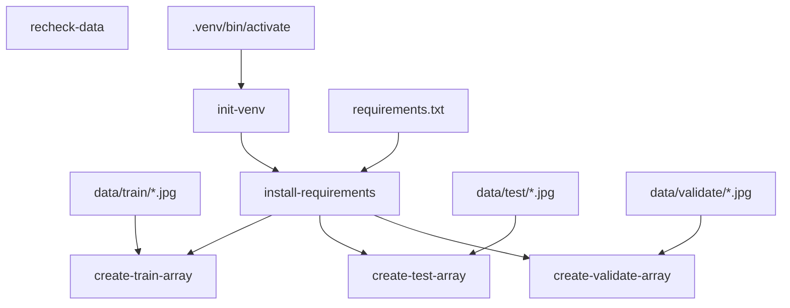

# How to create a data pipeline with Xvc

A data pipeline starts from data and ends with models. Between there is various data transformations and model training. We try to make all pieces reproducible and Xvc helps with this goal. 

In this document, we'll create the following pipeline for a digit recognition system. Our purpose is to show how Xvc helps in versioning data, so this document doesn't try to achieve a high classification performance. 


```admonish info
This document can be more verbose than usual, because all commands in this document are run on a clean directory during tests to check outputs. Some of the idiosyncrasies, e.g., running certain commands with `zsh -c` are due to this reason. Some of the output that changes in 
```
```
```

Although you can do without, most of the times Xvc runs in a Git repository. This allows to version control both the data and the code together. 
```console
$ git init
Initialized empty Git repository in [CWD]/.git/

$ xvc init
```

In this HOWTO, we use Chinese MNIST dataset to create an image classification pipeline. We already downloaded it [from kaggle](https://www.kaggle.com/datasets/gpreda/chinese-mnist/data). 

```console
$ ls -l
total 21112
-rw-r--r--  1 iex  staff  10792680 Nov 17 19:46 chinese_mnist.zip
-rw-r--r--  1 iex  staff      1124 Nov 28 14:27 image_to_numpy_array.py
-rw-r--r--  1 iex  staff        27 Dec  1 11:40 requirements.txt
-rw-r--r--  1 iex  staff      4266 Nov 30 22:14 train.py

```
Let's start by tracking the data file with Xvc.

```console
$ xvc file track chinese_mnist.zip --as symlink

```

The default [recheck (checkout) method](/ref/xvc-file-recheck.md) is _copy_ that means the file is
duplicated in the workspace as a writable file. We don't need to write over this
data file, we'll only read from it, so we set the recheck type as symlink.

```console
$ ls -l
total 32
lrwxr-xr-x  1 iex  staff   195 Dec  1 11:40 chinese_mnist.zip -> [CWD]/.xvc/b3/b24/2c9/422f91b804ea3008bc0bc025e97bf50c1d902ae7a0f13588b84f59023d/0.zip
-rw-r--r--  1 iex  staff  1124 Nov 28 14:27 image_to_numpy_array.py
-rw-r--r--  1 iex  staff    27 Dec  1 11:40 requirements.txt
-rw-r--r--  1 iex  staff  4266 Nov 30 22:14 train.py

```

The long directory name is the BLAKE-3 hash of the data file.

As we'll work with the file contents, let's unzip the data file.

```console
$ unzip -q chinese_mnist.zip

$ ls -l
total 32
lrwxr-xr-x  1 iex  staff   195 Dec  1 11:40 chinese_mnist.zip -> [CWD]/.xvc/b3/b24/2c9/422f91b804ea3008bc0bc025e97bf50c1d902ae7a0f13588b84f59023d/0.zip
drwxr-xr-x  4 iex  staff   128 Nov 17 19:45 data
-rw-r--r--  1 iex  staff  1124 Nov 28 14:27 image_to_numpy_array.py
-rw-r--r--  1 iex  staff    27 Dec  1 11:40 requirements.txt
-rw-r--r--  1 iex  staff  4266 Nov 30 22:14 train.py

```

Now we have the data directory with the following structure:

```console
$ tree -d data
data
└── data

2 directories

```

Let's track the data directory as well with Xvc.

```console
$ xvc file track data --as symlink
```

The reason we're tracking the data directory separately is that we'll use different subsets as training, validation, and test data. 

Let's list the track status of files first. 

```console
$ xvc file list data/data/input_9_9_*
SS         [..] 3a714d65          data/data/input_9_9_9.jpg
SS         [..] 9ffccc4d          data/data/input_9_9_8.jpg
SS         [..] 5d6312a4          data/data/input_9_9_7.jpg
SS         [..] 7a0ddb0e          data/data/input_9_9_6.jpg
SS         [..] 2047d7f3          data/data/input_9_9_5.jpg
SS         [..] 10fcf309          data/data/input_9_9_4.jpg
SS         [..] 0bdcd918          data/data/input_9_9_3.jpg
SS         [..] aebcbc03          data/data/input_9_9_2.jpg
SS         [..] 38abd173          data/data/input_9_9_15.jpg
SS         [..] 7c6a9003          data/data/input_9_9_14.jpg
SS         [..] a9f04ad9          data/data/input_9_9_13.jpg
SS         [..] 2d372f95          data/data/input_9_9_12.jpg
SS         [..] 8fe799b4          data/data/input_9_9_11.jpg
SS         [..] ee35e5d5          data/data/input_9_9_10.jpg
SS         [..] 7576894f          data/data/input_9_9_1.jpg
Total #: 15 Workspace Size:        2925 Cached Size:        8710


```

`xvc file list` command shows the tracking status. Initial two characters shows
the tracking status, `SS` means the file is tracked as symlink and is available
in the workspace as a symlink. The next column shows the file size, then the
last modified date, then the BLAKE-3 hash of the file, and finally the file
name. The empty column contains the actual hash of the file if the file is
available in the workspace. Here it's empty because the workspace file is a
link to the file in cache.

The summary line shows the total size of the files and the size they occupy in
the workspace.

## Splitting Train, Validation, and Test Sets

The first step of the pipeline is to create subsets of the data. 

The data set contains 15 classes. It has 10 samples for each of these classes
from 100 different people. As we'll train a Chinese digit recognizer, we'll
first divide volunteers 1-60 for training, 61-80 for validation, and 81-100 for
testing. This will ensure that the model is not trained with the same person's
handwriting.


```console
$ xvc file copy --name-only data/data/input_?_* data/train/
$ xvc file copy --name-only data/data/input_[12345]?_* data/train/
$ xvc file copy --name-only data/data/input_100_* data/train/
$ xvc file copy --name-only data/data/input_[67]?_* data/validate/
$ xvc file copy --name-only data/data/input_[89]?_* data/test/

$ tree -d data/
data/
├── data
├── test
├── train
└── validate

5 directories

```

If you look at the contents of these directories, you'll see that they are
symbolic links to the same files we started to track. 

Let's check the number of images in each set. 

```console
$ zsh -c 'ls -1 data/train/*.jpg | wc -l'
    9000

$ zsh -c 'ls -1 data/validate/*.jpg | wc -l'
    3000

$ zsh -c 'ls -1 data/test/*.jpg | wc -l'
    3000

```

The first step in the pipeline will be rechecking (checking out) these subsets.

```console
$ xvc pipeline step new -s recheck-data --command 'xvc file recheck data/train/ data/validate/ data/test/'
```

[`xvc file recheck`](/ref/xvc-file-recheck.md) is used in to instate files from Xvc cache.
Let's test the pipeline by first deleting the files we manually created.
```console
$ rm -rf data/train data/validate data/test
```

We run the steps we created.

```console
$ xvc pipeline run 
[DONE] recheck-data (xvc file recheck data/train/ data/validate/ data/test/)

```
If we check the contents of the directories, we'll see that they are back.

```console
$ zsh -c 'ls -1 data/train/*.jpg | wc -l'
    9000

```

## Preprocessing Images into Numpy Arrays


The Python script to train a model runs with Numpy arrays. So we'll convert each of these directories with images into two numpy arrays. 
One of the arrays will keep $n$ 64x64 images and the other will keep $n$ labels for these images.

```console
$ xvc pipeline step new --step-name create-train-array --command '.venv/bin/python3 image_to_numpy_array.py --dir data/train/'
$ xvc pipeline step new --step-name create-test-array --command '.venv/bin/python3 image_to_numpy_array.py --dir data/test/'
$ xvc pipeline step new --step-name create-validate-array --command '.venv/bin/python3 image_to_numpy_array.py --dir data/validate/'
```

These commands will run when the image files in those directories will change. Xvc can keep track of file groups and invalidate a step when the _content_ of any of these files change. Moreover, it's possible to track which files have changed if there are too many files. We don't need this feature of tracking individual items in _globs_, so we'll use a _glob_ dependency. 

```console
$ xvc pipeline step dependency --step-name create-train-array --glob 'data/train/*.jpg'
$ xvc pipeline step dependency --step-name create-test-array --glob 'data/test/*.jpg'
$ xvc pipeline step dependency --step-name create-validate-array --glob 'data/validate/*.jpg'
```

Now we have three more steps that depend on changed files. The script depends on OpenCV to read images. Python best practices recommend to create a separate virtual environment for each project. We'll also make sure that the venv is created and the requirements are installed before running the script.

Create a command to initialize the virtual environment. It will run if there is no `.venv/bin/activate` file. 

```console
$ xvc pipeline step new --step-name init-venv --command 'python3 -m venv .venv'
$ xvc pipeline step dependency --step-name init-venv --generic 'echo "$(hostname)/$(pwd)"'
```

We used `--generic` dependency that runs a command and checks its output to see whether the step requires to be run again. We only want to run `init-env` once per deployment, so checking output of `hostname` and `pwd` is better than existence of a file. File dependencies must be available before running the pipeline to record their metadata. There is no such restriction for generic dependencies.

Then, another step that depends on `init-venv` and `requirements.txt` will install the dependencies. 

```console
$ xvc pipeline step new --step-name install-requirements --command '.venv/bin/python3 -m pip install -r requirements.txt'
$ xvc pipeline step dependency --step-name install-requirements --step init-venv
$ xvc pipeline step dependency --step-name install-requirements --file requirements.txt
```
Note that, unlike other tools, you can specify direct dependencies between steps in Xvc. When a pipeline step must wait another step to finish successfully, a dependency between these two can be defined. 

The above `create-*-array` steps will depend on to `install-requirements` to ensure that requirements are installed when the scripts are run. 

```console
$ xvc pipeline step dependency --step-name create-train-array --step install-requirements

$ xvc pipeline step dependency --step-name create-validate-array --step install-requirements

$ xvc pipeline step dependency --step-name create-test-array --step install-requirements

```

Now, as the pipeline grows, it may be nice to see the graph what we have done so far. 

```console
$ xvc pipeline dag --format mermaid
flowchart TD
    n0["recheck-data"]
    n1["create-train-array"]
    n2["data/train/*.jpg"] --> n1
    n3["install-requirements"] --> n1
    n4["create-test-array"]
    n5["data/test/*.jpg"] --> n4
    n3["install-requirements"] --> n4
    n6["create-validate-array"]
    n7["data/validate/*.jpg"] --> n6
    n3["install-requirements"] --> n6
    n8["init-venv"]
    n9["echo "$(hostname)/$(pwd)""] --> n8
    n3["install-requirements"]
    n8["init-venv"] --> n3
    n10["requirements.txt"] --> n3


```


`dag` command can also produce GraphViz DOT output. For larger graphs, it may be more suitable. We'll use DOT to create images in later sections. 

Let's run the pipeline at this point to test.

```console
$ xvc -vv pipeline run
[INFO] Found explicit dependency: XvcStep { name: "install-requirements" } -> Step(StepDep { name: "init-venv" })
[INFO] Found explicit dependency: XvcStep { name: "create-test-array" } -> Step(StepDep { name: "install-requirements" })
[INFO] Found explicit dependency: XvcStep { name: "create-train-array" } -> Step(StepDep { name: "install-requirements" })
[INFO] Found explicit dependency: XvcStep { name: "create-validate-array" } -> Step(StepDep { name: "install-requirements" })
[INFO][pipeline/src/pipeline/mod.rs::343] Pipeline Graph:
digraph {
    0 [ label = "(30018, 4830302117829726283)" ]
    1 [ label = "(30011, 7277162294923643601)" ]
    2 [ label = "(30010, 16493669356687221979)" ]
    3 [ label = "(30009, 3994230713464996698)" ]
    4 [ label = "(30012, 10718819935381421357)" ]
    5 [ label = "(30016, 16026985595423784649)" ]
    0 -> 5 [ label = "Step" ]
    1 -> 0 [ label = "Step" ]
    2 -> 0 [ label = "Step" ]
    4 -> 0 [ label = "Step" ]
}


[INFO] No dependency steps for step init-venv
[INFO] Waiting for dependency steps for step install-requirements
[INFO] No dependency steps for step recheck-data
[INFO] Waiting for dependency steps for step create-validate-array
[INFO] Waiting for dependency steps for step create-test-array
[INFO] Waiting for dependency steps for step create-train-array
[INFO] [recheck-data] Dependencies has changed
[INFO] [init-venv] Dependencies has changed
[DONE] recheck-data (xvc file recheck data/train/ data/validate/ data/test/)
[DONE] init-venv (python3 -m venv .venv)
[INFO] Dependency steps completed successfully for step install-requirements
[INFO] [install-requirements] Dependencies has changed
[OUT] [install-requirements] Collecting opencv-python (from -r requirements.txt (line 1))
  Using cached opencv_python-4.8.1.78-cp37-abi3-macosx_11_0_arm64.whl.metadata (19 kB)
Collecting torch (from -r requirements.txt (line 2))
  Using cached torch-2.1.1-cp311-none-macosx_11_0_arm64.whl.metadata (25 kB)
Collecting pyyaml (from -r requirements.txt (line 3))
  Downloading PyYAML-6.0.1-cp311-cp311-macosx_11_0_arm64.whl.metadata (2.1 kB)
Collecting numpy>=1.21.2 (from opencv-python->-r requirements.txt (line 1))
  Using cached numpy-1.26.2-cp311-cp311-macosx_11_0_arm64.whl.metadata (115 kB)
Collecting filelock (from torch->-r requirements.txt (line 2))
  Using cached filelock-3.13.1-py3-none-any.whl.metadata (2.8 kB)
Collecting typing-extensions (from torch->-r requirements.txt (line 2))
  Using cached typing_extensions-4.8.0-py3-none-any.whl.metadata (3.0 kB)
Collecting sympy (from torch->-r requirements.txt (line 2))
  Using cached sympy-1.12-py3-none-any.whl (5.7 MB)
Collecting networkx (from torch->-r requirements.txt (line 2))
  Using cached networkx-3.2.1-py3-none-any.whl.metadata (5.2 kB)
Collecting jinja2 (from torch->-r requirements.txt (line 2))
  Using cached Jinja2-3.1.2-py3-none-any.whl (133 kB)
Collecting fsspec (from torch->-r requirements.txt (line 2))
  Using cached fsspec-2023.10.0-py3-none-any.whl.metadata (6.8 kB)
Collecting MarkupSafe>=2.0 (from jinja2->torch->-r requirements.txt (line 2))
  Using cached MarkupSafe-2.1.3-cp311-cp311-macosx_10_9_universal2.whl.metadata (3.0 kB)
Collecting mpmath>=0.19 (from sympy->torch->-r requirements.txt (line 2))
  Using cached mpmath-1.3.0-py3-none-any.whl (536 kB)
Using cached opencv_python-4.8.1.78-cp37-abi3-macosx_11_0_arm64.whl (33.1 MB)
Using cached torch-2.1.1-cp311-none-macosx_11_0_arm64.whl (59.6 MB)
Downloading PyYAML-6.0.1-cp311-cp311-macosx_11_0_arm64.whl (167 kB)
   ━━━━━━━━━━━━━━━━━━━━━━━━━━━━━━━━━━━━━━━ 167.5/167.5 kB 853.1 kB/s eta 0:00:00
Using cached numpy-1.26.2-cp311-cp311-macosx_11_0_arm64.whl (14.0 MB)
Using cached filelock-3.13.1-py3-none-any.whl (11 kB)
Using cached fsspec-2023.10.0-py3-none-any.whl (166 kB)
Using cached networkx-3.2.1-py3-none-any.whl (1.6 MB)
Using cached typing_extensions-4.8.0-py3-none-any.whl (31 kB)
Using cached MarkupSafe-2.1.3-cp311-cp311-macosx_10_9_universal2.whl (17 kB)
Installing collected packages: mpmath, typing-extensions, sympy, pyyaml, numpy, networkx, MarkupSafe, fsspec, filelock, opencv-python, jinja2, torch
Successfully installed MarkupSafe-2.1.3 filelock-3.13.1 fsspec-2023.10.0 jinja2-3.1.2 mpmath-1.3.0 networkx-3.2.1 numpy-1.26.2 opencv-python-4.8.1.78 pyyaml-6.0.1 sympy-1.12 torch-2.1.1 typing-extensions-4.8.0
 
[DONE] install-requirements (.venv/bin/python3 -m pip install -r requirements.txt)
[INFO] Dependency steps completed successfully for step create-train-array
[INFO] Dependency steps completed successfully for step create-validate-array
[INFO] Dependency steps completed successfully for step create-test-array
[INFO] [create-test-array] Dependencies has changed
[INFO] [create-validate-array] Dependencies has changed
[INFO] [create-train-array] Dependencies has changed
[DONE] create-test-array (.venv/bin/python3 image_to_numpy_array.py --dir data/test/)
[DONE] create-train-array (.venv/bin/python3 image_to_numpy_array.py --dir data/train/)
[DONE] create-validate-array (.venv/bin/python3 image_to_numpy_array.py --dir data/validate/)
[WARN][walker/src/error.rs::91] Crossbeam Send Error for Type: "Some(/n    Create {/n        path: /"[CWD]/.xvc/store/xvc-dependency-store/1701420096623112.json/",/n        metadata: Metadata {/n            file_type: FileType(/n                FileType {/n                    mode: 33188,/n                },/n            ),/n            is_dir: false,/n            is_file: true,/n            permissions: Permissions(/n                FilePermissions {/n                    mode: 33188,/n                },/n            ),/n            modified: Ok(/n                SystemTime {/n                    tv_sec: 1701420096,/n                    tv_nsec: 623377803,/n                },/n            ),/n            accessed: Ok(/n                SystemTime {/n                    tv_sec: 1701420096,/n                    tv_nsec: 623314555,/n                },/n            ),/n            created: Ok(/n                SystemTime {/n                    tv_sec: 1701420096,/n                    tv_nsec: 623314555,/n                },/n            ),/n            ../n        },/n    },/n)" "sending on a disconnected channel"
[WARN][walker/src/error.rs::91] Crossbeam Send Error for Type: "Some(/n    Create {/n        path: /"[CWD]/.xvc/store/xvc-dependency-store/1701420096623112.json/",/n        metadata: Metadata {/n            file_type: FileType(/n                FileType {/n                    mode: 33188,/n                },/n            ),/n            is_dir: false,/n            is_file: true,/n            permissions: Permissions(/n                FilePermissions {/n                    mode: 33188,/n                },/n            ),/n            modified: Ok(/n                SystemTime {/n                    tv_sec: 1701420096,/n                    tv_nsec: 623377803,/n                },/n            ),/n            accessed: Ok(/n                SystemTime {/n                    tv_sec: 1701420096,/n                    tv_nsec: 623314555,/n                },/n            ),/n            created: Ok(/n                SystemTime {/n                    tv_sec: 1701420096,/n                    tv_nsec: 623314555,/n                },/n            ),/n            ../n        },/n    },/n)" "sending on a disconnected channel"

```

Now, when we take a look at the data directories, we find `images.npy` and `classes.npy` files.

```console
$ zsh -cl 'ls -l data/train/*.npy'
-rw-r--r--  1 iex  staff      72128 Dec  1 11:41 data/train/classes.npy
-rw-r--r--  1 iex  staff  110592128 Dec  1 11:41 data/train/images.npy

$ zsh -cl 'ls -l data/test/*.npy'
-rw-r--r--  1 iex  staff     24128 Dec  1 11:41 data/test/classes.npy
-rw-r--r--  1 iex  staff  36864128 Dec  1 11:41 data/test/images.npy

$ zsh -cl 'ls -l data/validate/*.npy'
-rw-r--r--  1 iex  staff     24128 Dec  1 11:41 data/validate/classes.npy
-rw-r--r--  1 iex  staff  36864128 Dec  1 11:41 data/validate/images.npy

```

## Train a model

Now we have built the NumPy arrays, we can train a model. We'll use a simple convolutional neural network as a showcase. This is by no means a state-of-art solution, so the results will be less than perfect.


The script receives training, validation and testing directories, loads the data from Numpy arrays we just produced, loads hyperparameters from a file called `params.yaml`, trains the model, tests it and writes the results and model to a file. It's a very involved piece produced with the assistance of GPT-4. 

We first define the step to run the command:

```console
$ xvc pipeline step new --step-name train-model --command '.venv/bin/python3 train.py  --train_dir data/train/ --validation_dir data/validate --test_dir data/test'

```

The step will depend to array generation steps by depending on the files they produce. In order to define a dependency between `train-model` and `create-train-array` step, we must tell that `create-array-dependency` outputs a file called `images.npy`. We can do this by using `--file` option of `step output` command. 
```console
$ xvc pipeline step output --step-name create-train-array --output-file data/train/images.npy

$ xvc pipeline step output --step-name create-train-array --output-file data/train/classes.npy

$ xvc pipeline step dependency --step-name train-model --file data/train/images.npy
$ xvc pipeline step dependency --step-name train-model --file data/train/classes.npy
```

Note that this operation is different from creating a direct dependency between steps. There may be multiple steps creating the same outputs and there may be multiple steps depending on the same files. Preferring direct (`--step`) dependencies and indirect (`--file`) dependencies is a matter of taste and use. 

We'll create these dependencies for other files as well. 

```console
$ xvc pipeline step output --step-name create-test-array --output-file data/test/images.npy

$ xvc pipeline step output --step-name create-test-array --output-file data/test/classes.npy

$ xvc pipeline step dependency --step-name train-model --file data/test/images.npy

$ xvc pipeline step dependency --step-name train-model --file data/test/classes.npy

$ xvc pipeline step output --step-name create-validate-array --output-file data/validate/images.npy

$ xvc pipeline step output --step-name create-validate-array --output-file data/validate/classes.npy

$ xvc pipeline step dependency --step-name train-model --file data/validate/images.npy

$ xvc pipeline step dependency --step-name train-model --file data/validate/classes.npy

```

Before running the pipeline, let's see the pipeline DAG once more. This time in DOT format. 

```console
$ xvc pipeline dag 
digraph pipeline{n0[shape=box;label="recheck-data";];n1[shape=box;label="create-train-array";];n2[shape=folder;label="data/train/*.jpg";];n2->n1;n3[shape=box;label="install-requirements";];n3->n1;n4[shape=note;color=black;label="data/train/images.npy";];n1->n4;n5[shape=note;color=black;label="data/train/classes.npy";];n1->n5;n6[shape=box;label="create-test-array";];n7[shape=folder;label="data/test/*.jpg";];n7->n6;n3[shape=box;label="install-requirements";];n3->n6;n8[shape=note;color=black;label="data/test/images.npy";];n6->n8;n9[shape=note;color=black;label="data/test/classes.npy";];n6->n9;n10[shape=box;label="create-validate-array";];n11[shape=folder;label="data/validate/*.jpg";];n11->n10;n3[shape=box;label="install-requirements";];n3->n10;n12[shape=note;color=black;label="data/validate/images.npy";];n10->n12;n13[shape=note;color=black;label="data/validate/classes.npy";];n10->n13;n14[shape=box;label="init-venv";];n15[shape=trapezium;label="echo /"$(hostname)/$(pwd)/"";];n15->n14;n3[shape=box;label="install-requirements";];n14[shape=box;label="init-venv";];n14->n3;n16[shape=note;label="requirements.txt";];n16->n3;n17[shape=box;label="train-model";];n4[shape=note;label="data/train/images.npy";];n4->n17;n5[shape=note;label="data/train/classes.npy";];n5->n17;n8[shape=note;label="data/test/images.npy";];n8->n17;n9[shape=note;label="data/test/classes.npy";];n9->n17;n12[shape=note;label="data/validate/images.npy";];n12->n17;n13[shape=note;label="data/validate/classes.npy";];n13->n17;}

```

It's not the most readable graph description but you can feed the output to `dot` command to create an SVG file. 

```console
$ zsh -cl 'xvc pipeline dag | dot -Tsvg > pipeline.svg'
```

Let's run the pipeline and train the model. 


```console
$ xvc -vv pipeline run
[INFO] Found explicit dependency: XvcStep { name: "create-test-array" } -> Step(StepDep { name: "install-requirements" })
[INFO] Found explicit dependency: XvcStep { name: "install-requirements" } -> Step(StepDep { name: "init-venv" })
[INFO] Found explicit dependency: XvcStep { name: "create-validate-array" } -> Step(StepDep { name: "install-requirements" })
[INFO] Found explicit dependency: XvcStep { name: "create-train-array" } -> Step(StepDep { name: "install-requirements" })
[INFO][pipeline/src/pipeline/mod.rs::151] Found implicit dependency: XvcStep { name: "train-model" } -> XvcStep { name: "create-test-array" } (via XvcPath("data/test/classes.npy"))
[INFO][pipeline/src/pipeline/mod.rs::151] Found implicit dependency: XvcStep { name: "train-model" } -> XvcStep { name: "create-test-array" } (via XvcPath("data/test/images.npy"))
[INFO][pipeline/src/pipeline/mod.rs::151] Found implicit dependency: XvcStep { name: "train-model" } -> XvcStep { name: "create-validate-array" } (via XvcPath("data/validate/classes.npy"))
[INFO][pipeline/src/pipeline/mod.rs::151] Found implicit dependency: XvcStep { name: "train-model" } -> XvcStep { name: "create-validate-array" } (via XvcPath("data/validate/images.npy"))
[INFO][pipeline/src/pipeline/mod.rs::151] Found implicit dependency: XvcStep { name: "train-model" } -> XvcStep { name: "create-train-array" } (via XvcPath("data/train/images.npy"))
[INFO][pipeline/src/pipeline/mod.rs::151] Found implicit dependency: XvcStep { name: "train-model" } -> XvcStep { name: "create-train-array" } (via XvcPath("data/train/classes.npy"))
[INFO][pipeline/src/pipeline/mod.rs::343] Pipeline Graph:
digraph {
    0 [ label = "(30024, 9372694292470649146)" ]
    1 [ label = "(30011, 7277162294923643601)" ]
    2 [ label = "(30016, 16026985595423784649)" ]
    3 [ label = "(30009, 3994230713464996698)" ]
    4 [ label = "(30018, 4830302117829726283)" ]
    5 [ label = "(30012, 10718819935381421357)" ]
    6 [ label = "(30010, 16493669356687221979)" ]
    1 -> 4 [ label = "Step" ]
    4 -> 2 [ label = "Step" ]
    5 -> 4 [ label = "Step" ]
    6 -> 4 [ label = "Step" ]
    0 -> 1 [ label = "File" ]
    0 -> 5 [ label = "File" ]
    0 -> 6 [ label = "File" ]
}


[INFO] Waiting for dependency steps for step install-requirements
[INFO] Waiting for dependency steps for step create-validate-array
[INFO] No dependency steps for step init-venv
[INFO] Waiting for dependency steps for step create-test-array
[INFO] Waiting for dependency steps for step create-train-array
[INFO] Waiting for dependency steps for step train-model
[INFO] No dependency steps for step recheck-data
[INFO] [recheck-data] Dependencies has changed
[INFO] [init-venv] No changed dependencies. Skipping thorough comparison.
[INFO] [init-venv] No missing Outputs and no changed dependencies
[INFO] Dependency steps completed successfully for step install-requirements
[INFO] [install-requirements] No changed dependencies. Skipping thorough comparison.
[INFO] [install-requirements] No missing Outputs and no changed dependencies
[INFO] Dependency steps completed successfully for step create-validate-array
[INFO] Dependency steps completed successfully for step create-train-array
[INFO] Dependency steps completed successfully for step create-test-array
[INFO] [create-validate-array] No changed dependencies. Skipping thorough comparison.
[INFO] [create-validate-array] No missing Outputs and no changed dependencies
[INFO] [create-test-array] No changed dependencies. Skipping thorough comparison.
[INFO] [create-test-array] No missing Outputs and no changed dependencies
[INFO] [create-train-array] No changed dependencies. Skipping thorough comparison.
[INFO] [create-train-array] No missing Outputs and no changed dependencies
[INFO] Dependency steps completed successfully for step train-model
[DONE] recheck-data (xvc file recheck data/train/ data/validate/ data/test/)
[INFO] [train-model] Dependencies has changed
[WARN] [ERR] [train-model] Traceback (most recent call last):
  File "[CWD]/train.py", line 10, in <module>
    from sklearn.metrics import confusion_matrix
ModuleNotFoundError: No module named 'sklearn'
 
[ERROR] Step train-model finished UNSUCCESSFULLY with command .venv/bin/python3 train.py  --train_dir data/train/ --validation_dir data/validate --test_dir data/test

```

