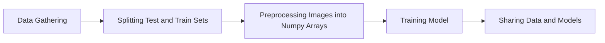

# How to create a data pipeline with Xvc

A data pipeline starts from data and ends with models. Between there is various data transformations and model training. We try to make all pieces reproducible and Xvc helps with this goal. 

In this document, we'll create the following pipeline for a digit recognition system. Our purpose is to show how Xvc helps in versioning data, so this document doesn't try to achieve a high classification performance. 




```admonish info
This document can be more verbose than usual, because all commands in this document are run on a clean directory during tests to check outputs. Some of the idiosyncrasies, e.g., running certain commands with `zsh -c` are due to this reason.
```
```
```

Although you can do without, most of the times Xvc runs in a Git repository. This allows to version control both the data and the code together. 
```console
$ git init
Initialized empty Git repository in [CWD]/.git/

$ xvc init
```

In this HOWTO, we use Chinese MNIST dataset to create an image classification pipeline. We already downloaded it [from kaggle](https://www.kaggle.com/datasets/gpreda/chinese-mnist/data). 

```console
$ ls -l
total 21080
-rw-r--r--  1 iex  staff  10792680 Nov 17 19:46 chinese_mnist.zip

```
Let's start by tracking the data file with Xvc.

```console
$ xvc file track chinese_mnist.zip --as symlink

```

The default [recheck (checkout) method](/ref/xvc-file-recheck.md) is _copy_ that means the file is
duplicated in the workspace as a writable file. We don't need to write over this
data file, we'll only read from it, so we set the recheck type as symlink.

```console
$ ls -l
total 0
lrwxr-xr-x  1 iex  staff  192 Nov 19 13:46 chinese_mnist.zip -> [CWD]/.xvc/b3/b24/2c9/422f91b804ea3008bc0bc025e97bf50c1d902ae7a0f13588b84f59023d/0.zip

```

The long directory name is the BLAKE-3 hash of the data file.

As we'll work with the file contents, let's unzip the data file.

```console
$ unzip -q chinese_mnist.zip

$ ls -l
total 0
lrwxr-xr-x  1 iex  staff  192 Nov 19 13:46 chinese_mnist.zip -> [CWD]/.xvc/b3/b24/2c9/422f91b804ea3008bc0bc025e97bf50c1d902ae7a0f13588b84f59023d/0.zip
drwxr-xr-x  4 iex  staff  128 Nov 17 19:45 data

```

Now we have the data directory with the following structure:

```console
$ tree -d data
data
└── data

2 directories

```

Let's track the data directory as well with Xvc.

```console
$ xvc file track data --as symlink
```

The reason we're tracking the data directory separately is that we'll use different subsets as training, validation, and test data. 

Let's list the track status of files first. 

```console
$ xvc file list data/data/input_9_9_*
SS         192 2023-11-19 10:46:58 3a714d65          data/data/input_9_9_9.jpg
SS         192 2023-11-19 10:46:58 9ffccc4d          data/data/input_9_9_8.jpg
SS         192 2023-11-19 10:46:57 5d6312a4          data/data/input_9_9_7.jpg
SS         192 2023-11-19 10:46:58 7a0ddb0e          data/data/input_9_9_6.jpg
SS         192 2023-11-19 10:46:57 2047d7f3          data/data/input_9_9_5.jpg
SS         192 2023-11-19 10:46:58 10fcf309          data/data/input_9_9_4.jpg
SS         192 2023-11-19 10:46:59 0bdcd918          data/data/input_9_9_3.jpg
SS         192 2023-11-19 10:46:58 aebcbc03          data/data/input_9_9_2.jpg
SS         192 2023-11-19 10:46:56 38abd173          data/data/input_9_9_15.jpg
SS         192 2023-11-19 10:46:56 7c6a9003          data/data/input_9_9_14.jpg
SS         192 2023-11-19 10:46:58 a9f04ad9          data/data/input_9_9_13.jpg
SS         192 2023-11-19 10:46:57 2d372f95          data/data/input_9_9_12.jpg
SS         192 2023-11-19 10:46:58 8fe799b4          data/data/input_9_9_11.jpg
SS         192 2023-11-19 10:46:57 ee35e5d5          data/data/input_9_9_10.jpg
SS         192 2023-11-19 10:46:57 7576894f          data/data/input_9_9_1.jpg
Total #: 15 Workspace Size:        2880 Cached Size:        8710


```

`xvc file list` command shows the tracking status. Initial two characters shows
the tracking status, `SS` means the file is tracked as symlink and is available
in the workspace as a symlink. The next column shows the file size, then the
last modified date, then the BLAKE-3 hash of the file, and finally the file
name. The empty column contains the actual hash of the file if the file is
available in the workspace. Here it's empty because the workspace file is a
link to the file in cache.

The summary line shows the total size of the files and the size they occupy in
the workspace.

The first step of out pipeline is to create subsets of the data. 

The data set contains 15 classes. It has 10 samples for each of these classes
from 100 different people. As we'll train a Chinese digit recognizer, we'll
first divide volunteers 1-60 for training, 61-80 for validation, and 81-100 for
testing. This will ensure that the model is not trained with the same person's
handwriting.


```console
$ xvc file copy --name-only data/data/input_?_* data/train/
$ xvc file copy --name-only data/data/input_[12345]?_* data/train/
$ xvc file copy --name-only data/data/input_100_* data/train/
$ xvc file copy --name-only data/data/input_[67]?_* data/validate/
$ xvc file copy --name-only data/data/input_[89]?_* data/test/

$ tree -d data/
data/
├── data
├── test
├── train
└── validate

5 directories

```

If you look at the contents of these directories, you'll see that they are
symbolic links to the same files we started to track. 

Let's check the number of images in each set. 

```console
$ zsh -c 'ls -1 data/train/*.jpg | wc -l'
    9000

$ zsh -c 'ls -1 data/validate/*.jpg | wc -l'
    3000

$ zsh -c 'ls -1 data/test/*.jpg | wc -l'
    3000

```

The first step in the pipeline will be creating these subsets. 

```console
$ xvc pipeline step new -s split-train --command "xvc file copy --name-only 'data/data/input_?_*' data/train/ && xvc file copy --name-only 'data/data/input_[12345]?_*' data/train/ && xvc file copy --name-only 'data/data/input_100_*' data/train/"
$ xvc pipeline step new -s split-validate --command "xvc file copy --name-only 'data/data/input_[67]?_*' data/validate/"
$ xvc pipeline step new -s split-test --command "xvc file copy --name-only 'data/data/input_[89]?_*' data/test/"
```

When run for already copied files, `xvc file copy` works as if [`xvc file
recheck`](/ref/xvc-file-recheck.md) that only checkouts (reinstates) the files.
Let's test the pipeline by first deleting the files we manually created.
```console
$ rm -rf data/train data/validate data/test
```

We run the steps we created.

```console
$ xvc -vvv pipeline run 
[DEBUG][logging/src/lib.rs::236] Terminal logger enabled with level: Debug
[DEBUG][core/src/types/xvcroot.rs::253] XVC DIR: "[CWD]"
[DEBUG][config/src/error.rs::72] Config source for level "system" not found at "/Users/iex/Library/Application Support/com.emresult.xvc"
[DEBUG][config/src/error.rs::72] Config source for level "global" not found at "/Users/iex/Library/Application Support/xvc"
[DEBUG][/Users/iex/.cargo/registry/src/index.crates.io-6f17d22bba15001f/globset-0.4.13/src/lib.rs::431] built glob set; 0 literals, 2 basenames, 0 extensions, 0 prefixes, 0 suffixes, 0 required extensions, 0 regexes
[INFO][pipeline/src/pipeline/mod.rs::343] Pipeline Graph:
digraph {
    0 [ label = "(30011, 7616904094995077032)" ]
    1 [ label = "(30009, 6703050485687325591)" ]
    2 [ label = "(30010, 16049726314937551449)" ]
}


[INFO] No dependency steps for step split-validate
[INFO] No dependency steps for step split-train
[INFO] No dependency steps for step split-test
[INFO] [split-validate] Dependencies has changed
[INFO] [split-train] Dependencies has changed
[INFO] [split-test] Dependencies has changed
[DEBUG] Step split-train with command xvc file copy --name-only data/data/input_?_* data/train/ && xvc file copy --name-only data/data/input_[12345]?_* data/train/ && xvc file copy --name-only data/data/input_100_* data/train/ is still running
[DEBUG] Step split-validate with command xvc file copy --name-only data/data/input_[67]?_* data/validate/ is still running
[DEBUG] Step split-test with command xvc file copy --name-only data/data/input_[89]?_* data/test/ is still running
[WARN] [ERR] [split-train] error: unexpected argument 'data/data/input_1_10_11.jpg' found

Usage: xvc file copy [OPTIONS] <SOURCE> <DESTINATION>

For more information, try '--help'.
 
[WARN] [ERR] [split-validate] error: unexpected argument 'data/data/input_60_10_11.jpg' found

Usage: xvc file copy [OPTIONS] <SOURCE> <DESTINATION>

For more information, try '--help'.
 
[WARN] [ERR] [split-test] error: unexpected argument 'data/data/input_80_10_11.jpg' found

Usage: xvc file copy [OPTIONS] <SOURCE> <DESTINATION>

For more information, try '--help'.
 
[ERROR] Step split-validate finished UNSUCCESSFULLY with command xvc file copy --name-only data/data/input_[67]?_* data/validate/
[ERROR] Step split-train finished UNSUCCESSFULLY with command xvc file copy --name-only data/data/input_?_* data/train/ && xvc file copy --name-only data/data/input_[12345]?_* data/train/ && xvc file copy --name-only data/data/input_100_* data/train/
[ERROR] Step split-test finished UNSUCCESSFULLY with command xvc file copy --name-only data/data/input_[89]?_* data/test/
[DEBUG] Using Git: /opt/homebrew/bin/git
[DEBUG] No files to commit
[DEBUG] Command completed successfully.

```

The Python script to train a model runs with Numpy arrays. So we'll convert each of these 
