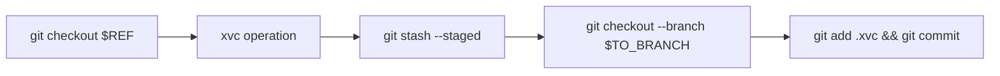

# Xvc with Git Branches

When you're working with multiple branches in Git, you may ask Xvc to checkout a branch and commit to another branch. 
These operations are performed at the beginning, and at the end of Xvc operations. 
You can use `--from-ref` and `--to-branch` options to checkout a Git reference before an Xvc operation, and commit the results to a certain Git branch.

Checkout and commit operations sandwich Xvc operations. 



If `--from-ref` is not given, initial `git checkout` is not performed. 
Xvc operates in the current branch. 
This is the default behavior. 

```console
$ git init --initial-branch=main
...
$ xvc init
? 0
$ ls
data.txt

$ xvc --to-branch data-file file track data.txt
thread '<unnamed>' panicked at 'called `Result::unwrap()` on an `Err` value: ConfigKeyNotFound { key: "file.recheck.method" }', core/src/types/recheckmethod.rs:84:1
stack backtrace:
   0: rust_begin_unwind
             at /rustc/897e37553bba8b42751c67658967889d11ecd120/library/std/src/panicking.rs:584:5
   1: core::panicking::panic_fmt
             at /rustc/897e37553bba8b42751c67658967889d11ecd120/library/core/src/panicking.rs:142:14
   2: core::result::unwrap_failed
             at /rustc/897e37553bba8b42751c67658967889d11ecd120/library/core/src/result.rs:1785:5
   3: core::result::Result<T,E>::unwrap
             at /rustc/897e37553bba8b42751c67658967889d11ecd120/library/core/src/result.rs:1107:23
   4: <xvc_core::types::recheckmethod::RecheckMethod as xvc_config::FromConfigKey<xvc_core::types::recheckmethod::RecheckMethod>>::from_conf
             at /Users/iex/github.com/iesahin/xvc/config/src/lib.rs:648:17
   5: <xvc_file::track::TrackCLI as xvc_config::UpdateFromXvcConfig>::update_from_conf::{{closure}}
             at /Users/iex/github.com/iesahin/xvc/file/src/track/mod.rs:75:32
   6: core::option::Option<T>::unwrap_or_else
             at /rustc/897e37553bba8b42751c67658967889d11ecd120/library/core/src/option.rs:825:21
   7: <xvc_file::track::TrackCLI as xvc_config::UpdateFromXvcConfig>::update_from_conf
             at /Users/iex/github.com/iesahin/xvc/file/src/track/mod.rs:73:26
   8: xvc_file::track::cmd_track
             at /Users/iex/github.com/iesahin/xvc/file/src/track/mod.rs:123:16
   9: xvc_file::run
             at /Users/iex/github.com/iesahin/xvc/file/src/lib.rs:150:43
  10: xvc::cli::dispatch::{{closure}}::{{closure}}
             at /Users/iex/github.com/iesahin/xvc/lib/src/cli/mod.rs:274:24
  11: crossbeam_utils::thread::ScopedThreadBuilder::spawn::{{closure}}
             at /Users/iex/.cargo/registry/src/github.com-1ecc6299db9ec823/crossbeam-utils-0.8.14/src/thread.rs:438:31
  12: core::ops::function::FnOnce::call_once{{vtable.shim}}
             at /rustc/897e37553bba8b42751c67658967889d11ecd120/library/core/src/ops/function.rs:248:5
  13: <alloc::boxed::Box<F,A> as core::ops::function::FnOnce<Args>>::call_once
             at /rustc/897e37553bba8b42751c67658967889d11ecd120/library/alloc/src/boxed.rs:1940:9
note: Some details are omitted, run with `RUST_BACKTRACE=full` for a verbose backtrace.
thread 'main' panicked at 'called `Result::unwrap()` on an `Err` value: Any { .. }', lib/src/cli/mod.rs:394:6
stack backtrace:
   0: rust_begin_unwind
             at /rustc/897e37553bba8b42751c67658967889d11ecd120/library/std/src/panicking.rs:584:5
   1: core::panicking::panic_fmt
             at /rustc/897e37553bba8b42751c67658967889d11ecd120/library/core/src/panicking.rs:142:14
   2: core::result::unwrap_failed
             at /rustc/897e37553bba8b42751c67658967889d11ecd120/library/core/src/result.rs:1785:5
   3: core::result::Result<T,E>::unwrap
             at /rustc/897e37553bba8b42751c67658967889d11ecd120/library/core/src/result.rs:1107:23
   4: xvc::cli::dispatch
             at /Users/iex/github.com/iesahin/xvc/lib/src/cli/mod.rs:243:5
   5: xvc::main
             at /Users/iex/github.com/iesahin/xvc/workflow_tests/src/main.rs:12:5
   6: core::ops::function::FnOnce::call_once
             at /rustc/897e37553bba8b42751c67658967889d11ecd120/library/core/src/ops/function.rs:248:5
note: Some details are omitted, run with `RUST_BACKTRACE=full` for a verbose backtrace.

$ git branch
* main

$ git status -s
?? data.txt

$ xvc file list data.txt
Frct          19 2023-01-25 08:51:03          c85f3e81 data.txt
Total #: 1 Workspace Size:          19 Cached Size:           0


```

If you return to `main` branch, you'll see the file is tracked by neither Git nor Xvc. 

```console
$ git checkout main
...
$ xvc file list data.txt
Frct          19 2023-01-25 08:51:03          c85f3e81 data.txt
Total #: 1 Workspace Size:          19 Cached Size:           0


$ git status -s
?? data.txt

```

Now, we'll add a step to the default pipeline to get an uppercase version of the data. 
We want this to work only in data 

```console
$ xvc --from-ref data-file pipeline step new --step-name to-uppercase --command 'cat data.txt | tr a-z A-Z > uppercase.txt'
error: pathspec 'data-file' did not match any file(s) known to git
Error: GitProcessError { stdout: "", stderr: "" }

$ xvc pipeline step dependency --step-name to-uppercase --file data.txt 
$ xvc pipeline step output --step-name to-uppercase --output-file uppercase.txt
```

Note that `xvc pipeline step dependency` and `xvc pipeline step output` commands don't need `--from-ref` and `--to-branch` options, as they run in `data-file` branch already. 

Now, we want to have this new version of data available only in `uppercase` branch. 

```console
$ xvc --from-ref data-file --to-branch uppercase pipeline run
error: pathspec 'data-file' did not match any file(s) known to git
Error: GitProcessError { stdout: "", stderr: "" }

$ git branch
* main

```

You can use this for experimentation. 
Whenever you have a pipeline that you want to run and keep the results in another Git branch, you can use `--to-branch` for experimentation. 

```console
$ xvcpr --from-ref data-file --to-branch another-uppercase
$ git-branch 
* another-uppercase
uppercase
data-file
main
```

The pipeline always runs, because in `data-file` branch `uppercase.txt` is always missing. 
It's stored only in the resulting branch you give by `--to-branch`. 

