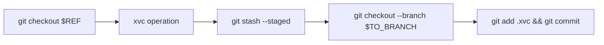

# Xvc with Git Branches

When you're working with multiple branches in Git, you may ask Xvc to checkout a branch and commit to another branch. 
These operations are performed at the beginning, and at the end of Xvc operations. 
You can use `--from-ref` and `--to-branch` options to checkout a Git reference before an Xvc operation, and commit the results to a certain Git branch.

Checkout and commit operations sandwich Xvc operations. 



If `--from-ref` is not given, initial `git checkout` is not performed. 
Xvc operates in the current branch. 
This is the default behavior. 

```console
$ git init --initial-branch=main
...
$ xvc init
? 0
$ cat "Oh, data, my, data" > data.txt
$ ls
  data.txt
$ xvc --to-branch data-file file track data.txt
$ git branch
* data-file
main
$ git status -s
$ xvc file list
C=         data.txt
```

If you return to `main` branch, you'll see the file is tracked by neither Git, nor Xvc. 

```console
$ git checkout main
$ xvc file list
UU        data.txt
$ git status -s
?? data.txt
```

Now, we'll add a step to the default pipeline to get an uppercase version of the data. 
We want this to work only in data 

```console
$ . $(xvc aliases) # If you're not already added these. Makes shorter versions of the commands available. 
$ xvcpsn --from-ref data-file --to-branch data-file --step-name to-uppercase --command 'cat data.txt | tr a-z A-Z > uppercase.txt'
$ xvcpsd --step-name to-uppercase --file data.txt
$ xvcpso --step-name to-uppercase --output-file uppercase.txt
```

Note that `xvcpsd` and `xvcpso` commands don't need `--from-ref` and `--to-branch` options, as they run in `data-file` branch already. 

Now, we want to have this new version of data available only in `uppercase` branch. 

```console
$ xvc --from-ref data-file --to-branch uppercase pipeline run
$ git branch
* uppercase
  data-file
  main

```

You can use this for experimentation. 
Whenever you have a pipeline that you want to run and keep the results in another Git branch, you can use `--to-branch` for experimentation. 

```console
$ xvcpr --from-ref data-file --to-branch another-uppercase
$ git-branch 
* another-uppercase
uppercase
data-file
main
```

The pipeline always runs, because in `data-file` branch `uppercase.txt` is always missing. 
It's stored only in the resulting branch you give by `--to-branch`. 


