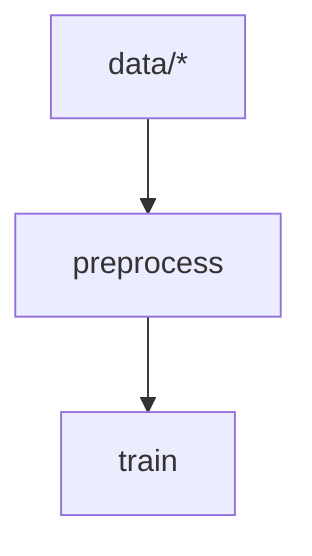

# Introduction to Xvc

Xvc is a command line utility to track large files with Git, define
dependencies between files to run commands when only these dependencies change,
and run experiments by making small changes in these files for later
comparison.

It's used mostly in Machine Learning scenarios where data and model files are
large, code files depend on these and experiments must be compared via various
metrics.

Xvc can use S3 and compatible cloud storages to upload tracked files with their
exact version and can retrieve these later. This allows to delete them from the
project when they are not needed to save space and get them back when needed.
This facility can also be used for sharing these files. You can just clone the
Git repository and get only the necessary Xvc-tracked files.

Xvc tracks files, directories and other elements by calculating their digests.
These digests are used as address to store and find their locations in the
cache and storages. When you make a change to a file, it gets a new digest and
the changed version has a new address. This makes sure that all versions can be
retrieved on demand.

Xvc can be used as a `make` replacement to build multi-file projects with
complex dependencies. Unlike `make` that detect file changes with timestamps,
Xvc checks the files via their content. This reduces false-positives in
invalidation.

Xvc pipelines are used to define steps to reach to a set of outputs. These
steps have commands to run and may (or may not) produce intermediate outputs
that other steps depend. Xvc pipelines allows steps to depend on other steps,
other pipelines, text and binary files, directories, globs that select a subset
of files, certain lines in a file, certain regular expression results, URLs,
(hyper)parameter definitions in YAML, JSON or TOML files as of now. More
dependency types like environment variables, database tables and queries, S3
buckets, REST query results, generic CLI command results, Bitcoin wallets,
Jupyter notebook cells are in the plans.

For example, Xvc can be used to create a pipeline that depends on certain files
in a directory via a glob, and a parameter in a YAML file to update a machine
learning model. The same feature can be used to build software when the code or
artifacts used in the software change. This allow binary outputs (as well as
code inputs) to be tracked in Xvc. Instead of building everything from scratch
in a new Git clone, a software project can reuse only the portions that require
a rebuild. Binary distributions become much simpler.

This book is used as the documentation of the project. It is a work in progress
as Xvc, and contain outdated information. Please report any errors and bugs in
https://github.com/iesahin/xvc as the rest of project.

## Common Usage Examples

<details>
  <summary> <strong> 🔽 Installation</strong></summary>

You can get the binary files for Linux, macOS, and Windows from [releases]
page. Extract and copy the file to your `$PATH`.


Alternatively, if you have Rust [installed], you can build xvc:

```shell
$ cargo install xvc
```


If you want to use Xvc with Python console and Jupyter notebooks, you can also
install it with `pip`:

```shell
$ pip install xvc
```

Note that pip installation doesn't make `xvc` available as a shell command.
Please see [xvc.py] for details.


### Completions

Xvc supports dynamic completions for bash, zsh, elvish, fish and powershell. For example, run the following to add completions for bash:

```bash
echo "source <(COMPLETE=bash xvc)" >> ~/.bashrc
```

See [completions] section in the docs for others.

</details>

<details>
  <summary>🚀
    <strong> Initialize a directory for Xvc</strong>
  </summary>

```bash
$ xvc init
```

[This command][xvc-init] initializes the `.xvc/` directory and adds a
`.xvcignore` file for specifying paths you wish to hide from Xvc.

  > 💡
  > Git is **not required** to run Xvc. However running Xvc with Git is usually
  > a good idea. Xvc can stage/commit metadata files (under `.xvc/`) used to
  > track binary files and you can use branches for versioning as well. By
  > default, you won't have to deal with Git commands to commit these metadata
  > files. Xvc can manage the files it updates and hides your binary files from
  > Git by default. 
  > 
  > If you don't want to use Xvc with Git, use `--no-git` option when
  > initializing.

</details>

<details>
  <summary>
    👣
    <strong>Track binary files</strong>
  </summary>

Add your data files and directories for tracking:

```shell
$ xvc file track my-data/
```

[This command][xvc-file-track] calculates content
hashes for data (using BLAKE-3, by default) and records them. Files are moved
to content-addressed directories under `.xvc/b3`. Then they are copied to the
workspace. 

  > 💡**Tip**:
  > You can specify different [recheck (checkout)
  > methods][xvc-file-recheck] for files and
  > directories depending on your use case. Symlinks and hardlinks to the
  > files under Xvc cache don't consume additional space but they are readonly.
  > You can also use (copy-on-write) reflinks if your file system supports it
  > and Xvc is built with `reflink` feature. 

</details>

<details>
<summary>🫧 
    <strong>Checkout a subset of files as symlinks</strong>
</summary>

You can [copy][xvc-file-copy] and [recheck][xvc-file-recheck] (checkout)
subsets of files from Xvc cache as symlinks to create multiple _views_. This is
useful when you need a read-only access that won't consume additional space.

```bash
$ xvc file copy my-data/ another-view-to-my-data/
$ xvc file recheck another-view-to-my-data/ --as symlink
```

  > 💡
  > [`xvc file copy`][xvc-file-copy] and [`xvc file move`][xvc-file-move]
  > doesn't require file contents to be available. Xvc works only with their
  > metadata and you can organize files without their content copied to
  > workspace or cache. 
  
  > 💡 If you installed [completions] to your shell, Xvc completes file names
  > even if they are not available in your local paths.

</details>

<details>
  <summary> 🌁 
    <strong>Send files to the cloud services</strong>
  </summary>

Configure a cloud storage to share the files you track with Xvc.

```shell
$ xvc storage new s3 --name my-storage --region us-east-1 --bucket-name xvc
```

You can send the files to this storage.

```shell
$ xvc file send --to my-storage
```

You can also send a subset of the files.

```shell
$ xvc file send 'my-data/training/*' --to my-storage
```

Xvc [supports][xvc-s-n] [external directories][xvc-s-n-local],
[Rsync][xvc-s-n-rsync], [AWS S3][xvc-s-n-s3], [Google Cloud
Storage][xvc-s-n-gcs], [MinIO][xvc-s-n-minio], [Cloudflare R2][xvc-s-n-r2],
[Wasabi][xvc-s-n-wasabi], [Digital Ocean Spaces][xvc-s-n-do]. Please [create an
issue]
if you want Xvc to support another cloud storage service.

> 💡 Xvc also supports any command to upload/download files. If your favorite
> service is not listed or you want to use another tool (s5cmd, rclone, etc.),
> you can specify a [generic][xvc-s-n-generic] storage by supplying shell
> commands to upload and download. 

> 📌 **Important**:
> Xvc never stores credentials to your connections and expects them to be
> available in the environment. It _never_ makes network requests (for
> tracking, statistics, etc.) without your knowledge. You can [compile] without
> cloud connection support in case you want to make sure that it makes no
> connections to outside services.

</details>

<details>
  <summary> 🪣 
    <strong>Get files from cloud services</strong>
  </summary>

When you (or someone else) want to access these files later, you can clone the
Git repository and [get the files][xvc-file-bring] from the storage.

```shell
$ git clone https://example.com/my-machine-learning-project
Cloning into 'my-machine-learning-project'...

$ cd my-machine-learning-project
$ xvc file bring my-data/ --from my-storage

```

This approach ensures convenient access to files from the shared storage when
needed.

  > 💡**Tip**:
  > You don't have to reconfigure the storage after cloning, but you need to
  > have valid credentials as environment variables to access the storage. Xvc
  > never stores any credentials.

</details>

<details>
  <summary> 🫖
    <strong>Share files from cloud storages for a limited time</strong> 
  </summary>
  
  You can share Xvc tracked files from S3 compatible storages for a specified period.

```shell
$ xvc file share --storage my-storage dir-0001/file-0001.bin --duration 1h
https://my-storage.s3.eu-central-1.amazonaws.com/xvc....
```

You can share the link with others and they will be able to access to the file
hour. The default period is 24 hours.

</details>

<details>
<summary> 🥤<strong>Create a data pipeline</strong></summary>

Suppose you have a script to preprocess files in a directory and you want to
run this when the files in `my-data/train` directory changes. We first define a
step in the pipeline that will run the script.

```bash
$ xvc pipeline step new --step-name preprocess --command 'python3 src/preprocess.py'
```

Each command is associated with a step and each step has a command.

</details>

<details>
<summary> 🔗 <strong>Add a dependency to a pipeline step</strong></summary>

When we want to create a dependency for a command, we use [`xvc pipeline step
dependency`][xvc-pipeline-step-dependency] command with various parameters. 

We want to define to dependencies for the `preprocess` step we created previously. 
We'll make `preprocess` step to depend on:

- The `src/preprocess.py` source file itself, so when we change the script, we'll run the step again

```bash
$ xvc pipeline step dependency --step-name preprocess --file src/preprocess.py
```

- `data/raw/*.jpg` files that the script works on.

```bash
$ xvc pipeline step dependency -s preprocess --glob 'data/raw/*jpg'
```

> ⚠️ Most of the shells expand globs before running the command, so you need to
> quote glob to pass these as strings without expansion. Xvc expands these
> globs itself. 

</details>

<details>
<summary> 🛝 <strong>Run pipeline</strong></summary>

After you define the pipeline, you can run it by:

```bash
$ xvc pipeline run
[DONE] preprocess (python3 src/preprocess.py)
[OUT] [preprocess] 
...

[DONE] preprocess (python3 src/preprocess.py)

```

> 💡 Xvc runs pipeline steps in parallel if they are not interdependent. You
> can specify the maximum number of parallel processes.

</details>

<details>
  <summary> 🪡 
    <strong>Add fine grained dependencies to steps</strong>
  </summary>

Xvc allows many kinds of dependencies: 

- Steps can explicitly depend on [other steps][xvc-p-s-d-step] when they are required to run serially. 

- Steps can depend on [single files][xvc-p-s-d-file] or groups of files defined
by [globs][xvc-p-s-d-glob]. For globs, you can also get which files are added,
deleted or updated with [glob-items][xvc-p-s-d-glob-items].

  > 💡 Similar to Git, Xvc doesn't track directories per se. You can define
  > glob dependencies that describe files in directory like `dir/*` when you
  > want to track all files in in. 


- You can specify steps to depend only to a subset of lines in a file with
[line ranges][xvc-p-s-d-line] or [regular expressions][xvc-p-s-d-regex]. You
can also get which lines are added, deleted or updated with more granular
[line-items][xvc-p-s-d-line-items] or [regex-items][xvc-p-s-d-regex-items]
dependencies. 

- If you track (hyper)parameters for building/model training process in JSON or
YAML files, you can specify steps to [depend on these parameters][xvc-p-s-d-params]. 

- If you want your steps to run when an HTTP(S) URL's content change, you can
specify this with [URL dependencies][xvc-p-s-d-url]


- If you want your step to run when the output from an SQLite query change, you can specify it with [SQLite dependencies.][xvc-p-s-d-sqlite]

- If none of the dependency types are fit for your needs, you can also specify a [command][xvc-p-s-d-generic] that will be run to check if a step is invalidated. 

  </details>

<details>
<summary> 🖇️ <strong>Example to add a dependency when only certain lines in a file change</strong></summary>

Suppose you have a list of IQ scores in a file. 

```csv
Ada Harris,128
Alan Thompson,125
Brian Shaffer,122
Brian Wilson,94
Dr. Brittany Chang,103
Brittany Smith,104
David Brown,113
Emily Davis,97
Grace White,130
James Taylor,101
Dr. Jane Doe,105
Jessica Lee,102
John Smith,110
Laura Martinez,110
Dr. Linus Martin,118
Mallory Johnson,105
Mallory Payne MD,99
Margaret Clark,122
Michael Johnson,92
Robert Anderson,105
Sarah Wilson,104
Sherry Brown,115
Sherry Leonard,117
Susan Davis,107
Dr. Susan Swanson,132
```


We're only interested in the IQ scores of those with _Dr._ in front of
their names. Let's create a regex search dependency to run a command when only
a line with a _Dr._ title is added to the file. 


Our command will be collecting all lines with an initial _Dr._ to another file. 

```bash
$ xvc pipeline step new --step-name dr-iq --command 'echo "${XVC_ADDED_REGEX_ITEMS}" >> dr-iq-scores.csv '
$ xvc pipeline step dependency --step-name dr-iq --regex-items 'iq-scores.csv:/^Dr\..*'
```

The first line specifies a command, when run writes `${XVC_ADDED_REGEX_ITEMS}`
environment variable to `dr-iq-scores.csv` file.

The second line specifies the dependency which will also populate the
`${XVC_ADDED_REGEX_ITEMS}` environment variable in the command.

Some dependency types like [regex items][xvc-p-s-d-regex-items], [line
items][xvc-p-s-d-line-items] and [glob items][xvc-p-s-d-glob-items] inject
environment variables to the shells running the step commands. If you have
thousands of files specified by a glob, but want to run a script only on the
added files after the last run, you can use these environment variables.

When you run the pipeline, a file named `dr-iq-scores.csv` will be created. 

```bash
$ xvc pipeline run
[DONE] dr-iq (echo "${XVC_ADDED_REGEX_ITEMS}" >> dr-iq-scores.csv )

$ cat dr-iq-scores.csv
Dr. Brittany Chang,103
Dr. Jane Doe,105
Dr. Linus Martin,118
Dr. Susan Swanson,132

```

When the file changes, e.g. another line matching the dependency regex added
to the `iq-scores.csv` file, the command will add to
`dr-iq-scores.csv` file.

```bash
$ zsh -cl 'echo "Dr. John Doe,123" >> iq-scores.csv'

$ xvc pipeline run
[DONE] dr-iq (echo "${XVC_ADDED_REGEX_ITEMS}" >> dr-iq-scores.csv )

$ cat dr-iq-scores.csv
Dr. Brian Shaffer,122
Dr. Brittany Chang,82
Dr. Mallory Payne MD,70
Dr. Sherry Leonard,93
Dr. Susan Swanson,81
Dr. John Doe,123

```

Note that, `${XVC_ADDED_REGEX_ITEMS}` has only the added lines, not all of the
lines the regex match. So, we can just work on the added elements, without
rerunning the commands for all matching elements. 

</details>

<details>
  <summary> 🛃 
      <strong>Export, edit and import a pipeline with YAML or JSON files</strong>
    </summary>

Unlike some other tools, Xvc doesn't require (or allow) to specify pipelines in
YAML files. Nevertheless, you can [export][xvc-p-e] and [import][xvc-p-i] the pipeline to JSON or
YAML to edit in your editor. You can fix typos in commands, remove steps
completely, or duplicate the pipeline with a new name this way. 


```bash
$ xvc pipeline export --file my-pipeline.json

$ cat my-pipeline.json
{
  "name": "default",
  "steps": [
    {
      "command": "python3 -m pip install --quiet --user -r requirements.txt",
      "dependencies": [
        {
          "File": {
            "content_digest": {
              "algorithm": "Blake3",
              "digest": [
                43,
                86,
                244,
                111,
                13,
                243,
                28,
                110,
                140,
                213,
                105,
                20,
                239,
                62,
                73,
                75,
                13,
                146,
                82,
                17,
                148,
                152,
                66,
                86,
                154,
                230,
                154,
                246,
                213,
                214,
                40,
                119
              ]
            },
            "path": "requirements.txt",
            "xvc_metadata": {
              "file_type": "File",
              "modified": {
                "nanos_since_epoch": [..],
                "secs_since_epoch": [..]
              },
              "size": 14
            }
          }
        }
      ],
      "invalidate": "ByDependencies",
      "name": "install-deps",
      "outputs": []
    },
    {
      "command": "python3 generate_data.py",
      "dependencies": [
        {
          "Step": {
            "name": "install-deps"
          }
        }
      ],
      "invalidate": "ByDependencies",
      "name": "generate-data",
      "outputs": []
    },
    {
      "command": "echo /"${XVC_ADDED_REGEX_ITEMS}/" >> dr-iq-scores.csv ",
      "dependencies": [
        {
          "RegexItems": {
            "lines": [
              "Dr. Brian Shaffer,122",
              "Dr. Susan Swanson,81",
              "Dr. Brittany Chang,82",
              "Dr. Mallory Payne MD,70",
              "Dr. Sherry Leonard,93",
              "Dr. Albert Einstein,144"
            ],
            "path": "iq-scores.csv",
            "regex": "^Dr//..*",
            "xvc_metadata": {
              "file_type": "File",
              "modified": {
                "nanos_since_epoch": [..],
                "secs_since_epoch": [..]
              },
              "size": 19021
            }
          }
        }
      ],
      "invalidate": "ByDependencies",
      "name": "dr-iq",
      "outputs": [
        {
          "File": {
            "path": "dr-iq-scores.csv"
          }
        }
      ]
    },
    {
      "command": "python3 visualize.py",
      "dependencies": [
        {
          "File": {
            "content_digest": null,
            "path": "dr-iq-scores.csv",
            "xvc_metadata": null
          }
        }
      ],
      "invalidate": "ByDependencies",
      "name": "visualize",
      "outputs": []
    }
  ],
  "version": 1,
  "workdir": ""
}
```

After you edit the file with changes, you can import the file to check its
consistency and update the pipeline definition. 

```bash
$ xvc pipeline import --file my-pipeline.json --overwrite
```

</details>

<details>
  <summary> 🎋 
      <strong>Visualize a pipeline in Graphviz or Mermaid</strong>
  </summary>

You can get the pipeline in Graphviz DOT format to convert to an image.

```bash
$ zsh -cl 'xvc pipeline dag --format graphviz | dot -opipeline.png'

```

You can also ask for a [mermaid] diagram;


```bash
xvc pipeline dag --format mermaid
flowchart TD
    n0["preprocess"]
    n1["data/*"] --> n0
    n2["train"]
    n0["preprocess"] --> n2

```

You can embed this output in Markdown files, Github PRs or Jupyter notebooks.



</details>


## Comparison with other tools

There are many similar tools for managing large files on Git, managing machine learning pipelines and experiments. Most of ML oriented tools are provided as SaaS and in a different vein than Xvc.

Similar tools for file management on Git are the following:

- `dvc`: See [Xvc for DVC Users](./start/from-dvc.md) and [Benchmarks against DVC](./how-to/benchmarks-versus-dvc.md) documents for a detailed comparison. 
- `git-annex`: One of the earliest and most successful projects to manage large files with Git. It supports a large number
  of remote storage types, as well as adding other utilities as backends, similar to [`xvc storage new
  generic`][xvc-s-n-generic]. It features an assistant aimed to make it easier for common use
  cases. It uses SHA-256 as the single digest option and uses symlinks as a [recheck method][recheck-method] It doesn't have data
  pipeline features.
- `git-lfs`: It uses Git internals to track binary files. It requires server support for remote storages and allows only Git remotes to be used for binary file storage. Uses the same digest function Git uses. (By default, SHA-1). Uses `.gitattributes` mechanism to track certain files by default. It doesn't have data pipeline features.

[recheck-method]: ./concepts/recheck.md

[discussions]: https://github.com/iesahin/xvc/discussions
[compile]: ./intro/compile-without-default-features
[completions]: ./intro/completions
[create an issue]: https://github.com/iesahin/xvc/issues?q=sort%3Aupdated-desc+is%3Aissue+is%3Aopen
[docs]: .
[installed]: https://www.rust-lang.org/tools/install
[mermaid]: https://mermaid.js.org
[releases]: https://github.com/iesahin/xvc/releases/latest

[xvc-file-bring]: ./ref/xvc-file-bring
[xvc-file-copy]: ./ref/xvc-file-copy
[xvc-file-list]: ./ref/xvc-file-list
[xvc-file-move]: ./ref/xvc-file-move
[xvc-file-recheck]: ./ref/xvc-file-recheck
[xvc-file-send]: ./ref/xvc-file-send
[xvc-file-track]: ./ref/xvc-file-track
[xvc-init]: ./ref/xvc-init

[xvc-p-e]:  ./ref/xvc-pipeline-export
[xvc-p-i]:  ./ref/xvc-pipeline-import
[xvc-p-n]: ./ref/xvc-pipeline-new
[xvc-p-r]: ./ref/xvc-pipeline-run
[xvc-p-s-d-file]: ./ref/xvc-pipeline-step-dependency#file
[xvc-p-s-d-generic]: ./ref/xvc-pipeline-step-dependency#generic
[xvc-p-s-d-glob-items]: ./ref/xvc-pipeline-step-dependency#glob-items
[xvc-p-s-d-glob]: ./ref/xvc-pipeline-step-dependency#glob
[xvc-p-s-d-line-items]: ./ref/xvc-pipeline-step-dependency#line-items
[xvc-p-s-d-line]: ./ref/xvc-pipeline-step-dependency#line
[xvc-p-s-d-params]: ./ref/xvc-pipeline-step-dependency#hyper-parameter
[xvc-p-s-d-regex-items]: ./ref/xvc-pipeline-step-dependency#regex-items
[xvc-p-s-d-regex]: ./ref/xvc-pipeline-step-dependency#regex
[xvc-p-s-d-sqlite]: ./ref/xvc-pipeline-step-dependency#sqlite-query-dependency
[xvc-p-s-d-step]: ./ref/xvc-pipeline-step-dependency#step
[xvc-p-s-d-url]: ./ref/xvc-pipeline-step-dependency#url-dependencies
[xvc-p-s-d]: ./ref/xvc-pipeline-step-dependency
[xvc-p-s-n]: ./ref/xvc-pipeline-step-new

[xvc-s-n-do]: ./ref/xvc-storage-new-digital-ocean
[xvc-s-n-gcs]: ./ref/xvc-storage-new-gcs
[xvc-s-n-generic]: ./ref/xvc-storage-new-generic
[xvc-s-n-local]: ./ref/xvc-storage-new-local
[xvc-s-n-minio]: ./ref/xvc-storage-new-minio
[xvc-s-n-r2]: ./ref/xvc-storage-new-r2
[xvc-s-n-rsync]: ./ref/xvc-storage-new-rsync
[xvc-s-n-s3]: ./ref/xvc-storage-new-s3
[xvc-s-n-wasabi]: ./ref/xvc-storage-new-wasabi 
[xvc-s-n]: ./ref/xvc-storage-new 
[xvc.py]: https://github.com/iesahin/xvc.py
