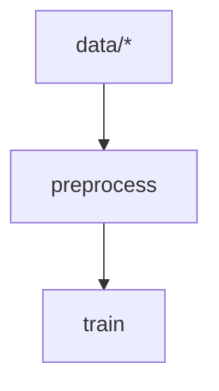

# xvc pipeline dag

## Synopsis

```console
$ xvc pipeline dag --help
Generate a dot or mermaid diagram for the pipeline

Usage: xvc pipeline dag [OPTIONS]

Options:
  -p, --pipeline-name <PIPELINE_NAME>  Name of the pipeline to generate the diagram
      --file <FILE>                    Output file. Writes to stdout if not set
      --format <FORMAT>                Format for graph. Either dot or mermaid [default: dot]
  -h, --help                           Print help

```

You can visualize the pipeline you defined with [xvc pipeline](/ref/xvc-pipeline/) set of command with the `xvc pipeline
dag` command. It will generate a dot or mermaid diagram for the pipeline.

## Examples

As all other pipeline commands, this requires an Xvc repository.

```console
$ git init --initial-branch=main
Initialized empty Git repository in [CWD]/.git/

$ xvc init
```

All steps of the pipeline are shown as nodes in the graph.

We create a dependency between the two steps by using the `--dependencies` flag to make them run sequentially.

```console
$ xvc pipeline step new --step-name preprocess --command "echo 'preprocess'"

$ xvc pipeline step new --step-name train --command "echo 'train'"

$ xvc pipeline step dependency --step-name train --step preprocess

```

```console
$ xvc pipeline dag
digraph pipeline{n0[shape=box;label="preprocess";];n1[shape=box;label="train";];n0[shape=box;label="preprocess";];n0->n1;}

```

When you add a dependency between two steps, the graph shows it as a node.

```console
$ xvc pipeline step dependency --step-name preprocess --glob 'data/*'

$ xvc pipeline dag
digraph pipeline{n0[shape=box;label="preprocess";];n1[shape=folder;label="data/*";];n1->n0;n2[shape=box;label="train";];n0[shape=box;label="preprocess";];n0->n2;}

```

You can use `--mermaid` option to get a [mermaid.js](https://mermaid.js.org) diagram.

```
$ xvc pipeline dag --format=mermaid
flowchart TD
    n0["preprocess"]
    n1["data/*"] --> n0
    n2["train"]
    n0["preprocess"] --> n2


```

The output can be used in [Mermaid Live Editor](https://mermaid.live) or any web page that support the format.


