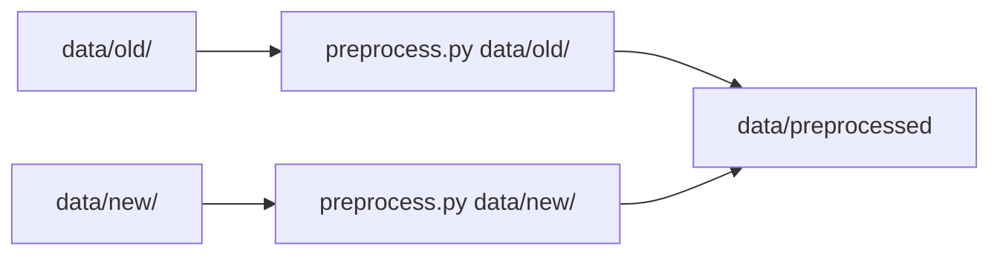
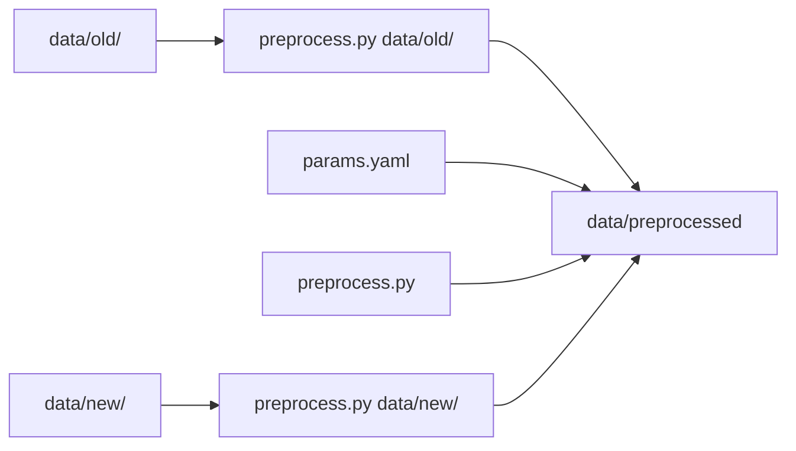

# Xvc for Machine Learning

_Xvc Getting Started pages are written as stories and dialogues between tortoise (🐢) and hare (🐇)._

Ah, hello tortoise. How are you? I began to work as an machine learning engineer, you know?

You're quick as always, hare. How is your job going?

It's good. We have lots and lots of data. We have models. We have script to create those models. We have notebooks that we make experiments. That's all good stuff. We'll solve the hare intelligence problem. 

That sounds cool. Aren't you losing yourself in all these, though?

Yeah, time to time we have those moments. Some models work with some data, some experiments require some kind of preprocessing, some data changed since we started to work with it and now we have multiple versions. All looks cool until you zoom in. 

Ah, I see. I recently heard a tool called Xvc. It may be of use to you. 

What does it do?

It keeps track of all these stuff you mentioned. Data, models, scripts. It also can detect when data changed and run the scripts associated with that data. 

That sound something we need. My boss wanted me to build a pipeline for cat pictures. He likes to see the cats that resemble rabbits. Every time a 

Once upon a time there was a machine learning engineer. 
She was creating models with her data.
It was all good. 
It was only she and her data, and models. 

She built good models.
Selected the best among them. 
Modified her training scripts along the way.

Then, more data came. 
The new data had the same outlook but with some minor differences.
It required a new preprocessing script.
She didn't want to mix the old data with the new. 
But wanted to merge them after preprocessing. 
A new set of directories emerged in her workspace. 

One day, her boss called and described a new paper that tells a better model for their problem. 
She wanted to implement it.
Her boss wanted to see a quick test to evaluate the new method.
Now she has two training scripts with two different models.
They saw older model worked better in some cases, and newer model worked better in other cases.

Later more data came. 
More models are required. 
Now, they can't figure out easily which model is produced from which subset of the data. 
They need to version their data and models, and how models are produced from data. 
Then, they found a tool called Xvc.

She was using Git to track scripts. 
However, Git was very slow to use for data files. 
They were both numerous and large. 
Keeping all of them in Git proved to explode the `.git` directory size and made Git very slow.
She understood Git is meant to track text files, not data files. 

She discovered this tool called Xvc. 
First she initialized her repository for Xvc. 

```shell
$ cd machine-learning-project
$ xvc init
```

She was able to track files. 

```shell
$ xvc file track data/
```

She decided to create a preprocessing pipeline for all data she has.



She created a step in the default pipeline for preprocessing. 

```shell
$ xvc pipeline step new -n preprocess-old --command "python3 src/preprocess.py data/old"
$ xvc pipeline step dependency -n preprocess-old-data --path data/old-data
```

Now, when either new or old data is modified, she was able to run the pipeline with a single command and get the preprocessed data. 

```shell
$ xvc pipeline run
```

When this command is run to get an updated `data/preprocessed` directory, she commits the changes in all data.

```shell
$ xvc file commit
```

Without any parameters, all changed data files are cached. 

One day, her boss called and introduced a new data scientist to work with her. 
His name was Bob. 

Bob had a few ideas about preprocessing the data.
He came up with a bunch of hyperparameters to change preprocessing.
After seeing his enthusiasm, they wanted to add hyperparameters to the pipeline.




