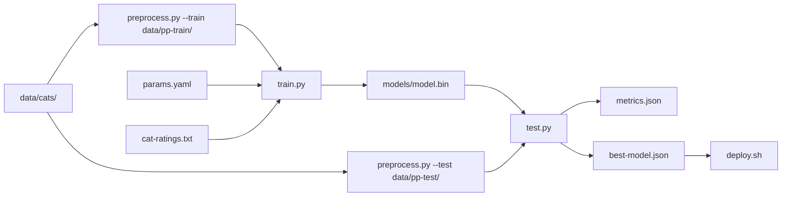

# Xvc for Machine Learning

_Xvc Getting Started pages are written as stories and dialogues between tortoise (🐢) and hare (🐇)._

🐇 Ah, hello tortoise. How are you? I began to work as an machine learning engineer, you know? I'll be the fastest. 

🐢 You're quick as always, hare. How is your job going so far?

🐇 It's good. We have lots and lots of data. We have models. We have scripts to create those models. We have notebooks full of experiments. That's all good stuff. We'll solve the hare intelligence problem. 

🐢 Sounds cool. Aren't you losing yourself in all these, though?

🐇 Time to time we have those moments. Some models work with some data, some experiments require some kind of preprocessing, some data changed since we started to work with it and now we have multiple versions.

🐢 I see. I began to use a tool called Xvc. It may be of use to you.

🐇 What does it do?

🐢 It keeps track of all these stuff you mentioned. Data, models, scripts. It also can detect when data changed and run the scripts associated with that data.

🐇 That sound something we need. My boss wanted me to build a pipeline for cat pictures. He makes a contest for cat pictures. Every time he finds a new cat picture he likes, we have to update the model.

🐢 He must have lots of cat pictures.

🐇 He has. He sometimes find higher resolution versions and replaces older pictures. He has terabytes of cat pictures.

🐢 How do you keep track of those versions?

🐇 We don't. We have a disk for cat pictures. He puts everything there and we train models with it.

🐢 You can use Xvc to version those files. You can go back and forth in time, or have different branches. It's based on Git.

🐇 I know, but Git is for code files, right? I never found a good way to store image files in Git. It stores everything. 

🐢 Yep. Git keeps all history in each repository. Better to keep that terabytes of images away from Git. Otherwise, you'll have terabytes of cat pictures in each clone you use. Xvc helps there. It tracks contents of data files separately from Git. Image files are not put into Git objects, and they are not duplicated in all repositories. 

🐇 You know, I'm not interested in details. Tell me how this works.

🐢 Ok. When you go back to cat picture directory, create a Git repository, and initialize Xvc immediately. 

```console
$ git init
...
$ xvc init
? 0
```

🐇 No messages?

🐢 Xvc is of silent type of Unix commands. It follows "no news is good news" principle. We use `? 0` to indicate the command return code. 0 means success. If you want more output, you can add `-v` as a flag. Increase the number of `-v`s to increase the details. 

🐇 So `-vvvvvvvvvvvvvvv` will show which atoms interact in disk while running Xvc?

🐢 It may work, try that next time. Now, you can add your cat pictures to Xvc. Xvc makes copies of tracked files by default. I assume you have a large collection. Better to make everything symlinks for now. We can change how specific files are linked to cache later. 

```console
$ xvc -v file track --cache-type symlink .
...
```

🐇 Does it track everything that way?

🐢 Yes. If you want to track only particular files or directories, you can replace `.` with their names.

🐇 What's the best cache type for me?

🐢 If your file system supports, best way seems `reflink` to me. It's like a symlink but makes a copy when your file changes. Most of the widely used file systems don't support it though. If your files are read only and you don't have many links to the same files, you can use `hardlink`. If they are likely to change, you can use `copy`. If there are many links to same files, better to use `symlink`.

🐇 So, symlinks are not the best? Why did you select it?

🐢 I suspect most of the files in your cat pictures are duplicates. Xvc stores only one copy of these in cache and links all occurrences in the workspace to this copy. This is called deduplication. There are limits to number of hardlinks, so I recommended you to use symlinks. They are more visible. You can see they are links. Hardlinks are harder to detect. 

🐇 Ah, when I type `ls -l`, they all show the cache location now.

🐢 If you have a `models/` directory and want to track them as copies, you can tell Xvc: 

```console
$ xvc file track --cache-type copy models/
```

It replaces previous symlinks with the copies of the files _only_ in `models/`. 


🐇 Can I have my data read only and models writable?


🐢 You can. Xvc keeps track of each file's `cache-type` separately. Data can stay in read-only symlinks, and models can be copied so they can be updated and stored as different versions. 


🐇 I have also scripts, what should I do with them?


🐢 Are you using Git for them?


🐇 Yep. They are in a separate repository. I think I can use the same repository now. 


🐢 You can. Better to keep them in the same repository. They can be versioned with the data they use and models they produce. You can use standard Git commands to track them. If you track a file with Git, Xvc doesn't track it. It stays away from it. 

🐇 You said we can create pipelines with Xvc as well. I created a multi-stage pipeline for cat picture models. It's like this:




🐢 It looks like a  fairly complex pipeline. You can create a pipeline definition for it. For each separate command we'll have a step. How many different commands do you have?


🐇 A `preprocess --train` command, a `preprocess --test` command, a `train` command, a `test` command and a `deploy` command. Five.


🐢 Do you need more than one pipeline? Maybe you would like to put deployment to another pipeline?

🐇 No, I don't think so. I may have in the future. 

🐢 Xvc has a default pipeline. We'll use it for now. If you need more pipelines  you can create with `xvc pipeline new`. 

🐇 How do I create step for commands?

🐢 Let's create the steps at once. Each step requires a name and a command. 

```console
$ xvc pipeline step new --name preprocess-train --command 'python3 src/preprocess.py --train data/cats data/pp-train/'
$ xvc pipeline step new --name preprocess-test --command 'python3 src/preprocess.py --test data/cats data/pp-test/'
$ xvc pipeline step new --name train --command 'python3 src/train.py data/pp-train/' 
$ xvc pipeline step new --name test --command 'python3 src/test.py data/pp-test/ metrics.json'
$ xvc pipeline step new --name deploy --command 'python3 deploy.py models/model.bin /var/server/files/model.bin'
```

🐇 How do we define dependencies?

🐢 You can have many different types of dependencies. All are defined by [`xvc pipeline step dependency`](/ref/xvc-pipeline-step-dependency) command. You can set up direct dependencies between steps, if one is invalidated, its dependents also run. You can set up file dependencies, if the file changes the step is invalidated and requires to run. There are other, more detailed dependencies like parameter dependencies which take a file in JSON or YAML format, then checks whether a value has changed. There are regular expression dependencies, for example if you have a piece of code in your training script that you change to update the parameters, you can define a regex dependency. 

🐇 It looks I can use this for CSV files as well. 

🐢 Yes. If your step depends not on the whole CSV file, but only specific rows, you can use regex dependencies. You can also specify line numbers of a file to depend. 

🐇 My `preprocess.py` script depends on `data/cats` directory. My `train.py` script depends on `params.yaml` for some hyperparameters, and reads `5 Star` ratings from `cat-contest.txt`. I want to deploy when the newly produced model is better than the older one by checking `best-model.json`. My deployment script doesn't update the deployment if the new model is not the best. 

🐢 Let's see. For each step, you can use a single command to define its dependencies. For `preprocess.py` you'll depend to the data directory and the script itself. We want to run the step when the script changes. It's like this: 

```console 
$ xvc pipeline step dependency --step-name preprocess-train --directory data/cats --file src/preprocess.py
$ xvc pipeline step dependency --step-name preprocess-test --directory data/cats --file src/preprocess.py
$ xvc pipeline step dependency --step-name train --directory data/pp-train --file src/train.py --param 'params.yaml::learning_rate' --regex 'cat-contest.csv:/^5,.*'
$ xvc pipeline step dependency --step-name test --directory models/ --directory data/pp-test/
$ xvc pipeline step dependency --step-name deploy --file best-model.json 
```

You must also define the outputs these steps produce, so when the output is missing or dependency is newer than the output, the step will require to rerun. 

```console
$ xvc pipeline step output --step-name preprocess-train --directory data/pp-train
$ xvc pipeline step output --step-name preprocess-test --directory data/pp-test
$ xvc pipeline step output --step-name train --directory models/
$ xvc pipeline step output --step-name test --file metrics.json  --file best-model.json
$ xvc pipeline step output --step-name deploy --file /var/server/files/model.bin
```

🐇 These commands become too long to type. You know, I'm a lazy hare and don't like to type much. Is there an easier way?

🐢 You can try `source $(xvc aliases)` in your Bash or Zsh, and get a bunch of aliases for these commands. `xvc pipeline step output` becomes `xvcpso`, `xvc pipeline step dependency` becomes `xvcpsd`, etc. You can see the whole list: 


```console
$ xvc aliases
alias xls='xvc file list'
alias pvc='xvc pipeline'
alias fvc='xvc file'
alias xvcf='xvc file'
alias xvcft='xvc file track'
alias xvcfl='xvc file list'
alias xvcfs='xvc file send'
alias xvcfb='xvc file bring'
alias xvcfh='xvc file hash'
alias xvcfc='xvc file checkout'
alias xvcp='xvc pipeline'
alias xvcpr='xvc pipeline run'
alias xvcps='xvc pipeline step'
alias xvcpsn='xvc pipeline step new'
alias xvcpsd='xvc pipeline step dependency'
alias xvcpso='xvc pipeline step output'
alias xvcpi='xvc pipeline import'
alias xvcpe='xvc pipeline export'
alias xvcpl='xvc pipeline list'
alias xvcpn='xvc pipeline new'
alias xvcpu='xvc pipeline update'
alias xvcpd='xvc pipeline dag'
alias xvcs='xvc storage'
alias xvcsn='xvc storage new'
alias xvcsl='xvc storage list'
alias xvcsr='xvc storage remove'
```

🐇 Oh, there are many more commands. 

🐢 Yep. More to come as well. If you want to edit the pipelines you created in YAML, you can use `xvc pipeline export` and after making the changes, you can use `xvc pipeline import`. 

🐇 I don't need to delete the pipeline to rewrite everything, then? 

🐢 You can export a pipeline, edit and import with a different name to test. When you want to run them, you specify their names. 

🐇 Ah, yeah, that's the most important part. How do I run?

🐢 `xvc pipeline run`, or `xvcpr`. It takes the name of the pipeline and runs it. It sorts steps, checks if there are any cycles. The steps musn't have cycles, otherwise it's an infinite loop and computers don't like infinite loops like turtles do. Xvc runs steps in parallel if there are no common dependencies. 

🐇 So, if I have multiple preprocessing steps that don't depend each other, they can run in parallel?

🐢 Yeah, they run in parallel. For example in your pipeline `preprocess-train` and `preprocess-test` can run in parallel, because they don't depend on each other.

🐇 Cool. I want to see the pipeline we created. 

🐢 You can see it with `xvc pipeline dag` (`xvcpd`) It prints a mermaid.js diagram that you can paste to your files.

🐇 Better to have an image of this, maybe. 

🐢 I'll inform the developer about it. Please tell him anything you'd like to see in the tool in [Github](https://github.com/iesahin/xvc/discussions) or via [email](mailto:help@xvc.dev) He's extremely introverted but tries to be a nice guy.

🐇 Ah, ok, I'll write to him about this. 
